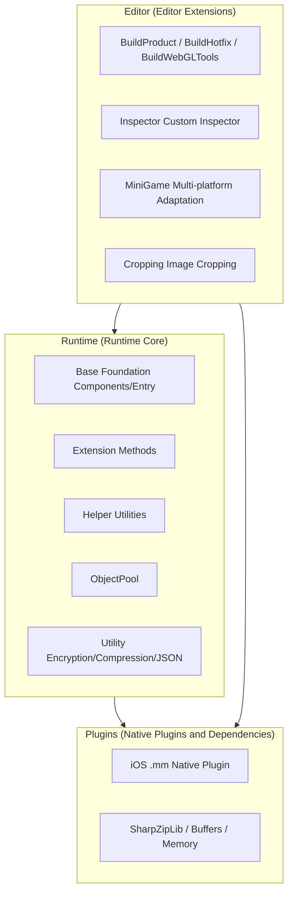

# Framework Three-Layer Structure Overview

GameFrameX is a Unity framework for indie game developers, adopting a **Runtime / Plugins / Editor** three-layer modular architecture. The three layers have clear responsibilities and collaborate with each other: Runtime provides core runtime functionality, Plugins provides native platform capabilities and third-party dependencies, and Editor provides editor extensions and build pipelines. This page uses a diagram and a table to help you quickly build a holistic understanding.

## Working Principle Overview



## Three-Layer Responsibilities Quick Reference

| Layer | Directory | Key Files | Main Responsibilities |
|----|------|----------|----------|
| **Runtime** | `Runtime/` | [GameEntry.cs](/Runtime/Base/GameEntry.cs#L46-L60)、[GameFrameworkComponent.cs](/Runtime/Base/GameFrameworkComponent.cs#L43-L45) | Framework entry, component management, event pool, reference pool, object pool, variable system, encryption/compression, JSON, extension methods, helper utilities |
| **Plugins** | `Plugins/` | [GameFrameX.mm](/Plugins/iOS/GameFrameX/GameFrameX.mm)、`ICSharpCode.SharpZipLib.dll`、`System.Memory.dll` | iOS native capabilities, ZIP compression library, .NET memory and runtime support |

## Next Steps

- To learn about the internal sub-module division of Runtime such as Base / Extension / Helper / Utility, see《Runtime Module Details》.
- To learn about the iOS native plugin and DLL dependency list of Plugins, see《Plugins Module Details》.
- To learn about the Editor build pipeline, mini-game multi-platform adaptation, and Inspector extensions, see《Editor Module Details》.
- To run through a minimal project from scratch, see《Quick Start》.

## Runtime Layer (Runtime Core)

Runtime contains all the C# code of the framework, and its directory is divided into 7 sub-modules by responsibility.

| Sub-module | Key Contents | Description |
|--------|----------|------|
| **Base** | [GameEntry.cs](/Runtime/Base/GameEntry.cs#L46-L56)、[GameFrameworkComponent.cs](/Runtime/Base/GameFrameworkComponent.cs#L43-L45)、`EventPool/`、`ReferencePool/`、`TaskPool/`、`Variable/` | Framework entry and component base class, event pool, reference pool, task pool, bindable variables, singleton |
| **Extension** | `BinaryExtension`、`StringExtensions`、`CollectionExtensions`、`UnityEngine.Transform` extension, etc. | Common and Unity type extension methods |
| **Helper** | `ApplicationHelper`、`FileHelper`、`PathHelper`、`MathHelper`、`TimerHelper`、`ZipHelper`, etc. | Application, file, path, math, timer, compression, and other runtime helpers |
| **ObjectPool** | [ObjectPoolComponent.cs](/Runtime/ObjectPool/ObjectPoolComponent.cs) | Subclass of `GameFrameworkComponent`, responsible for object reuse and memory optimization |
| **Property** | `BindableProperty` | MVVM-style bindable properties |
| **ReferencePool** | `ReferencePoolComponent` | Reference type object pool, reduces GC pressure |
| **Utility** | `Utility.Encryption` (AES/RSA/DSA)、`Utility.Compression`、`Utility.Json`、`Utility.Hash` (MD5/SHA1/HMAC)、`Utility.Verifier` (CRC32/CRC64) | Pure static utilities for encryption, compression, JSON, hashing, verification, etc. |

Entry type example:

```csharp
using GameFrameX.Runtime;

// Framework entry, provides a unified access point for game framework components
public static class GameEntry { /* ... */ }

// All components attached to GameEntry inherit from this base class
public abstract class GameFrameworkComponent : MonoBehaviour { /* ... */ }
```

Source: [GameEntry.cs](/Runtime/Base/GameEntry.cs#L46-L60), [GameFrameworkComponent.cs](/Runtime/Base/GameFrameworkComponent.cs#L43-L45)

## Plugins Layer (Native Plugins and Dependencies)

The Plugins layer only contains things that cannot be done at the Unity C# layer: native platform plugins and third-party .NET DLLs.

| Sub-module | Files | Description |
|--------|------|------|
| **iOS Plugin** | [GameFrameX.mm](/Plugins/iOS/GameFrameX/GameFrameX.mm)、`GameFrameXTrackingAuthorization.mm` | iOS native capabilities (such as ATT tracking permission) |
| **Compression Library** | `ICSharpCode.SharpZipLib.dll` | ZIP compression/decompression, called by `Utility.Compression` |
| **Memory and Buffers** | `System.Buffers.dll`、`System.Memory.dll`、`System.IO.Pipelines.dll` | High-performance memory and IO pipelines |
| **Runtime Support** | `Microsoft.NET.StringTools.dll`、`System.Runtime.CompilerServices.Unsafe.dll` | String optimization and unsafe code support |

## Editor Layer (Editor Extensions)

The Editor layer only takes effect within the Unity editor, providing build pipelines and development assistance.

| Sub-module | Key Files | Description |
|--------|----------|------|
| **BuildProduct** | `BuildProductHelper`、`BuildPostProcessHelper`、`IBuilderPreHookHandler`、`IBuilderPostHookHandler` | General build helper and pre/post build hooks |
| **BuildHotfix** | `BuildHotfixHelper`、`HotFixAssemblyDefinitionHelper` | HybridCLR hot-update assembly build |
| **BuildWebGLTools** | `BuildWebGLToolsWithHybridCLR` | WebGL platform + HybridCLR joint build |
| **MiniGame** | [MiniGameDefineSymbolHelper.WeChat.cs](/Editor/MiniGame/DomesticMiniGames/MiniGameDefineSymbolHelper.WeChat.cs) and 21 other platform macro definitions | One-click switching for WeChat, Alipay, Douyin, Kuaishou, Baidu, JD, Meituan, Taobao, and other platforms |
| **Inspector** | `BaseComponentInspector`、`ObjectPoolComponentInspector`、`ReferencePoolComponentInspector` | Custom inspector panel, observe pool status at runtime |
| **Cropping** | `CroppingWindow` | Image cropping tool |
| **InspectorLockShortcut** | `InspectorLockShortcut` | Inspector lock shortcut |

Build hook usage example (pseudocode, see source file for actual signature):

```csharp
using GameFrameX.Editor;

public sealed class MyPreBuildHook : IBuilderPreHookHandler
{
    public void OnBeforeBuild(BuildContext ctx) { /* ... */ }
}
```