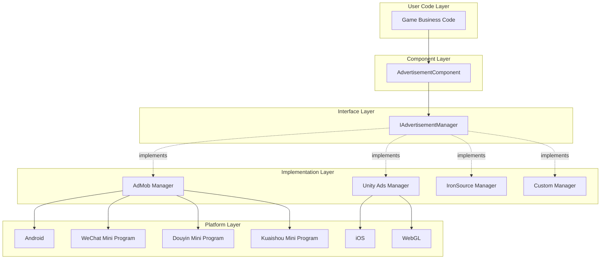
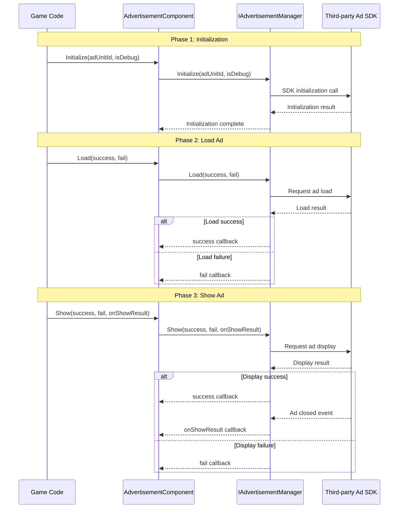

# Overview

Game Frame X Advertisement is the advertisement component of the Game Frame X framework, providing a unified abstraction layer for ad functionality in Unity projects. The component is designed using the Strategy pattern, enabling developers to easily integrate various ad SDKs (such as AdMob, Unity Ads, IronSource, etc.) without modifying core business code.

## Project Introduction

`com.gameframex.unity.advertisement` is one of the core modules of the Game Frame X framework, specifically designed to address the complexity of ad integration in Unity projects. The component provides a standardized set of ad operation interfaces, allowing developers to write ad invocation code once and switch between different ad platforms.

The component supports Unity 2017.1 and higher, with the current latest version being 1.4.0. It uses the Apache License 2.0 open source license, allowing free use in both commercial and non-commercial projects.

## Architecture Design

The component adopts a layered architecture design, separating ad business logic from specific platform implementations. This design follows the Dependency Inversion Principle, where the upper-level module (AdvertisementComponent) depends on the abstract interface (IAdvertisementManager) rather than concrete implementation details.

## Core Components

The component contains four core classes, each with different responsibilities, working together to provide complete ad functionality encapsulation.

### AdvertisementComponent

AdvertisementComponent is the primary entry point for user interaction. It inherits from GameFrameworkComponent and is a Unity MonoBehaviour component. Developers need to add this component to any GameObject in the scene, then call its methods through code to load and display ads.

> Source: [AdvertisementComponent.cs](https://cnb.cool/GameFrameX/com.gameframex.unity.advertisement/blob/main/Runtime/Advertisement/AdvertisementComponent.cs#L1-L169)

The core responsibilities of this component include: automatically selecting the corresponding ad unit ID based on the current runtime platform, initializing the ad manager during the Unity lifecycle, and providing three main methods (Load, Show, Play) for business code to call.

### IAdvertisementManager

IAdvertisementManager is the core interface of the ad manager, defining standard methods for all ad operations. Any specific ad SDK implementation must implement this interface to ensure behavioral consistency across different ad platforms.

> Source: [IAdvertisementManager.cs](https://cnb.cool/GameFrameX/com.gameframex.unity.advertisement/blob/main/Runtime/Advertisement/IAdvertisementManager.cs#L1-L55)

This interface defines four core methods: Initialize for initializing the ad manager, SetExtraData for setting additional parameters, Load for preloading ads, and Show for displaying ads. The interface design uses a callback pattern, handling asynchronous operation success, failure, and result callbacks through Action delegates.

### BaseAdvertisementManager

BaseAdvertisementManager is an abstract base class that inherits from GameFrameworkModule and implements the IAdvertisementManager interface. It provides developers with a starting point for creating custom ad managers, encapsulating common callback handling logic.

> Source: [BaseAdvertisementManager.cs](https://cnb.cool/GameFrameX/com.gameframex.unity.advertisement/blob/main/Runtime/Advertisement/BaseAdvertisementManager.cs#L1-L109)

This base class defines four protected callback properties: OnShowResult, OnLoadSuccess, OnLoadFail, corresponding to ad display results, ad load success, and ad load failure respectively. Subclasses can use these callback properties to trigger corresponding business logic.

### AdvertisementComponentInspector

AdvertisementComponentInspector is a custom Inspector panel for the Unity editor, inheriting from ComponentTypeComponentInspector. It provides a friendly graphical configuration interface for AdvertisementComponent, allowing developers to directly set ad unit IDs for each platform in the Inspector window.

> Source: [AdvertisementComponentInspector.cs](https://cnb.cool/GameFrameX/com.gameframex.unity.advertisement/blob/main/Editor/Inspector/AdvertisementComponentInspector.cs#L1-L72)

This editor integration greatly simplifies the configuration process, allowing developers to set ad unit IDs without writing code.

## Workflow

The standard workflow for ads consists of three main phases: initialization, loading, and displaying. This workflow design follows best practices to ensure ads load smoothly and display in a timely manner.

The initialization phase is automatically executed in the Start method of AdvertisementComponent, using the ad unit ID configured in the Inspector. The loading phase is optional but recommended to call the Load method before displaying ads to reduce user wait time. The display phase is triggered through the Show method, and after display completion, the onShowResult callback notifies the developer whether the ad was watched completely, which is particularly important for rewarded video ads.

## Platform Support

The component supports multiple platforms and release targets to meet the publishing needs of different game projects.

| Platform | Configuration Field | Description |
|----------|---------------------|-------------|
| Android | m_adUnitIdAndroid | Google Play and other Android app stores |
| iOS | m_adUnitIdiOS | Apple App Store |
| WebGL | m_adUnitIdWebGL | Standard WebGL builds |
| WeChat Mini Program | m_adUnitIdWebGLWeChat | WeChat Mini Game platform |
| Douyin Mini Program | m_adUnitIdWebGLDouYin | Douyin Mini Game platform |
| Kuaishou Mini Program | m_adUnitIdWebGLKuaiShou | Kuaishou Mini Game platform |

The component automatically selects the corresponding ad unit ID based on compile-time platform macros. Developers need to configure the correct compilation macros in the corresponding platform's build settings, such as ENABLE_WECHAT_MINI_GAME, ENABLE_DOUYIN_MINI_GAME, ENABLE_KUAISHOU_MINI_GAME, etc.

## Rewarded Video Support

The component specifically optimizes support for rewarded video ads, one of the most common monetization methods in mobile games. Rewarded videos allow players to voluntarily choose to watch ads in exchange for in-game rewards. This ad format has high user acceptance and conversion rates.

The core flow of rewarded videos is: player triggers the watch ad action -> ad displays -> player watches completely or closes midway -> callback notifies the developer whether to award the reward. The boolean parameter of the onShowResult callback indicates whether the ad was watched completely: true means the user watched the full ad and the reward should be granted; false means the user skipped the ad or did not watch it completely for other reasons, and the reward should not be granted.

This design ensures fairness in reward distribution, preventing players from obtaining undeserved rewards by closing ads or using other methods to skip them.

## Design Philosophy

The component design follows several core principles to ensure ease of use, extensibility, and reliability.

First is the Open-Closed Principle: the system is open for extension but closed for modification. When support for a new ad platform is needed, simply create a new IAdvertisementManager implementation class without modifying existing code. This design makes adding ad platforms simple and controllable without affecting the stability of existing features.

Second is the Dependency Inversion Principle: high-level modules should not depend on low-level modules; both should depend on abstractions. AdvertisementComponent depends on the IAdvertisementManager interface rather than caring about which specific ad platform implementation is used. This allows switching ad platforms without modifying business code.

Finally is the Single Responsibility Principle: each class has clear responsibility boundaries. AdvertisementComponent is responsible for Unity lifecycle integration and dispatching calls, IAdvertisementManager defines the interface contract, and specific implementation classes handle interaction with their respective SDKs. This separation makes the code easier to understand and maintain.

## Use Cases

This component is suitable for various Unity game projects that require ad monetization, especially those that need to be published on multiple platforms. Through a unified interface abstraction, developers can write ad logic code once and then choose different ad platform implementations as needed.

For projects that need to be published on multiple mini-program platforms, the component's cross-platform ad unit ID configuration feature is particularly important. Developers can configure different ad units for WeChat, Douyin, Kuaishou, and other platforms, enabling multi-platform publishing without modifying code.

## Related Links

- [Installation Guide](./2-installation) - Learn how to install and configure the component in your project
- [Getting Started](./3-getting-started) - Quick start with ad functionality
- [Core Concepts](./4-core-concepts) - Deep dive into the component's design principles
- [Platform Configuration](./5-platforms) - Detailed configuration for each platform
- [API Reference](./6-api-reference) - Complete interface documentation
- [Troubleshooting](./7-troubleshooting) - Frequently asked questions

## Changelog

The current version is 1.4.0, which adds WebGL ad unit ID support for the Kuaishou Mini Game platform. The component is continuously iterated and updated, with each update bringing new platform support, feature enhancements, and bug fixes.

> Source: [CHANGELOG.md](https://cnb.cool/GameFrameX/com.gameframex.unity.advertisement/blob/main/CHANGELOG.md#L1-L70)
