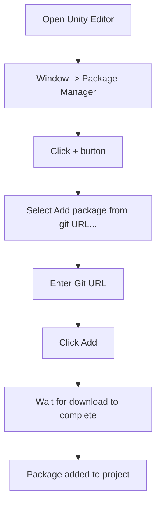

# Installation Guide

This guide will help you install the Game Frame X Advertisement component into your Unity project and complete the basic configuration.

## Overview

Game Frame X Advertisement is the ad component of the Game Frame X framework, providing a unified ad functionality abstraction layer. The component supports multiple ad platforms, including AdMob, Unity Ads, IronSource, etc., allowing developers to switch between different ad SDKs without modifying core code.

> **Important**: This component (`com.gameframex.unity.advertisement`) provides the abstraction layer and core logic for ad display. You need to include a concrete `IAdvertisementManager` interface implementation in your project, which is responsible for interacting with the specific ad SDK.

## Prerequisites

Before installing this component, ensure the following requirements are met:

| Requirement | Description |
|-------------|-------------|
| Unity Version | 2017.1 or higher |
| Game Frame X Core | GameFrameX.Runtime and GameFrameX.Event.Runtime must be installed |
| Ad SDK | A specific ad platform SDK needs to be integrated (e.g., AdMob, Unity Ads, etc.) |

## Installation Steps

### Method 1: Install via Unity Package Manager (Recommended)

1. Open the Unity Editor
2. Select the menu `Window` -> `Package Manager`
3. In the Package Manager window, click the `+` button in the upper left corner
4. Select `Add package from git URL...`
5. Enter the following Git URL:
   ```
   https://github.com/GameFrameX/com.gameframex.unity.advertisement.git
   ```
6. Click the `Add` button to start installation
7. Wait for the Package Manager to download and import the package



### Method 2: Install via npm/cnpm

If your network environment has slow access to GitHub, you can use the CNPM mirror:

1. Add the dependency in the `Packages/manifest.json` file:
   ```json
   {
     "dependencies": {
       "com.gameframex.unity.advertisement": "https://npm.cnb.cool/GameFrameX/com.gameframex.unity.advertisement.git"
     }
   }
   ```
2. After saving the file, Unity will automatically download and import the package

### Method 3: Manual Installation

1. Clone or download the source code from the GitHub repository:
   ```
   https://github.com/GameFrameX/com.gameframex.unity.advertisement.git
   ```
2. Copy the downloaded folder to the `Packages` directory of your Unity project
3. Rename the folder to `com.gameframex.unity.advertisement`
4. Reopen the Unity Editor

## Dependency Configuration

This component depends on the following Game Frame X modules; ensure these modules are properly installed:

```json
// GameFrameX.Advertisement.Runtime.asmdef
{
    "references": [
        "GameFrameX.Runtime",
        "GameFrameX.Event.Runtime"
    ]
}
```

### Installing Game Frame X Core Modules

If the Game Frame X core modules are not yet installed, follow these steps:

1. Add the GameFrameX core package in the Package Manager:
   ```
   https://github.com/GameFrameX/com.gameframex.unity.runtime.git
   ```

## Scene Configuration

### Adding AdvertisementComponent

1. In the Unity Editor, open the scene where you want to integrate ads
2. In the Hierarchy panel, right-click and select `Create Empty` to create an empty GameObject
3. Select the GameObject, click `Add Component` in the Inspector panel
4. Search for and add `Advertisement Component` (or `GameFrameX/Advertisement`)
5. The component has been added to the scene

```csharp
// You can also add the component via code
using GameFrameX.Advertisement.Runtime;
using UnityEngine;

public class AdSetup : MonoBehaviour
{
    void Start()
    {
        // Ensure the scene has an AdvertisementComponent
        var adComponent = GetComponent<AdvertisementComponent>();
        if (adComponent == null)
        {
            adComponent = gameObject.AddComponent<AdvertisementComponent>();
        }
    }
}
```

### Configuring Ad Unit IDs

Configure ad unit IDs for each platform in the Inspector panel:

| Platform | Field Name | Description |
|----------|------------|-------------|
| Android | Ad Unit Id (Android) | Google Play platform ad unit ID |
| iOS | Ad Unit Id (iOS) | Apple App Store platform ad unit ID |
| WebGL | Ad Unit Id (WebGL) | Web platform ad unit ID |
| WeChat Mini Game | Ad Unit Id (WebGL WeChat) | WeChat Mini Game ad unit ID |
| Douyin Mini Game | Ad Unit Id (WebGL DouYin) | Douyin Mini Game ad unit ID |
| Kuaishou Mini Game | Ad Unit Id (WebGL KuaiShou) | Kuaishou Mini Game ad unit ID |

> **Note**: The component automatically selects the corresponding ad unit ID based on the current build platform.

```mermaid
flowchart TD
    subgraph Configuration["Ad Configuration Flow"]
        A[Add AdvertisementComponent] --> B[Select target platform]
        B --> C{Need multi-platform support?}
        C -->|Yes| D[Configure Ad Unit Id for each platform]
        C -->|No| E[Configure Ad Unit Id for current platform only]
        D --> F[Set test mode (optional)]
        E --> F
        F --> G[Run project to verify]
    end
```

### Test Mode Configuration

In the Inspector panel, check the `Debug Mode` option to enable test ads for development and debugging.

```csharp
// You can also configure test mode via code
public class AdSetup : MonoBehaviour
{
    void Start()
    {
        var adComponent = GetComponent<AdvertisementComponent>();
        // Manual initialization, the second parameter enables debug mode
        adComponent.Initialize("your-ad-unit-id", true);
    }
}
```

## Ad Manager Implementation

### Implementing the IAdvertisementManager Interface

This component requires you to provide a concrete implementation of the `IAdvertisementManager` interface. Here are the implementation steps:

1. Create a new class that inherits from `BaseAdvertisementManager`
2. Implement all abstract methods
3. Register your implementation at game startup

```csharp
using System;
using GameFrameX.Advertisement.Runtime;

public class MyAdManager : BaseAdvertisementManager
{
    public override void Initialize(string adUnitId, bool debug = false)
    {
        // Initialize ad SDK
    }

    public override void Play(Action<bool> playResult, string customData = null)
    {
        // Play rewarded video ad
    }

    public override void Show(Action<string> success, Action<string> fail, Action<bool> onShowResult, string customData = null)
    {
        // Show ad
    }

    public override void Load(Action<string> success, Action<string> fail, string customData = null)
    {
        // Load ad
    }
}
```

> For detailed implementation instructions, please refer to the [Core Concepts](../4-core-concepts) and [Getting Started](../3-getting-started) documentation.

## Verifying Installation

After installation is complete, you can verify through the following methods:

1. **Check if the package is correctly imported**:
   - Look for the `Packages/com.gameframex.unity.advertisement` directory in your Unity project
   - Confirm that the Runtime and Editor folders exist

2. **Check if compilation succeeds**:
   - In Unity, open `Window` -> `Assembly Compiler` (if the related tool is installed)
   - Or try building the project

3. **Run tests**:
   - Add AdvertisementComponent to the scene
   - Run the game and check the console for error messages

## Frequently Asked Questions

### Q: Compilation errors after installation

**Possible cause**: Missing dependent Game Frame X core modules.

**Solution**:
1. Confirm that GameFrameX.Runtime is installed
2. Confirm that GameFrameX.Event.Runtime is installed
3. Re-import the ad component package

### Q: Ad unit ID not automatically matched

**Possible cause**: Platform define symbols are not set correctly.

**Solution**:
- Android: Ensure Android platform is selected in Build Settings
- iOS: Ensure iOS platform is selected in Build Settings
- WebGL: Ensure WebGL platform is selected in Build Settings

### Q: Cannot see configuration options in Inspector

**Possible cause**: Editor scripts are not compiled correctly.

**Solution**:
1. Check if the Editor folder exists
2. Reopen the Unity Editor
3. Check if `GameFrameX.Advertisement.Editor.asmdef` exists

## Related Links

- [Overview](../1-overview) - Learn about the overall architecture of Game Frame X Advertisement
- [Getting Started](../3-getting-started) - Quick start with ad functionality
- [Core Concepts](../4-core-concepts) - Deep dive into core interfaces and implementations
- [API Reference](../6-api-reference) - Complete API documentation
- [GitHub Repository](https://github.com/GameFrameX/com.gameframex.unity.advertisement.git) - Official source repository
