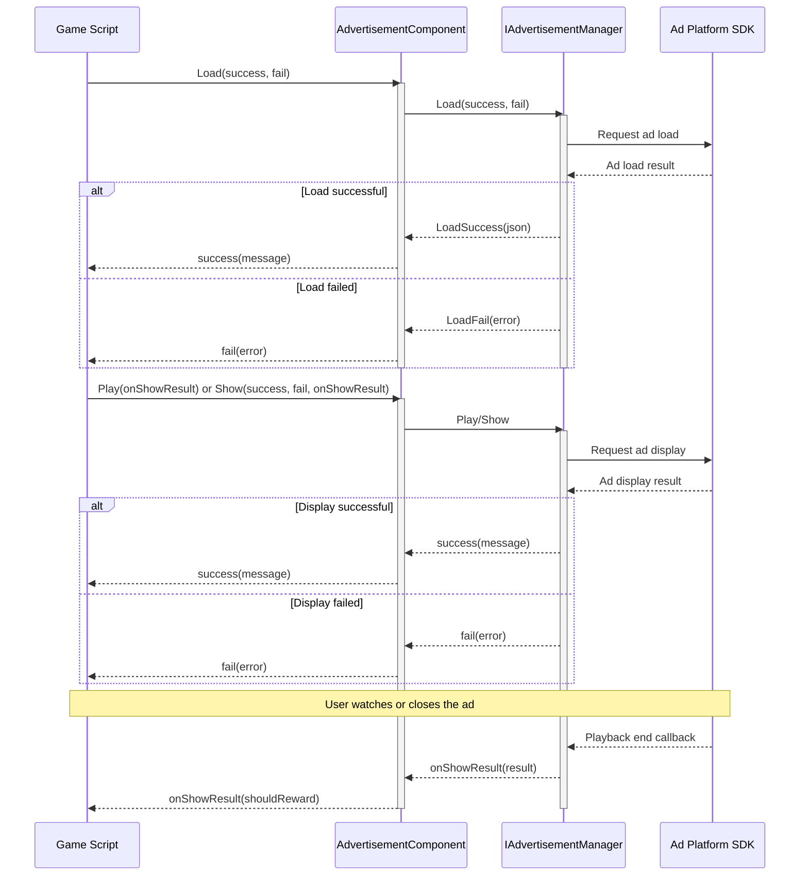

# Getting Started

This guide will help you quickly integrate ad functionality into your Unity project. In just a few simple steps, you can display banner ads, interstitial ads, and rewarded video ads in your game.

## Overview

Game Frame X Advertisement is a lightweight ad abstraction layer component that provides a unified ad interface for Unity projects. By implementing the `IAdvertisementManager` interface, you can easily integrate any ad network (such as AdMob, Unity Ads, IronSource, etc.) without modifying core business code.

Key features of this component:
- **Platform-agnostic**: Unified API interface supporting multi-platform ad display
- **Easy integration**: Integrated as a Unity component without writing complex code
- **Flexible extension**: Easily switch between different ad SDKs through interface implementation

## Architecture Overview

The ad component uses a layered architecture design, with the core layer separated from the platform implementation layer:

```mermaid
flowchart TD
    subgraph Client["Client Layer"]
        GameScript[Game Script]
    end

    subgraph Component["AdvertisementComponent"]
        AdComp[Ad Component]
    end

    subgraph Core["Core Interface Layer"]
        IAdMgr[IAdvertisementManager]
        BaseMgr[BaseAdvertisementManager]
    end

    subgraph Implementation["Platform Implementation Layer"]
        Admob[AdMob Implementation]
        UnityAds[Unity Ads Implementation]
        IronSource[IronSource Implementation]
    end

    GameScript --> AdComp
    AdComp --> IAdMgr
    IAdMgr <|.. BaseMgr
    BaseMgr <|-- Admob
    BaseMgr <|-- UnityAds
    BaseMgr <|-- IronSource
```

## Quick Integration Steps

### Step 1: Install the Ad Component

First, install the Game Frame X Advertisement component in your Unity project. For detailed installation instructions, see the [Installation Guide](./2-installation).

### Step 2: Add the Ad Component to the Scene

1. In the Unity Editor, select the scene where you want to add ads
2. In the Hierarchy panel, right-click the GameObject where you want to add ads
3. Select the **GameFrameX -> Advertisement** menu item
4. Or drag and drop the `AdvertisementComponent` script directly onto a GameObject

```csharp
// Adding the component manually
using UnityEngine;
using GameFrameX.Advertisement.Runtime;

public class GameManager : MonoBehaviour
{
    private AdvertisementComponent _adComponent;

    void Start()
    {
        // Add the ad component to the current GameObject
        _adComponent = gameObject.AddComponent<AdvertisementComponent>();
    }
}
```

> Source: [AdvertisementComponent.cs](https://cnb.cool/GameFrameX/com.gameframex.unity.advertisement/blob/main/Runtime/Advertisement/AdvertisementComponent.cs#L1-L169)

### Step 3: Configure Ad Unit IDs

Configure ad unit IDs for each platform in the Unity Inspector panel:

| Platform | Field Name | Description |
|----------|------------|-------------|
| Android | Ad Unit Id Android | Google Play Store version |
| iOS | Ad Unit Id iOS | Apple App Store version |
| WebGL | Ad Unit Id WebGL | Web version |
| WeChat Mini Game | Ad Unit Id WebGL WeChat | WeChat environment |
| Douyin Mini Game | Ad Unit Id WebGL DouYin | Douyin environment |
| Kuaishou Mini Game | Ad Unit Id WebGL KuaiShou | Kuaishou environment |

> Source: [AdvertisementComponent.cs](https://cnb.cool/GameFrameX/com.gameframex.unity.advertisement/blob/main/Runtime/Advertisement/AdvertisementComponent.cs#L15-L43)

### Step 4: Implement the Ad Manager

The component itself only provides the abstraction layer; you need to implement a concrete ad manager. Create a class that inherits from `BaseAdvertisementManager`:

```csharp
using System;
using GameFrameX.Advertisement.Runtime;
using UnityEngine;

public class MyAdManager : BaseAdvertisementManager
{
    private string _adUnitId;
    private bool _isDebug;

    /// <summary>
    /// Initialize the ad manager
    /// </summary>
    public override void Initialize(string adUnitId, bool debug = false)
    {
        _adUnitId = adUnitId;
        _isDebug = debug;
        Debug.Log($"Ad Manager Initialized with ID: {_adUnitId}, Debug: {_isDebug}");
    }

    /// <summary>
    /// Load ad
    /// </summary>
    public override void Load(Action<string> success, Action<string> fail, string customData = null)
    {
        // Implement actual ad loading logic here
        // Call base.LoadSuccess(json) or base.LoadFail(json) to notify result
        Debug.Log("Loading advertisement...");
        
        // Simulate successful loading
        base.LoadSuccess("{\"status\":\"loaded\"}");
    }

    /// <summary>
    /// Show ad
    /// </summary>
    public override void Show(Action<string> success, Action<string> fail, Action<bool> onShowResult, string customData = null)
    {
        // Implement actual ad display logic here
        Debug.Log("Showing advertisement...");
        
        // Simulate successful display
        success?.Invoke("{\"status\":\"shown\"}");
    }

    /// <summary>
    /// Play rewarded video ad
    /// </summary>
    public override void Play(Action<bool> playResult, string customData = null)
    {
        // Implement rewarded video ad playback logic here
        // playResult callback parameter: true = watched completely, false = skipped
        Debug.Log("Playing rewarded advertisement...");
        
        // Simulate complete viewing
        playResult?.Invoke(true);
    }
}
```

> Source: [BaseAdvertisementManager.cs](https://cnb.cool/GameFrameX/com.gameframex.unity.advertisement/blob/main/Runtime/Advertisement/BaseAdvertisementManager.cs#L1-L108)

## Usage Examples

### Basic Usage: Load and Show Ads

```csharp
using UnityEngine;
using GameFrameX.Advertisement.Runtime;
using System;

public class RewardedAdButton : MonoBehaviour
{
    // Reference to AdvertisementComponent
    [SerializeField] private AdvertisementComponent adComponent;

    // Load ad
    public void LoadRewardedAd()
    {
        if (adComponent == null)
        {
            adComponent = GetComponent<AdvertisementComponent>();
        }

        adComponent.Load(
            // Load success callback
            (message) => {
                Debug.Log($"Ad loaded successfully: {message}");
                // You can enable the "Show Ad" button here
            },
            // Load failure callback
            (error) => {
                Debug.LogError($"Ad load failed: {error}");
            }
        );
    }

    // Show rewarded video ad
    public void ShowRewardedAd()
    {
        if (adComponent == null)
        {
            adComponent = GetComponent<AdvertisementComponent>();
        }

        adComponent.Play(
            // Ad playback result callback
            // true = user watched the ad completely, should grant reward
            // false = user skipped the ad, no reward
            (shouldReward) => {
                if (shouldReward)
                {
                    Debug.Log("User watched ad completely, granting reward!");
                    GivePlayerReward();
                }
                else
                {
                    Debug.Log("User skipped ad, no reward granted");
                }
            }
        );
    }

    private void GivePlayerReward()
    {
        // Implement reward granting logic here
        Debug.Log("Reward granted!");
    }
}
```

> Source: [README.md](https://cnb.cool/GameFrameX/com.gameframex.unity.advertisement/blob/main/README.md#L25-L82)

### Using the Show Method to Display Ads

In addition to the `Play` method, you can also use the `Show` method for more fine-grained control:

```csharp
public void ShowInterstitialAd()
{
    adComponent.Show(
        // Show success callback
        (message) => {
            Debug.Log($"Ad displayed successfully: {message}");
        },
        // Show failure callback
        (error) => {
            Debug.LogError($"Ad display failed: {error}");
        },
        // Show result callback (called when ad is closed)
        (showResult) => {
            Debug.Log($"Ad display result: {(showResult ? "Complete playback" : "Incomplete playback")}");
            // Resume game state
            ResumeGame();
        }
    );
}
```

> Source: [IAdvertisementManager.cs](https://cnb.cool/GameFrameX/com.gameframex.unity.advertisement/blob/main/Runtime/Advertisement/IAdvertisementManager.cs#L36-L53)

### Setting Extra Data

Some ad platforms support setting additional parameter data before displaying:

```csharp
// Set extra data
adComponent.SetExtraData("user_level", "10");
adComponent.SetExtraData("is_vip", "true");

// Then show the ad
ShowRewardedAd();
```

> Source: [AdvertisementComponent.cs](https://cnb.cool/GameFrameX/com.gameframex.unity.advertisement/blob/main/Runtime/Advertisement/AdvertisementComponent.cs#L107-L119)

## Ad Loading and Display Flow

The following flowchart shows the complete process from loading to displaying an ad:



## Callback Description

| Method | Callback | Parameter | Description |
|--------|----------|-----------|-------------|
| `Load` | success | `string message` | Called when ad loads successfully, parameter is success message |
| `Load` | fail | `string error` | Called when ad load fails, parameter is error message |
| `Show` | success | `string message` | Called when ad starts displaying |
| `Show` | fail | `string error` | Called when ad display fails (e.g., no ad available) |
| `Show` | onShowResult | `bool shouldReward` | Called after ad is closed, `true` means watched completely |
| `Play` | onShowResult | `bool shouldReward` | Rewarded video playback result, `true` means reward should be granted |

## Platform Configuration

Different target platforms require different configurations. Please refer to the [Platform Configuration](./5-platforms) documentation for detailed instructions:

- Android ad unit ID configuration
- iOS ad unit ID configuration
- WebGL ad unit ID configuration
- WeChat/Douyin/Kuaishou Mini Game configuration

## Core Concepts

For a deeper understanding of the core concepts and design principles of the ad system, please refer to the [Core Concepts](./4-core-concepts) documentation.

## Frequently Asked Questions

If you encounter issues during integration, please refer to the [Troubleshooting](./7-troubleshooting) documentation for solutions.

## Related Links

- [Installation Guide](./2-installation) - Detailed installation steps
- [Core Concepts](./4-core-concepts) - Ad system architecture and design patterns
- [Platform Configuration](./5-platforms) - Detailed configuration for each platform
- [API Reference](./6-api-reference) - Complete API documentation
- [Troubleshooting](./7-troubleshooting) - Frequently asked questions
