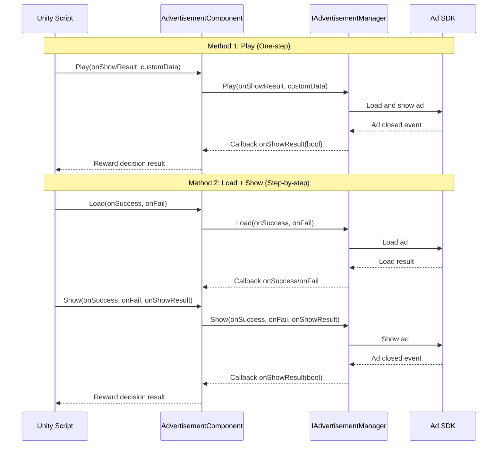

# Core Concepts

This document introduces the core architecture concepts, design patterns, and working principles of the GameFrameX ad module. Understanding these concepts will help you better use and extend the ad functionality.

## Overview

The GameFrameX ad module is a Unity-based ad integration framework that uses modular architecture design and provides unified ad interface abstraction. This module allows developers to implement ad functionality in a platform-agnostic manner while supporting customized implementations for different platforms (Android, iOS, WebGL, and various mini-game environments).

The core design philosophy is to decouple ad business logic from the Unity component lifecycle. Through interface abstraction and modular design, the code becomes more testable, maintainable, and extensible.

## Architecture Design

```mermaid
graph TD
    subgraph UnityLayer["Unity Component Layer"]
        AC[AdvertisementComponent<br/>Ad Component]
    end

    subgraph FrameworkLayer["GameFrameX Framework Layer"]
        GFC[GameFrameworkComponent<br/>Framework Component Base Class]
        GFE[GameFrameworkEntry<br/>Framework Entry]
        GFM[GameFrameworkModule<br/>Framework Module Base Class]
    end

    subgraph AbstractionLayer["Abstraction Interface Layer"]
        IAM[IAdvertisementManager<br/>Ad Manager Interface]
        BAM[BaseAdvertisementManager<br/>Ad Manager Base Class]
    end

    subgraph ImplementationLayer["Platform Implementation Layer"]
        ADM[Platform Specific<br/>Ad Manager Implementation]
    end

    AC -->|depends on| IAM
    AC -->|gets module| GFE
    GFE -->|instantiates| GFM
    IAM <|..| BAM
    BAM -->|inherits| GFM
    BAM -->|depends on| ADM
    AC -->|references| GFC
```

### Layer Responsibilities

**Unity Component Layer**
- `AdvertisementComponent`: Acts as a Unity GameObject component, encapsulating the external interface for ad functionality
- Responsible for component lifecycle management (Awake, Start)
- Handles platform-specific ad unit ID selection

**Framework Layer**
- `GameFrameworkComponent`: Provides base functionality for Unity components
- `GameFrameworkEntry`: Provides the entry point for module registration and retrieval
- `GameFrameworkModule`: Base class for all GameFrameX modules

**Abstraction Interface Layer**
- `IAdvertisementManager`: Defines the abstract interface for the ad manager, isolating business logic from concrete implementation
- `BaseAdvertisementManager`: Provides base implementation, defining callback fields and template methods

**Platform Implementation Layer**
- Implemented by specific platforms (e.g., Unity Ads, AdMob, etc.) inheriting from `BaseAdvertisementManager`

## Core Component Details

### IAdvertisementManager Interface

`IAdvertisementManager` is the core interface of the ad module, defining the standard contract for all ad operations:

```csharp
public interface IAdvertisementManager
{
    void Initialize(string adUnitId, bool isDebug = false);
    void SetExtraData(string key, string value);
    void Play(Action<bool> playResult, string customData = null);
    void Show(Action<string> success, Action<string> fail, Action<bool> onShowResult, string customData = null);
    void Load(Action<string> success, Action<string> fail, string customData = null);
}
```

> Source: [IAdvertisementManager.cs]({{file_base_url}}/Runtime/Advertisement/IAdvertisementManager.cs#L10-L54)

**Interface Design Intent:**
- **Initialize**: Initializes the ad manager, setting the ad unit ID and debug mode
- **SetExtraData**: Allows setting additional parameters before displaying ads for use by the ad SDK
- **Play**: Simplified one-step ad playback method (load + display)
- **Show**: Step-by-step ad display, requires calling Load first
- **Load**: Preloads ad resources to improve display success rate

### BaseAdvertisementManager Base Class

`BaseAdvertisementManager` is the base class for all platform-specific ad managers, inheriting from `GameFrameworkModule`:

```csharp
public abstract class BaseAdvertisementManager : GameFrameworkModule, IAdvertisementManager
{
    protected Action<bool> OnShowResult;
    protected Action<string> OnLoadSuccess;
    protected Action<string> OnLoadFail;

    public abstract void Initialize(string adUnitId, bool debug = false);
    public abstract void Play(Action<bool> playResult, string customData = null);
    public abstract void Show(Action<string> success, Action<string> fail, Action<bool> onShowResult, string customData = null);
    public abstract void Load(Action<string> success, Action<string> fail, string customData = null);

    protected void LoadSuccess(string json);
    protected void LoadFail(string json);
}
```

> Source: [BaseAdvertisementManager.cs]({{file_base_url}}/Runtime/Advertisement/BaseAdvertisementManager.cs#L11-L108)

**Base Class Design Intent:**
- Inheriting `GameFrameworkModule` makes it part of the framework, enjoying the lifecycle management provided by the framework
- Uses the `protected` modifier to expose callback fields for subclasses to trigger at appropriate times
- Abstract methods force subclasses to implement platform-specific logic
- `LoadSuccess` and `LoadFail` provide standard handling templates for load results

### AdvertisementComponent Component

`AdvertisementComponent` is the entry component at the Unity level, inheriting from `GameFrameworkComponent`:

```csharp
[DisallowMultipleComponent]
[AddComponentMenu("GameFrameX/Advertisement")]
public class AdvertisementComponent : GameFrameworkComponent
{
    [SerializeField] private string m_adUnitIdAndroid = string.Empty;
    [SerializeField] private string m_adUnitIdiOS = string.Empty;
    [SerializeField] private string m_adUnitIdWebGL = string.Empty;
    [SerializeField] private string m_adUnitIdWebGLWeChat = string.Empty;
    [SerializeField] private string m_adUnitIdWebGLDouYin = string.Empty;
    [SerializeField] private string m_adUnitIdWebGLKuaiShou = string.Empty;
    [SerializeField] private bool m_debug = false;

    public string AdUnitId { get; private set; }

    private IAdvertisementManager _advertisementManager;

    protected override void Awake() { /* ... */ }
    private void Start() { /* ... */ }
    public void Initialize(string adUnitId, bool isDebug = false) { /* ... */ }
    public void SetExtraData(string key, string value) { /* ... */ }
    public void Show(Action<string> success, Action<string> fail, Action<bool> onShowResult) { /* ... */ }
    public void Play(Action<bool> onShowResult, string customData = null) { /* ... */ }
    public void Load(Action<string> success, Action<string> fail) { /* ... */ }
}
```

> Source: [AdvertisementComponent.cs]({{file_base_url}}/Runtime/Advertisement/AdvertisementComponent.cs#L13-L168)

**Component Design Intent:**
- Uses `[DisallowMultipleComponent]` to ensure only one ad component instance in the scene
- Uses `[AddComponentMenu]` for easy component addition in the Unity Editor
- Serialized fields support configuring ad unit IDs for different platforms in the editor
- In `Awake`, gets the module instance via `GameFrameworkEntry.GetModule<IAdvertisementManager>()`
- In `Start`, automatically initializes the ad manager
- Automatically selects the correct ad unit ID based on the runtime platform and compile conditions

## Platform Selection Mechanism

The ad component automatically selects the corresponding ad unit ID based on the runtime environment. This process is completed in the `Awake` method:

```csharp
AdUnitId =
#if UNITY_WEBGL
#if ENABLE_WECHAT_MINI_GAME
    m_adUnitIdWebGLWeChat
#elif ENABLE_DOUYIN_MINI_GAME
    m_adUnitIdWebGLDouYin
#elif ENABLE_KUAISHOU_MINI_GAME
    m_adUnitIdWebGLKuaiShou
#else
    m_adUnitIdWebGL
#endif
#elif UNITY_ANDROID
    m_adUnitIdAndroid
#elif UNITY_IOS
    m_adUnitIdiOS
#else
    string.Empty
#endif
;
```

> Source: [AdvertisementComponent.cs]({{file_base_url}}/Runtime/Advertisement/AdvertisementComponent.cs#L69-L87)

This design supports the following platforms:
| Platform | Conditional Compilation Symbol | Configuration Field |
|----------|-------------------------------|---------------------|
| Android | `UNITY_ANDROID` | m_adUnitIdAndroid |
| iOS | `UNITY_IOS` | m_adUnitIdiOS |
| WebGL (Generic) | `UNITY_WEBGL` | m_adUnitIdWebGL |
| WeChat Mini Game | `ENABLE_WECHAT_MINI_GAME` | m_adUnitIdWebGLWeChat |
| Douyin Mini Game | `ENABLE_DOUYIN_MINI_GAME` | m_adUnitIdWebGLDouYin |
| Kuaishou Mini Game | `ENABLE_KUAISHOU_MINI_GAME` | m_adUnitIdWebGLKuaiShou |

## Ad Playback Flow



### Play Method (Recommended)

The `Play` method is the simplest ad playback method, encapsulating the complete process of loading and displaying:

```csharp
public void Play(Action<bool> onShowResult, string customData = null)
{
    _advertisementManager.Play(onShowResult, customData);
}
```

> Source: [AdvertisementComponent.cs]({{file_base_url}}/Runtime/Advertisement/AdvertisementComponent.cs#L148-L151)

Suitable for simple scenarios, it automatically handles ad loading when called.

### Load + Show Method (Fine-grained Control)

For scenarios requiring fine-grained control, you can use the step-by-step approach:

```csharp
// Step 1: Preload ad
public void Load(Action<string> success, Action<string> fail)
{
    _advertisementManager.Load(success, fail);
}

// Step 2: Show ad
public void Show(Action<string> success, Action<string> fail, Action<bool> onShowResult)
{
    _advertisementManager.Show(success, fail, onShowResult);
}
```

> Source: [AdvertisementComponent.cs]({{file_base_url}}/Runtime/Advertisement/AdvertisementComponent.cs#L133-L167)

Suitable for:
- Preloading ads at specific times
- Handling different outcomes based on load results
- Distinguishing between load failures and display failures

## Callback Mechanism

The ad module uses C# `Action` delegates to implement asynchronous callbacks:

| Callback Type | Parameter | Purpose |
|--------------|-----------|---------|
| `Action<string> success` | Success message | Called when the operation succeeds |
| `Action<string> fail` | Failure reason | Called when the operation fails |
| `Action<bool> onShowResult` | Whether watched completely | Called when ad is closed, true means reward should be granted |

### onShowResult Callback Description

The boolean value meaning of the `onShowResult` callback:
- **true**: User watched the ad completely (usually requires granting reward)
- **false**: User skipped the ad or ad playback was abnormal (no reward granted)

```csharp
// Usage example
advertisementComponent.Play((shouldReward) =>
{
    if (shouldReward)
    {
        // Grant reward
        Debug.Log("User watched ad completely, granting reward");
    }
    else
    {
        Debug.Log("User skipped ad, no reward granted");
    }
});
```

## Design Pattern Summary

### 1. Template Method Pattern

`BaseAdvertisementManager` defines `LoadSuccess` and `LoadFail` template methods. Subclasses only need to call these methods without implementing their own callback logic:

```csharp
protected void LoadSuccess(string json)
{
    OnLoadSuccess?.Invoke(json);
}
```

> Source: [BaseAdvertisementManager.cs]({{file_base_url}}/Runtime/Advertisement/BaseAdvertisementManager.cs#L94-L97)

### 2. Dependency Injection

`AdvertisementComponent` gets the module instance through `GameFrameworkEntry.GetModule<IAdvertisementManager>()` instead of creating it itself:

```csharp
_advertisementManager = GameFrameworkEntry.GetModule<IAdvertisementManager>();
```

> Source: [AdvertisementComponent.cs]({{file_base_url}}/Runtime/Advertisement/AdvertisementComponent.cs#L62-L67)

This design allows replacing different ad implementations at runtime, facilitating testing and platform adaptation.

### 3. Strategy Pattern

Different ad platform implementations can replace the `IAdvertisementManager` interface. As long as they implement the same interface, they can be seamlessly switched.

### 4. Facade Pattern

`AdvertisementComponent` serves as a unified entry point, simplifying interaction with the ad module. Developers don't need to care about the underlying implementation details.

## Extending the Ad Module

To add support for a new ad platform:

1. **Create a new ad manager class** inheriting from `BaseAdvertisementManager`
2. **Implement all abstract methods**, handling platform-specific ad logic
3. **Register with the framework** through `GameFrameworkEntry` module registration
4. **Configure in Unity component**, setting the ad unit ID for the corresponding platform

For specific implementation, please refer to the [API Reference](./6-api-reference) and [Platform Configuration](./5-platforms) documentation.

## Related Links

- [Getting Started](./3-getting-started)
- [Platform Configuration](./5-platforms)
- [API Reference](./6-api-reference)
- [Installation Guide](./2-installation)
