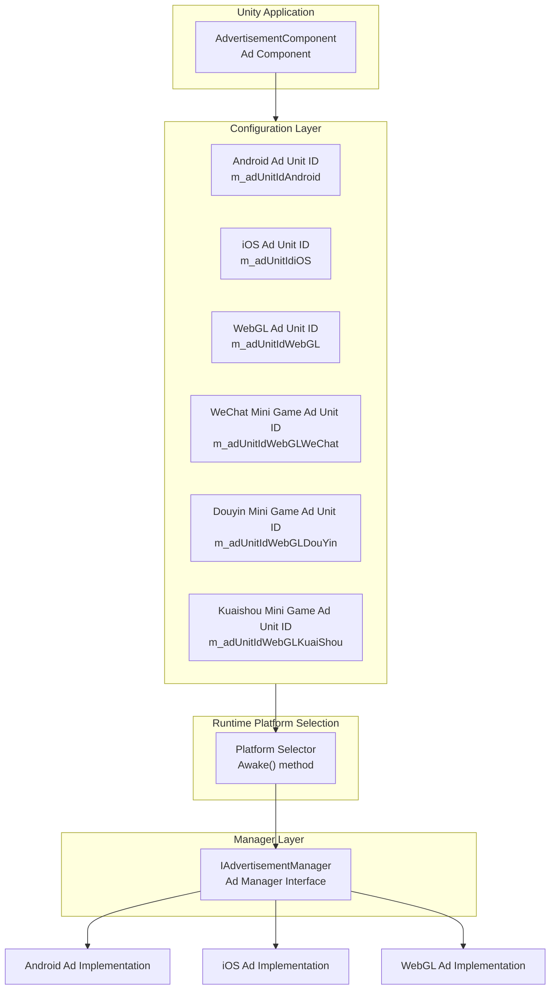

# Platform Configuration

This document introduces the platform configuration mechanism of the Game Frame X ad component, explaining how to configure ad unit IDs on different publishing platforms.

## Overview

The Game Frame X ad component uses a platform-agnostic design architecture, providing a unified ad interface through the `AdvertisementComponent` component. The underlying implementation uses Unity's conditional compilation directives to automatically adapt to different platforms. Developers only need to configure ad unit IDs for each platform in the Inspector panel to achieve one-time configuration and multi-platform publishing.

> Note: This component only provides the abstraction layer and core logic framework for ad functionality. To achieve actual ad display, you need to integrate a specific ad SDK (such as AdMob, Unity Ads, CSJ, etc.) in your project and implement the `IAdvertisementManager` interface.

## Supported Platforms

The Game Frame X ad component supports the following platform configurations:

| Platform | Configuration Field | Conditional Compilation Directive | Description |
|----------|---------------------|----------------------------------|-------------|
| Android | `m_adUnitIdAndroid` | `UNITY_ANDROID` | Android native platform |
| iOS | `m_adUnitIdiOS` | `UNITY_IOS` | iOS platform |
| WebGL | `m_adUnitIdWebGL` | `UNITY_WEBGL` | Standard WebGL platform |
| WebGL (WeChat Mini Game) | `m_adUnitIdWebGLWeChat` | `UNITY_WEBGL` + `ENABLE_WECHAT_MINI_GAME` | WeChat Mini Game environment |
| WebGL (Douyin Mini Game) | `m_adUnitIdWebGLDouYin` | `UNITY_WEBGL` + `ENABLE_DOUYIN_MINI_GAME` | Douyin Mini Game environment |
| WebGL (Kuaishou Mini Game) | `m_adUnitIdWebGLKuaiShou` | `UNITY_WEBGL` + `ENABLE_KUAISHOU_MINI_GAME` | Kuaishou Mini Game environment |

## Architecture Design



The platform selection logic is implemented in the `Awake()` method of `AdvertisementComponent`, automatically selecting the corresponding ad unit ID based on the current compilation platform:

```csharp
AdUnitId =
#if UNITY_WEBGL
#if ENABLE_WECHAT_MINI_GAME
    m_adUnitIdWebGLWeChat
#elif ENABLE_DOUYIN_MINI_GAME
    m_adUnitIdWebGLDouYin
#elif ENABLE_KUAISHOU_MINI_GAME
    m_adUnitIdWebGLKuaiShou
#else
    m_adUnitIdWebGL
#endif
#elif UNITY_ANDROID
    m_adUnitIdAndroid
#elif UNITY_IOS
    m_adUnitIdiOS
#else
    string.Empty
#endif
;
```

> Source: [AdvertisementComponent.cs](https://cnb.cool/GameFrameX/com.gameframex.unity.advertisement/blob/main/Runtime/Advertisement/AdvertisementComponent.cs#L69-L87)

## Configuration Process

### Step 1: Add Component

In the Unity scene, create an empty GameObject (or select an existing one), then add the `AdvertisementComponent` component:

1. In the Unity menu, select **GameObject** -> **GameFrameX** -> **Advertisement**
2. Or in the Inspector panel, click **Add Component**, search for and add `Advertisement`

### Step 2: Configure Ad Unit IDs

Configure ad unit IDs for each platform in the Inspector panel:

```csharp
[SerializeField] private string m_adUnitIdAndroid = string.Empty;      // Android ad unit ID
[SerializeField] private string m_adUnitIdiOS = string.Empty;           // iOS ad unit ID
[SerializeField] private string m_adUnitIdWebGL = string.Empty;         // WebGL ad unit ID
[SerializeField] private string m_adUnitIdWebGLWeChat = string.Empty;   // WeChat Mini Game ad unit ID
[SerializeField] private string m_adUnitIdWebGLDouYin = string.Empty;   // Douyin Mini Game ad unit ID
[SerializeField] private string m_adUnitIdWebGLKuaiShou = string.Empty;  // Kuaishou Mini Game ad unit ID
```

> Source: [AdvertisementComponent.cs](https://cnb.cool/GameFrameX/com.gameframex.unity.advertisement/blob/main/Runtime/Advertisement/AdvertisementComponent.cs#L15-L43)

### Step 3: Configure Test Mode (Optional)

If you need to view ad logs during debugging, you can enable test mode:

```csharp
[SerializeField] private bool m_debug = false;  // Whether test mode is enabled
```

> Source: [AdvertisementComponent.cs](https://cnb.cool/GameFrameX/com.gameframex.unity.advertisement/blob/main/Runtime/Advertisement/AdvertisementComponent.cs#L48)

### Step 4: Implement the Ad Manager

This component provides the configuration layer; you still need to implement the concrete ad manager. A typical implementation flow is as follows:

```csharp
using GameFrameX.Advertisement.Runtime;
using GameFrameX.Runtime;
using UnityEngine;

public class MyAdvertisementManager : BaseAdvertisementManager
{
    public override void Initialize(string adUnitId, bool debug = false)
    {
        // Implement specific initialization logic
    }

    public override void Play(Action<bool> playResult, string customData = null)
    {
        // Implement ad playback logic
    }

    public override void Show(Action<string> success, Action<string> fail, Action<bool> onShowResult, string customData = null)
    {
        // Implement ad display logic
    }

    public override void Load(Action<string> success, Action<string> fail, string customData = null)
    {
        // Implement ad loading logic
    }
}
```

## Unity Editor Configuration Interface

Game Frame X provides a custom Inspector interface, making it easy for developers to configure ad unit IDs in the editor:

```csharp
[CustomEditor(typeof(AdvertisementComponent))]
internal sealed class AdvertisementComponentInspector : ComponentTypeComponentInspector
{
    // Customize the Inspector to display ad unit ID configuration fields for each platform
}
```

> Source: [AdvertisementComponentInspector.cs](https://cnb.cool/GameFrameX/com.gameframex.unity.advertisement/blob/main/Editor/Inspector/AdvertisementComponentInspector.cs#L16-L71)

Inspector interface display:

```
+----------------------------------------------+
| Advertisement Component                       |
+----------------------------------------------+
| Debug Mode:  [ ]                              |
|                                           |
| Android Ad Unit ID:  [________________]       |
| IOS Ad Unit ID:      [________________]       |
| WebGL Ad Unit ID:    [________________]        |
| WebGL WeChat Ad Unit ID: [________________]    |
| WebGL Douyin Ad Unit ID: [________________]    |
| WebGL Kuaishou Ad Unit ID: [________________]  |
+----------------------------------------------+
```

## Platform-Specific Notes

### Android Platform

- Uses `UnityEngine.RuntimePlatform.Android` as the compilation target
- Needs to apply for ad unit IDs from Google AdMob or other Android ad platforms

### iOS Platform

- Uses `UnityEngine.RuntimePlatform.IPhonePlayer` as the compilation target
- Needs to apply for ad unit IDs from ad platforms allowed by Apple App Store policies

### WebGL Platform

The WebGL platform is further subdivided based on compilation macro definitions:

| Compilation Macro | Platform | Description |
|-------------------|----------|-------------|
| `ENABLE_WECHAT_MINI_GAME` | WeChat Mini Game | WeChat Mini Game environment |
| `ENABLE_DOUYIN_MINI_GAME` | Douyin Mini Game | Douyin Mini Game environment |
| `ENABLE_KUAISHOU_MINI_GAME` | Kuaishou Mini Game | Kuaishou Mini Game environment |
| None of the above macros | Standard WebGL | Browser environment |

> **Important**: In Unity Build Settings, you need to set the correct preprocessor macros based on the target platform. For WeChat, Douyin, and Kuaishou mini-games, add the corresponding macro definitions in Player Settings -> Other Settings -> Scripting Define Symbols.

## Configuration Verification

After configuration is complete, you can verify the configuration through the following methods:

1. **Runtime Logs**: The component outputs the selected platform and ad unit ID during initialization
2. **Code Debugging**: Check the value of the `AdUnitId` property in the `Awake()` method

```csharp
// In AdvertisementComponent
public string AdUnitId { get; private set; }

// Use log output to verify
Debug.Log($"Current platform ad unit ID: {AdUnitId}");
```

## Frequently Asked Questions

### Q1: What format should the ad unit ID be in for each platform?

Different ad platforms have different ad unit ID formats:
- **Google AdMob**: Format like `ca-app-pub-xxxxxx/xxxxxx`
- **Unity Ads**: Format is a numeric ID
- **CSJ (China)**: Format provided by the ad platform

Please refer to the specific ad platform's documentation for the correct ad unit ID format.

### Q2: Ad unit ID is configured correctly but ads don't display?

Please check the following:
1. Confirm that a concrete class implementing the `IAdvertisementManager` interface exists
2. Confirm that the concrete implementation class is correctly registered with the Game Frame X framework
3. Check if the ad platform's backend has the app and ad unit properly configured
4. Enable `m_debug` mode to view detailed logs

### Q3: Ads don't display after WebGL platform build?

For the WebGL platform, ensure:
1. The `m_adUnitIdWebGL` field is correctly set
2. If it's a WeChat/Douyin/Kuaishou mini-game, ensure the corresponding compilation macro has been added in Player Settings
3. No JavaScript errors in the browser console

## Related Links

- [Overview](./1-overview) - Learn about the overall architecture of the ad component
- [Installation Guide](./2-installation) - View component installation methods
- [Getting Started](./3-getting-started) - Quick ad functionality integration
- [Core Concepts](./4-core-concepts) - Deep dive into core concepts
- [API Reference](./6-api-reference) - Complete API interface documentation
- [Troubleshooting](./7-troubleshooting) - Frequently asked questions
