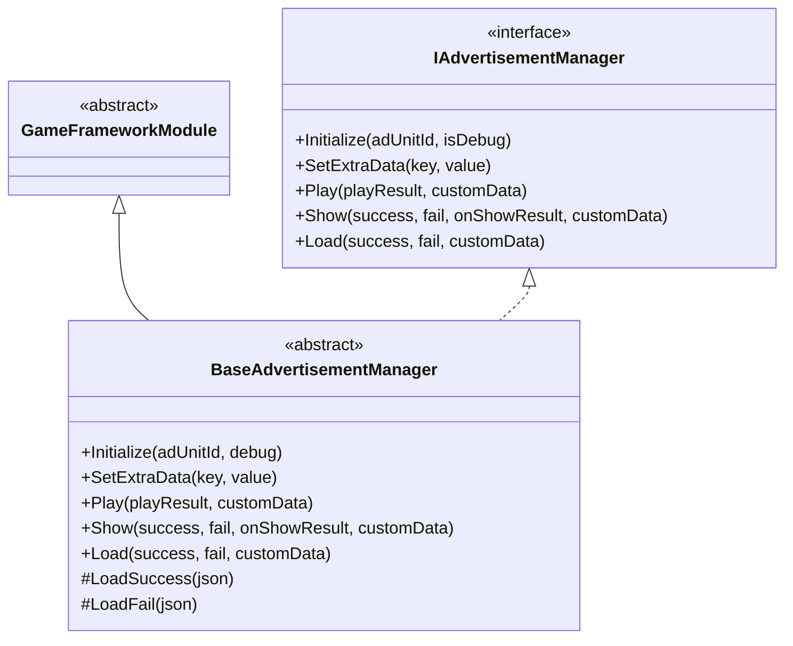
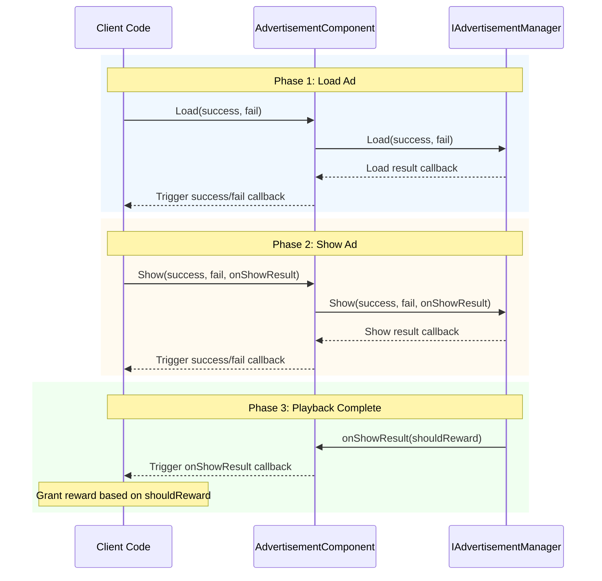

# API Reference

This section provides detailed information on the complete API interface of the GameFrameX Advertisement module, covering interface definitions, abstract base classes, and public methods and properties of the Unity component.

## Overview

The Advertisement module provides a unified ad management interface that supports multiple ad platforms (Android, iOS, WebGL, WeChat Mini Game, Douyin Mini Game, Kuaishou Mini Game). The API design uses the Strategy Pattern, defining a unified ad operation contract through the `IAdvertisementManager` interface, with each platform's implementation class responsible for specific ad SDK integration.

---

## IAdvertisementManager Interface

`IAdvertisementManager` is the core interface for ad management, defining standard methods for all ad operations. This interface follows the Dependency Inversion Principle, decoupling upper-level code from specific ad platform implementations.

> Source: [IAdvertisementManager.cs]({{file_base_url}}/Runtime/Advertisement/IAdvertisementManager.cs#L1-L55)

### Method List

| Method | Description |
|--------|-------------|
| `Initialize` | Initialize the ad manager |
| `SetExtraData` | Set additional ad data |
| `Play` | Play ad (simplified version) |
| `Show` | Show ad (full version) |
| `Load` | Load ad |

---

## BaseAdvertisementManager Abstract Class

`BaseAdvertisementManager` is the abstract base class for all platform ad managers, inheriting from `GameFrameworkModule` and implementing the `IAdvertisementManager` interface. This class provides default implementations for some methods and defines abstract methods that subclasses must implement.

> Source: [BaseAdvertisementManager.cs]({{file_base_url}}/Runtime/Advertisement/BaseAdvertisementManager.cs#L1-L109)

### Class Structure



### Protected Members

| Member | Type | Description |
|--------|------|-------------|
| `OnShowResult` | `Action<bool>` | Ad display result callback |
| `OnLoadSuccess` | `Action<string>` | Ad load success callback |
| `OnLoadFail` | `Action<string>` | Ad load failure callback |

### Lifecycle Methods

#### `Update(elapseSeconds, realElapseSeconds)`

Update method, called every frame.

**Declaration:**
```csharp
protected override void Update(float elapseSeconds, float realElapseSeconds)
```

> Source: [BaseAdvertisementManager.cs]({{file_base_url}}/Runtime/Advertisement/BaseAdvertisementManager.cs#L18-L21)

#### `Shutdown()`

Cleanup method called when the module is shut down.

**Declaration:**
```csharp
protected override void Shutdown()
```

> Source: [BaseAdvertisementManager.cs]({{file_base_url}}/Runtime/Advertisement/BaseAdvertisementManager.cs#L25-L28)

---

## AdvertisementComponent Component

`AdvertisementComponent` is the ad component used in Unity scenes, inheriting from `GameFrameworkComponent`. This component provides an editor-facing configuration interface and runtime API, and is the class that developers interact with most directly in the game.

> Source: [AdvertisementComponent.cs]({{file_base_url}}/Runtime/Advertisement/AdvertisementComponent.cs#L1-L169)

### Unity Properties

The following properties can be configured in the Unity Editor:

| Property | Type | Default Value | Description |
|----------|------|---------------|-------------|
| `AdUnitId` | string | Empty string | Android platform ad unit ID |
| `m_adUnitIdiOS` | string | Empty string | iOS platform ad unit ID |
| `m_adUnitIdWebGL` | string | Empty string | WebGL platform ad unit ID |
| `m_adUnitIdWebGLWeChat` | string | Empty string | WeChat Mini Game ad unit ID |
| `m_adUnitIdWebGLDouYin` | string | Empty string | Douyin Mini Game ad unit ID |
| `m_adUnitIdWebGLKuaiShou` | string | Empty string | Kuaishou Mini Game ad unit ID |
| `m_debug` | bool | false | Whether to enable test mode |

### Public Properties

#### `AdUnitId`

Gets the ad unit ID for the current platform. This property automatically selects the appropriate ad unit ID based on the current runtime platform in the `Awake()` method.

```csharp
public string AdUnitId { get; private set; }
```

> Source: [AdvertisementComponent.cs]({{file_base_url}}/Runtime/Advertisement/AdvertisementComponent.cs#L51-L53)

### Public Methods

#### `Initialize(adUnitId, isDebug)`

Initialize the ad manager. Can be used to reinitialize the ad manager at runtime.

**Declaration:**
```csharp
public void Initialize(string adUnitId, bool isDebug = false)
```

**Parameters:**
- `adUnitId` (string): Ad unit ID
- `isDebug` (bool): Whether to enable test mode, default value is false

**Example:**
```csharp
// Initialize ad component
var adComponent = gameObject.GetComponent<AdvertisementComponent>();
adComponent.Initialize("your_ad_unit_id", true);
```

> Source: [AdvertisementComponent.cs]({{file_base_url}}/Runtime/Advertisement/AdvertisementComponent.cs#L101-L105)

---

#### `SetExtraData(key, value)`

Set additional ad data. Sets additional parameter data before displaying ads, which may be used by the ad SDK.

**Declaration:**
```csharp
public void SetExtraData(string key, string value)
```

**Parameters:**
- `key` (string): Data key
- `value` (string): Data value

**Design Intent:** This method is used to pass ad-related context information, such as user level, level progress, etc. The ad SDK can use this information to optimize ad delivery strategy.

**Example:**
```csharp
// Set user level information
adComponent.SetExtraData("user_level", "10");
adComponent.SetExtraData("current_level", "5");
```

> Source: [AdvertisementComponent.cs]({{file_base_url}}/Runtime/Advertisement/AdvertisementComponent.cs#L116-L119)

---

#### `Show(success, fail, onShowResult)`

Show ad (full version). Ensure you have preloaded an ad via the `Load` method before calling this method.

**Declaration:**
```csharp
public void Show(Action<string> success, Action<string> fail, Action<bool> onShowResult)
```

**Parameters:**
- `success` (Action\<string\>): Show success callback, parameter is success message
- `fail` (Action\<string\>): Show failure callback, parameter is failure reason
- `onShowResult` (Action\<bool\>): Callback when ad is closed after successful display. Parameter value true indicates reward should be granted, false indicates the ad was not watched completely

**Design Intent:** This method provides complete callback handling capability, suitable for scenarios requiring different business logic based on ad display results.

**Example:**
```csharp
// Show interstitial ad
adComponent.Show(
    success => Debug.Log($"Ad displayed successfully: {success}"),
    fail => Debug.LogError($"Ad display failed: {fail}"),
    shouldReward =>
    {
        if (shouldReward)
        {
            // Grant reward
            Debug.Log("User watched ad completely, granting reward");
        }
    }
);
```

> Source: [AdvertisementComponent.cs]({{file_base_url}}/Runtime/Advertisement/AdvertisementComponent.cs#L133-L136)

---

#### `Play(onShowResult, customData)`

Play ad (simplified version). This is a simplified version of the `Show` method, suitable for simple ad playback scenarios.

**Declaration:**
```csharp
public void Play(Action<bool> onShowResult, string customData = null)
```

**Parameters:**
- `onShowResult` (Action\<bool\>): Callback when ad is closed after successful display. Parameter value true indicates reward should be granted, false indicates the ad was not watched completely
- `customData` (string): Custom data, can be null

**Design Intent:** Compared to the `Show` method, the `Play` method simplifies callback parameters, suitable for quick integration and simple reward granting scenarios.

**Example:**
```csharp
// Play rewarded video ad
adComponent.Play(shouldReward =>
{
    if (shouldReward)
    {
        // Grant reward
        Debug.Log("Granting reward coins x 100");
    }
}, "level_5_reward");
```

> Source: [AdvertisementComponent.cs]({{file_base_url}}/Runtime/Advertisement/AdvertisementComponent.cs#L148-L151)

---

#### `Load(success, fail)`

Load ad. It is recommended to call this method to preload ad resources before displaying ads.

**Declaration:**
```csharp
public void Load(Action<string> success, Action<string> fail)
```

**Parameters:**
- `success` (Action\<string\>): Load success callback, parameter is success message
- `fail` (Action\<string\>): Load failure callback, parameter is failure reason

**Design Intent:** Preloading ads can reduce user wait time and improve user experience. It is recommended to call this in advance during game loading screens or idle time.

**Example:**
```csharp
// Preload ad
adComponent.Load(
    success => Debug.Log($"Ad loaded successfully: {success}"),
    fail => Debug.LogWarning($"Ad load failed: {fail}")
);
```

> Source: [AdvertisementComponent.cs]({{file_base_url}}/Runtime/Advertisement/AdvertisementComponent.cs#L164-L167)

---

## Ad Playback Flow

The following flowchart shows the complete ad playback lifecycle:



---

## Complete Usage Example

The following example demonstrates the complete flow of playing a rewarded video ad after a game level is completed:

```csharp
using UnityEngine;
using GameFrameX.Advertisement.Runtime;

public class GameLevel : MonoBehaviour
{
    [SerializeField] private AdvertisementComponent advertisementComponent;
    
    private void OnLevelComplete()
    {
        // Check if ad component is available
        if (advertisementComponent != null)
        {
            // Play rewarded video ad
            advertisementComponent.Play(shouldReward =>
            {
                if (shouldReward)
                {
                    // Grant level completion reward
                    AwardLevelRewards();
                }
                else
                {
                    Debug.Log("User did not watch ad completely, cannot receive reward");
                }
            }, $"level_{CurrentLevel}_completion");
        }
    }
    
    private void AwardLevelRewards()
    {
        Debug.Log("Level rewards granted!");
    }
}
```

> Sources:
> - [AdvertisementComponent.cs]({{file_base_url}}/Runtime/Advertisement/AdvertisementComponent.cs#L148-L151)
> - [IAdvertisementManager.cs]({{file_base_url}}/Runtime/Advertisement/IAdvertisementManager.cs#L28-L34)

---

## Related Links

- [Overview](../1-overview) - Overall introduction to the ad module
- [Installation Guide](../2-installation) - Environment setup and installation
- [Getting Started](../3-getting-started) - Quick integration guide
- [Core Concepts](../4-core-concepts) - Core architecture design
- [Platform Configuration](../5-platforms) - Detailed configuration for each platform
- [Troubleshooting](../7-troubleshooting) - Common issues and solutions
