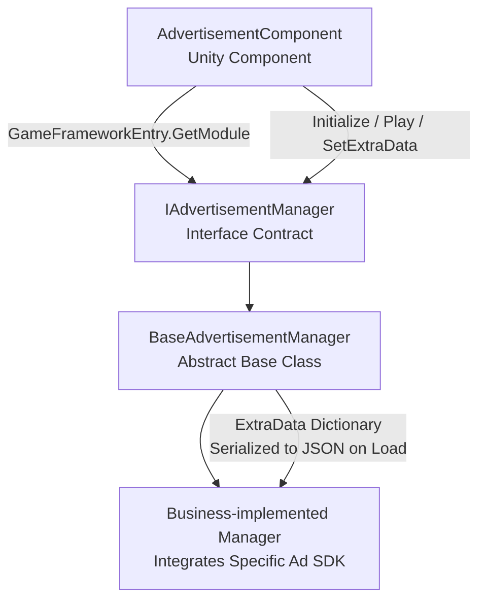

# Ad Component Runtime Overview

The GameFrameX ad component is built on a two-layer structure combining a Unity component and a framework module. It consolidates SDK initialization, playback, loading, and callbacks under a unified `IAdvertisementManager` contract, so business code only needs to call `AdvertisementComponent`.

## Quick Start

1. Attach an `AdvertisementComponent` to a scene object (menu path `GameFrameX/Advertisement`), and fill in the ad unit IDs for each platform in the Inspector (`m_adUnitIdAndroid` / `m_adUnitIdiOS` / `m_adUnitIdWebGL*`).
2. Drag a config subclass derived from `AdvertisementConfig` (for example, `DefaultAdvertisementConfig`) into the `Config` field of the Inspector to carry extended parameters like `isDebug`.
3. Once the scene starts, the framework automatically selects the ad unit ID based on the current platform and passes `m_config` to the manager in `Start()`. After that, business code only needs to call `Play(AdvertisementPlayOption)`.

```csharp
// Trigger playback (recommended usage)
var option = new AdvertisementPlayOption
{
    onPlayResult = success => Debug.Log($"Playback finished: {success}"),
    customData = "revive_001",
};
FindObjectOfType<AdvertisementComponent>().Play(option);
```

Source: [AdvertisementComponent.cs](https://github.com/GameFrameX/com.gameframex.unity.advertisement/blob/main/Runtime/Advertisement/AdvertisementComponent.cs#L120-L219)

## How It Works

The ad component is driven by four collaborating objects: the component layer (`AdvertisementComponent`) → the interface layer (`IAdvertisementManager`) → the abstract manager (`BaseAdvertisementManager`) → the platform-specific implementation (business projects inherit `BaseAdvertisementManager` to integrate third-party SDKs). `Awake()` uses reflection to resolve the implementation type, retrieves the manager from `GameFrameworkEntry`, and then picks the ad unit ID based on platform macros.



Key points:

- **Platform ad unit ID selection**: `Awake()` uses macros like `#if UNITY_WEBGL` / `UNITY_ANDROID` / `UNITY_IOS` to differentiate platforms; under WebGL, it further distinguishes between sub-platforms such as WeChat/Douyin/Kuaishou mini-games. ([AdvertisementComponent.cs#L99-L117](https://github.com/GameFrameX/com.gameframex.unity.advertisement/blob/main/Runtime/Advertisement/AdvertisementComponent.cs#L99-L117))
- **Config object**: `AdvertisementConfig` is an abstract base class containing only the `isDebug` field; business code derives from it and adds fields as needed (for example, `adUnitId`). When `BaseAdvertisementManager.Initialize(AdvertisementConfig)` receives a `DefaultAdvertisementConfig`, it extracts `adUnitId` and then falls back to the legacy `Initialize(string, bool)` path. ([AdvertisementConfig.cs#L41-L53](https://github.com/GameFrameX/com.gameframex.unity.advertisement/blob/main/Runtime/Advertisement/AdvertisementConfig.cs#L41-L53), [BaseAdvertisementManager.cs#L112-L163](https://github.com/GameFrameX/com.gameframex.unity.advertisement/blob/main/Runtime/Advertisement/BaseAdvertisementManager.cs#L112-L163))
- **Backward compatibility for legacy and new APIs**: The legacy `Initialize(string, bool)` / `Show(...)` / `Play(Action<bool>, string)` / `Load(...)` methods are retained but marked `[Obsolete]`. The implementation uses a `_delegating` flag to prevent legacy and new APIs from recursively calling each other; the recommended unified usage is `Play(AdvertisementPlayOption)`. ([BaseAdvertisementManager.cs#L119-L134](https://github.com/GameFrameX/com.gameframex.unity.advertisement/blob/main/Runtime/Advertisement/BaseAdvertisementManager.cs#L119-L134))
- **Pass-through of extension data**: `SetExtraData(string, string)` writes key-value pairs into the base class `ExtraData` dictionary (a `null` value removes the key). Business implementations can serialize the dictionary to JSON during the `Load` phase and pass it through to the ad server for server-side reward validation. ([BaseAdvertisementManager.cs#L174-L189](https://github.com/GameFrameX/com.gameframex.unity.advertisement/blob/main/Runtime/Advertisement/BaseAdvertisementManager.cs#L174-L189))
- **Callback slots**: The base class declares three callback fields — `OnShowResult` / `OnLoadSuccess` / `OnLoadFail` — which business implementations can trigger as needed. ([BaseAdvertisementManager.cs#L77-L93](https://github.com/GameFrameX/com.gameframex.unity.advertisement/blob/main/Runtime/Advertisement/BaseAdvertisementManager.cs#L77-L93))

## What's Next

- Attach the component in a scene and fill in the ad unit IDs: see *How to Integrate the Ad Component*
- Integrate a specific SDK (Unity Ads / Pangle / GroMore, etc.): see *How to Implement a Custom Ad Manager*
- Parameter reference for calling `Play(AdvertisementPlayOption)`: see *Ad Playback Options Reference*