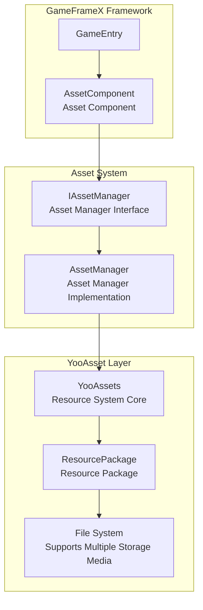
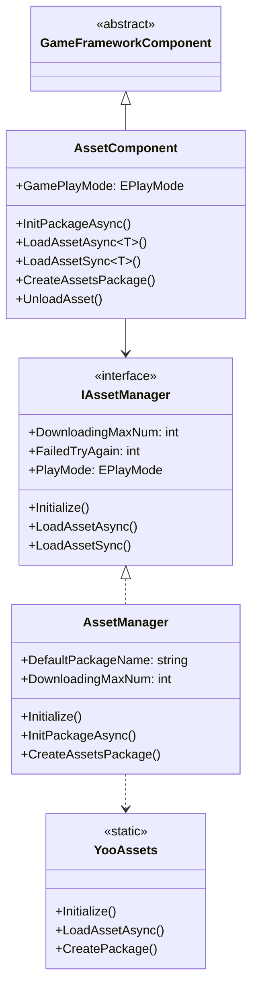
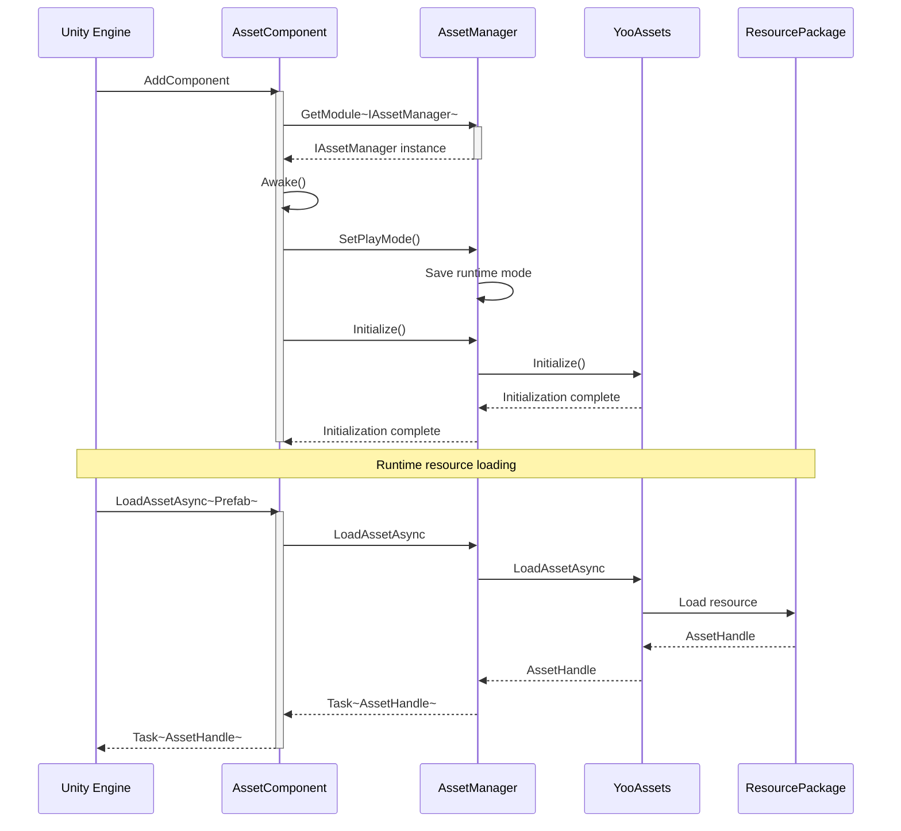
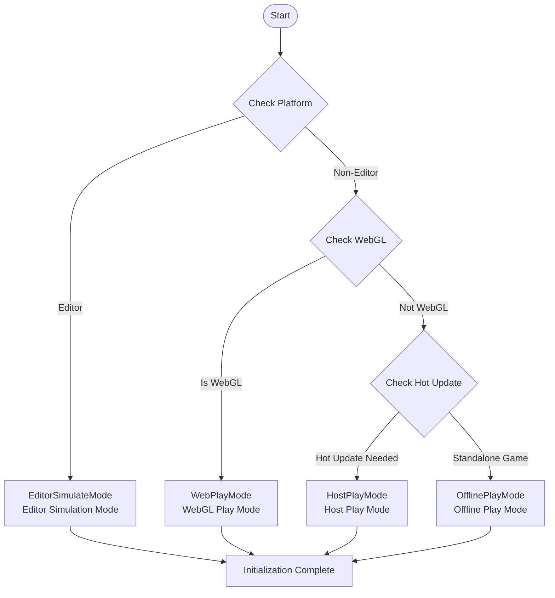

# Asset Component Introduction

The GameFrameX Asset component is a unified management solution for Unity game resources, built on top of YooAsset. It provides developers with a simple and efficient interface for resource loading and management. The component supports multiple runtime modes to meet the full range of needs from development debugging to hot-updated production environments.

## Overview

The Asset component is one of the core modules of the GameFrameX framework, specifically designed to address resource management issues in Unity projects. During game development, resource loading, caching, unloading, and hot-updating are critical aspects that directly impact game performance and user experience. By encapsulating the powerful capabilities of YooAsset, the Asset component provides a unified, concise, and easy-to-use API. Developers can quickly implement resource loading and management without needing to understand the underlying implementation details.

The core design philosophy of this component is to encapsulate complex resource management logic into simple interface calls while retaining sufficient flexibility to meet different project requirements. Whether it is a simple standalone game or a large commercial project requiring hot-updates, the Asset component can provide an appropriate solution. By supporting multiple runtime modes, developers can use the editor simulation mode for rapid iteration during development, the offline mode for functional verification during testing, and the hot-update mode for dynamic resource updates in production environments.



## Core Features

The Asset component provides comprehensive resource management capabilities, covering all common resource operation scenarios in game development.

### Resource Loading

The component supports both synchronous and asynchronous resource loading methods. Developers can choose the appropriate loading method based on actual needs. Asynchronous loading is suitable for most scenarios and can keep the game running smoothly. Synchronous loading is more efficient in certain specific scenarios (such as switching after resource preloading is complete).

- **Asynchronous Loading**: Loads resources using the Task async pattern, supporting both coroutines and callbacks
- **Synchronous Loading**: Directly returns a resource handle, suitable for scenarios where the resource is known to be already loaded
- **Generic Support**: Provides strongly-typed generic methods to avoid type conversion errors
- **Multiple Resource Types**: Supports loading of regular resources, sub-resources, raw files, and scenes

### Resource Package Management

Resource packages are the basic unit of resource management. The component supports operations such as creating, retrieving, and setting default packages. Through the resource package mechanism, resources can be organized in a modular way, with different functional modules using different resource packages for easier resource organization and updates.

```csharp
// Create a resource package
var package = assetComponent.CreateAssetsPackage("GameplayPackage");

// Try to get a resource package
var existingPackage = assetComponent.TryGetAssetsPackage("GameplayPackage");

// Set the default resource package
assetComponent.SetDefaultAssetsPackage(existingPackage);

// Check if a resource package exists
if (assetComponent.HasAssetsPackage("GameplayPackage"))
{
    // Resource package exists
}
```

> Source: [AssetComponent.cs](https://github.com/GameFrameX/com.gameframex.unity.asset/blob/main/Runtime/Asset/AssetComponent.cs#L463-L510)

### Resource Information Query

The component provides rich resource information query functions, including getting resource information, checking if resources exist, and determining if resources need to be downloaded. These functions are important for implementing on-demand resource downloads and progress display.

### Resource Unloading and Cleanup

Proper resource management includes not only loading but also timely unloading and cleanup. The component provides multiple resource release strategies, including unloading specific resources, unloading unused resources, and forced cleanup, helping developers effectively control memory usage.

## Architecture Design

The Asset component adopts a layered architecture design, where each layer has clear responsibility boundaries. This design gives the system good scalability and maintainability.

### Layered Architecture



### Component Interaction Flow



## Runtime Modes

The Asset component supports four runtime modes, each suitable for different development and deployment scenarios. The runtime mode determines how resources are loaded and their source. Developers need to choose the appropriate mode based on the specific requirements of the project.

### 1. Editor Simulation Mode (EditorSimulateMode)

The editor simulation mode is primarily used for rapid iteration during development. In this mode, resources are loaded directly from the Unity editor's resource folders without the need for resource packaging. The advantage of this mode is that modifications to resources take effect immediately during development without repackaging, greatly improving development efficiency. However, note that this mode can only be used in the editor environment and must be switched to another mode when building for release.

### 2. Offline Play Mode (OfflinePlayMode)

The offline play mode is suitable for standalone games or built-in game resources that do not require hot-updates. In this mode, all resources are loaded from the built-in file system, and resources are packaged into the installation package during the build. The advantage of this mode is simplicity and reliability - there is no need to worry about maintaining a resource server after game release, making it suitable for games with infrequent content updates.

### 3. Host Play Mode (HostPlayMode)

The host play mode is the most commonly used mode for large games, especially suitable for projects requiring hot-updates. In this mode, resources are divided into built-in resources and remote resources. Built-in resources are packaged with the application, while remote resources are downloaded on demand from the resource server. This mode supports dynamic resource updates, allowing content updates, bug fixes, or new feature additions after the game is released. The component supports configuring both primary and backup servers to ensure reliable resource downloads.

### 4. WebGL Play Mode (WebPlayMode)

The WebGL play mode is specifically optimized for the WebGL platform and is suitable for web games and mini-game platforms. This mode takes into account the special limitations of the WebGL platform and provides specific adaptations for resource loading. It also supports platforms such as ByteDance Mini Game, WeChat Mini Game, and Kuaishou Mini Game. Developers can configure accordingly based on the target platform.



## Platform Support

The Asset component is built on YooAsset and natively supports all platforms supported by Unity, including but not limited to Windows, macOS, iOS, Android, WebGL, and various mini-game platforms. The component automatically switches to WebPlayMode on the WebGL platform to ensure correct resource loading.

## Quick Start

To use the Asset component in your project, first add AssetComponent to the scene:

```csharp
// Create an empty GameObject in the Unity scene and add AssetComponent
var assetComponent = gameObject.AddComponent<AssetComponent>();
assetComponent.GamePlayMode = EPlayMode.HostPlayMode;
```

Then obtain the component instance through GameFrameX's entry point for resource loading:

```csharp
// Get the asset component
var assetComponent = GameEntry.GetComponent<AssetComponent>();

// Load resource asynchronously
var handle = await assetComponent.LoadAssetAsync<GameObject>("Assets/Prefabs/Player.prefab");
var prefab = handle.AssetObject as GameObject;

// Release the resource when done
handle.Release();
```

> Source: [AssetComponent.cs](https://github.com/GameFrameX/com.gameframex.unity.asset/blob/main/Runtime/Asset/AssetComponent.cs#L225-L316)

## Related Links

- [Features](./1-overview.features) - Learn more about features
- [Installation](./2-installation.index) - Installation and configuration guide
- [Getting Started Guide](./3-getting-started.index) - Get started quickly
- [Architecture Design](./4-core-concepts.architecture) - Deep dive into architecture design
- [Asset Manager](./4-core-concepts.asset-manager) - Asset manager details
- [Resource Loading API](./5-api-reference.loading-api) - API reference
- [Runtime Modes](./6-configuration.play-modes) - Runtime mode configuration
