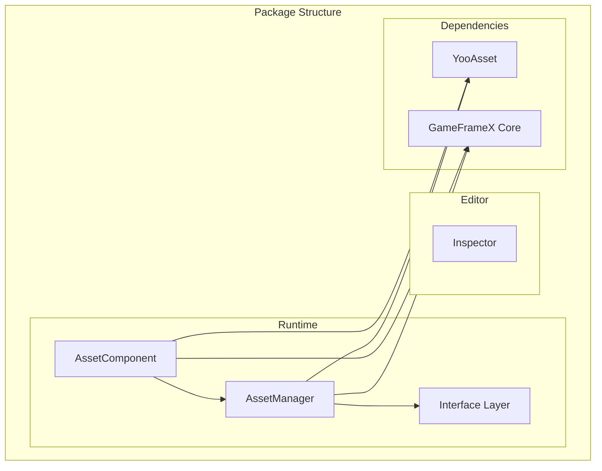

# Installation

The GameFrameX Asset component supports multiple installation methods to accommodate different project workflows and development needs. This document describes each installation method and its applicable scenarios in detail.

## Overview

The GameFrameX Asset component is a Unity resource management package built on YooAsset, providing unified resource loading, unloading, and hot-update interfaces. The component is distributed via Unity Package Manager (UPM) and supports multiple installation methods. Developers can choose the most appropriate installation method based on their project situation.

## Environment Requirements

| Requirement | Minimum Version | Description |
|-------------|-----------------|-------------|
| Unity Version | 2019.4 | LTS version recommended |
| Package Manager | UPM | Built into Unity |
| Network | GitHub access required | For Git URL installation |

## Installation Methods

### Method 1: Install via manifest.json

Edit the project's `Packages/manifest.json` file directly and add the package reference under the `dependencies` section. This is the most commonly used installation method, suitable for team projects requiring version control.

**Steps:**

1. Open the `Packages/manifest.json` file in your Unity project directory
2. Add the package reference in the `dependencies` section
3. Save the file and wait for Unity to automatically download and import

```json
{
  "dependencies": {
    "com.gameframex.unity.asset": "https://github.com/GameFrameX/com.gameframex.unity.asset.git"
  }
}
```

> Source: [README.md](https://github.com/GameFrameX/com.gameframex.unity.asset/blob/main/README.md#L13-L16)

**Applicable Scenarios:**
- Team collaboration projects requiring version locking
- CI/CD automated build environments
- Development workflows requiring custom package versions

**Notes:**
- This method always fetches the latest version
- To lock a version, use the `#branch` or `#tag` syntax
- The Git repository URL must remain accessible

### Method 2: Install via Unity Package Manager

Use Unity Editor's built-in Package Manager interface to add the package via Git URL. This method doesn't require manual editing of configuration files and is suitable for quick trials and temporary testing.

**Steps:**

1. Open `Window` -> `Package Manager` in Unity Editor
2. Click the `+` button in the top left corner
3. Select `Add package from git URL...`
4. Enter the Git repository URL: `https://github.com/GameFrameX/com.gameframex.unity.asset.git`
5. Click `Add` and wait for the package to download

```
https://github.com/GameFrameX/com.gameframex.unity.asset.git
```

> Source: [README.md](https://github.com/GameFrameX/com.gameframex.unity.asset/blob/main/README.md#L17)

**Applicable Scenarios:**
- Quick prototyping and feature testing
- Independent developers getting started quickly
- Temporary feature verification

**Notes:**
- Requires network connectivity
- First-time installation may take longer to download dependencies
- Recommended to switch to Method 1 for version control after testing

### Method 3: Manual Placement in Packages Directory

Clone or download the repository and place it directly in the Unity project's `Packages` directory. This method works completely offline and is suitable for network-restricted environments.

**Steps:**

1. Clone or download the repository: `https://github.com/GameFrameX/com.gameframex.unity.asset.git`
2. Rename the repository folder to `com.gameframex.unity.asset`
3. Copy the folder to the `Packages` directory of your Unity project
4. Unity will automatically recognize and load the package

```
YourUnityProject/
└── Packages/
    └── com.gameframex.unity.asset/
        ├── package.json
        ├── Runtime/
        └── Editor/
```

> Source: [README.md](https://github.com/GameFrameX/com.gameframex.unity.asset/blob/main/README.md#L18)

**Applicable Scenarios:**
- Network-restricted or unable to access external repositories
- Need to make local modifications and debug the package
- Offline development and build environments

**Notes:**
- The package will not auto-update; manual synchronization is required
- Modified packages may affect future upgrades
- Recommended to keep the original package copy for upgrades

## Dependency Requirements

The GameFrameX Asset component depends on the following packages, which are automatically installed during the installation process:

| Dependency Package | Version | Description |
|-------------------|---------|-------------|
| com.gameframex.unity | 1.1.1 | GameFrameX core framework |
| YooAsset | - | Underlying resource management implementation |
| BetterStreamingAssets | - | Streaming assets access support |

### YooAsset Integration

This component is built on [YooAsset](https://github.com/yoomotion/YooAsset) and provides the following core features:

- Resource packaging and distribution
- Resource loading and cache management
- Asynchronous scene loading
- Resource hot-update support
- Multi-platform adaptation

> For detailed API usage, refer to the [Resource Loading API](./5-api-reference.loading-api) documentation.

## Package Structure

After installation, the package directory structure is as follows:

```
com.gameframex.unity.asset/
├── package.json              # Package configuration file
├── Runtime/                  # Runtime code
│   ├── GameFrameX.Asset.Runtime.asmdef
│   ├── Asset/
│   │   ├── AssetComponent.cs
│   │   ├── AssetManager.cs
│   │   ├── IAssetManager.cs
│   │   └── Constant.cs
│   └── Update/
│       ├── EPatchStates.cs
│       └── EventArgs/
├── Editor/                   # Editor code
│   ├── GameFrameX.Asset.Editor.asmdef
│   └── Inspector/
│       └── AssetComponentInspector.cs
└── Tests/                   # Unit tests
    └── GameFrameX.Asset.Tests.asmdef
```



## Installation Verification

After installation is complete, verify through the following methods:

1. **Check Package Manager**: Confirm the `GameFrameX Asset` package is displayed in the Package Manager window
2. **Check Assemblies**: Confirm `GameFrameX.Asset.Runtime` and `GameFrameX.Asset.Editor` assemblies are generated in the Project window
3. **Run Sample Code**: Try loading a resource to verify functionality

```csharp
// Simple test to verify installation
using GameFrameX.Asset.Runtime;

public class InstallationTest : MonoBehaviour
{
    private void Start()
    {
        // Get the asset manager instance
        var manager = AssetManager.Instance;
        Debug.Log($"Asset Manager initialized: {manager != null}");
    }
}
```

## Version Selection

| Version Format | Example | Description |
|---------------|---------|-------------|
| latest | - | Fetches the latest code from the main branch |
| Branch | #main | Fetches the specified branch |
| Tag | #2.4.0 | Fetches the specified release version |

It is recommended to lock a specific version number in production projects to avoid compatibility issues caused by automatic updates.

## Common Issues

### Compilation Errors After Installation

**Cause**: Missing dependency packages or Unity version too old

**Solution**:
1. Confirm Unity version >= 2019.4
2. Check that dependencies are correctly added in `manifest.json`
3. Try deleting the `Library` folder and reopening the project

### Unable to Connect to Git Repository

**Cause**: Network issues or changed repository URL

**Solution**:
1. Check network connection
2. Confirm the Git repository URL is correct
3. Try using Method 3 for manual installation

### Version Upgrade Issues

**Solution**:
1. Backup the current project
2. Remove the old version package
3. Reinstall the new version following this document
4. Check the [CHANGELOG](./CHANGELOG.md) for version changes

## Related Links

- [GitHub Repository](https://github.com/GameFrameX/com.gameframex.unity.asset.git)
- [Dependencies](./2-installation.dependencies)
- [Getting Started Guide](./3-getting-started.index)
- [Official Documentation](https://gameframex.doc.alianblank.com)
