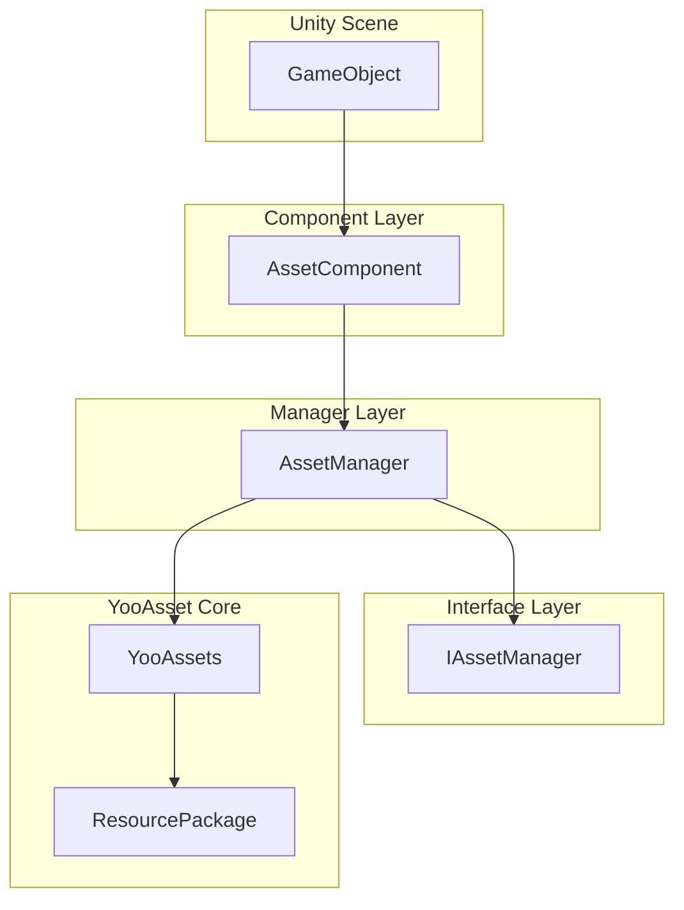
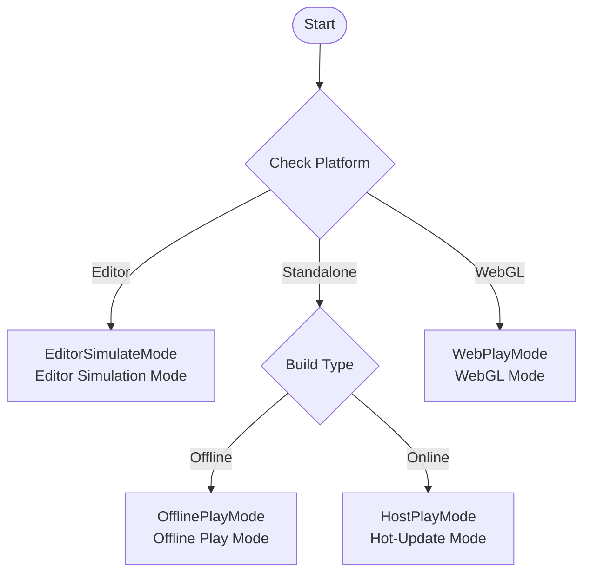

# Getting Started Guide

This document will help you quickly get started with the GameFrameX Asset component, learning how to integrate and use it for resource management in your Unity project.

## Overview

GameFrameX Asset is a Unity resource management system built on [YooAsset](https://yooasset.com/). It provides a unified resource loading interface and supports multiple runtime modes, including editor simulation mode, offline play mode, hot-update host mode, and WebGL mode. This component is one of the core modules of the GameFrameX game framework, specifically responsible for handling resource loading, unloading, and hot-update workflows.

The main design goal of the Asset component is to simplify the complexity of resource management, enabling developers to implement asynchronous loading, synchronous loading, scene switching, and hot-update functionality in a more concise way. By encapsulating YooAsset's underlying API, the Asset component provides a more intuitive and easy-to-use interface while retaining YooAsset's powerful resource management capabilities.

## System Architecture

The Asset component adopts a layered architecture design, with the core consisting of three main parts: the Unity component layer, the manager layer, and the interface layer. This layered design ensures code maintainability and extensibility while providing flexible resource management capabilities.



**Layer Responsibilities:**

**Component Layer (AssetComponent)** is a Unity MonoBehaviour component that needs to be attached to a GameObject in the scene. It is responsible for initializing the resource management system when the game starts and automatically selecting the appropriate runtime mode based on the target platform. On the WebGL platform, the component automatically switches to WebPlayMode to ensure resources are correctly loaded from the remote server.

**Manager Layer (AssetManager)** is the core implementation class for resource management, inheriting from GameFrameworkModule. It encapsulates all resource operations, including resource loading, unloading, package management, and cleanup. AssetManager provides both synchronous and asynchronous loading interfaces to meet different scenario needs.

**Interface Layer (IAssetManager)** defines the standard interface for resource management, ensuring the manager implementation follows proper conventions. Through interface abstraction, unit testing and module replacement become convenient.

## Core Concepts

### Runtime Mode (PlayMode)

The Asset component supports four runtime modes, each suitable for different development and deployment scenarios:



**EditorSimulateMode** is primarily used during development. In this mode, resources are loaded directly from the Unity editor's resource folders without the need for resource packaging. This mode can significantly shorten the development iteration cycle, allowing developers to quickly test resource loading functionality. Note that when running in a non-editor environment with this mode set, the system will automatically switch to HostPlayMode.

**OfflinePlayMode** is suitable for standalone games or internal testing that do not require hot-updates. In this mode, all resources are loaded from the built-in resource package (Buildin) without any remote resource downloads. Resources are packaged and built into the installation package, so players can run the game without an internet connection.

**HostPlayMode** is the most commonly used production mode, suitable for online games that require continuous updates. Resources are divided into built-in resources and remote resources: built-in resources are distributed with the application package, while remote resources are downloaded on demand from the hot-update server. This mode supports dynamic resource updates, allowing game content to be updated without republishing the application.

**WebPlayMode** is specifically optimized for the WebGL platform. Due to browser security restrictions and loading performance considerations, the WebGL platform requires a special resource loading approach. The Asset component automatically detects the WebGL platform and switches to this mode, while also supporting platforms such as ByteDance Mini Game, WeChat Mini Game, and Kuaishou Mini Game.

### Resource Package (ResourcePackage)

A resource package is the basic unit for organizing and managing resources. Each resource package has an independent name and can be configured with different resource server addresses. The system supports creating multiple resource packages to separate different types of resources, such as the main resource package, DLC resource packages, or language resource packages. The default resource package name is "DefaultPackage", which the system automatically creates and sets as the default.

### Resource Handle (AssetHandle)

A resource handle is a wrapper class for the return value of loaded resources. Through the handle object, you can access the loaded resource and call the Release method to free the resource when it is no longer needed. The system provides various types of handles: AssetHandle for regular resources, SubAssetsHandle for sub-resources, AllAssetsHandle for loading all resources, SceneHandle for scene loading, and RawFileHandle for raw files.

## Quick Start Flow

To use the Asset component in your project, complete the following key steps:

### Step 1: Install the Component

First, install the Asset component in your Unity project. For installation methods, refer to the [Installation](./2-installation.index) documentation. After installation, ensure the project includes the GameFrameX core framework and other necessary dependencies.

### Step 2: Add the Component to the Scene

In the Unity Editor, create a new GameObject (or use an existing one), then add the AssetComponent through the menu "Component" -> "GameFrameX" -> "Asset". After adding the component, you can configure the runtime mode and other parameters in the Inspector panel.

```csharp
// Example Unity scene hierarchy after adding the component
// GameObject (Root)
// └── Asset (with AssetComponent attached)
```

> Source: [AssetComponent.cs](https://github.com/GameFrameX/com.gameframex.unity.asset/blob/main/Runtime/Asset/AssetComponent.cs#L18-L35)

### Step 3: Configure Runtime Mode

In the Inspector panel, select the appropriate runtime mode based on your development stage and release target:

- **Development**: Select EditorSimulateMode to load resources directly from the editor
- **Offline Testing**: Select OfflinePlayMode to simulate a standalone environment
- **Hot-Update Testing**: Select HostPlayMode to test the complete hot-update workflow
- **WebGL Release**: Automatically switches to WebPlayMode on the WebGL platform

```csharp
// Runtime mode can also be set dynamically in code
var assetComponent = gameObject.GetComponent<AssetComponent>();
assetComponent.GamePlayMode = EPlayMode.HostPlayMode;
```

> Source: [AssetComponent.cs](https://github.com/GameFrameX/com.gameframex.unity.asset/blob/main/Runtime/Asset/AssetComponent.cs#L20-L31)

### Step 4: Initialize the Resource Package

For scenarios requiring hot-updates, you need to initialize the resource package and configure the remote server address. This step is typically performed during game startup or in the resource update workflow.

```csharp
// Initialize the default resource package
var assetComponent = gameObject.GetComponent<AssetComponent>();
bool success = await assetComponent.InitPackageAsync(
    "DefaultPackage",           // Resource package name
    "https://your-server.com/", // Primary server address
    "https://backup-server.com/", // Backup server address
    true                        // Whether to set as default package
);

if (success)
{
    Debug.Log("Resource package initialized successfully");
}
```

> Source: [AssetComponent.cs](https://github.com/GameFrameX/com.gameframex.unity.asset/blob/main/Runtime/Asset/AssetComponent.cs#L80-L95)

### Step 5: Load Resources

After initialization is complete, you can use the component's interfaces to load resources. The system supports both synchronous and asynchronous loading methods:

```csharp
// Asynchronous resource loading example
var assetComponent = gameObject.GetComponent<AssetComponent>();
var handle = await assetComponent.LoadAssetAsync<Sprite>("UI/Icons/PlayerIcon");
var sprite = handle.AssetObject as Sprite;

// Release the resource when done
handle.Release();
```

> Source: [AssetComponent.cs](https://github.com/GameFrameX/com.gameframex.unity.asset/blob/main/Runtime/Asset/AssetComponent.cs#L258-L261)

## Resource Loading Methods in Detail

The Asset component provides rich resource loading interfaces to meet various loading needs.

### Asynchronous Loading

Asynchronous loading is the recommended primary loading method, especially suitable for scenarios requiring large amounts of resource loading. Asynchronous loading does not block the main thread and keeps the game running smoothly. All async methods return Task objects, supporting the await syntax:

```csharp
// Asynchronously load a regular resource
var handle = await assetComponent.LoadAssetAsync<GameObject>("Prefabs/Player");

// Asynchronously load a typed resource
var handle = await assetComponent.LoadAssetAsync<Sprite>("UI/Background");

// Asynchronously load multiple resources
var allAssetsHandle = await assetComponent.LoadAllAssetsAsync<GameObject>("Prefabs/Enemies");

// Asynchronously load a scene
var sceneHandle = await assetComponent.LoadSceneAsync("Scenes/GameLevel", LoadSceneMode.Single);
```

> Source: [AssetManager.cs](https://github.com/GameFrameX/com.gameframex.unity.asset/blob/main/Runtime/Asset/AssetManager.cs#L469-L481)

### Synchronous Loading

Synchronous loading is suitable for scenarios where loading time is not critical but resources need to be obtained immediately. Since synchronous loading blocks the main thread, it may cause stuttering when loading large resources, so it is recommended to use it only when necessary:

```csharp
// Synchronously load a resource
var handle = assetComponent.LoadAssetSync<GameObject>("Prefabs/Player");
var player = handle.AssetObject as GameObject;
```

> Source: [AssetManager.cs](https://github.com/GameFrameX/com.gameframex.unity.asset/blob/main/Runtime/Asset/AssetManager.cs#L603-L606)

### Sub-Resource Loading

Sub-resource loading is used to handle cases where a single resource file contains multiple sub-resources, such as a Sprite Atlas or multiple sub-objects in a model file:

```csharp
// Load all sub-sprites from a Sprite Atlas
var handle = await assetComponent.LoadSubAssetsAsync<Sprite>("Atlas/UIAtlas");
foreach (var sprite in handle.AssetObject)
{
    Debug.Log($"Sprite name: {sprite.name}");
}
handle.Release();
```

> Source: [AssetManager.cs](https://github.com/GameFrameX/com.gameframex.unity.asset/blob/main/Runtime/Asset/AssetManager.cs#L244-L250)

### Raw File Loading

If you need to load non-Unity resource type files (such as configuration files, text files, etc.), use the raw file loading interface:

```csharp
// Asynchronously load a raw file
var rawHandle = await assetComponent.LoadRawFileAsync("Config/GameConfig.json");
byte[] data = rawHandle.ReadRawFile();
rawHandle.Release();
```

> Source: [AssetManager.cs](https://github.com/GameFrameX/com.gameframex.unity.asset/blob/main/Runtime/Asset/AssetManager.cs#L314-L320)

## Resource Management Best Practices

### Release Resources Promptly

Resources that are no longer in use should be released promptly to free up memory. Use the Release method of the resource handle:

```csharp
// Load and use a resource
var handle = await assetComponent.LoadAssetAsync<GameObject>("Prefabs/Player");
var player = Instantiate(handle.AssetObject as GameObject);

// Release the handle when done (note: the resource instance is not destroyed)
handle.Release();

// If complete cleanup is needed, including the resource instance
Destroy(player);
```

> Source: [AssetComponent.cs](https://github.com/GameFrameX/com.gameframex.unity.asset/blob/main/Runtime/Asset/AssetComponent.cs#L622-L628)

### Batch Unload Unused Resources

After the game runs for a while, a large number of unused resources may accumulate. Use the cleanup function to release these resources:

```csharp
// Unload unreferenced resources
assetComponent.UnloadUnusedAssetsAsync();

// Clean up unused resource package files (can free up storage space)
assetComponent.ClearUnusedBundleFilesAsync();
```

> Source: [AssetComponent.cs](https://github.com/GameFrameX/com.gameframex.unity.asset/blob/main/Runtime/Asset/AssetComponent.cs#L635-L658)

### Use Resource Packages for Resource Isolation

For large projects, it is recommended to use multiple resource packages to organize different types of resources. This enables on-demand loading and updating of resources:

```csharp
// Create additional resource packages
var dlcPackage = assetComponent.CreateAssetsPackage("DLC_Package");

// Get an existing resource package
var package = assetComponent.TryGetAssetsPackage("DefaultPackage");

// Set the default resource package
assetComponent.SetDefaultAssetsPackage(package);
```

> Source: [AssetComponent.cs](https://github.com/GameFrameX/com.gameframex.unity.asset/blob/main/Runtime/Asset/AssetComponent.cs#L471-L507)

## Next Steps

Now that you understand the basic usage of the Asset component, you can continue learning about the following topics:

- **[First Example](./3-getting-started.first-steps)**: Deep dive into resource loading implementation through complete code examples
- **[Architecture Design](./4-core-concepts.architecture)**: Understand the component's detailed architecture design and module organization
- **[Resource Loading API](./5-api-reference.loading-api)**: Review the complete API documentation
- **[Runtime Modes](./6-configuration.play-modes)**: Learn about various runtime mode configurations and usage scenarios

## Related Links

- [Asset Component Introduction](./1-overview.introduction)
- [Features](./1-overview.features)
- [Supported Unity Versions](./1-overview.supported-versions)
- [Installation](./2-installation.index)
- [Dependencies](./2-installation.dependencies)
- [First Example](./3-getting-started.first-steps)
- [Architecture Design](./4-core-concepts.architecture)
- [Asset Component](./4-core-concepts.asset-component)
- [Asset Manager](./4-core-concepts.asset-manager)
