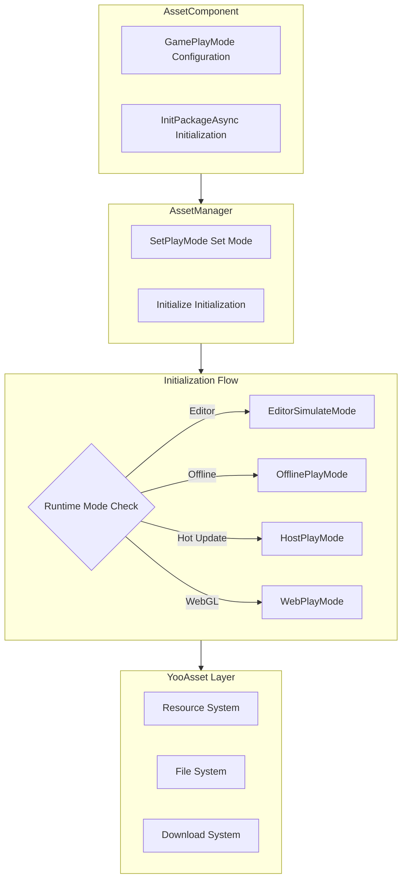

# Features

The Asset component is one of the core modules of the GameFrameX framework, built on YooAsset to provide unified resource loading, management, and updating capabilities. This component simplifies complex resource management operations into intuitive API interfaces, enabling developers to efficiently perform resource loading, scene switching, and resource package management.

## Overview

The Asset component aims to solve common resource management pain points in Unity projects, including inconsistent resource loading methods, difficult resource updates, and complex multi-platform adaptation. By providing unified interface abstraction and multiple runtime mode support, developers can flexibly use the same code in different development and deployment scenarios. The component supports everything from simple standalone games to complex hot-updated games, providing comprehensive solutions for both rapid iteration in the editor and hot-update deployment in production environments.

The core value of this component lies in encapsulating the complex functionality of the underlying resource management framework (YooAsset) while retaining its powerful capabilities. Developers do not need to understand the underlying implementation details; they can complete resource loading, scene switching, and other operations through simple API calls. Additionally, the component provides a complete event system that enables developers to monitor resource download progress, status changes, and other key information in real time, thereby achieving a better user experience.

## Core Features

### Multi-Mode Runtime Support

The Asset component supports four different runtime modes, each optimized for specific use cases. This design allows the same code to seamlessly switch between different development and deployment environments without modifying business logic code.

**Editor Simulation Mode (EditorSimulateMode)** is suitable for rapid iteration during development. In this mode, resources are loaded directly from the Unity editor's project directory without any packaging operations. This greatly accelerates development speed, as developers can see changes immediately after modifying resources without waiting for resource packaging to complete. This mode only works in the Unity Editor environment and will automatically switch to other modes when building for release.

**Offline Play Mode (OfflinePlayMode)** is suitable for standalone games or scenarios that do not require hot-updates. In this mode, all resources are loaded from the built-in resource package (Buildin) without any network requests. Resources are distributed with the application without additional download steps. This mode is best suited for indie game development or scenarios requiring strict control over resource distribution.

**Host Play Mode (HostPlayMode)** is suitable for games requiring hot-update functionality. In this mode, resources are divided into two parts: built-in resource packages for storing initial resources, and remote servers for storing hot-updated resources. The component automatically detects and downloads resources that need updating, supporting resume downloads and version management. This mode is standard for modern mobile games, allowing developers to continue updating content after game release.

**WebGL Play Mode (WebPlayMode)** is specifically optimized for the WebGL platform. This mode is adapted for the unique nature of the browser environment and supports various Web mini-game platforms (such as WeChat Mini Game, ByteDance Mini Game, Kuaishou Mini Game, etc.). The component automatically detects the target platform and selects appropriate file system parameters to ensure correct resource loading.



### Unified Resource Loading Interface

The Asset component provides rich resource loading interfaces covering various use cases. All loading interfaces support generic versions that automatically infer resource types, reducing the hassle of type conversion.

**Asynchronous Loading** is the recommended primary loading method, especially suitable for scenarios requiring multiple resources or large resource loading. Asynchronous loading does not block the main thread and maintains smooth UI response. The component converts YooAsset's callback-style API into Task-based async interfaces, making the code more concise and readable, supporting the async/await syntax sugar.

```csharp
// Asynchronously load a resource
var handle = await assetComponent.LoadAssetAsync<Texture2D>("Textures/Background");
var texture = handle.AssetObject as Texture2D;

// Asynchronously load all resources
var allHandle = await assetComponent.LoadAllAssetsAsync<GameObject>("Prefabs/Enemies");
foreach (var obj in allHandle.AllAssetObjects)
{
    // Process each resource
}

// Asynchronously load a scene
await assetComponent.LoadSceneAsync("Scenes/GameLevel", LoadSceneMode.Single);
```

> Source: [AssetComponent.cs](https://github.com/GameFrameX/com.gameframex.unity.asset/blob/main/Runtime/Asset/AssetComponent.cs#L258-L261)

**Synchronous Loading** is suitable for scenarios with strict loading time requirements, such as resources that need to be displayed immediately. Synchronous loading blocks the calling thread and may cause UI stuttering, so it is recommended to use it only when necessary and avoid loading large resources on the main thread.

```csharp
// Synchronously load a resource
var handle = assetComponent.LoadAssetSync<AudioClip>("Audio/BGM");
var audio = handle.AssetObject as AudioClip;
```

> Source: [AssetComponent.cs](https://github.com/GameFrameX/com.gameframex.unity.asset/blob/main/Runtime/Asset/AssetComponent.cs#L426-L429)

**Sub-Resource Loading** is used to handle resources with sub-resources, such as SpriteAtlas (containing multiple Sprites). This allows developers to load an entire atlas at once and then retrieve individual sprites as needed.

```csharp
// Load sub-resources
var handle = await assetComponent.LoadSubAssetsAsync<Sprite>("UI/Atlas/MainUI");
foreach (var sprite in handle.SubAssetObjects)
{
    // Process each sub-resource
}
```

> Source: [AssetComponent.cs](https://github.com/GameFrameX/com.gameframex.unity.asset/blob/main/Runtime/Asset/AssetComponent.cs#L128-L131)

**Raw File Loading** is used to load files in non-Unity resource formats, such as configuration files, text files, binary data, etc. The loaded data is returned as a byte array, and developers can parse it themselves.

```csharp
// Load a raw file
var handle = await assetComponent.LoadRawFileAsync("Config/GameConfig.json");
var data = handle.RawFileData;
var json = System.Text.Encoding.UTF8.GetString(data);
```

> Source: [AssetComponent.cs](https://github.com/GameFrameX/com.gameframex.unity.asset/blob/main/Runtime/Asset/AssetComponent.cs#L192-L195)

### Resource Package Management

Resource packages (ResourcePackage) are the basic units for organizing and managing resources. The Asset component supports creating multiple independent resource packages, allowing developers to organize resources by functional modules or loading strategies.

**Creating Resource Packages** allows developers to create new resource packages to manage specific categories of resources. Each resource package has independent initialization parameters and resource collections, suitable for scenarios requiring on-demand loading of different resource sets.

```csharp
// Create a resource package
var package = assetComponent.CreateAssetsPackage("DLC_Package");
```

> Source: [AssetComponent.cs](https://github.com/GameFrameX/com.gameframex.unity.asset/blob/main/Runtime/Asset/AssetComponent.cs#L471-L474)

**Getting and Checking Resource Packages** provides multiple ways to query existing resource packages. You can get a resource package instance by name or check if a resource package with a specific name exists.

```csharp
// Check if a resource package exists
if (assetComponent.HasAssetsPackage("DLC_Package"))
{
    var package = assetComponent.GetAssetsPackage("DLC_Package");
}
```

> Source: [AssetComponent.cs](https://github.com/GameFrameX/com.gameframex.unity.asset/blob/main/Runtime/Asset/AssetComponent.cs#L493-L506)

**Setting the Default Resource Package** specifies the default resource package, which subsequent resource loading operations will use by default. This simplifies resource loading code without needing to specify the package name each time.

```csharp
// Set the default resource package
assetComponent.SetDefaultAssetsPackage(package);
```

> Source: [AssetComponent.cs](https://github.com/GameFrameX/com.gameframex.unity.asset/blob/main/Runtime/Asset/AssetComponent.cs#L581-L584)

### Resource Query and Verification

The component provides comprehensive resource query functions to help developers understand resource information before loading.

**Getting Resource Information** can retrieve resource metadata based on resource tags or paths. This information includes resource dependencies, the resource package they belong to, and loading methods, which is very useful for implementing more complex resource management strategies.

```csharp
// Get resource information by tag
var infos = assetComponent.GetAssetInfos("UI");
// Get a single resource's information by path
var info = assetComponent.GetAssetInfo("Prefabs/Player");
```

> Source: [AssetComponent.cs](https://github.com/GameFrameX/com.gameframex.unity.asset/blob/main/Runtime/Asset/AssetComponent.cs#L550-L562)

**Checking Resource Paths** validates whether a specified resource path is valid, avoiding errors from loading non-existent resources.

```csharp
// Check if a resource path exists
if (assetComponent.HasAssetPath("Prefabs/Enemy"))
{
    // Resource exists, safe to load
}
```

> Source: [AssetComponent.cs](https://github.com/GameFrameX/com.gameframex.unity.asset/blob/main/Runtime/Asset/AssetComponent.cs#L570-L573)

**Checking Download Requirements** In host play mode, you can check if a resource needs to be downloaded from the remote server. This is very helpful for implementing pre-download functionality or displaying download progress.

```csharp
// Check if download is needed
if (assetComponent.IsNeedDownload("Textures/HighRes/Detail"))
{
    // This resource needs to be downloaded from remote
}
```

> Source: [AssetComponent.cs](https://github.com/GameFrameX/com.gameframex.unity.asset/blob/main/Runtime/Asset/AssetComponent.cs#L528-L531)

### Resource Unloading and Cleanup

Proper resource management includes not only loading but also timely unloading and cleanup to free memory and optimize performance.

**Unload Specific Resources** frees memory occupied by specific resources. When a resource is no longer needed, it should be unloaded promptly to release memory.

```csharp
// Unload a specific resource
assetComponent.UnloadAsset("Prefabs/Enemy");
// Unload from a specific resource package
assetComponent.UnloadAsset("DLC_Package", "Prefabs/Boss");
```

> Source: [AssetComponent.cs](https://github.com/GameFrameX/com.gameframex.unity.asset/blob/main/Runtime/Asset/AssetComponent.cs#L612-L615)

**Unload Unused Resources** scans and unloads all unreferenced resources. This is typically called when switching scenes or entering a new game phase to clean up resources that are no longer needed.

```csharp
// Unload unused resources
assetComponent.UnloadUnusedAssetsAsync();
```

> Source: [AssetComponent.cs](https://github.com/GameFrameX/com.gameframex.unity.asset/blob/main/Runtime/Asset/AssetComponent.cs#L635-L638)

**Clean Up Resource Files** not only frees memory but also deletes cached download files. This is used when disk space needs to be freed or the resource cache needs to be reset.

```csharp
// Clean up unused resource files
assetComponent.ClearUnusedBundleFilesAsync();
// Clean up all resource files
assetComponent.ClearAllBundleFilesAsync();
```

> Source: [AssetComponent.cs](https://github.com/GameFrameX/com.gameframex.unity.asset/blob/main/Runtime/Asset/AssetComponent.cs#L645-L658)

### Update Event System

The Asset component implements a complete event system that enables developers to monitor various stages of resource management in real time. This is crucial for implementing loading screens, update prompts, and other features.

**Download Progress Update Event** is triggered continuously during resource downloading, providing current download progress information. Event parameters include total file count, downloaded file count, total size, and downloaded size. Developers can calculate percentages and display progress bars based on this data.

```csharp
// Subscribe to download progress update event
EventComponent.Subscribe<AssetDownloadProgressUpdateEventArgs>(OnDownloadProgress);

private void OnDownloadProgress(object sender, AssetDownloadProgressUpdateEventArgs e)
{
    var progress = (float)e.CurrentDownloadSizeBytes / e.TotalDownloadSizeBytes;
    Debug.Log($"Download progress: {progress * 100}%");
}
```

> Source: [AssetDownloadProgressUpdateEventArgs.cs](https://github.com/GameFrameX/com.gameframex.unity.asset/blob/main/Runtime/Update/EventArgs/AssetDownloadProgressUpdateEventArgs.cs#L66-L68)

**Found Update Files Event** is triggered when resource files needing updates are detected. At this point, you can display an update content summary to the user and ask whether to start downloading.

**Resource Package State Change Event** is triggered at various stages of the resource initialization process, including the preparation stage, version check stage, manifest update stage, resource detection stage, and completion stage.

```csharp
// Subscribe to state change event
EventComponent.Subscribe<AssetPatchStatesChangeEventArgs>(OnPatchStatesChange);

private void OnPatchStatesChange(object sender, AssetPatchStatesChangeEventArgs e)
{
    Debug.Log($"Current state: {e.CurrentStates}");
}
```

> Source: [AssetPatchStatesChangeEventArgs.cs](https://github.com/GameFrameX/com.gameframex.unity.asset/blob/main/Runtime/Update/EventArgs/AssetPatchStatesChangeEventArgs.cs#L41-L42)

**Error Handling Events** include patch manifest update failure, static version update failure, network file download failure, and other events, enabling developers to handle different types of errors appropriately.

```csharp
// Subscribe to download failure event
EventComponent.Subscribe<AssetWebFileDownloadFailedEventArgs>(OnDownloadFailed);

private void OnDownloadFailed(object sender, AssetWebFileDownloadFailedEventArgs e)
{
    Debug.LogError($"File download failed: {e.FileName}, error: {e.Error}");
}
```

> Source: [AssetWebFileDownloadFailedEventArgs.cs](https://github.com/GameFrameX/com.gameframex.unity.asset/blob/main/Runtime/Update/EventArgs/AssetWebFileDownloadFailedEventArgs.cs#L51-L53)

## Platform Support

The Asset component provides specialized optimization support for different target platforms, ensuring proper operation in various environments.

**Unity Editor** provides complete development support, including simulation mode, resource preview, and debugging features. Developers can quickly test and iterate on resource management logic in the editor.

**PC Platforms** (Windows, Mac, Linux) support all runtime modes, including hot-update functionality in host mode. Resource loading experience is smooth due to typically good disk and network conditions.

**Mobile Platforms** (iOS, Android) are the primary target platforms for the component, supporting complete hot-update capabilities. The component is optimized for mobile network instability, supporting resume downloads and failure retries.

**WebGL Platform** has a dedicated runtime mode optimized for the browser environment. The component supports mainstream Web mini-game platforms, including WeChat Mini Game, ByteDance Mini Game, and Kuaishou Mini Game.

```mermaid
flowchart LR
    subgraph Platforms["Supported Platforms"]
        P1[Unity Editor]
        P2[PC (Win/Mac/Linux)]
        P3[Mobile (iOS/Android)]
        P4[WebGL]
        P5[Mini-Game Platforms]
    end
    
    subgraph Modes["Supported Runtime Modes"]
        M1[EditorSimulateMode]
        M2[OfflinePlayMode]
        M3[HostPlayMode]
        M4[WebPlayMode]
    end
    
    P1 -->|EditorSimulateMode| M1
    P2 -->|OfflinePlayMode| M2
    P2 -->|HostPlayMode| M3
    P3 -->|OfflinePlayMode| M2
    P3 -->|HostPlayMode| M3
    P4 -->|WebPlayMode| M4
    P5 -->|WebPlayMode| M4
```

## Configuration Options

The Asset component provides multiple configuration options, allowing developers to adjust behavior based on project requirements.

| Configuration Item | Type | Default | Description |
|-------------------|------|---------|-------------|
| GamePlayMode | EPlayMode | EditorSimulateMode | Resource runtime mode |
| DownloadingMaxNum | int | 10 | Maximum number of simultaneous downloads |
| FailedTryAgain | int | 3 | Number of retry attempts after download failure |
| VerifyLevel | EFileVerifyLevel | Normal | Download file verification level |
| Milliseconds | long | 30 | Maximum time slice per frame for the async system (milliseconds) |
| ReadOnlyPath | string | - | Resource read-only area path |
| ReadWritePath | string | - | Resource read-write area path |

> Source: [IAssetManager.cs](https://github.com/GameFrameX/com.gameframex.unity.asset/blob/main/Runtime/Asset/IAssetManager.cs#L18-L75)

## Related Links

- [Asset Component Introduction](./1-overview.introduction)
- [Architecture Design](./4-core-concepts.architecture)
- [Asset Component](./4-core-concepts.asset-component)
- [Asset Manager](./4-core-concepts.asset-manager)
- [Runtime Modes](./6-configuration.play-modes)
- [Resource Loading API](./5-api-reference.loading-api)
- [Package Management](./5-api-reference.package-management)
- [Update Events](./5-api-reference.update-events)
