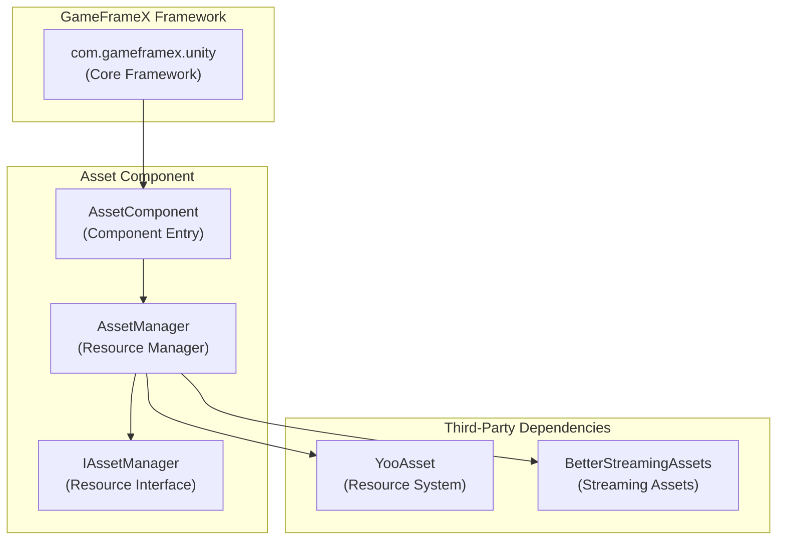

# Dependencies

This document details the dependency requirements for the GameFrameX Asset component, including Unity version requirements, framework dependencies, and third-party dependencies.

## Overview

The GameFrameX Asset component is one of the core modules of the GameFrameX framework, responsible for providing unified resource management functionality. Before using this component, ensure your development environment and project meet the following dependency requirements.

## Unity Version Requirements

| Item | Requirement |
|------|-------------|
| Minimum Unity Version | **2019.4** |
| Recommended Unity Version | 2020.3 LTS or higher |

> Source: [package.json](https://github.com/GameFrameX/com.gameframex.unity.asset/blob/main/package.json#L7)

## Framework Dependencies

### Core Dependencies

The Asset component depends on the GameFrameX core framework package, which is a **mandatory prerequisite** for using this component.

| Dependency Package | Version | Description |
|-------------------|---------|-------------|
| `com.gameframex.unity` | **1.1.1** | GameFrameX core framework, provides base architecture and module system |

```json
{
  "dependencies": {
    "com.gameframex.unity.asset": "2.4.0",
    "com.gameframex.unity": "1.1.1"
  }
}
```

> Source: [package.json](https://github.com/GameFrameX/com.gameframex.unity.asset/blob/main/package.json#L21-L23)

### Framework Architecture

The Asset component's position within the GameFrameX framework:



**Design Notes:**
- `AssetComponent` inherits from `GameFrameworkComponent` and is the component entry point
- `AssetManager` implements `IAssetManager` interface, providing the concrete implementation of resource management
- The underlying layer uses YooAsset as the resource management system and BetterStreamingAssets for streaming asset support

## Third-Party Dependencies

### YooAsset

YooAsset is the core resource management system for the Asset component, responsible for:
- Asynchronous/synchronous resource loading
- Resource package management
- Resource version management
- Resource hot-update support

```csharp
// Using YooAsset in AssetManager.cs
using YooAsset;

public partial class AssetManager : GameFrameworkModule, IAssetManager
{
    public void Initialize()
    {
        BetterStreamingAssets.Initialize();
        YooAssets.Initialize();
        YooAssets.SetOperationSystemMaxTimeSlice(30);
    }
}
```

> Source: [Runtime/Asset/AssetManager.cs](https://github.com/GameFrameX/com.gameframex.unity.asset/blob/main/Runtime/Asset/AssetManager.cs#L46-L56)

### BetterStreamingAssets

Used to support efficient access to streaming assets, a dependency of YooAsset.

## Namespace Dependencies

The Asset component uses the following namespaces:

| Namespace | Description |
|-----------|-------------|
| `GameFrameX.Runtime` | Core framework runtime namespace |
| `GameFrameX.Asset.Runtime` | Asset component's own namespace |
| `YooAsset` | Resource management system |
| `UnityEngine` | Unity engine core |
| `UnityEngine.SceneManagement` | Scene management |

```csharp
using GameFrameX.Runtime;
using GameFrameX.Asset.Runtime;
using YooAsset;
using UnityEngine;
using UnityEngine.SceneManagement;
using Object = UnityEngine.Object;
```

> Source: [Runtime/Asset/AssetComponent.cs](https://github.com/GameFrameX/com.gameframex.unity.asset/blob/main/Runtime/Asset/AssetComponent.cs#L1-L8)

## Installing Dependencies

### Automatic Installation (Recommended)

Add dependencies in the Unity project's `Packages/manifest.json` file:

```json
{
  "dependencies": {
    "com.gameframex.unity.asset": "https://github.com/GameFrameX/com.gameframex.unity.asset.git",
    "com.gameframex.unity": "1.1.1"
  }
}
```

> For more information, refer to [Installation](./2-installation.index)

### Git URL Installation

Add using Git URL in Unity Package Manager:
- Asset component: `https://github.com/GameFrameX/com.gameframex.unity.asset.git`
- Core framework: `https://github.com/GameFrameX/com.gameframex.unity.git`

### Local Installation

Clone the repositories directly into the Unity project's `Packages` directory:

```bash
git clone https://github.com/GameFrameX/com.gameframex.unity.asset.git Packages/com.gameframex.unity.asset
git clone https://github.com/GameFrameX/com.gameframex.unity.git Packages/com.gameframex.unity
```

## Version Compatibility

| Asset Component Version | Unity Version | Framework Version | Description |
|------------------------|---------------|-------------------|-------------|
| 2.4.0 | 2019.4+ | 1.1.1 | Current latest version |
| 2.3.0 | 2019.4+ | 1.1.1 | Supports ByteDance Mini Game |
| 2.2.x | 2019.4+ | 1.1.0 | Stable basic features |

## Common Issues

### Q: What happens if the core framework is not installed?

A: The Asset component depends on the `GameFrameworkComponent` base class. If the core framework is not installed, it will cause compilation errors. Please ensure the `com.gameframex.unity` package is installed first.

### Q: Does YooAsset need to be installed separately?

A: No. YooAsset is included as a dependency of the YooAsset package and will be automatically installed as a sub-dependency when installing the Asset component.

### Q: Which Unity platforms are supported?

A: The Asset component supports the following platforms:
- Windows/Mac/Linux desktop platforms
- iOS/Android mobile platforms
- WebGL platform
- WeChat Mini Game
- ByteDance Mini Game
- Kuaishou Mini Game

> For more information, refer to [Platform Support Overview](./7-platforms.index)

## Related Links

- [Installation](./2-installation.index)
- [Asset Component Introduction](./1-overview.introduction)
- [Features](./1-overview.features)
- [Core Concepts](./4-core-concepts.architecture)
- [API Reference](./5-api-reference.loading-api)
