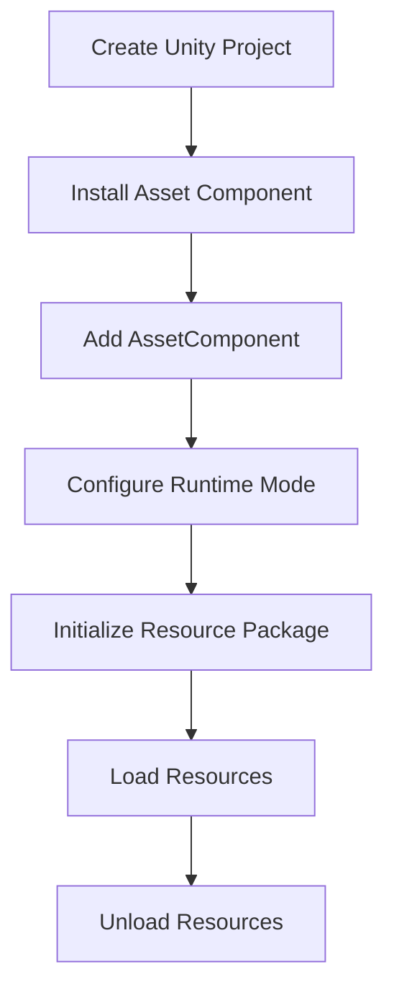

# First Example

This document will guide you through your first use of the GameFrameX Asset component, helping you quickly get started with the core resource system functionality through a complete example.

## Overview

The Asset component is a Unity resource management system built on YooAssets, providing unified resource loading, unloading, and hot-update functionality. This example demonstrates how to configure and use this component in a Unity project to perform basic resource loading operations.

## Quick Start Flow

The following is the standard workflow for using the Asset component:



## Usage Steps

### Step 1: Add AssetComponent

Create an empty GameObject in the Unity scene and add the `AssetComponent` component. This component automatically exposes all resource management features.

```csharp
// In Unity Editor
// 1. Create an empty GameObject in the scene
// 2. Click Add Component
// 3. Search for "GameFrameX/Asset" and add
// 4. The AssetComponent will be automatically attached
```

> Source: [AssetComponent.cs](https://github.com/GameFrameX/com.gameframex.unity.asset/blob/main/Runtime/Asset/AssetComponent.cs#L16-L18)

AssetComponent inherits from `GameFrameworkComponent` and uses the `[AddComponentMenu("GameFrameX/Asset")]` attribute for easy addition in the editor.

### Step 2: Configure Runtime Mode

AssetComponent provides the `GamePlayMode` property for setting the resource runtime mode:

```csharp
// Property definition in AssetComponent.cs
public EPlayMode GamePlayMode { get; set; }
```

Supported runtime modes include:
- **EditorSimulateMode**: Editor simulation mode, used only during development
- **HostPlayMode**: Remote hot-update mode
- **WebPlayMode**: WebGL platform-specific mode

> For detailed runtime mode descriptions, refer to the [Runtime Modes](./6-configuration.play-modes) documentation.

```csharp
// Runtime mode setting example (in AssetComponent.Awake)
_assetManager.SetPlayMode(GamePlayMode);
```

> Source: [AssetComponent.cs](https://github.com/GameFrameX/com.gameframex.unity.asset/blob/main/Runtime/Asset/AssetComponent.cs#L63)

### Step 3: Initialize Resource Package

Before using the resource system, you need to initialize the resource package:

```csharp
// Automatically called in AssetComponent.Start
private void Start()
{
    _assetManager.Initialize();
}
```

> Source: [AssetComponent.cs](https://github.com/GameFrameX/com.gameframex.unity.asset/blob/main/Runtime/Asset/AssetComponent.cs#L66-L70)

You can also manually initialize a specific resource package:

```csharp
// Resource package initialization example
public async Task<bool> InitPackageAsync(string packageName, string host, string fallbackHostServer, bool isDefaultPackage = false)
{
    return await _assetManager.InitPackageAsync(packageName, host, fallbackHostServer, isDefaultPackage);
}
```

> Source: [AssetComponent.cs](https://github.com/GameFrameX/com.gameframex.unity.asset/blob/main/Runtime/Asset/AssetComponent.cs#L80-L95)

## Resource Loading Examples

The Asset component provides multiple resource loading methods. Below are examples of both asynchronous and synchronous loading.

### Asynchronous Resource Loading

Asynchronous loading is the recommended primary method and does not block the main thread:

```csharp
using UnityEngine;
using GameFrameX.Asset.Runtime;
using YooAsset;
using System.Threading.Tasks;

// Asynchronous Prefab loading example
public async void LoadAssetExample(AssetComponent assetComponent)
{
    // Method 1: Generic async loading
    var handle = await assetComponent.LoadAssetAsync<GameObject>("Assets/Prefabs/Player.prefab");
    var prefab = handle.AssetObject as GameObject;
    
    // Instantiate the object
    if (prefab != null)
    {
        Instantiate(prefab);
    }
    
    // Release the handle after loading
    handle.Release();
}
```

> Source: [AssetComponent.cs](https://github.com/GameFrameX/com.gameframex.unity.asset/blob/main/Runtime/Asset/AssetComponent.cs#L257-L261)

```csharp
// Method 2: Load using path and type
public async Task LoadAssetWithType(AssetComponent assetComponent)
{
    var handle = await assetComponent.LoadAssetAsync("Assets/Textures/Background.png", typeof(Texture2D));
    var texture = handle.AssetObject as Texture2D;
    
    // Use the texture...
    handle.Release();
}
```

> Source: [AssetComponent.cs](https://github.com/GameFrameX/com.gameframex.unity.asset/blob/main/Runtime/Asset/AssetComponent.cs#L245-L249)

### Synchronous Resource Loading

Synchronous loading is suitable for scenarios where resources must be obtained in the current frame:

```csharp
// Synchronous Prefab loading example
public void LoadAssetSyncExample(AssetComponent assetComponent)
{
    var handle = assetComponent.LoadAssetSync<GameObject>("Assets/Prefabs/Enemy.prefab");
    var enemy = handle.AssetObject as GameObject;
    
    if (enemy != null)
    {
        Instantiate(enemy);
    }
    
    // Synchronous loading also requires manual release
    handle.Release();
}
```

> Source: [AssetComponent.cs](https://github.com/GameFrameX/com.gameframex.unity.asset/blob/main/Runtime/Asset/AssetComponent.cs#L425-L429)

### Loading Scenes

```csharp
// Asynchronous scene loading example
public async Task LoadSceneExample(AssetComponent assetComponent)
{
    var sceneHandle = await assetComponent.LoadSceneAsync(
        "Assets/Scenes/GameScene.unity", 
        UnityEngine.SceneManagement.LoadSceneMode.Single, 
        true
    );
    
    Debug.Log($"Scene loaded: {sceneHandle.Scene.name}");
}
```

> Source: [AssetComponent.cs](https://github.com/GameFrameX/com.gameframex.unity.asset/blob/main/Runtime/Asset/AssetComponent.cs#L442-L446)

### Loading Multiple Resources

```csharp
// Load all resources under a specified path
public async Task LoadAllAssetsExample(AssetComponent assetComponent)
{
    var allAssetsHandle = await assetComponent.LoadAllAssetsAsync<GameObject>("Assets/Prefabs/");
    
    foreach (var asset in allAssetsHandle.AllAssetObjects)
    {
        Debug.Log($"Loaded resource: {asset.name}");
    }
    
    // Release after all are used
    allAssetsHandle.Release();
}
```

> Source: [AssetComponent.cs](https://github.com/GameFrameX/com.gameframex.unity.asset/blob/main/Runtime/Asset/AssetComponent.cs#L269-L273)

## Resource Unloading Examples

Properly managing the resource lifecycle is essential to avoid memory leaks:

```csharp
public class ResourceManager
{
    private AssetComponent _assetComponent;
    
    // Unload a specific resource
    public void UnloadSingleAsset(string assetPath)
    {
        _assetComponent.UnloadAsset(assetPath);
    }
    
    // Unload unused resources (recommended to call periodically)
    public void UnloadUnusedAssets()
    {
        _assetComponent.UnloadUnusedAssetsAsync();
    }
    
    // Clean up unused resource package files
    public void ClearUnusedBundles()
    {
        _assetComponent.ClearUnusedBundleFilesAsync();
    }
    
    // Force unload all resources (use with caution)
    public void UnloadAllAssets()
    {
        _assetComponent.UnloadAllAssetsAsync(null);
    }
}
```

> Source: [AssetComponent.cs](https://github.com/GameFrameX/com.gameframex.unity.asset/blob/main/Runtime/Asset/AssetComponent.cs#L590-L658)

## Complete Usage Example

Below is a complete MonoBehaviour script example demonstrating the full flow from initialization to loading and unloading:

```csharp
using UnityEngine;
using GameFrameX.Asset.Runtime;
using YooAsset;
using System.Threading.Tasks;
using UnityEngine.SceneManagement;

public class GameEntry : MonoBehaviour
{
    private AssetComponent _assetComponent;
    
    private void Start()
    {
        // Get the AssetComponent
        _assetComponent = GetComponent<AssetComponent>();
        
        // Initialize the resource package
        InitializePackage();
    }
    
    private async void InitializePackage()
    {
        // Initialize the default resource package
        bool success = await _assetComponent.InitPackageAsync(
            "DefaultPackage",           // Package name
            "http://localhost:8080/",   // Primary server address
            "http://backup:8080/",     // Backup server address
            true                        // Whether to set as default package
        );
        
        if (success)
        {
            Debug.Log("Resource package initialized successfully!");
            // Start loading game content
            LoadGameContent();
        }
        else
        {
            Debug.LogError("Resource package initialization failed!");
        }
    }
    
    private async void LoadGameContent()
    {
        // Load player prefab
        var playerHandle = await _assetComponent.LoadAssetAsync<GameObject>("Assets/Prefabs/Player.prefab");
        var playerPrefab = playerHandle.AssetObject as GameObject;
        
        if (playerPrefab != null)
        {
            Instantiate(playerPrefab);
        }
        
        // Load background music
        var audioHandle = await _assetComponent.LoadAssetAsync<AudioClip>("Assets/Audio/BGM.mp3");
        var bgm = audioHandle.AssetObject as AudioClip;
        
        // Load main scene
        await _assetComponent.LoadSceneAsync(
            "Assets/Scenes/Main.unity",
            LoadSceneMode.Single,
            true
        );
        
        // Note: In production, decide when to release resource handles based on requirements
    }
}
```

> Source: [AssetManager.cs](https://github.com/GameFrameX/com.gameframex.unity.asset/blob/main/Runtime/Asset/AssetManager.cs#L46-L56)

## Resource Package Management

The Asset component supports multi-package management, allowing you to create and switch between different resource packages:

```csharp
public class PackageManagerExample
{
    private AssetComponent _assetComponent;
    
    // Create a new resource package
    public void CreatePackage(string packageName)
    {
        var package = _assetComponent.CreateAssetsPackage(packageName);
        
        if (package != null)
        {
            Debug.Log($"Resource package created: {packageName}");
        }
    }
    
    // Get a resource package
    public void GetPackage(string packageName)
    {
        var package = _assetComponent.GetAssetsPackage(packageName);
        
        if (package != null)
        {
            Debug.Log($"Got resource package: {package.Name}");
        }
    }
    
    // Check if a resource package exists
    public bool CheckPackageExists(string packageName)
    {
        return _assetComponent.HasAssetsPackage(packageName);
    }
    
    // Set the default resource package
    public void SetDefaultPackage(string packageName)
    {
        var package = _assetComponent.GetAssetsPackage(packageName);
        if (package != null)
        {
            _assetComponent.SetDefaultAssetsPackage(package);
        }
    }
}
```

> Source: [AssetComponent.cs](https://github.com/GameFrameX/com.gameframex.unity.asset/blob/main/Runtime/Asset/AssetComponent.cs#L470-L507)

## Best Practices

### 1. Use Asynchronous Loading

```csharp
// Recommended: Asynchronous loading
public async Task<GameObject> LoadPlayerAsync()
{
    var handle = await _assetComponent.LoadAssetAsync<GameObject>("Assets/Prefabs/Player.prefab");
    return handle.AssetObject as GameObject;
}
```

### 2. Release Resource Handles Promptly

```csharp
// Recommended: Release after use
var handle = await _assetComponent.LoadAssetAsync<GameObject>("Assets/Prefabs/Player.prefab");
var player = handle.AssetObject as GameObject;
Instantiate(player);
handle.Release();  // Release immediately

// Not recommended: Holding the handle without releasing
var handle = await _assetComponent.LoadAssetAsync<GameObject>("Assets/Prefabs/Player.prefab");
// ... holding for a long time without releasing
```

### 3. Use Resource Tags for Batch Queries

```csharp
// Batch get resource information by tag
public void LoadByTag()
{
    var assets = _assetComponent.GetAssetInfos("UI");
    foreach (var asset in assets)
    {
        Debug.Log($"Found UI resource: {asset.AssetPath}");
    }
}
```

> Source: [AssetComponent.cs](https://github.com/GameFrameX/com.gameframex.unity.asset/blob/main/Runtime/Asset/AssetComponent.cs#L549-L553)

## Related Links

- [Getting Started Guide](./3-getting-started.index) - Return to getting started overview
- [Architecture Design](./4-core-concepts.architecture) - Understand system architecture
- [Asset Component](./4-core-concepts.asset-component) - Learn more about AssetComponent
- [Asset Manager](./4-core-concepts.asset-manager) - Learn more about AssetManager
- [Resource Loading API](./5-api-reference.loading-api) - Complete API reference
- [Runtime Modes](./6-configuration.play-modes) - Configure different runtime modes
- [Component Settings](./6-configuration.component-settings) - Component configuration details
