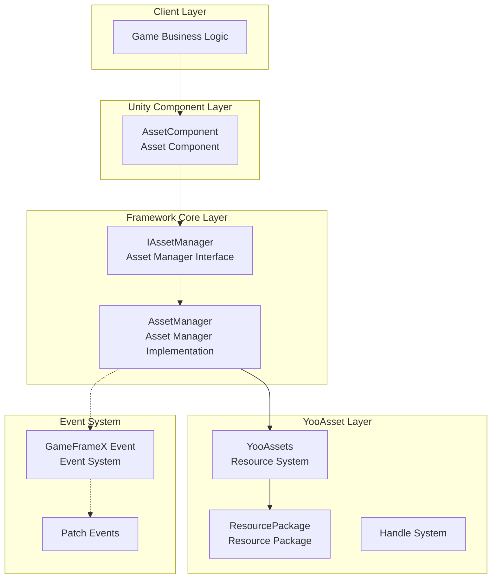
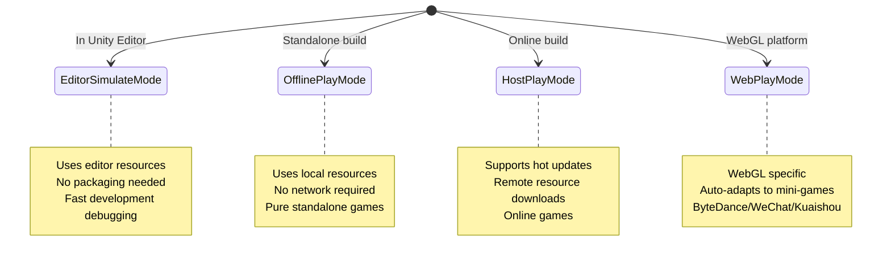
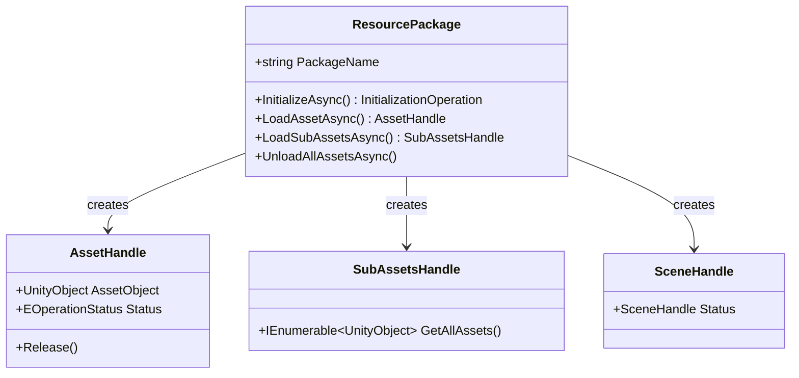
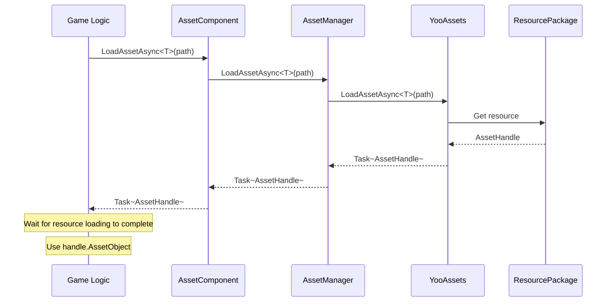

# Architecture Design

This document provides a detailed introduction to the overall architecture design of the GameFrameX Asset component, including core components, module responsibilities, interaction relationships, and design decisions.

## Overview

The GameFrameX Asset component is one of the core modules of the GameFrameX framework, built on the industry-proven **YooAsset** resource management system. By encapsulating YooAsset's underlying API, this component provides a **unified, concise, and easy-to-use** resource management solution for Unity game applications.

**Design Goals:**
- Simplify the complexity of resource loading and unloading
- Provide consistent cross-platform API interfaces
- Support multiple runtime modes (editor simulation, offline, hot-update, WebGL)
- Integrate the GameFrameX event system for state notifications
- Support multi-package resource management

## Architecture Overview



### Layer Responsibilities

| Layer | Component | Responsibility |
|-------|-----------|---------------|
| Client Layer | Game Business Logic | Calls the API provided by the asset component to load resources |
| Unity Component Layer | AssetComponent | Serves as a component in the Unity scene, providing user-facing API entry point |
| Framework Core Layer | AssetManager | Implements core business logic for resource management |
| YooAsset Layer | YooAssets | Underlying resource system, handles actual file system, downloads, caching, etc. |
| Event System | EventSystem | Provides patch workflow state notifications, download progress, and other events |

## Core Components

### 1. AssetComponent

`AssetComponent` is the core component in the Unity game scene, inheriting from `GameFrameworkComponent`. It serves as the unified entry point for the resource system, providing resource access interfaces for the game logic layer.

**Main Responsibilities:**
- Attached to the scene as a Unity component
- Configure the runtime mode (PlayMode)
- Manage resource package initialization
- Proxy and forward resource loading requests to AssetManager
- Handle platform differences (automatic WebGL mode switching)

> Source: [AssetComponent.cs](https://github.com/GameFrameX/com.gameframex.unity.asset/blob/main/Runtime/Asset/AssetComponent.cs#L18-L70)

```csharp
[DisallowMultipleComponent]
[AddComponentMenu("GameFrameX/Asset")]
public sealed class AssetComponent : GameFrameworkComponent
{
    [Tooltip("Forces WebPlayMode when target platform is Web")]
    [SerializeField]
    private EPlayMode m_GamePlayMode;
    
    private IAssetManager _assetManager;
    
    protected override void Awake()
    {
        // Automatically adjust runtime mode in non-editor environments
#if !UNITY_EDITOR
        if (GamePlayMode == EPlayMode.EditorSimulateMode)
        {
            GamePlayMode = EPlayMode.HostPlayMode;
        }
#if UNITY_WEBGL
        GamePlayMode = EPlayMode.WebPlayMode;
#endif
#endif
        base.Awake();
        _assetManager = GameFrameworkEntry.GetModule<IAssetManager>();
        _assetManager.SetPlayMode(GamePlayMode);
    }
}
```

**Design Intent:**
- Uses `[DisallowMultipleComponent]` to restrict the scene to only one AssetComponent, ensuring uniqueness of resource management
- Handles platform differences in `Awake` to ensure the correct runtime mode is used in non-editor environments
- Obtains IAssetManager instance through dependency injection, achieving decoupling

### 2. IAssetManager

The `IAssetManager` interface defines all operation contracts for resource management, ensuring implementation flexibility and testability.

> Source: [IAssetManager.cs](https://github.com/GameFrameX/com.gameframex.unity.asset/blob/main/Runtime/Asset/IAssetManager.cs#L1-L519)

**Interface Categories:**

| Category | Method Examples |
|----------|----------------|
| Initialization | `Initialize()`, `InitPackageAsync()` |
| Async Loading | `LoadAssetAsync<T>()`, `LoadSceneAsync()` |
| Sync Loading | `LoadAssetSync<T>()`, `LoadSubAssetSync()` |
| Package Management | `CreateAssetsPackage()`, `GetAssetsPackage()` |
| Resource Unloading | `UnloadAsset()`, `UnloadUnusedAssetsAsync()` |
| Resource Queries | `GetAssetInfo()`, `HasAssetPath()`, `IsNeedDownload()` |

### 3. AssetManager

`AssetManager` is the core implementation class for resource management, inheriting from `GameFrameworkModule` and implementing the `IAssetManager` interface. It encapsulates calls to YooAssets and adapts to the GameFrameX module system.

**Main Responsibilities:**
- Manage YooAssets initialization
- Handle configuration for different runtime modes
- Encapsulate resource loading/unloading operations
- Manage resource packages

> Source: [AssetManager.cs](https://github.com/GameFrameX/com.gameframex.unity.asset/blob/main/Runtime/Asset/AssetManager.cs#L14-L60)

```csharp
[UnityEngine.Scripting.Preserve]
public partial class AssetManager : GameFrameworkModule, IAssetManager
{
    public string DefaultPackageName { get; set; } = ConstDefaultPackageName;
    public int DownloadingMaxNum { get; set; }
    public int FailedTryAgain { get; set; }
    public EFileVerifyLevel VerifyLevel { get; set; }
    public EPlayMode PlayMode { get; private set; }
    
    public void Initialize()
    {
        BetterStreamingAssets.Initialize();
        Log.Info($"Resource system runtime mode: {PlayMode}");
        YooAssets.Initialize();
        YooAssets.SetOperationSystemMaxTimeSlice(30);
    }
}
```

## Runtime Modes

The Asset component supports four runtime modes defined by the `EPlayMode` enumeration:



### Mode Selection Logic

> Source: [AssetManager.Initialization.cs](https://github.com/GameFrameX/com.gameframex.unity.asset/blob/main/Runtime/Asset/AssetManager.Initialization.cs#L18-L47)

```csharp
private InitializationOperation CreateInitializationOperationHandler(ResourcePackage resourcePackage, string hostServerURL, string fallbackHostServerURL)
{
    switch (PlayMode)
    {
        case EPlayMode.EditorSimulateMode:
            return InitializeYooAssetEditorSimulateMode(resourcePackage);
        case EPlayMode.OfflinePlayMode:
            return InitializeYooAssetOfflinePlayMode(resourcePackage);
        case EPlayMode.HostPlayMode:
            return InitializeYooAssetHostPlayMode(resourcePackage, hostServerURL, fallbackHostServerURL);
        case EPlayMode.WebPlayMode:
            return InitializeYooAssetWebPlayMode(resourcePackage, hostServerURL, fallbackHostServerURL);
        default:
            return null;
    }
}
```

### Mode Initialization Details

| Mode | Initialization Method | Use Case |
|------|----------------------|----------|
| EditorSimulateMode | `InitializeYooAssetEditorSimulateMode()` | Editor development debugging, no packaging |
| OfflinePlayMode | `InitializeYooAssetOfflinePlayMode()` | Standalone games, no hot updates |
| HostPlayMode | `InitializeYooAssetHostPlayMode()` | Online games requiring hot updates |
| WebPlayMode | `InitializeYooAssetWebPlayMode()` | WebGL/mini-game platforms |

## Resource Package System

The Asset component uses a **Resource Package** mechanism to manage different types of resources.



### Resource Package Operations

```csharp
// Create a resource package
ResourcePackage package = assetComponent.CreateAssetsPackage("MyPackage");

// Get a resource package
ResourcePackage pkg = assetComponent.TryGetAssetsPackage("MyPackage");

// Set the default resource package
assetComponent.SetDefaultAssetsPackage(pkg);

// Check if a resource package exists
if (assetComponent.HasAssetsPackage("MyPackage"))
{
    // Use the resource package
}
```

> Source: [AssetManager.cs](https://github.com/GameFrameX/com.gameframex.unity.asset/blob/main/Runtime/Asset/AssetManager.cs#L646-L692)

## Event System

The Asset component integrates the GameFrameX event system to notify about resource loading progress and status changes.

### Patch State Changes

> Source: [EPatchStates.cs](https://github.com/GameFrameX/com.gameframex.unity.asset/blob/main/Runtime/Update/EPatchStates.cs#L1-L33)

```csharp
public enum EPatchStates
{
    /// <summary>Update static resource version</summary>
    UpdateStaticVersion,
    /// <summary>Update patch manifest</summary>
    UpdateManifest,
    /// <summary>Create downloader</summary>
    CreateDownloader,
    /// <summary>Download remote files</summary>
    DownloadWebFiles,
    /// <summary>Patch workflow complete</summary>
    PatchDone,
}
```

### Event Types

| Event Class | Purpose |
|------------|---------|
| AssetPatchStatesChangeEventArgs | Patch workflow state changes |
| AssetDownloadProgressUpdateEventArgs | Download progress updates |
| AssetFoundUpdateFilesEventArgs | Files needing updates found |
| AssetPatchManifestUpdateFailedEventArgs | Patch manifest update failed |
| AssetWebFileDownloadFailedEventArgs | Resource file download failed |

> Source: [AssetPatchStatesChangeEventArgs.cs](https://github.com/GameFrameX/com.gameframex.unity.asset/blob/main/Runtime/Update/EventArgs/AssetPatchStatesChangeEventArgs.cs#L1-L49)

## Resource Loading Flow

### Asynchronous Resource Loading



### Resource Unloading Flow

```mermaid
flowchart LR
    A[Call UnloadAsset] --> B{Specific Package?}
    B -->|Yes| C[UnloadAsset(packageName, assetPath)]
    B -->|No| D[UnloadAsset(assetPath)]
    C --> E[Get target package]
    D --> E
    E --> F[Call Package.TryUnloadUnusedAsset]
    F --> G[YooAsset releases resource]
    
    G --> H{Call UnloadUnusedAssetsAsync?}
    H -->|Yes| I[Release unused resources]
    H -->|No| J[End]
```

## Configuration Options

The Asset component provides the following configurable options:

| Configuration Item | Type | Default | Description |
|-------------------|------|---------|-------------|
| GamePlayMode | EPlayMode | EditorSimulateMode | Resource runtime mode |
| DefaultPackageName | string | "DefaultPackage" | Default resource package name |
| DownloadingMaxNum | int | - | Maximum concurrent download count |
| FailedTryAgain | int | - | Download failure retry count |
| VerifyLevel | EFileVerifyLevel | - | File verification level |
| Milliseconds | long | - | Maximum execution time per frame for async system (milliseconds) |

> Source: [AssetComponent.cs](https://github.com/GameFrameX/com.gameframex.unity.asset/blob/main/Runtime/Asset/AssetComponent.cs#L20-L36)

## Design Decision Notes

### 1. Why YooAsset?

Reasons for choosing YooAsset as the underlying resource system:
- **Comprehensive Features**: Supports resource packaging, dependency analysis, hot updates, cache management, and other complete functionality
- **Performance Optimization**: Provides handle mechanism, reference counting, and resource release optimization
- **Cross-Platform**: Supports all mainstream Unity platforms
- **Active Community**: Continuously maintained and updated

### 2. Why Interface Separation?

Defining clear operation contracts through the `IAssetManager` interface:
- Facilitates unit testing (can mock implementations)
- Provides extension points for replacing underlying implementations
- Makes API documentation clearer

### 3. Why Distinguish Sync/Async Loading?

- **Asynchronous Loading**: Suitable for large-scale resource loading, avoids blocking the main thread
- **Synchronous Loading**: Suitable for small resources or specific performance-sensitive scenarios
- Users can choose the appropriate loading method based on scenario requirements

### 4. Why Resource Packages?

Multi-package design supports:
- Organizing resources by functional modules (UI, DLC, configuration)
- Dynamically loading/unloading specific modules
- On-demand resource downloading, saving bandwidth

## Related Links

- [Asset Component](./4-core-concepts.asset-component) - AssetComponent detailed API
- [Asset Manager](./4-core-concepts.asset-manager) - AssetManager implementation details
- [Resource Loading API](./5-api-reference.loading-api) - Complete loading API reference
- [Package Management](./5-api-reference.package-management) - Resource package operations API
- [Runtime Modes](./6-configuration.play-modes) - Various runtime mode configurations
- [Component Settings](./6-configuration.component-settings) - Component configuration options
