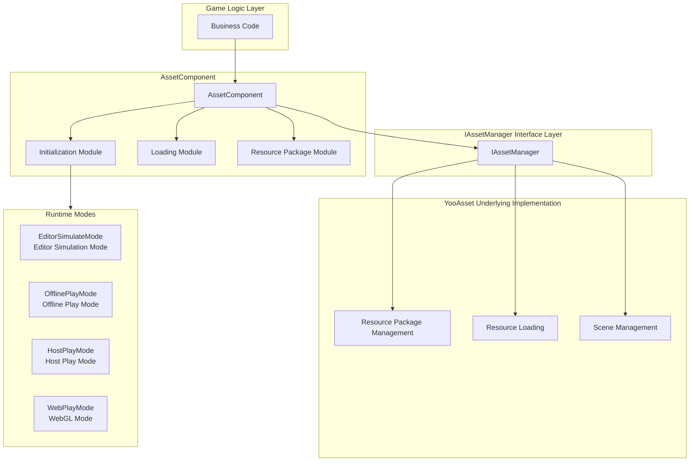
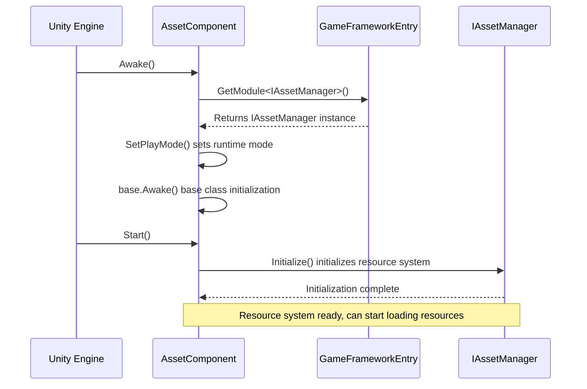
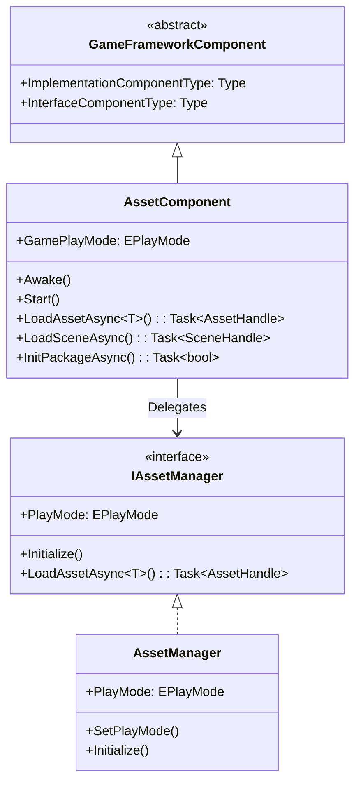

# Asset Component

The AssetComponent is the core entry point of the GameFrameX resource system, providing unified resource loading, unloading, and management functions. This component encapsulates the underlying implementation of YooAsset, offering a clean and efficient resource management API for game projects.

## Overview

AssetComponent is a Unity component (MonoBehaviour) that inherits from GameFrameworkComponent. As the facade of the resource system, it simplifies the complexity of resource operations and provides features such as synchronous/asynchronous loading, scene management, and resource package management.

**Design Goals:**
- Provide a unified resource access interface, hiding underlying implementation details
- Support multiple runtime modes to adapt to different development and deployment scenarios
- Implement lazy loading and automatic release of resources to optimize memory usage
- Support hot-update resource management for online games

## Architecture Design



**Architecture Notes:**
- **Game Logic Layer**: Business code accesses the resource system through AssetComponent
- **AssetComponent Layer**: Provides component-based resource interfaces, including initialization, loading, and package management modules
- **IAssetManager Interface Layer**: Defines abstract interfaces for resource management, achieving separation of concerns
- **YooAsset Layer**: Actual resource management implementation based on the YooAsset library
- **Runtime Modes**: Supports four different resource runtime modes to adapt to various development and deployment scenarios

## Core Features

### 1. Runtime Mode Support

AssetComponent supports four runtime modes, configured through the `GamePlayMode` property:

| Mode | Description | Use Case |
|------|-------------|----------|
| EditorSimulateMode | Editor simulation mode | Development phase, test resources without packaging |
| OfflinePlayMode | Offline play mode | Pure local resources, no network updates |
| HostPlayMode | Host play mode | Production versions requiring hot updates |
| WebPlayMode | WebGL mode | Web platform deployment, supports mini-game platforms |

**Platform Auto-Adaptation:**

```csharp
// AssetComponent.cs - Runtime auto-adjustment of runtime mode
#if !UNITY_EDITOR
    if (GamePlayMode == EPlayMode.EditorSimulateMode)
    {
        GamePlayMode = EPlayMode.HostPlayMode;
    }
#if UNITY_WEBGL
    GamePlayMode = EPlayMode.WebPlayMode;
#endif
#endif
```
> Source: [AssetComponent.cs](https://github.com/GameFrameX/com.gameframex.unity.asset/blob/main/Runtime/Asset/AssetComponent.cs#L44-L52)

### 2. Resource Loading

AssetComponent provides rich resource loading interfaces, supporting both synchronous and asynchronous methods:

```csharp
// Asynchronously load a resource
public async Task<AssetHandle> LoadAssetAsync<T>(string path) where T : Object

// Synchronously load a resource
public AssetHandle LoadAssetSync<T>(string path) where T : Object

// Asynchronously load sub-resources (e.g., Sprites in a SpriteAtlas)
public Task<SubAssetsHandle> LoadSubAssetsAsync<T>(string path) where T : Object

// Asynchronously load all resources
public Task<AllAssetsHandle> LoadAllAssetsAsync<T>(string path) where T : Object
```
> Source: [AssetComponent.cs](https://github.com/GameFrameX/com.gameframex.unity.asset/blob/main/Runtime/Asset/AssetComponent.cs#L257-L305)

### 3. Scene Loading

Supports asynchronous loading of Unity scenes:

```csharp
// Asynchronously load a scene
public Task<SceneHandle> LoadSceneAsync(string path, LoadSceneMode sceneMode, bool activateOnLoad = true)
```
> Source: [AssetComponent.cs](https://github.com/GameFrameX/com.gameframex.unity.asset/blob/main/Runtime/Asset/AssetComponent.cs#L443-L459)

### 4. Resource Package Management

Supports multi-package management, allowing creation, retrieval, and setting of default packages:

```csharp
// Create a resource package
public ResourcePackage CreateAssetsPackage(string packageName)

// Try to get a resource package (returns null if not exists)
public ResourcePackage TryGetAssetsPackage(string packageName)

// Check if a resource package exists
public bool HasAssetsPackage(string packageName)

// Set the default resource package
public void SetDefaultAssetsPackage(ResourcePackage assetsPackage)
```
> Source: [AssetComponent.cs](https://github.com/GameFrameX/com.gameframex.unity.asset/blob/main/Runtime/Asset/AssetComponent.cs#L471-L584)

### 5. Resource Unloading and Cleanup

Provides multiple resource release strategies:

```csharp
// Unload a specific resource
public void UnloadAsset(string assetPath)

// Unload a resource handle
public void UnloadAssetHandle(object assetHandle)

// Unload unused resources
public void UnloadUnusedAssetsAsync(string packageName = null)

// Clear unused bundle files
public void ClearUnusedBundleFilesAsync(string packageName = null)

// Force reclaim all resources
public void UnloadAllAssetsAsync(string packageName)

// Clear all bundle files
public void ClearAllBundleFilesAsync(string packageName = null)
```
> Source: [AssetComponent.cs](https://github.com/GameFrameX/com.gameframex.unity.asset/blob/main/Runtime/Asset/AssetComponent.cs#L602-L658)

## Core Flows

### Component Initialization Flow



### Resource Loading Flow

```mermaid
sequenceDiagram
    participant Client as Business Code
    participant AC as AssetComponent
    participant IAM as IAssetManager
    package as YooAsset ResourcePackage

    Client->>AC: LoadAssetAsync<T>(path)
    AC->>IAM: LoadAssetAsync<T>(path)
    IAM->>package: LoadAssetAsync(path)

    rect rgb(240, 248, 255)
        Note right of package: Resource loading phase
    end

    package-->>IAM: AssetHandle
    IAM-->>AC: AssetHandle
    AC-->>Client: Task<AssetHandle>

    Client->>Client: await Task
    Note over Client: Get resource object

    Client->>AC: UnloadAssetHandle(handle)
    AC->>IAM: handle.Release()
    Note over package: Resource released
```

## Usage Examples

### Basic Usage: Asynchronous Resource Loading

```csharp
using UnityEngine;
using GameFrameX.Asset.Runtime;
using YooAssets;

public class Example : MonoBehaviour
{
    private async void Start()
    {
        var assetComponent = GameEntry.GetComponent<AssetComponent>();

        // Asynchronously load a Prefab
        var handle = await assetComponent.LoadAssetAsync<GameObject>("Prefabs/Player");
        var prefab = handle.LoadAsset();

        // Instantiate the object
        Instantiate(prefab);

        // Release the resource handle after loading
        handle.Release();
    }
}
```
> Source: [AssetComponent.cs](https://github.com/GameFrameX/com.gameframex.unity.asset/blob/main/Runtime/Asset/AssetComponent.cs#L257-L261)

### Advanced Usage: Package Initialization and Multi-Package Management

```csharp
using UnityEngine;
using GameFrameX.Asset.Runtime;

public class MultiPackageExample : MonoBehaviour
{
    private async void Start()
    {
        var assetComponent = GameEntry.GetComponent<AssetComponent>();

        // Initialize the default resource package
        await assetComponent.InitPackageAsync(
            "DefaultPackage",           // Package name
            "https://cdn.example.com/", // Primary download URL
            "https://backup.example.com/", // Backup URL
            true                        // Whether to set as default
        );

        // Create additional resource packages
        var uiPackage = assetComponent.CreateAssetsPackage("UIPackage");
        var configPackage = assetComponent.CreateAssetsPackage("ConfigPackage");

        // Set the default resource package
        assetComponent.SetDefaultAssetsPackage(uiPackage);
    }
}
```
> Source: [AssetComponent.cs](https://github.com/GameFrameX/com.gameframex.unity.asset/blob/main/Runtime/Asset/AssetComponent.cs#L80-L95)

### Advanced Usage: Checking Resource Status and Conditional Loading

```csharp
using UnityEngine;
using GameFrameX.Asset.Runtime;

public class ResourceCheckExample : MonoBehaviour
{
    private async void LoadResourceWithCheck()
    {
        var assetComponent = GameEntry.GetComponent<AssetComponent>();

        string resourcePath = "Prefabs/HeavyModel";

        // Check if the resource needs to be downloaded
        if (assetComponent.IsNeedDownload(resourcePath))
        {
            Debug.Log("Resource needs download, showing download UI...");
            // Add download progress UI here
        }

        // Get resource information
        var assetInfo = assetComponent.GetAssetInfo(resourcePath);
        if (assetInfo != null)
        {
            Debug.Log($"Resource path: {assetInfo.AssetPath}");
        }

        // Check if the resource path exists
        if (assetComponent.HasAssetPath(resourcePath))
        {
            var handle = await assetComponent.LoadAssetAsync<GameObject>(resourcePath);
            // Handle resource
            handle.Release();
        }
    }
}
```
> Source: [AssetComponent.cs](https://github.com/GameFrameX/com.gameframex.unity.asset/blob/main/Runtime/Asset/AssetComponent.cs#L517-L573)

## Configuration

### Configuration in Unity Editor

Create a GameObject in the Unity scene and add the **AssetComponent** component:

1. Configure **Resource Runtime Mode** (GamePlayMode) in the Inspector panel
2. Configure corresponding parameters based on the selected mode

```csharp
// AssetComponentInspector.cs - Editor configuration UI
[CustomEditor(typeof(AssetComponent))]
internal sealed class AssetComponentInspector : ComponentTypeComponentInspector
{
    public override void OnInspectorGUI()
    {
        // Disable editing during runtime
        EditorGUI.BeginDisabledGroup(EditorApplication.isPlayingOrWillChangePlaymode);
        {
            EditorGUILayout.PropertyField(m_GamePlayMode, m_GamePlayModeGUIContent);
        }
    }
}
```
> Source: [AssetComponentInspector.cs](https://github.com/GameFrameX/com.gameframex.unity.asset/blob/main/Editor/Inspector/AssetComponentInspector.cs#L48-L66)

### Component Properties

| Property | Type | Description |
|----------|------|-------------|
| GamePlayMode | EPlayMode | Resource runtime mode, determines resource loading method |
| ImplementationComponentType | Type | Implementation type of IAssetManager |
| InterfaceComponentType | Type | Interface type corresponding to the component |

## Relationship with Asset Manager

AssetComponent is a facade class oriented toward the Unity component system, while IAssetManager/AssetManager provides pure business logic layer resource management capabilities:



**Responsibility Division:**
- **AssetComponent**: Acts as a Unity component, handles lifecycle (Awake/Start), provides Unity-friendly API
- **IAssetManager**: Defines interface contracts for resource management, decoupled from Unity lifecycle
- **AssetManager**: Specific implementation of the interface, handles YooAsset underlying calls

## Related Links

- [Asset Manager](./4-core-concepts.asset-manager) - Learn more about underlying resource management implementation
- [Runtime Modes](./6-configuration.play-modes) - Learn about detailed configuration of four runtime modes
- [Resource Loading API](./5-api-reference.loading-api) - Complete resource loading interface documentation
- [Package Management](./5-api-reference.package-management) - Detailed package management explanation
- [Installation Guide](./2-installation.index) - How to install and configure the resource component
- [Getting Started](./3-getting-started.index) - Quick start using the resource component