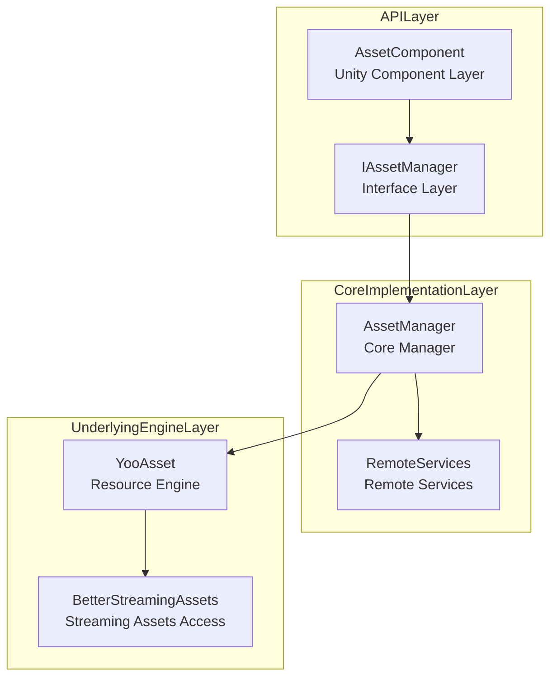
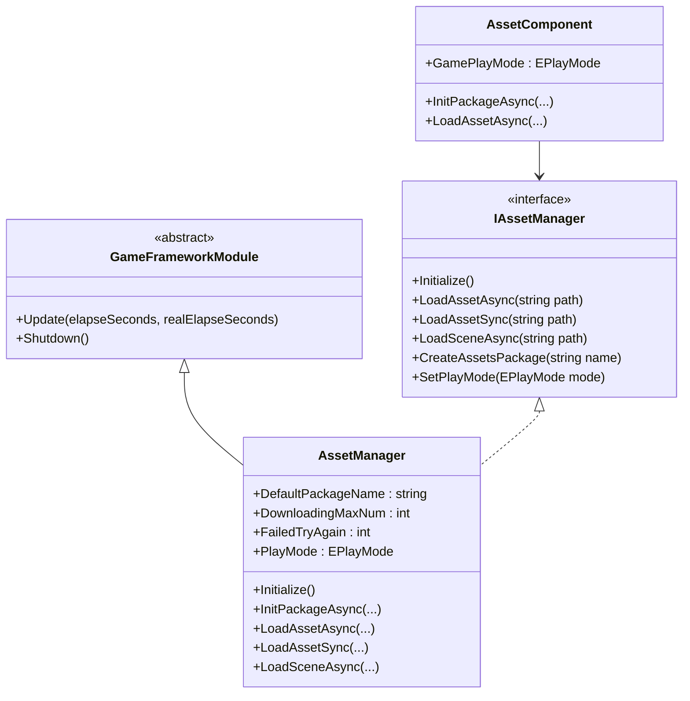
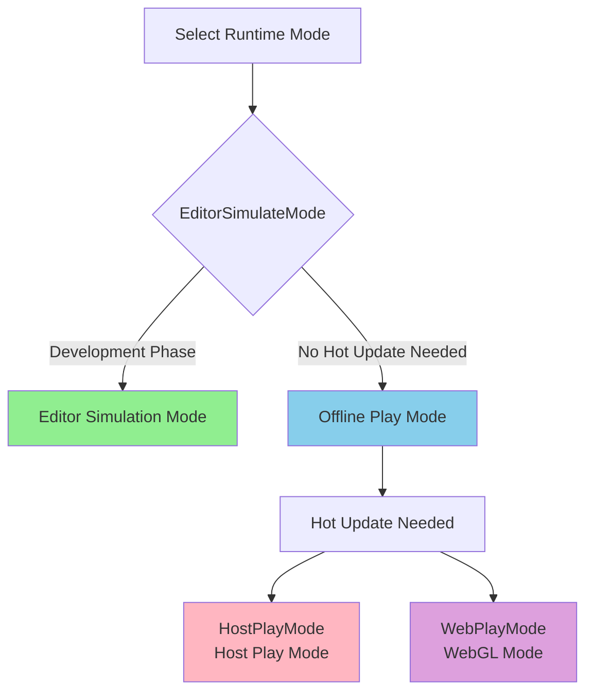
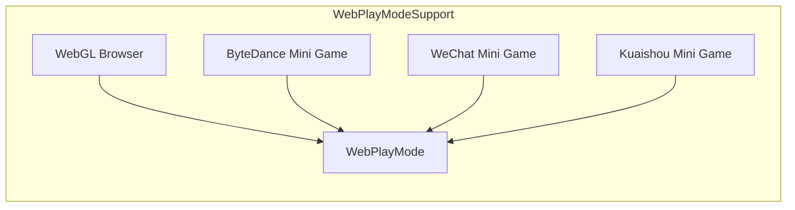

# Asset Manager

The Asset Manager is the core component of the GameFrameX asset system, responsible for unified management of game resource loading, unloading, hot updates, and resource package management. This component is built on the YooAsset library and provides a clean and easy-to-use API interface, supporting multiple runtime modes and platforms.

## Overview

The Asset Manager serves as a core module of the game framework, taking on the critical responsibility of game runtime resource management. In modern game development, effective resource management directly impacts game performance, loading speed, and user experience. The Asset Manager provides a complete resource management solution by uniformly encapsulating YooAsset's functionality.

This component supports the following core features:

- **Synchronous/Asynchronous Resource Loading**: Provides both synchronous and asynchronous loading methods to meet different scenario requirements
- **Multi-Package Management**: Supports creating and managing multiple independent resource packages
- **Scene Loading**: Supports asynchronous scene loading and switching
- **Hot Update Support**: Supports resource hot updates in HostPlayMode and WebPlayMode
- **Resource Cleanup**: Provides multiple resource release strategies to optimize memory usage

The design philosophy of the Asset Manager is to encapsulate complex underlying resource management logic so that developers only need to focus on business-level resource usage, without worrying about how resources are loaded from disk or network, or how version management is handled.

## Architecture Design

The Asset Manager's architecture adopts a layered design pattern, with three main layers from top to bottom:



### Component Description

**API Layer** is responsible for interaction with the Unity engine and business code. `AssetComponent` is a Unity component attached to a GameObject, providing Inspector panel configuration and component lifecycle management. `IAssetManager` interface defines all operation contracts for resource management, ensuring code testability and replaceability.

**Core Implementation Layer** implements the core logic of resource management. `AssetManager` inherits from `GameFrameworkModule` and is the core of the entire resource system. It encapsulates all features of YooAsset and adds functionality more suitable for game development. `RemoteServices` is an internal class responsible for parsing remote URLs for hot-update resources.

**Underlying Engine Layer** is the actual resource operation implementation. YooAsset is an excellent Unity resource management solution in the industry, providing powerful resource packaging, loading, and hot-update capabilities. BetterStreamingAssets provides efficient access to the StreamingAssets directory.

### Core Class Diagram



## Core Features

### Resource Loading

The Asset Manager provides rich resource loading interfaces, supporting both synchronous and asynchronous loading modes. Synchronous loading is suitable for scenarios where loading time requirements are not high and execution occurs on the main thread; asynchronous loading is suitable for large resource loading scenarios that need to maintain frame rate stability.

#### Asynchronous Resource Loading

Asynchronous loading is the most commonly used resource loading method in game development. It does not block the main thread and can keep the game running smoothly. The Asset Manager provides multiple asynchronous loading interfaces:

```csharp
// Asynchronously load a resource by path
var handle = await assetComponent.LoadAssetAsync<GameObject>("Prefabs/Player");

// Get the loaded resource object
var playerPrefab = handle.AssetObject as GameObject;
if (playerPrefab != null)
{
    Instantiate(playerPrefab);
}

// Release the handle after loading
handle.Release();
```

> Source: [AssetManager.cs](https://github.com/GameFrameX/com.gameframex.unity.asset/blob/main/Runtime/Asset/AssetManager.cs#L454-L480)

Asynchronous loading returns a Handle object, through which you can access the loaded resource, monitor loading progress, and release the resource at the appropriate time. Developers should note that handles should be released promptly when resources are no longer needed to avoid memory leaks.

#### Synchronous Resource Loading

For scenarios where resources must be obtained in the current frame, you can use the synchronous loading interface:

```csharp
// Synchronously load a resource
var handle = assetComponent.LoadAssetSync<GameObject>("Prefabs/Enemy");
var enemyPrefab = handle.AssetObject as GameObject;
handle.Release();
```

> Source: [AssetManager.cs](https://github.com/GameFrameX/com.gameframex.unity.asset/blob/main/Runtime/Asset/AssetManager.cs#L603-L606)

Synchronous loading blocks the calling thread and does not return until the resource is loaded. Therefore, synchronous loading is not suitable for loading large resources and is generally only used for loading small-scale resources such as configuration data.

#### Loading Sub-Resources

Some resources contain multiple sub-resources, such as materials or textures referenced in a prefab. The Asset Manager provides dedicated sub-resource loading interfaces:

```csharp
// Asynchronously load sub-resources
var handle = await assetComponent.LoadSubAssetsAsync<Sprite>("Atlas/GameUI");
foreach (var subAsset in handle.SubAssets)
{
    var sprite = subAsset.AssetObject as Sprite;
    // Process sprite...
}
handle.Release();
```

> Source: [AssetManager.cs](https://github.com/GameFrameX/com.gameframex.unity.asset/blob/main/Runtime/Asset/AssetManager.cs#L244-L250)

### Resource Package Management

A Resource Package is the basic unit of resource management. Each resource package can be independently packaged, version-managed, and hot-updated. The Asset Manager supports managing multiple packages simultaneously.

#### Creating a Resource Package

```csharp
// Create a new resource package
var package = assetComponent.CreateAssetsPackage("DLC_Package");
assetComponent.SetDefaultAssetsPackage(package);
```

> Source: [AssetManager.cs](https://github.com/GameFrameX/com.gameframex.unity.asset/blob/main/Runtime/Asset/AssetManager.cs#L654-L657)

#### Getting a Resource Package

```csharp
// Get an existing resource package
var package = assetComponent.TryGetAssetsPackage("DLC_Package");
if (package != null)
{
    // Use the resource package...
}
```

> Source: [AssetManager.cs](https://github.com/GameFrameX/com.gameframex.unity.asset/blob/main/Runtime/Asset/AssetManager.cs#L665-L668)

### Scene Management

The Asset Manager supports asynchronous loading of Unity scenes, which is particularly important for level switching in large games:

```csharp
// Asynchronously load a scene
var handle = await assetComponent.LoadSceneAsync(
    "Scenes/Level1",
    LoadSceneMode.Single,
    true
);
```

> Source: [AssetManager.cs](https://github.com/GameFrameX/com.gameframex.unity.asset/blob/main/Runtime/Asset/AssetManager.cs#L620-L626)

The third parameter controls whether the scene is automatically activated after loading. If you need to display a Loading screen during loading, set this parameter to false and manually activate it after Loading is complete.

### Resource Cleanup

Proper management of resource memory is an important aspect of game performance optimization. The Asset Manager provides multiple resource release interfaces:

```csharp
// Unload a specific resource
assetComponent.UnloadAsset("Prefabs/Player");

// Unload unused resources
assetComponent.UnloadUnusedAssetsAsync();

// Clean up unused bundle files
assetComponent.ClearUnusedBundleFilesAsync();

// Force reclaim all resources
assetComponent.UnloadAllAssetsAsync();
```

> Source: [AssetManager.cs](https://github.com/GameFrameX/com.gameframex.unity.asset/blob/main/Runtime/Asset/AssetManager.cs#L591-L658)

These interfaces have different use cases: UnloadAsset is used to unload specific resources; UnloadUnusedAssetsAsync unloads resources currently not referenced; ClearUnusedBundleFilesAsync cleans up unused bundle files to free disk space; UnloadAllAssetsAsync forcefully unloads all resources in the resource package.

## Runtime Modes

The Asset Manager supports four runtime modes, each suitable for different development and deployment scenarios:



### Editor Simulation Mode

Editor Simulation Mode (EditorSimulateMode) is the most commonly used mode during the development phase. In this mode, resources are loaded directly from Unity Editor source asset folders without resource packaging. This greatly accelerates development iteration speed, and changes to resources take effect immediately.

```csharp
// Set the runtime mode
assetComponent.GamePlayMode = EPlayMode.EditorSimulateMode;
```

> Source: [AssetManager.Initialization.cs](https://github.com/GameFrameX/com.gameframex.unity.asset/blob/main/Runtime/Asset/AssetManager.Initialization.cs#L55-L61)

**Characteristics:**
- No packaging needed, resource changes take effect immediately
- Does not support hot update functionality
- Only available in editor environment

### Offline Play Mode

Offline Play Mode (OfflinePlayMode) is suitable for standalone games or applications that do not require hot updates. In this mode, all resources are loaded from local storage.

```csharp
// Set the runtime mode
assetComponent.GamePlayMode = EPlayMode.OfflinePlayMode;
```

> Source: [AssetManager.Initialization.cs](https://github.com/GameFrameX/com.gameframex.unity.asset/blob/main/Runtime/Asset/AssetManager.Initialization.cs#L69-L75)

**Characteristics:**
- All resources loaded from local
- No network requests, stable performance
- Suitable for standalone games or release versions

### Host Play Mode

Host Play Mode (HostPlayMode) is the most commonly used production mode, supporting complete hot update functionality. In this mode, resources are divided into built-in resources and remote resources. Built-in resources are distributed with the application, while remote resources are dynamically downloaded from the server.

```csharp
// Set the runtime mode
assetComponent.GamePlayMode = EPlayMode.HostPlayMode;

// Initialize the resource package (async)
await assetComponent.InitPackageAsync(
    "DefaultPackage",           // Package name
    "http://192.168.1.100:8000", // Primary server address
    "http://backup.example.com"   // Backup server address
);
```

> Source: [AssetManager.Initialization.cs](https://github.com/GameFrameX/com.gameframex.unity.asset/blob/main/Runtime/Asset/AssetManager.Initialization.cs#L155-L164)

**Characteristics:**
- Supports resource hot updates
- Mixed mode of built-in resources + remote resources
- Suitable for games requiring frequent content updates

### WebGL Mode

WebGL Mode (WebPlayMode) is specifically designed for the WebGL platform, compatible with various mini-game environments:

```csharp
// Web platform automatically uses WebPlayMode
#if UNITY_WEBGL && !UNITY_EDITOR
assetComponent.GamePlayMode = EPlayMode.WebPlayMode;
#endif
```

> Source: [AssetComponent.cs](https://github.com/GameFrameX/com.gameframex.unity.asset/blob/main/Runtime/Asset/AssetComponent.cs#L49-L51)

**Supported Platforms:**
- WebGL browser
- ByteDance Mini Game
- WeChat Mini Game
- Kuaishou Mini Game



## Usage Examples

### Basic Initialization

When the game starts, the resource system needs to be correctly initialized:

```csharp
public class GameBootstrap : MonoBehaviour
{
    public AssetComponent assetComponent;

    private async void Start()
    {
        // Configure the runtime mode
        assetComponent.GamePlayMode = EPlayMode.HostPlayMode;

        // Initialize the default resource package
        bool success = await assetComponent.InitPackageAsync(
            "DefaultPackage",
            "http://localhost:8080",
            "http://localhost:8081",
            true
        );

        if (success)
        {
            Debug.Log("Resource system initialized successfully");
            // Start game logic...
        }
    }
}
```

> Source: [AssetComponent.cs](https://github.com/GameFrameX/com.gameframex.unity.asset/blob/main/Runtime/Asset/AssetComponent.cs#L80-L95)

### Best Practices for Resource Loading

```csharp
public class ResourceManager
{
    private AssetComponent _assetComponent;

    // Load resources using generics, recommended approach
    public async Task<T> LoadAssetAsync<T>(string path) where T : UnityEngine.Object
    {
        var handle = await _assetComponent.LoadAssetAsync<T>(path);
        return handle.AssetObject as T;
    }

    // Load multiple assets of the same type
    public async Task<T[]> LoadAssetsAsync<T>(string path) where T : UnityEngine.Object
    {
        var handle = await _assetComponent.LoadAllAssetsAsync<T>(path);
        var assets = new List<T>();
        foreach (var asset in handle.AllAssets())
        {
            assets.Add(asset.AssetObject as T);
        }
        handle.Release();
        return assets.ToArray();
    }

    // Load sprite atlas
    public async Task<Sprite[]> LoadSprites(string atlasPath)
    {
        var handle = await _assetComponent.LoadSubAssetsAsync<Sprite>(atlasPath);
        var sprites = new List<Sprite>();
        foreach (var subAsset in handle.SubAssets)
        {
            sprites.Add(subAsset.AssetObject as Sprite);
        }
        handle.Release();
        return sprites.ToArray();
    }
}
```

### Hot Update Check

When needing to check if resources need hot updates:

```csharp
public async Task<bool> CheckAndUpdateResources()
{
    var assetComponent = GameEntry.GetComponent<AssetComponent>();

    // Check if resources need to be downloaded
    if (assetComponent.IsNeedDownload("Prefabs/Player"))
    {
        Debug.Log("New resources found, need to download...");
        // Implement download logic...
    }

    return true;
}
```

> Source: [AssetManager.cs](https://github.com/GameFrameX/com.gameframex.unity.asset/blob/main/Runtime/Asset/AssetManager.cs#L700-L714)

## Configuration

### AssetComponent Configuration

In the Unity Editor, AssetComponent provides the following configuration options:

| Configuration Item | Type | Description |
|--------------------|------|-------------|
| GamePlayMode | EPlayMode | Resource runtime mode |

> Source: [AssetComponent.cs](https://github.com/GameFrameX/com.gameframex.unity.asset/blob/main/Runtime/Asset/AssetComponent.cs#L18-L31)

### Asset Manager Configuration

The Asset Manager provides multiple configurable properties:

| Property | Type | Default | Description |
|----------|------|---------|-------------|
| DefaultPackageName | string | "DefaultPackage" | Default resource package name |
| DownloadingMaxNum | int | - | Maximum concurrent download count |
| FailedTryAgain | int | - | Download failure retry count |
| VerifyLevel | EFileVerifyLevel | - | Download file verification level |
| Milliseconds | long | - | Async system time slice (milliseconds) |

> Source: [AssetManager.cs](https://github.com/GameFrameX/com.gameframex.unity.asset/blob/main/Runtime/Asset/AssetManager.cs#L14-L39)

## API Reference

### Initialization Interfaces

#### `Initialize()`

Initializes the resource system. Called automatically during the Unity component's Start phase.

```csharp
public void Initialize()
```

> Source: [AssetManager.cs](https://github.com/GameFrameX/com.gameframex.unity.asset/blob/main/Runtime/Asset/AssetManager.cs#L46-L56)

#### `InitPackageAsync`

Asynchronously initializes a resource package.

```csharp
public Task<bool> InitPackageAsync(
    string packageName,           // Resource package name
    string hostServerURL,         // Primary server URL
    string fallbackHostServerURL, // Backup server URL
    bool isDefaultPackage = true  // Whether to set as default package
)
```

> Source: [AssetManager.cs](https://github.com/GameFrameX/com.gameframex.unity.asset/blob/main/Runtime/Asset/AssetManager.cs#L68-L100)

### Resource Loading Interfaces

#### `LoadAssetAsync<T>`

Asynchronously loads a single resource.

```csharp
public Task<AssetHandle> LoadAssetAsync<T>(string path) where T : UnityEngine.Object
```

**Parameters:**
- `path` (string): Resource path

**Returns:** `Task<AssetHandle>` - Resource handle

> Source: [AssetManager.cs](https://github.com/GameFrameX/com.gameframex.unity.asset/blob/main/Runtime/Asset/AssetManager.cs#L469-L481)

#### `LoadAssetSync<T>`

Synchronously loads a single resource.

```csharp
public AssetHandle LoadAssetSync<T>(string path) where T : UnityEngine.Object
```

**Parameters:**
- `path` (string): Resource path

**Returns:** AssetHandle - Resource handle

> Source: [AssetManager.cs](https://github.com/GameFrameX/com.gameframex.unity.asset/blob/main/Runtime/Asset/AssetManager.cs#L603-L606)

#### `LoadSceneAsync`

Asynchronously loads a scene.

```csharp
public Task<SceneHandle> LoadSceneAsync(
    string path,                      // Scene path
    LoadSceneMode sceneMode,          // Scene loading mode
    bool activateOnLoad = true        // Whether to auto-activate after loading
)
```

> Source: [AssetManager.cs](https://github.com/GameFrameX/com.gameframex.unity.asset/blob/main/Runtime/Asset/AssetManager.cs#L620-L626)

### Resource Package Management Interfaces

#### `CreateAssetsPackage`

Creates a new resource package.

```csharp
public ResourcePackage CreateAssetsPackage(string packageName)
```

> Source: [AssetManager.cs](https://github.com/GameFrameX/com.gameframex.unity.asset/blob/main/Runtime/Asset/AssetManager.cs#L654-L657)

#### `GetAssetsPackage`

Gets an existing resource package.

```csharp
public ResourcePackage GetAssetsPackage(string packageName)
```

> Source: [AssetManager.cs](https://github.com/GameFrameX/com.gameframex.unity.asset/blob/main/Runtime/Asset/AssetManager.cs#L687-L690)

### Resource Cleanup Interfaces

#### `UnloadAsset`

Unloads a specified resource.

```csharp
public void UnloadAsset(string assetPath)
```

> Source: [AssetManager.cs](https://github.com/GameFrameX/com.gameframex.unity.asset/blob/main/Runtime/Asset/AssetManager.cs#L107-L112)

#### `UnloadUnusedAssetsAsync`

Asynchronously unloads unused resources.

```csharp
public void UnloadUnusedAssetsAsync(string packageName = null)
```

> Source: [AssetManager.cs](https://github.com/GameFrameX/com.gameframex.unity.asset/blob/main/Runtime/Asset/AssetManager.cs#L153-L165)

#### `ClearUnusedBundleFilesAsync`

Cleans up unused bundle files.

```csharp
public void ClearUnusedBundleFilesAsync(string packageName = null)
```

> Source: [AssetManager.cs](https://github.com/GameFrameX/com.gameframex.unity.asset/blob/main/Runtime/Asset/AssetManager.cs#L191-L204)

## Related Links

- [Asset Component](./4-core-concepts.asset-component) - Resource access at the Unity component level
- [Resource Loading API](./5-api-reference.loading-api) - Detailed API reference
- [Package Management](./5-api-reference.package-management) - Resource package operation guide
- [Runtime Modes](./6-configuration.play-modes) - Detailed runtime mode configuration
- [Component Settings](./6-configuration.component-settings) - Unity component configuration explanation
- [WebGL Platform](./7-platforms.webgl) - WebGL platform specific configuration