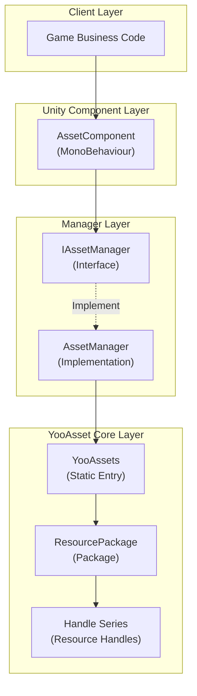
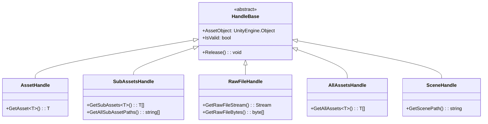
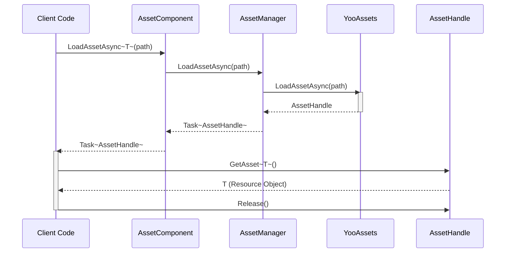

# Resource Loading API

The resource loading API is the core API of the GameFrameX Asset module, providing a unified resource loading and management solution. This interface is built on the YooAsset library and supports synchronous/asynchronous loading, package management, scene loading, and other resource operations.

## Overview

The `IAssetManager` interface defines all loading functionality of the asset component, covering the following core capabilities:

- **Multiple Resource Loading Methods**: Supports both synchronous and asynchronous loading modes
- **Rich Resource Types**: Supports normal resources, sub-resources, raw files, scenes, and other types
- **Package Management**: Supports creating, retrieving, and switching between multiple packages
- **Resource Lifecycle Management**: Provides complete management capabilities for resource unloading, cleanup, and reclamation

The resource loading API uses a Handle pattern to manage resource lifecycle. All loading operations return a corresponding Handle object, through which you can access loaded resources and perform release operations.

> Source: [IAssetManager.cs](https://github.com/GameFrameX/com.gameframex.unity.asset/blob/main/Runtime/Asset/IAssetManager.cs#L1-L519)

## Architecture Design

The resource loading system uses a layered architecture design with core components including:



**Architecture Notes:**

- **Client Layer**: Game business code calls resource functions through `AssetComponent` or `IAssetManager` interface
- **Unity Component Layer**: `AssetComponent` is a MonoBehaviour component attached to a GameObject, providing component-style access
- **Manager Layer**: `AssetManager` implements `IAssetManager` interface and is the core manager of resources
- **YooAsset Core Layer**: Actual resource loading is done by YooAsset, returning various Handle objects for resource management

### Handle Object System

Handle objects returned by resource loading are core to resource management:



> Handle types are defined by the YooAsset library. For details, see [YooAsset Official Documentation](https://www.yooasset.com/)

## Core Loading API

### Asynchronous Resource Loading

Asynchronous loading is the recommended primary loading method and does not block the main thread.

```csharp
/// <summary>
/// Asynchronously load a resource
/// </summary>
/// <param name="path">Resource path</param>
/// <typeparam name="T">Resource type</typeparam>
/// <returns>Returns a Task containing an AssetHandle object</returns>
Task<AssetHandle> LoadAssetAsync<T>(string path) where T : UnityEngine.Object;
```

> Source: [IAssetManager.cs](https://github.com/GameFrameX/com.gameframex.unity.asset/blob/main/Runtime/Asset/IAssetManager.cs#L234)

**Usage Example:**

```csharp
// Asynchronously load a Prefab through AssetComponent
var handle = await assetComponent.LoadAssetAsync<GameObject>("Prefabs/Player");
GameObject player = handle.GetAsset<GameObject>();
// Release the resource after use
handle.Release();
```

> Source: [AssetComponent.cs](https://github.com/GameFrameX/com.gameframex.unity.asset/blob/main/Runtime/Asset/AssetComponent.cs#L258-L261)

### Synchronous Resource Loading

Synchronous loading returns the resource immediately but blocks the main thread during loading. Use with caution.

```csharp
/// <summary>
/// Synchronously load a resource
/// </summary>
/// <param name="path">Resource path</param>
/// <returns>Returns an AssetHandle object</returns>
AssetHandle LoadAssetSync<T>(string path) where T : UnityEngine.Object;
```

> Source: [IAssetManager.cs](https://github.com/GameFrameX/com.gameframex.unity.asset/blob/main/Runtime/Asset/IAssetManager.cs#L365)

**Usage Example:**

```csharp
// Synchronously load a Sprite
var handle = assetManager.LoadAssetSync<Sprite>("UI/Sprites/Icon");
Sprite sprite = handle.GetAsset<Sprite>();
handle.Release();
```

> Source: [AssetManager.cs](https://github.com/GameFrameX/com.gameframex.unity.asset/blob/main/Runtime/Asset/AssetManager.cs#L603-L606)

### Loading Sub-Resources

Sub-resource loading is used to retrieve all sub-resources within a package, such as all Sprites in an atlas.

```csharp
/// <summary>
/// Asynchronously load sub-resource objects
/// </summary>
/// <param name="path">Resource path</param>
/// <typeparam name="T">Resource type</typeparam>
Task<SubAssetsHandle> LoadSubAssetsAsync<T>(string path) where T : UnityEngine.Object;
```

> Source: [IAssetManager.cs](https://github.com/GameFrameX/com.gameframex.unity.asset/blob/main/Runtime/Asset/IAssetManager.cs#L134)

**Usage Example:**

```csharp
// Load all Sprites from an atlas
var handle = await assetComponent.LoadSubAssetsAsync<Sprite>("Atlas/UI/MainAtlas");
Sprite[] sprites = handle.GetSubAssets<Sprite>();
foreach (var sprite in sprites)
{
    Debug.Log($"Sprite: {sprite.name}");
}
handle.Release();
```

> Source: [AssetComponent.cs](https://github.com/GameFrameX/com.gameframex.unity.asset/blob/main/Runtime/Asset/AssetComponent.cs#L128-L131)

### Loading Raw Files

Raw file loading is used to load raw files that are not Unity resource types, such as configuration files and text files.

```csharp
/// <summary>
/// Asynchronously load a raw file
/// </summary>
/// <param name="path">Resource path</param>
Task<RawFileHandle> LoadRawFileAsync(string path);
```

> Source: [IAssetManager.cs](https://github.com/GameFrameX/com.gameframex.unity.asset/blob/main/Runtime/Asset/IAssetManager.cs#L183)

**Usage Example:**

```csharp
// Load a JSON configuration file
var handle = await assetComponent.LoadRawFileAsync("Config/GameConfig.json");
string json = System.Text.Encoding.UTF8.GetString(handle.GetRawFileBytes());
handle.Release();
```

> Source: [AssetComponent.cs](https://github.com/GameFrameX/com.gameframex.unity.asset/blob/main/Runtime/Asset/AssetComponent.cs#L192-L195)

### Loading All Resources

Load all resource objects in a specified package.

```csharp
/// <summary>
/// Asynchronously load all resource objects in a package
/// </summary>
/// <param name="path">Resource location address</param>
Task<AllAssetsHandle> LoadAllAssetsAsync(string path);
```

> Source: [IAssetManager.cs](https://github.com/GameFrameX/com.gameframex.unity.asset/blob/main/Runtime/Asset/IAssetManager.cs#L267)

**Usage Example:**

```csharp
// Load all Prefabs in a directory
var handle = await assetComponent.LoadAllAssetsAsync<GameObject>("Prefabs/Enemies");
GameObject[] enemies = handle.GetAllAssets<GameObject>();
handle.Release();
```

> Source: [AssetComponent.cs](https://github.com/GameFrameX/com.gameframex.unity.asset/blob/main/Runtime/Asset/AssetComponent.cs#L292-L295)

### Loading Scenes

Asynchronously load a Unity scene.

```csharp
/// <summary>
/// Asynchronously load a scene
/// </summary>
/// <param name="path">Resource path</param>
/// <param name="sceneMode">Scene mode</param>
/// <param name="activateOnLoad">Whether to auto-activate after loading</param>
Task<SceneHandle> LoadSceneAsync(string path, LoadSceneMode sceneMode, bool activateOnLoad = true);
```

> Source: [IAssetManager.cs](https://github.com/GameFrameX/com.gameframex.unity.asset/blob/main/Runtime/Asset/IAssetManager.cs#L379)

**Usage Example:**

```csharp
// Asynchronously load and activate a scene
var handle = await assetComponent.LoadSceneAsync("Scenes/Game", LoadSceneMode.Single);
Debug.Log("Scene loaded successfully");
// Scene will auto-activate, if you need manual activation:
// handle.Activate();
```

> Source: [AssetComponent.cs](https://github.com/GameFrameX/com.gameframex.unity.asset/blob/main/Runtime/Asset/AssetComponent.cs#L443-L446)

## Resource Management API

### Package Management

A Resource Package is the basic unit of resource management. You can create multiple independent packages.

```csharp
/// <summary>
/// Create a resource package
/// </summary>
ResourcePackage CreateAssetsPackage(string packageName);

/// <summary>
/// Try to get a resource package
/// </summary>
ResourcePackage TryGetAssetsPackage(string packageName);

/// <summary>
/// Check if a resource package exists
/// </summary>
bool HasAssetsPackage(string packageName);

/// <summary>
/// Get a resource package
/// </summary>
ResourcePackage GetAssetsPackage(string packageName);

/// <summary>
/// Set the default resource package
/// </summary>
void SetDefaultAssetsPackage(ResourcePackage resourcePackage);
```

> Source: [IAssetManager.cs](https://github.com/GameFrameX/com.gameframex.unity.asset/blob/main/Runtime/Asset/IAssetManager.cs#L393-L481)

### Resource Unloading and Cleanup

```csharp
/// <summary>
/// Unload a resource
/// </summary>
void UnloadAsset(string assetPath);
void UnloadAsset(string packageName, string assetPath);

/// <summary>
/// Unload unused resources
/// </summary>
void UnloadUnusedAssetsAsync(string packageName = null);

/// <summary>
/// Clear unused resources
/// </summary>
void ClearUnusedBundleFilesAsync(string packageName = null);

/// <summary>
/// Clear all resources
/// </summary>
void ClearAllBundleFilesAsync(string packageName = null);

/// <summary>
/// Force reclaim all resources
/// </summary>
void UnloadAllAssetsAsync(string packageName = null);
```

> Source: [IAssetManager.cs](https://github.com/GameFrameX/com.gameframex.unity.asset/blob/main/Runtime/Asset/IAssetManager.cs#L107-L509)

### Resource Information Query

```csharp
/// <summary>
/// Whether download is needed (whether resource is on remote server)
/// </summary>
bool IsNeedDownload(AssetInfo assetInfo);
bool IsNeedDownload(string path);

/// <summary>
/// Get resource information
/// </summary>
AssetInfo[] GetAssetInfos(string[] assetTags);
AssetInfo[] GetAssetInfos(string assetTag);
AssetInfo GetAssetInfo(string path);

/// <summary>
/// Check if a specified resource path is valid
/// </summary>
bool HasAssetPath(string assetPath);
```

> Source: [IAssetManager.cs](https://github.com/GameFrameX/com.gameframex.unity.asset/blob/main/Runtime/Asset/IAssetManager.cs#L429-L481)

## Initialization and Configuration

### Initialize the Resource System

Before using resource loading functionality, the resource system must be initialized.

```csharp
/// <summary>
/// Initialize
/// </summary>
void Initialize();
```

> Source: [IAssetManager.cs](https://github.com/GameFrameX/com.gameframex.unity.asset/blob/main/Runtime/Asset/IAssetManager.cs#L89)

The initialization operation is automatically called by `AssetComponent` during the Start phase and generally does not need to be called manually.

### Initialize a Package

```csharp
/// <summary>
/// Asynchronous initialization operation
/// </summary>
Task<bool> InitPackageAsync(
    string packageName,
    string hostServerURL,
    string fallbackHostServerURL,
    bool isDefaultPackage = true
);
```

> Source: [IAssetManager.cs](https://github.com/GameFrameX/com.gameframex.unity.asset/blob/main/Runtime/Asset/IAssetManager.cs#L100)

**Usage Example:**

```csharp
// Initialize a package in AssetComponent
bool success = await assetComponent.InitPackageAsync(
    "DefaultPackage",                    // Package name
    "https://cdn.example.com/assets",   // Primary server address
    "https://backup.example.com/assets", // Backup server address
    true                                 // Set as default package
);

if (success)
{
    Debug.Log("Package initialized successfully");
}
```

> Source: [AssetComponent.cs](https://github.com/GameFrameX/com.gameframex.unity.asset/blob/main/Runtime/Asset/AssetComponent.cs#L80-L95)

### Configuration Properties

```csharp
/// <summary>
/// Maximum number of concurrent downloads
/// </summary>
int DownloadingMaxNum { get; set; }

/// <summary>
/// Maximum number of retry attempts on failure
/// </summary>
int FailedTryAgain { get; set; }

/// <summary>
/// Get the read-only path for resources
/// </summary>
string ReadOnlyPath { get; }

/// <summary>
/// Get the read-write path for resources
/// </summary>
string ReadWritePath { get; }

/// <summary>
/// Get or set the runtime mode
/// </summary>
EPlayMode PlayMode { get; }

/// <summary>
/// Get or set the download file verification level
/// </summary>
EFileVerifyLevel VerifyLevel { get; set; }
```

> Source: [IAssetManager.cs](https://github.com/GameFrameX/com.gameframex.unity.asset/blob/main/Runtime/Asset/IAssetManager.cs#L15-L75)

### Runtime Modes

The system supports four runtime modes, defined by the `EPlayMode` enum:

| Mode | Description | Use Case |
|------|-------------|----------|
| `EditorSimulateMode` | Editor simulation mode | Development phase, test without packaging |
| `OfflinePlayMode` | Offline play mode | Pure local resources, no hot update |
| `HostPlayMode` | Host play mode | Production environment with hot update support |
| `WebPlayMode` | WebGL mode | WebGL platform specific |

> For detailed runtime mode introduction, see [Runtime Modes](./6-configuration.play-modes)

```csharp
/// <summary>
/// Set the runtime mode
/// </summary>
void SetPlayMode(EPlayMode playMode);
```

> Source: [IAssetManager.cs](https://github.com/GameFrameX/com.gameframex.unity.asset/blob/main/Runtime/Asset/IAssetManager.cs#L82)

## Loading Flow

### Typical Asynchronous Loading Flow



### Complete Usage Example

```csharp
using UnityEngine;
using System;
using System.Threading.Tasks;
using YooAssets;
using GameFrameX.Asset.Runtime;

public class ResourceLoaderExample : MonoBehaviour
{
    private AssetComponent _assetComponent;

    async void Start()
    {
        // Get AssetComponent
        _assetComponent = GetComponent<AssetComponent>();

        // Initialize packages (usually done on the startup screen)
        await InitializePackages();

        // Example 1: Asynchronously load a single resource
        await LoadSingleAssetAsync();

        // Example 2: Load sub-resources (atlas)
        await LoadSubAssetsAsync();

        // Example 3: Load a scene
        await LoadSceneAsync();
    }

    async Task InitializePackages()
    {
        bool success = await _assetComponent.InitPackageAsync(
            "DefaultPackage",
            "https://cdn.example.com/assets",
            "https://backup.example.com/assets",
            true
        );
        Debug.Log($"Package initialization: {(success ? "Success" : "Failed")}");
    }

    async Task LoadSingleAssetAsync()
    {
        // Load a Prefab
        var handle = await _assetComponent.LoadAssetAsync<GameObject>("Prefabs/Player");
        if (handle.IsValid())
        {
            GameObject player = handle.GetAsset<GameObject>();
            Instantiate(player);
            Debug.Log($"Prefab loaded successfully: {player.name}");

            // Must release after use
            handle.Release();
        }
    }

    async Task LoadSubAssetsAsync()
    {
        // Load all Sprites from an atlas
        var handle = await _assetComponent.LoadSubAssetsAsync<Sprite>("Atlas/UI/MainUI");
        if (handle.IsValid())
        {
            var sprites = handle.GetSubAssets<Sprite>();
            Debug.Log($"Loaded {sprites.Length} Sprites");

            foreach (var sprite in sprites)
            {
                Debug.Log($"  - {sprite.name}");
            }

            handle.Release();
        }
    }

    async Task LoadSceneAsync()
    {
        // Load the game scene
        var handle = await _assetComponent.LoadSceneAsync(
            "Scenes/GameMain",
            UnityEngine.SceneManagement.LoadSceneMode.Single,
            true
        );

        if (handle.IsValid())
        {
            Debug.Log("Scene loaded successfully");
        }
    }
}
```

> Source: [AssetManager.cs](https://github.com/GameFrameX/com.gameframex.unity.asset/blob/main/Runtime/Asset/AssetManager.cs#L1-L829)

## API Reference

### Initialization Methods

#### `Initialize(): void`

Initializes the resource system. Usually called automatically by `AssetComponent` at startup.

#### `InitPackageAsync(packageName, hostServerURL, fallbackHostServerURL, isDefaultPackage): Task<bool>`

Asynchronously initializes a package.

**Parameters:**
- `packageName` (string): Package name
- `hostServerURL` (string): Primary hot-update server address
- `fallbackHostServerURL` (string): Backup hot-update server address
- `isDefaultPackage` (bool, optional): Whether to set as default package, defaults to true

**Returns:** Whether initialization was successful

### Asynchronous Loading Methods

#### `LoadAssetAsync<T>(path): Task<AssetHandle>`

Asynchronously loads a single resource.

**Parameters:**
- `path` (string): Resource path
- `T`: Resource type (generic parameter)

**Returns:** Task containing AssetHandle

#### `LoadSubAssetsAsync<T>(path): Task<SubAssetsHandle>`

Asynchronously loads sub-resources.

#### `LoadRawFileAsync(path): Task<RawFileHandle>`

Asynchronously loads raw files.

#### `LoadAllAssetsAsync(path): Task<AllAssetsHandle>`

Asynchronously loads all resource objects in a package.

#### `LoadSceneAsync(path, sceneMode, activateOnLoad): Task<SceneHandle>`

Asynchronously loads a scene.

### Synchronous Loading Methods

Synchronous loading methods correspond to asynchronous methods but return results immediately:
- `LoadAssetSync<T>(path): AssetHandle`
- `LoadSubAssetSync<T>(path): SubAssetsHandle`
- `LoadRawFileSync(path): RawFileHandle`
- `LoadAllAssetsSync<T>(path): AllAssetsHandle`

### Resource Management Methods

| Method | Description |
|--------|-------------|
| `CreateAssetsPackage(name)` | Create a package |
| `GetAssetsPackage(name)` | Get a package |
| `HasAssetsPackage(name)` | Check if a package exists |
| `SetDefaultAssetsPackage(package)` | Set the default package |
| `UnloadAsset(path)` | Unload a specific resource |
| `UnloadUnusedAssetsAsync()` | Asynchronously unload unused resources |
| `ClearUnusedBundleFilesAsync()` | Clear unused bundle files |
| `UnloadAllAssetsAsync()` | Force reclaim all resources |

### Query Methods

| Method | Description |
|--------|-------------|
| `IsNeedDownload(path)` | Check if resource needs download |
| `GetAssetInfo(path)` | Get resource information |
| `GetAssetInfos(tag)` | Get resource information list by tag |
| `HasAssetPath(path)` | Check if resource path is valid |

## Best Practices

### 1. Use Asynchronous Loading

Prefer asynchronous loading methods to avoid blocking the main thread and affecting game frame rate:

```csharp
// Recommended: Asynchronous loading
var handle = await assetComponent.LoadAssetAsync<GameObject>("Prefabs/Player");

// Caution: Synchronous loading
var handle = assetManager.LoadAssetSync<GameObject>("Prefabs/Player");
```

### 2. Release Resources Promptly

Must call Release() after using resources to avoid memory leaks:

```csharp
var handle = await assetComponent.LoadAssetAsync<GameObject>("Prefabs/Player");
GameObject obj = handle.GetAsset<GameObject>();
// ... use the resource object
handle.Release(); // Release the resource
```

### 3. Use try-finally to Ensure Release

Use try-finally to ensure resources are always released:

```csharp
var handle = await assetComponent.LoadAssetAsync<GameObject>("Prefabs/Player");
try
{
    GameObject obj = handle.GetAsset<GameObject>();
    // Use the resource
}
finally
{
    handle.Release();
}
```

### 4. Use Packages Reasonably

Organize packages reasonably based on game structure:

```csharp
// Create a UI package
var uiPackage = assetManager.CreateAssetsPackage("UI");
// Set as default package
assetManager.SetDefaultAssetsPackage(uiPackage);
```

### 5. Check Resource Validity

Check Handle validity before getting resources:

```csharp
var handle = await assetComponent.LoadAssetAsync<GameObject>("Prefabs/Player");
if (handle.IsValid())
{
    GameObject obj = handle.GetAsset<GameObject>();
    // Use the resource
}
else
{
    Debug.LogError("Resource loading failed");
}
handle.Release();
```

## Related Links

- [Asset Component](./4-core-concepts.asset-component) - Unity component way to access resources
- [Asset Manager](./4-core-concepts.asset-manager) - Asset manager core implementation
- [Runtime Modes](./6-configuration.play-modes) - Detailed explanation of four runtime modes
- [Package Management](./5-api-reference.package-management) - Package management API
- [Update Events](./5-api-reference.update-events) - Resource update events
- [YooAsset Official Documentation](https://www.yooasset.com/)