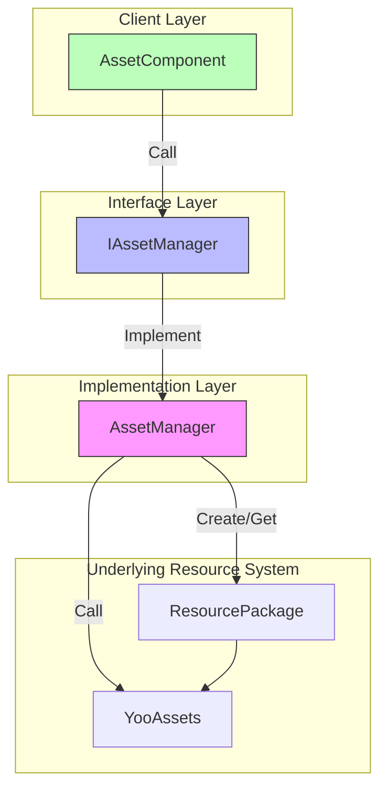
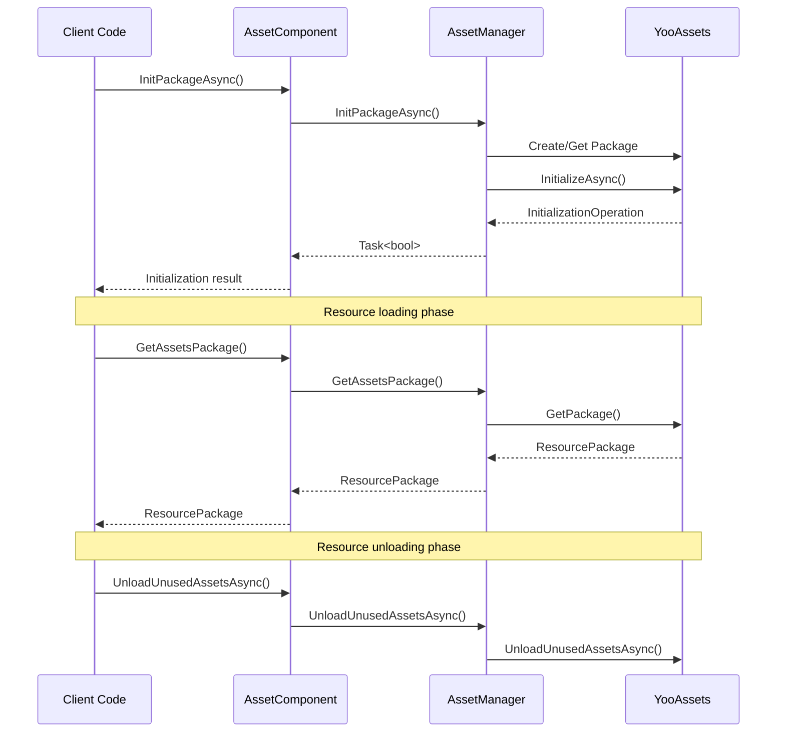

# Package Management

The package management API provides complete lifecycle management capabilities for ResourcePackages, including package creation, initialization, retrieval, and unloading. This module is built on the YooAssets library and provides unified and powerful package management functionality for GameFrameX.

## Overview

A Resource Package is the core concept for organizing and managing resources in the GameFrameX resource system. Each resource package represents an independent collection of resources with its own download URL, initialization method, and resource loading rules. Through the package management API, developers can:

- Create multiple independent resource packages for modular resource management
- Configure different remote server addresses for each package
- Set a default package to simplify the use of loading interfaces
- Flexibly control the timing of resource loading and unloading

The system supports managing multiple packages simultaneously, but only one package can be set as the default at a time. The default package allows the use of simplified loading interfaces without explicitly specifying a package name.

> Note: The default resource package name is `DefaultPackage`, defined in the `AssetManager.ConstDefaultPackageName` constant.

## Architecture

The package management architecture uses a typical layered design pattern, achieving encapsulation of the underlying YooAssets through interface abstraction:



**Component Description:**

| Component | Responsibility |
|-----------|----------------|
| AssetComponent | Unity component layer, provides public API interfaces |
| IAssetManager | Defines abstract interfaces for resource management |
| AssetManager | Concrete implementation class, handles interaction with YooAssets |
| ResourcePackage | YooAssets package object |

## Core Features

### Package Initialization

Packages must be initialized before use. The initialization process configures different file systems based on the runtime mode (PlayMode) and connects to remote servers (if needed).

#### Asynchronously Initialize a Package

```csharp
public async Task<bool> InitPackageAsync(string packageName, string host, string fallbackHostServer, bool isDefaultPackage = false)
```

> Source: [AssetComponent.cs](https://github.com/GameFrameX/com.gameframex.unity.asset/blob/main/Runtime/Asset/AssetComponent.cs#L80-L95)

**Parameter Description:**
- `packageName` (string): Package name, used to identify and retrieve the package
- `host` (string): Primary download URL, used to download remote resources
- `fallbackHostServer` (string): Backup download URL, used when the primary address is unavailable
- `isDefaultPackage` (bool): Whether to set as default package, defaults to false

**Return Value:**
- `Task<bool>`: Whether initialization was successful

**Usage Example:**

```csharp
var assetComponent = GameEntry.GetComponent<AssetComponent>();
bool success = await assetComponent.InitPackageAsync(
    "MyPackage",
    "https://cdn.example.com/assets",
    "https://backup.example.com/assets",
    true
);
```

The initialization process selects different initialization strategies based on the currently set runtime mode (EPlayMode):

- **EditorSimulateMode**: Editor simulation mode, uses simulated resources in the editor
- **OfflinePlayMode**: Offline play mode, uses only built-in resources
- **HostPlayMode**: Host play mode, supports remote resource download and hot update
- **WebPlayMode**: WebGL mode, optimized for web platform

> For detailed runtime mode descriptions, see the [Runtime Modes](./6-configuration.play-modes) documentation.

### Package Creation and Retrieval

#### Create a Package

```csharp
public ResourcePackage CreateAssetsPackage(string packageName)
```

> Source: [AssetComponent.cs](https://github.com/GameFrameX/com.gameframex.unity.asset/blob/main/Runtime/Asset/AssetComponent.cs#L471-L474)

Creates a new resource package. If the package already exists, returns the existing package instance.

**Parameters:**
- `packageName` (string): Package name

**Returns:**
- ResourcePackage: The created package object

#### Try to Get a Package

```csharp
public ResourcePackage TryGetAssetsPackage(string packageName)
```

> Source: [AssetComponent.cs](https://github.com/GameFrameX/com.gameframex.unity.asset/blob/main/Runtime/Asset/AssetComponent.cs#L482-L485)

Safely gets a package, returns null if the package does not exist rather than throwing an exception.

**Parameters:**
- `packageName` (string): Package name

**Returns:**
- ResourcePackage: Package object, returns null if not found

#### Check if Package Exists

```csharp
public bool HasAssetsPackage(string packageName)
```

> Source: [AssetComponent.cs](https://github.com/GameFrameX/com.gameframex.unity.asset/blob/main/Runtime/Asset/AssetComponent.cs#L493-L496)

Checks whether a package with the specified name has been created.

**Parameters:**
- `packageName` (string): Package name

**Returns:**
- bool: Whether it exists

#### Get a Package

```csharp
public ResourcePackage GetAssetsPackage(string packageName)
```

> Source: [AssetComponent.cs](https://github.com/GameFrameX/com.gameframex.unity.asset/blob/main/Runtime/Asset/AssetComponent.cs#L504-L507)

Gets the package with the specified name. Throws an exception if the package does not exist.

**Parameters:**
- `packageName` (string): Package name

**Returns:**
- ResourcePackage: Package object

### Default Package

#### Set Default Package

```csharp
public void SetDefaultAssetsPackage(ResourcePackage assetsPackage)
```

> Source: [AssetComponent.cs](https://github.com/GameFrameX/com.gameframex.unity.asset/blob/main/Runtime/Asset/AssetComponent.cs#L581-L584)

Sets the default package. After setting, there is no need to explicitly specify a package name when loading resources; the system automatically loads from the default package.

**Parameters:**
- `assetsPackage` (ResourcePackage): Package to set as default

**Usage Example:**

```csharp
var assetComponent = GameEntry.GetComponent<AssetComponent>();
var package = assetComponent.GetAssetsPackage("MyPackage");
assetComponent.SetDefaultAssetsPackage(package);
// Now you can use simplified loading interfaces
var handle = await assetComponent.LoadAssetAsync("Prefabs/Player");
```

## Resource Unloading and Cleanup

GameFrameX provides multi-level resource unloading and cleanup mechanisms to meet different scenario requirements.

### Unload a Single Resource

```csharp
public void UnloadAsset(string assetPath)
public void UnloadAsset(string packageName, string assetPath)
```

> Source: [AssetComponent.cs](https://github.com/GameFrameX/com.gameframex.unity.asset/blob/main/Runtime/Asset/AssetComponent.cs#L602-L615)

Unloads the resource at the specified path.

**Parameters:**
- `packageName` (string): Package name (optional, uses default package if not specified)
- `assetPath` (string): Resource path

### Force Reclaim All Resources

```csharp
public void UnloadAllAssetsAsync(string packageName)
```

> Source: [AssetComponent.cs](https://github.com/GameFrameX/com.gameframex.unity.asset/blob/main/Runtime/Asset/AssetComponent.cs#L591-L594)

Forcibly reclaims all loaded resources in the specified package. This immediately releases all resource memory and should be used with caution.

**Parameters:**
- `packageName` (string): Package name

### Unload Unused Resources

```csharp
public void UnloadUnusedAssetsAsync(string packageName = null)
```

> Source: [AssetComponent.cs](https://github.com/GameFrameX/com.gameframex.unity.asset/blob/main/Runtime/Asset/AssetComponent.cs#L635-L638)

Unloads resources that are no longer referenced. This is the recommended method for releasing resources. The system automatically identifies and releases resources that are no longer in use.

**Parameters:**
- `packageName` (string): Package name, null cleans the default package

### Clean Up Resource Files

```csharp
public void ClearAllBundleFilesAsync(string packageName = null)
public void ClearUnusedBundleFilesAsync(string packageName = null)
```

> Source: [AssetComponent.cs](https://github.com/GameFrameX/com.gameframex.unity.asset/blob/main/Runtime/Asset/AssetComponent.cs#L645-L658)

Cleans up locally cached package files.

- `ClearAllBundleFilesAsync`: Cleans all resource files
- `ClearUnusedBundleFilesAsync`: Only cleans unused resource files

**Parameters:**
- `packageName` (string): Package name, null cleans the default package

## Usage Flow

The following is a typical usage flow for multi-package scenarios:



## Typical Usage Scenarios

### Scenario 1: DLC Package Management

When needing to dynamically load additional DLC content after game release, use an independent package:

```csharp
var assetComponent = GameEntry.GetComponent<AssetComponent>();

// Initialize the DLC package
await assetComponent.InitPackageAsync(
    "DLC_LevelPack1",
    "https://cdn.example.com/dlc/levelpack1",
    "https://backup.example.com/dlc/levelpack1"
);

// Get the DLC package and load resources
var dlcPackage = assetComponent.GetAssetsPackage("DLC_LevelPack1");
assetComponent.SetDefaultAssetsPackage(dlcPackage);

var levelHandle = await assetComponent.LoadAssetAsync<Scene>("Levels/Level01");
```

### Scenario 2: Resource Hot Update

When using host play mode, packages are used to manage hot-update resources:

```csharp
var assetComponent = GameEntry.GetComponent<AssetComponent>();

// Initialize the default package (for hot update)
bool success = await assetComponent.InitPackageAsync(
    "HotUpdate",
    "https://gamecdn.example.com/hotupdate",
    "https://backup.example.com/hotupdate",
    true
);

if (success)
{
    Debug.Log("Hot-update package initialized successfully");
}
```

### Scenario 3: Resource Cleanup

Clean up resources that are no longer needed when switching game scenes or entering specific flows:

```csharp
var assetComponent = GameEntry.GetComponent<AssetComponent>();

// Unload unused resources (recommended)
assetComponent.UnloadUnusedAssetsAsync();

// Or clean all caches for a specific package
assetComponent.ClearUnusedBundleFilesAsync("OldDLC");
```

## API Reference

### AssetComponent

| Method | Return Type | Description |
|--------|-------------|-------------|
| InitPackageAsync | Task\<bool\> | Asynchronously initialize a package |
| CreateAssetsPackage | ResourcePackage | Create a package |
| TryGetAssetsPackage | ResourcePackage | Try to get a package (safe) |
| HasAssetsPackage | bool | Check if a package exists |
| GetAssetsPackage | ResourcePackage | Get a package |
| SetDefaultAssetsPackage | void | Set the default package |
| UnloadAsset | void | Unload a specific resource |
| UnloadAllAssetsAsync | void | Force reclaim all resources |
| UnloadUnusedAssetsAsync | void | Unload unused resources |
| ClearAllBundleFilesAsync | void | Clean all resource files |
| ClearUnusedBundleFilesAsync | void | Clean unused resource files |

### IAssetManager

| Property | Type | Description |
|----------|------|-------------|
| DefaultPackageName | string | Default package name |
| PlayMode | EPlayMode | Current runtime mode |
| VerifyLevel | EFileVerifyLevel | File verification level |
| Milliseconds | long | Async system time slice |

> For complete interface definitions, see [IAssetManager.cs](https://github.com/GameFrameX/com.gameframex.unity.asset/blob/main/Runtime/Asset/IAssetManager.cs)

## Related Links

- [Resource Loading API](./5-api-reference.loading-api) - Learn how to load resources from packages
- [Runtime Modes](./6-configuration.play-modes) - Learn about different runtime mode configuration
- [Asset Component](./4-core-concepts.asset-component) - Learn about the AssetComponent
- [Architecture Design](./4-core-concepts.architecture) - Learn about overall architecture design