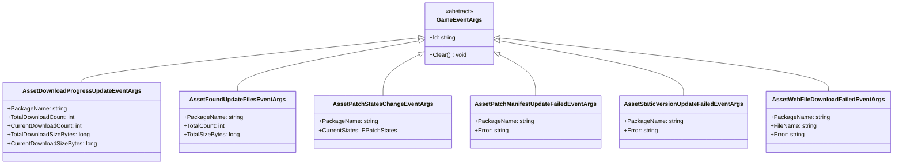
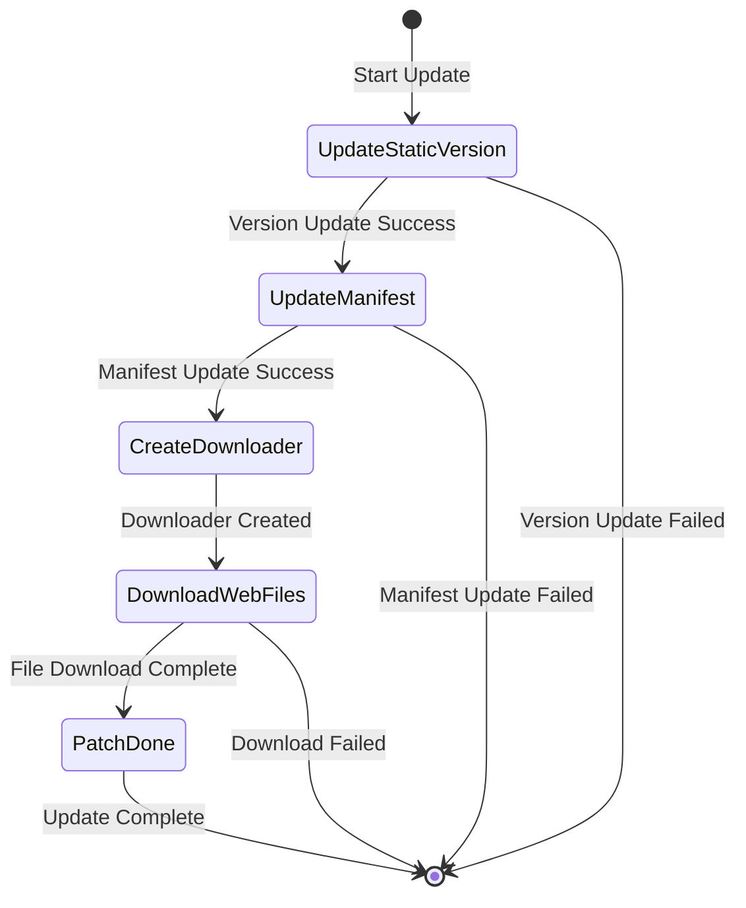

# Update Events

The resource system provides an update event mechanism that allows developers to listen to key nodes during the resource hot update process and execute custom logic.

## Overview

During the resource hot update flow, the system triggers various events to notify the current update progress and status. These events are built on GameFrameX's event system, following the publish-subscribe pattern. Developers can subscribe to these events to:
- Display update progress UI
- Track download data
- Handle update failures
- Execute custom business logic

All update events inherit from the `GameEventArgs` base class, each with a unique event ID (EventId) used for event subscription and distribution.

## Event System Architecture



## Update Flow States

The update flow is defined by the `EPatchStates` enum, containing the following five states:



| State | Description |
|------|------|
| UpdateStaticVersion | Update static resource version |
| UpdateManifest | Update patch manifest file |
| CreateDownloader | Create downloader |
| DownloadWebFiles | Download remote files |
| PatchDone | Patch flow complete |

## Event Details

### Download Progress Update Event (AssetDownloadProgressUpdateEventArgs)

Triggered in real-time during resource downloading to report current download progress.

> Source: [Runtime/Update/EventArgs/AssetDownloadProgressUpdateEventArgs.cs](https://github.com/GameFrameX/com.gameframex.unity.asset/blob/main/Runtime/Update/EventArgs/AssetDownloadProgressUpdateEventArgs.cs#L1-L77)

**Event ID:**
```csharp
public static readonly string EventId = typeof(AssetDownloadProgressUpdateEventArgs).FullName;
```

**Property Description:**

| Property | Type | Description |
|------|------|------|
| PackageName | string | Resource package name |
| TotalDownloadCount | int | Total download count |
| CurrentDownloadCount | int | Current downloaded count |
| TotalDownloadSizeBytes | long | Total download size in bytes |
| CurrentDownloadSizeBytes | long | Current downloaded size in bytes |

**Create Method:**
```csharp
public static AssetDownloadProgressUpdateEventArgs Create(
    string packageName,
    int totalDownloadCount,
    int currentDownloadCount,
    long totalDownloadSizeBytes,
    long currentDownloadSizeBytes)
```

### Found Update Files Event (AssetFoundUpdateFilesEventArgs)

Triggered when the system scans and finds files that need to be updated, carrying statistics for files to be updated.

> Source: [Runtime/Update/EventArgs/AssetFoundUpdateFilesEventArgs.cs](https://github.com/GameFrameX/com.gameframex.unity.asset/blob/main/Runtime/Update/EventArgs/AssetFoundUpdateFilesEventArgs.cs#L1-L60)

**Event ID:**
```csharp
public static readonly string EventId = typeof(AssetFoundUpdateFilesEventArgs).FullName;
```

**Property Description:**

| Property | Type | Description |
|------|------|------|
| PackageName | string | Resource package name |
| TotalCount | int | Total number of files to update |
| TotalSizeBytes | long | Total size of files to update in bytes |

**Create Method:**
```csharp
public static AssetFoundUpdateFilesEventArgs Create(
    string packageName,
    int totalCount,
    long totalSizeBytes)
```

### Patch Flow State Change Event (AssetPatchStatesChangeEventArgs)

Triggered when the resource update flow enters a new state stage, used to notify current update progress.

> Source: [Runtime/Update/EventArgs/AssetPatchStatesChangeEventArgs.cs](https://github.com/GameFrameX/com.gameframex.unity.asset/blob/main/Runtime/Update/EventArgs/AssetPatchStatesChangeEventArgs.cs#L1-L49)

**Event ID:**
```csharp
public static readonly string EventId = typeof(AssetPatchStatesChangeEventArgs).FullName;
```

**Property Description:**

| Property | Type | Description |
|------|------|------|
| PackageName | string | Resource package name |
| CurrentStates | EPatchStates | Current update state |

**Create Method:**
```csharp
public static AssetPatchStatesChangeEventArgs Create(
    string packageName,
    EPatchStates currentStates)
```

### Patch Manifest Update Failed Event (AssetPatchManifestUpdateFailedEventArgs)

Triggered when the patch manifest file update fails, containing error information.

> Source: [Runtime/Update/EventArgs/AssetPatchManifestUpdateFailedEventArgs.cs](https://github.com/GameFrameX/com.gameframex.unity.asset/blob/main/Runtime/Update/EventArgs/AssetPatchManifestUpdateFailedEventArgs.cs#L1-L52)

**Event ID:**
```csharp
public static readonly string EventId = typeof(AssetPatchManifestUpdateFailedEventArgs).FullName;
```

**Property Description:**

| Property | Type | Description |
|------|------|------|
| PackageName | string | Resource package name |
| Error | string | Error information |

**Create Method:**
```csharp
public static AssetPatchManifestUpdateFailedEventArgs Create(
    string packageName,
    string error)
```

### Static Version Update Failed Event (AssetStaticVersionUpdateFailedEventArgs)

Triggered when the resource version update fails, containing error information.

> Source: [Runtime/Update/EventArgs/AssetStaticVersionUpdateFailedEventArgs.cs](https://github.com/GameFrameX/com.gameframex.unity.asset/blob/main/Runtime/Update/EventArgs/AssetStaticVersionUpdateFailedEventArgs.cs#L1-L52)

**Event ID:**
```csharp
public static readonly string EventId = typeof(AssetStaticVersionUpdateFailedEventArgs).FullName;
```

**Property Description:**

| Property | Type | Description |
|------|------|------|
| PackageName | string | Resource package name |
| Error | string | Error information |

**Create Method:**
```csharp
public static AssetStaticVersionUpdateFailedEventArgs Create(
    string packageName,
    string error)
```

### Web File Download Failed Event (AssetWebFileDownloadFailedEventArgs)

Triggered when a specific resource file download fails, containing filename and error information.

> Source: [Runtime/Update/EventArgs/AssetWebFileDownloadFailedEventArgs.cs](https://github.com/GameFrameX/com.gameframex.unity.asset/blob/main/Runtime/Update/EventArgs/AssetWebFileDownloadFailedEventArgs.cs#L1-L60)

**Event ID:**
```csharp
public static readonly string EventId = typeof(AssetWebFileDownloadFailedEventArgs).FullName;
```

**Property Description:**

| Property | Type | Description |
|------|------|------|
| PackageName | string | Resource package name |
| FileName | string | Filename of failed download |
| Error | string | Error information |

**Create Method:**
```csharp
public static AssetWebFileDownloadFailedEventArgs Create(
    string packageName,
    string fileName,
    string error)
```

## Usage Examples

### Subscribe to Update State Change Event

```csharp
// Subscribe to patch flow state change event
GameEntry.Event.Subscribe(AssetPatchStatesChangeEventArgs.EventId, OnPatchStatesChange);

private void OnPatchStatesChange(object sender, AssetPatchStatesChangeEventArgs e)
{
    switch (e.CurrentStates)
    {
        case EPatchStates.UpdateStaticVersion:
            Debug.Log("Updating resource version...");
            break;
        case EPatchStates.UpdateManifest:
            Debug.Log("Updating patch manifest...");
            break;
        case EPatchStates.CreateDownloader:
            Debug.Log("Creating downloader...");
            break;
        case EPatchStates.DownloadWebFiles:
            Debug.Log("Downloading remote files...");
            break;
        case EPatchStates.PatchDone:
            Debug.Log("Update complete!");
            break;
    }
}
```

> Source: [Runtime/Update/EventArgs/AssetPatchStatesChangeEventArgs.cs](https://github.com/GameFrameX/com.gameframex.unity.asset/blob/main/Runtime/Update/EventArgs/AssetPatchStatesChangeEventArgs.cs#L35-L47)

### Subscribe to Download Progress Update Event

```csharp
// Subscribe to download progress update event
GameEntry.Event.Subscribe(AssetDownloadProgressUpdateEventArgs.EventId, OnDownloadProgress);

private void OnDownloadProgress(object sender, AssetDownloadProgressUpdateEventArgs e)
{
    float progress = (float)e.CurrentDownloadCount / e.TotalDownloadCount;
    long downloadedSize = e.CurrentDownloadSizeBytes / 1024 / 1024; // MB
    long totalSize = e.TotalDownloadSizeBytes / 1024 / 1024; // MB

    Debug.Log($"Download progress: {progress * 100:F1}% ({e.CurrentDownloadCount}/{e.TotalDownloadCount}) - {downloadedSize}MB / {totalSize}MB");
}
```

> Source: [Runtime/Update/EventArgs/AssetDownloadProgressUpdateEventArgs.cs](https://github.com/GameFrameX/com.gameframex.unity.asset/blob/main/Runtime/Update/EventArgs/AssetDownloadProgressUpdateEventArgs.cs#L60-L75)

### Subscribe to Found Update Files Event

```csharp
// Subscribe to found update files event
GameEntry.Event.Subscribe(AssetFoundUpdateFilesEventArgs.EventId, OnFoundUpdateFiles);

private void OnFoundUpdateFiles(object sender, AssetFoundUpdateFilesEventArgs e)
{
    long totalSizeMB = e.TotalSizeBytes / 1024 / 1024;
    Debug.Log($"Found {e.TotalCount} files to update, total size: {totalSizeMB}MB");
}
```

> Source: [Runtime/Update/EventArgs/AssetFoundUpdateFilesEventArgs.cs](https://github.com/GameFrameX/com.gameframex.unity.asset/blob/main/Runtime/Update/EventArgs/AssetFoundUpdateFilesEventArgs.cs#L44-L58)

### Subscribe to Error Events

```csharp
// Subscribe to static version update failed event
GameEntry.Event.Subscribe(AssetStaticVersionUpdateFailedEventArgs.EventId, OnStaticVersionUpdateFailed);

// Subscribe to manifest update failed event
GameEntry.Event.Subscribe(AssetPatchManifestUpdateFailedEventArgs.EventId, OnManifestUpdateFailed);

// Subscribe to file download failed event
GameEntry.Event.Subscribe(AssetWebFileDownloadFailedEventArgs.EventId, OnFileDownloadFailed);

private void OnStaticVersionUpdateFailed(object sender, AssetStaticVersionUpdateFailedEventArgs e)
{
    Debug.LogError($"Resource version update failed: {e.Error}");
    // Can show error prompt or execute retry logic here
}

private void OnManifestUpdateFailed(object sender, AssetPatchManifestUpdateFailedEventArgs e)
{
    Debug.LogError($"Patch manifest update failed: {e.Error}");
}

private void OnFileDownloadFailed(object sender, AssetWebFileDownloadFailedEventArgs e)
{
    Debug.LogError($"File download failed: {e.FileName}, error: {e.Error}");
}
```

> Sources:
> - [Runtime/Update/EventArgs/AssetStaticVersionUpdateFailedEventArgs.cs](https://github.com/GameFrameX/com.gameframex.unity.asset/blob/main/Runtime/Update/EventArgs/AssetStaticVersionUpdateFailedEventArgs.cs#L38-L50)
> - [Runtime/Update/EventArgs/AssetPatchManifestUpdateFailedEventArgs.cs](https://github.com/GameFrameX/com.gameframex.unity.asset/blob/main/Runtime/Update/EventArgs/AssetPatchManifestUpdateFailedEventArgs.cs#L38-L50)
> - [Runtime/Update/EventArgs/AssetWebFileDownloadFailedEventArgs.cs](https://github.com/GameFrameX/com.gameframex.unity.asset/blob/main/Runtime/Update/EventArgs/AssetWebFileDownloadFailedEventArgs.cs#L44-L58)

## Event Usage Notes

1. **Event Subscription Timing**: It is recommended to subscribe to events at game startup or before resource system initialization to ensure no update events are missed.

2. **Event Unsubscription**: Unsubscribe from events at the appropriate time (such as scene switching or component destruction) to avoid memory leaks.

3. **Object Pool Mechanism**: All event parameter classes implement the object pool pattern. Use `Create` method to get instances from the pool; instances are automatically recycled after use. Developers do not need to manually manage their lifecycles.

4. **Error Handling**: It is strongly recommended to subscribe to error-type events so you can promptly detect and respond when updates fail (such as prompting users to retry).

5. **Progress Calculation**: `AssetDownloadProgressUpdateEventArgs` provides byte-level download progress, which can be used to implement fine-grained download progress display.

## Related Links

- [Loading API](./5-api-reference.loading-api)
- [Package Management](./5-api-reference.package-management)
- [Play Modes](./6-configuration.play-modes)
- [Core Concepts - AssetManager](./4-core-concepts.asset-manager)
