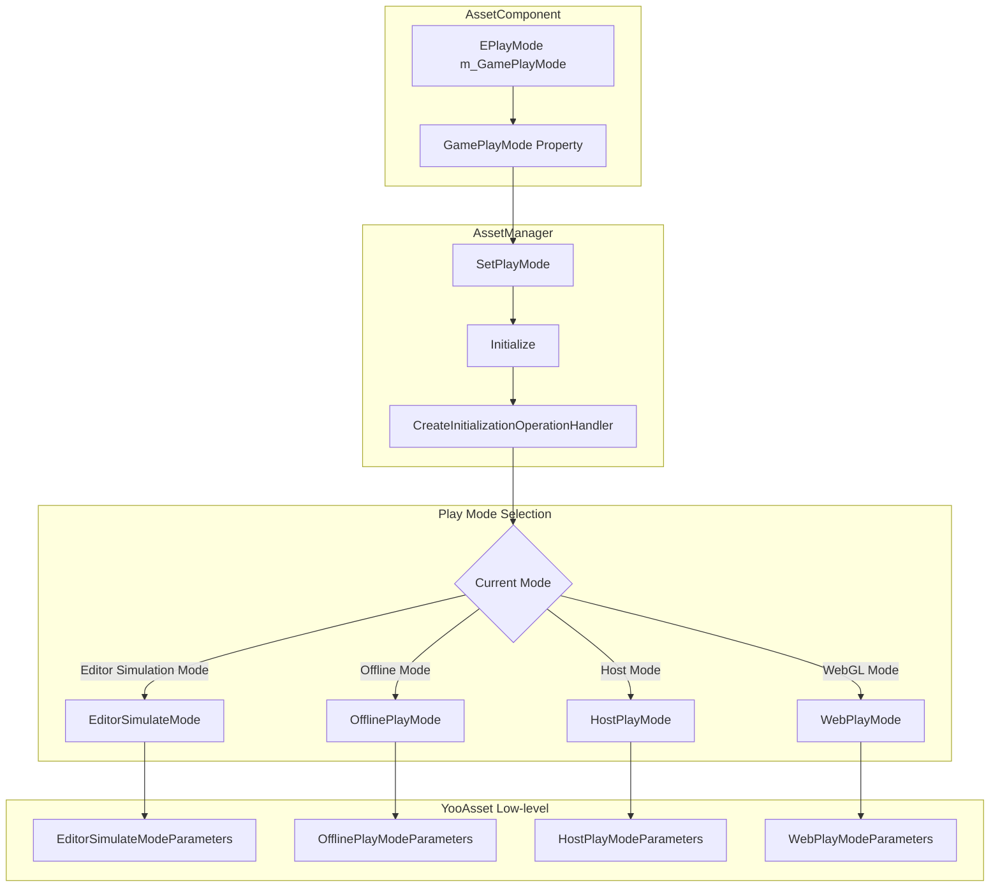
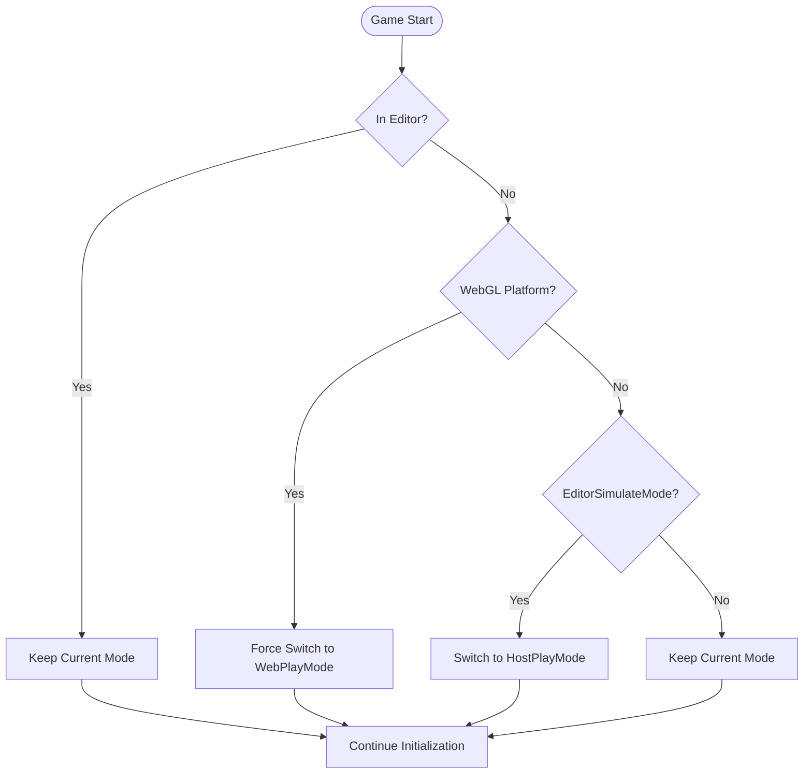

# Play Modes

Play modes define how the resource system initializes and loads resources at game startup. According to different development and deployment scenarios, GameFrameX provides four play modes to choose from.

## Overview

The resource system's play mode determines how resources are loaded and the source of data. Choosing the correct play mode is crucial for game development and release:

- **EditorSimulateMode**: Used only in Unity Editor for rapid development and debugging
- **OfflinePlayMode**: Standalone game mode, no network connection required
- **HostPlayMode**: Hot update mode, supports updating resources from remote servers
- **WebPlayMode**: WebGL and mini-game platform dedicated mode

> **Note**: When the target platform is WebGL, the system automatically forces the play mode to `EPlayMode.WebPlayMode` and cannot be changed manually.

## Architecture Design



### Component Responsibilities

| Component | Responsibility |
|------|------|
| AssetComponent | Stores play mode configuration, automatically detects platform at runtime and adjusts mode |
| AssetManager | Creates corresponding initialization parameters based on play mode and completes resource system initialization |
| YooAsset | Low-level resource system, executes corresponding initialization logic based on different parameter types |

## Detailed Play Mode Explanation

### 1. Editor Simulate Mode (EditorSimulateMode)

Editor simulate mode runs only in the Unity Editor environment and is not packaged into the final released game. This mode uses `EditorSimulateModeParameters` for initialization:

```csharp
// Source: Runtime/Asset/AssetManager.Initialization.cs#L55-L60
private InitializationOperation InitializeYooAssetEditorSimulateMode(ResourcePackage resourcePackage)
{
    var simulateBuildResult = EditorSimulateModeHelper.SimulateBuild(nameof(EDefaultBuildPipeline.BuiltinBuildPipeline), ConstDefaultPackageName);
    var createParameters = new EditorSimulateModeParameters();
    createParameters.EditorFileSystemParameters = FileSystemParameters.CreateDefaultEditorFileSystemParameters(simulateBuildResult);
    return resourcePackage.InitializeAsync(createParameters);
}
```

**Features:**
- No resource packaging operation required
- Loads directly from source resource files in the Editor
- Fastest loading speed, suitable for rapid iterative development
- Automatically switches to other modes when packaging for release

**Use Cases:**
- Feature development and debugging in the Editor
- Quick verification of resource loading logic

### 2. Offline Play Mode (OfflinePlayMode)

Offline play mode is used for completely offline game scenarios, with all resources packaged within the game installation package. This mode uses `OfflinePlayModeParameters` for initialization:

```csharp
// Source: Runtime/Asset/AssetManager.Initialization.cs#L69-L74
private InitializationOperation InitializeYooAssetOfflinePlayMode(ResourcePackage resourcePackage)
{
    var buildinFileSystem = FileSystemParameters.CreateDefaultBuildinFileSystemParameters();
    var initParameters = new OfflinePlayModeParameters();
    initParameters.BuildinFileSystemParameters = buildinFileSystem;
    return resourcePackage.InitializeAsync(initParameters);
}
```

**Features:**
- No network connection required
- Resources loaded from application's built-in read-only area (StreamingAssets)
- No runtime resource updates
- Suitable for standalone games or scenarios with unstable network environments

**Use Cases:**
- Standalone games
- Standalone games without hot updates
- Release platforms with limited network environments

### 3. Host Play Mode (HostPlayMode)

Host play mode (hot update mode) is the most commonly used mode for large games, supporting resource hot updates. This mode uses `HostPlayModeParameters` for initialization:

```csharp
// Source: Runtime/Asset/AssetManager.Initialization.cs#L155-L163
private InitializationOperation InitializeYooAssetHostPlayMode(ResourcePackage resourcePackage, string hostServerURL, string fallbackHostServerURL)
{
    var remoteServices = new RemoteServices(hostServerURL, fallbackHostServerURL);
    var createParameters = new HostPlayModeParameters
    {
        BuildinFileSystemParameters = FileSystemParameters.CreateDefaultBuildinFileSystemParameters(),
        CacheFileSystemParameters = FileSystemParameters.CreateDefaultCacheFileSystemParameters(remoteServices),
    };
    return resourcePackage.InitializeAsync(createParameters);
}
```

**Features:**
- Supports resource hot update functionality
- Prefers downloading latest resources from remote server
- Built-in resources serve as backup
- Supports breakpoint continuation and cache management

**Use Cases:**
- Online games requiring continuous content updates
- Large games requiring batch resource downloads
- Games wanting to fix bugs or add new content through hot updates

### 4. WebGL Play Mode (WebPlayMode)

WebGL play mode is specifically designed for WebGL platforms and mini-game platforms, supporting various mini-game platform file systems:

```csharp
// Source: Runtime/Asset/AssetManager.Initialization.cs#L85-L145
private InitializationOperation InitializeYooAssetWebPlayMode(ResourcePackage resourcePackage, string hostServerURL, string fallbackHostServerURL)
{
    var initParameters = new WebPlayModeParameters();
    FileSystemSystemParameters webFileSystem = null;
#if UNITY_WEBGL
#if ENABLE_DOUYIN_MINI_GAME
    // ByteDance Mini Game file system
    webFileSystem = ByteGameFileSystemCreater.CreateByteGameFileSystemParameters(hostServerURL);
#elif ENABLE_WECHAT_MINI_GAME
    // WeChat Mini Game file system
    webFileSystem = WechatFileSystemCreater.CreateWechatPathFileSystemParameters(hostServerURL);
#elif ENABLE_KUAISHOU_MINI_GAME
    // Kuaishou Mini Game file system
    webFileSystem = KuaiShouFileSystemCreater.CreateKuaiShouPathFileSystemParameters(hostServerURL);
#else
    // Default WebGL file system
    webFileSystem = FileSystemParameters.CreateDefaultWebFileSystemParameters();
#endif
#else
    webFileSystem = FileSystemParameters.CreateDefaultWebFileSystemParameters();
#endif
    initParameters.WebFileSystemParameters = webFileSystem;
    return resourcePackage.InitializeAsync(initParameters);
}
```

**Supported Platforms:**
- WebGL browser platform
- Douyin Mini Game (ByteDance Mini Game)
- WeChat Mini Game
- Kuaishou Mini Game

**Features:**
- Automatically detects target platform and selects appropriate file system
- Special optimization for mini-game platforms
- Supports preloading mechanisms unique to mini-game platforms

## Platform Auto-Switch Logic

The system automatically handles platform compatibility issues at runtime:

```csharp
// Source: Runtime/Asset/AssetComponent.cs#L42-L63
protected override void Awake()
{
#if !UNITY_EDITOR
    if (GamePlayMode == EPlayMode.EditorSimulateMode)
    {
        GamePlayMode = EPlayMode.HostPlayMode;
    }
#if UNITY_WEBGL
    GamePlayMode = EPlayMode.WebPlayMode;
#endif
#endif
    // ... Other initialization code
    _assetManager.SetPlayMode(GamePlayMode);
}
```



## Configuration

The play mode is configured through the AssetComponent component in the Unity scene:

```csharp
// Source: Runtime/Asset/AssetComponent.cs#L18-L31
[Tooltip("When target platform is Web, it will be forced to WebPlayMode")] [SerializeField]
private EPlayMode m_GamePlayMode;

/// <summary>
/// Play mode for resources
/// </summary>
public EPlayMode GamePlayMode
{
    get { return m_GamePlayMode; }
    set { m_GamePlayMode = value; }
}
```

### Configuration Properties

| Property | Type | Description |
|------|------|------|
| GamePlayMode | EPlayMode | Play mode for resources |

### EPlayMode Enum Values

| Enum Value | Description |
|--------|------|
| EditorSimulateMode | Editor simulation mode, available only in Editor |
| OfflinePlayMode | Offline play mode |
| HostPlayMode | Host play mode (hot update mode) |
| WebPlayMode | WebGL play mode |

## Usage Recommendations

### Development Phase

- Use **EditorSimulateMode** in Unity Editor for rapid iterative development
- Coordinate with resource packaging tools for complete packaging testing

### Testing Phase

- Use **OfflinePlayMode** for complete offline functionality testing
- Use **HostPlayMode** to test hot update process

### Release Phase

- Choose appropriate play mode based on target platform
- WebGL platform automatically uses WebPlayMode, no manual setting required
- Online games for mobile platforms recommend using HostPlayMode

## Related Links

- [Asset Component](./4-core-concepts.asset-component)
- [Asset Manager](./4-core-concepts.asset-manager)
- [Architecture](./4-core-concepts.architecture)
- [Component Configuration](./6-configuration.component-settings)
- [WebGL Platform Configuration](./7-platforms.webgl)
