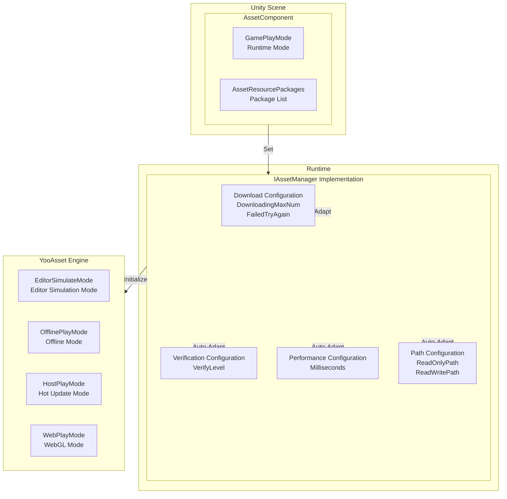
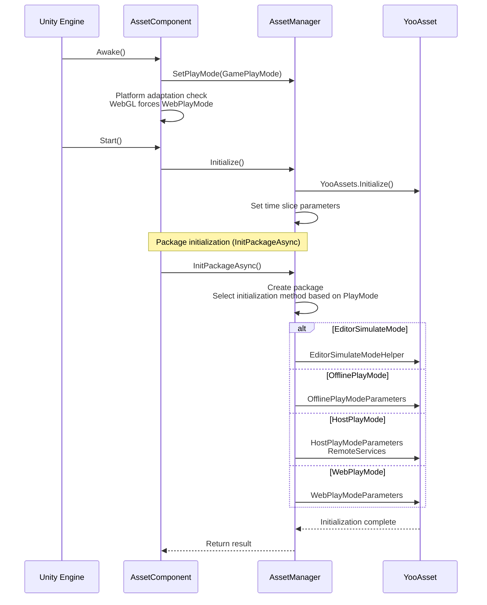

# Component Settings

AssetComponent is the core Unity component of the GameFrameX resource system, responsible for configuring and managing the runtime behavior of resources. Through this component, developers can flexibly configure resource loading modes, download parameters, package information, and other key settings.

## Overview

AssetComponent inherits from GameFrameworkComponent and is the core component in Unity scenes for initializing and managing the resource system. This component is configured through the Unity Inspector panel, supports multiple runtime modes, and can automatically adapt the best resource loading strategy for different platforms.



**Configuration Flow Description:**
1. Configure AssetComponent's runtime mode and package information in Unity Inspector
2. AssetComponent gets configuration and passes it to AssetManager during Awake phase
3. AssetManager initializes YooAsset engine based on configuration
4. System selects appropriate resource loading strategy based on runtime mode

## Core Configuration Properties

### Runtime Mode Configuration

AssetComponent provides the `GamePlayMode` property for setting the resource runtime mode:

```csharp
[Tooltip("Forces WebPlayMode when target platform is Web")] [SerializeField]
private EPlayMode m_GamePlayMode;
```
> Source: [Runtime/Asset/AssetComponent.cs](https://github.com/GameFrameX/com.gameframex.unity.asset/blob/main/Runtime/Asset/AssetComponent.cs#L20-L21)

**Runtime Mode Description:**

| Mode | Enum Value | Description | Use Case |
|------|------------|-------------|----------|
| Editor Simulation Mode | `EPlayMode.EditorSimulateMode` | Uses simulation mode in Unity Editor, test without packaging | Development and debugging phase |
| Offline Play Mode | `EPlayMode.OfflinePlayMode` | Uses local built-in resource files, no network download | Pure offline games |
| Host Play Mode | `EPlayMode.HostPlayMode` | Supports hot updates, downloads resources from remote servers | Games requiring hot updates |
| WebGL Mode | `EPlayMode.WebPlayMode` | Special optimization mode for WebGL platform | WebGL platform |

**Platform Auto-Adaptation Mechanism:**

```csharp
protected override void Awake()
{
#if !UNITY_EDITOR
    if (GamePlayMode == EPlayMode.EditorSimulateMode)
    {
        GamePlayMode = EPlayMode.HostPlayMode;
    }
#if UNITY_WEBGL
    GamePlayMode = EPlayMode.WebPlayMode;
#endif
#endif
    // ... subsequent initialization logic
}
```
> Source: [Runtime/Asset/AssetComponent.cs](https://github.com/GameFrameX/com.gameframex.unity.asset/blob/main/Runtime/Asset/AssetComponent.cs#L42-L64)

**Auto-Adaptation Rules:**
- In non-editor environments, `EditorSimulateMode` is automatically converted to `HostPlayMode`
- In WebGL platform environments, regardless of configuration, it is forced to `WebPlayMode`

### Package Configuration

In the editor environment, multiple package configurations can be set through `AssetResourcePackages`:

```csharp
#if UNITY_EDITOR
[SerializeField] private List<AssetResourcePackageInfo> m_assetResourcePackages = new List<AssetResourcePackageInfo>();
#endif
```
> Source: [Runtime/Asset/AssetComponent.cs](https://github.com/GameFrameX/com.gameframex.unity.asset/blob/main/Runtime/Asset/AssetComponent.cs#L33-L34)

**Package Information Structure:**

```csharp
[Serializable]
public sealed class AssetResourcePackageInfo
{
    [SerializeField] public string PackageName;
    [SerializeField] public string DownloadURL;
    [SerializeField] public string FallbackDownloadURL;
}
```
> Source: [Runtime/Asset/AssetComponent.cs](https://github.com/GameFrameX/com.gameframex.unity.asset/blob/main/Runtime/Asset/AssetComponent.cs#L661-L667)

| Configuration Item | Type | Description |
|-------------------|------|-------------|
| PackageName | string | Package name |
| DownloadURL | string | Primary download URL |
| FallbackDownloadURL | string | Backup download URL |

## Runtime Configuration Interface

The IAssetManager interface provides rich runtime configuration properties that can be dynamically adjusted in code:

```csharp
public interface IAssetManager
{
    /// <summary>
    /// Maximum number of concurrent downloads.
    /// </summary>
    int DownloadingMaxNum { get; set; }

    /// <summary>
    /// Maximum number of retry attempts on failure.
    /// </summary>
    int FailedTryAgain { get; set; }

    /// <summary>
    /// Get or set the package name.
    /// </summary>
    string DefaultPackageName { get; set; }

    /// <summary>
    /// Get or set the download file verification level.
    /// </summary>
    EFileVerifyLevel VerifyLevel { get; }

    /// <summary>
    /// Get or set async system parameters, the maximum time slice consumed per frame (unit: milliseconds).
    /// </summary>
    long Milliseconds { get; set; }

    /// <summary>
    /// Get the read-only path for resources.
    /// </summary>
    string ReadOnlyPath { get; }

    /// <summary>
    /// Get the read-write path for resources.
    /// </summary>
    string ReadWritePath { get; }
}
```
> Source: [Runtime/Asset/IAssetManager.cs](https://github.com/GameFrameX/com.gameframex.unity.asset/blob/main/Runtime/Asset/IAssetManager.cs#L13-L76)

### Download Configuration

| Configuration Item | Type | Default | Description |
|-------------------|------|---------|-------------|
| DownloadingMaxNum | int | - | Maximum number of concurrent downloads, recommended based on network conditions |
| FailedTryAgain | int | - | Number of retries after download failure, recommended to set to 3-5 |

### Verification Configuration

| Configuration Item | Type | Description |
|-------------------|------|-------------|
| VerifyLevel | EFileVerifyLevel | File verification level, used to ensure downloaded file integrity |

**Verification Level Description:**
- `None` - No verification
- `Low` - Low-level verification, only checks if file exists
- `Medium` - Medium-level verification, checks file size and partial hash
- `High` - High-level verification, checks complete file hash

### Performance Configuration

| Configuration Item | Type | Default | Description |
|-------------------|------|---------|-------------|
| Milliseconds | long | 30 | Maximum time slice per frame for async system (milliseconds), used to control resource loading time per frame to avoid stuttering |

### Path Configuration

| Configuration Item | Type | Description |
|-------------------|------|-------------|
| ReadOnlyPath | string | Read-only path for resources, usually points to StreamingAssets |
| ReadWritePath | string | Read-write path for resources, used to store downloaded resources and cache |

## Configuration Initialization Flow



**Initialization Code Example:**

```csharp
public void Initialize()
{
    BetterStreamingAssets.Initialize();
    Log.Info($"Resource system runtime mode: {PlayMode}");
    YooAssets.Initialize();
    YooAssets.SetOperationSystemMaxTimeSlice(30);
    Log.Info("Asset Init Over");
}
```
> Source: [Runtime/Asset/AssetManager.cs](https://github.com/GameFrameX/com.gameframex.unity.asset/blob/main/Runtime/Asset/AssetManager.cs#L46-L56)

## Editor Configuration Interface

AssetComponent provides a custom Unity Inspector editor interface:

```csharp
[CustomEditor(typeof(AssetComponent))]
internal sealed class AssetComponentInspector : ComponentTypeComponentInspector
{
    public override void OnInspectorGUI()
    {
        // Runtime mode configuration (cannot be modified during play)
        EditorGUI.BeginDisabledGroup(EditorApplication.isPlayingOrWillChangePlaymode);
        {
            EditorGUILayout.PropertyField(m_GamePlayMode, m_GamePlayModeGUIContent);
            GUI.enabled = false;
            EditorGUILayout.PropertyField(m_AssetResourcePackages, m_AssetResourcePackagesGUIContent);
            GUI.enabled = true;
        }
        EditorGUI.EndDisabledGroup();
    }
}
```
> Source: [Editor/Inspector/AssetComponentInspector.cs](https://github.com/GameFrameX/com.gameframex.unity.asset/blob/main/Editor/Inspector/AssetComponentInspector.cs#L39-L79)

**Configuration Interface Features:**
- Runtime mode configuration: Dropdown selector, can be intuitively selected in editor
- Package list configuration: Shows configured package information (disabled during play)
- Play protection: Configuration items cannot be modified after entering play mode

## Configuration Example Code

### Basic Configuration

```csharp
// Get AssetComponent
var assetComponent = GameEntry.GetComponent<AssetComponent>();

// Get current runtime mode
var playMode = assetComponent.GamePlayMode;
Debug.Log($"Current runtime mode: {playMode}");
```
> Source: [Runtime/Asset/AssetComponent.cs](https://github.com/GameFrameX/com.gameframex.unity.asset/blob/main/Runtime/Asset/AssetComponent.cs#L27-L31)

### Runtime Configuration Adjustment

```csharp
// Get the resource manager
var assetManager = GameFrameworkEntry.GetModule<IAssetManager>();

// Configure download parameters
assetManager.DownloadingMaxNum = 10;  // Maximum 10 resources downloaded simultaneously
assetManager.FailedTryAgain = 3;       // Retry 3 times on failure

// Configure performance parameters
assetManager.Milliseconds = 30;        // Maximum 30ms per frame

// Configure verification level
assetManager.VerifyLevel = EFileVerifyLevel.Medium;

// Configure paths
assetManager.SetReadOnlyPath(Application.streamingAssetsPath);
assetManager.SetReadWritePath(Application.persistentDataPath);
```
> Source: [Runtime/Asset/AssetManager.cs](https://github.com/GameFrameX/com.gameframex.unity.asset/blob/main/Runtime/Asset/AssetManager.cs#L24-L39)

### Package Initialization

```csharp
// Initialize the default package
var success = await assetComponent.InitPackageAsync(
    "DefaultPackage",                      // Package name
    "https://cdn.example.com/assets/",      // Primary download URL
    "https://backup.example.com/assets/",  // Backup download URL
    true                                    // Whether to set as default package
);

if (success)
{
    Debug.Log("Package initialized successfully");
}
else
{
    Debug.LogError("Package initialization failed");
}
```
> Source: [Runtime/Asset/AssetComponent.cs](https://github.com/GameFrameX/com.gameframex.unity.asset/blob/main/Runtime/Asset/AssetComponent.cs#L80-L95)

## Platform-Specific Configuration

### WebGL Platform

On the WebGL platform, the system automatically handles adaptation for different mini-game platforms:

```csharp
// ByteDance Mini Game
#if ENABLE_DOUYIN_MINI_GAME
GameEntry.GetComponent<AssetComponent>().gameObject.GetOrAddComponent<DouYinConfigHandler>();
#endif

// WeChat Mini Game
#if ENABLE_WECHAT_MINI_GAME
GameEntry.GetComponent<AssetComponent>().gameObject.GetOrAddComponent<WeChatConfigHandler>();
#endif

// Kuaishou Mini Game
#if ENABLE_KUAISHOU_MINI_GAME
GameEntry.GetComponent<AssetComponent>().gameObject.GetOrAddComponent<KuaiShouConfigHandler>();
#endif
```
> Source: [Runtime/Asset/AssetManager.Initialization.cs](https://github.com/GameFrameX/com.gameframex.unity.asset/blob/main/Runtime/Asset/AssetManager.Initialization.cs#L90-L126)

**Mini-Game Platform Special Handling:**
- **ByteDance Mini Game**: Uses ByteDance-specific file system, automatically controls concurrency
- **WeChat Mini Game**: Uses WeChat file system, caches to user data directory
- **Kuaishou Mini Game**: Uses Kuaishou file system

## Configuration Best Practices

### Development Phase

```csharp
// Recommended configuration for development phase
assetManager.DownloadingMaxNum = 5;
assetManager.FailedTryAgain = 3;
assetManager.VerifyLevel = EFileVerifyLevel.Low;
assetManager.Milliseconds = 20;
```

### Production Phase

```csharp
// Recommended configuration for production phase
assetManager.DownloadingMaxNum = 10;
assetManager.FailedTryAgain = 5;
assetManager.VerifyLevel = EFileVerifyLevel.High;
assetManager.Milliseconds = 30;
```

### Network Environment Adaptation

```csharp
// Weak network environment
if (Application.internetReachability == NetworkReachability.NotReachable)
{
    assetManager.GamePlayMode = EPlayMode.OfflinePlayMode;
}

// Mobile network
else if (Application.internetReachability == NetworkReachability.ReachableViaCarrierDataNetwork)
{
    assetManager.DownloadingMaxNum = 3;
}

// WiFi environment
else if (Application.internetReachability == NetworkReachability.ReachableViaLocalAreaNetwork)
{
    assetManager.DownloadingMaxNum = 10;
}
```

## Common Configuration Issues

### Issue 1: Editor Mode Cannot Run Normally

**Cause**: Used `EditorSimulateMode` in non-editor environment

**Solution**: Ensure the runtime mode is changed to `HostPlayMode` or `OfflinePlayMode` when packaging for release

### Issue 2: WebGL Platform Resource Loading Fails

**Cause**: WebGL platform is forced to `WebPlayMode`, requires correct download server configuration

**Solution**: Ensure correct `DownloadURL` and `FallbackDownloadURL` are provided in `InitPackageAsync`

### Issue 3: Slow Resource Download Speed

**Cause**: `DownloadingMaxNum` configuration is too low

**Solution**: Appropriately increase `DownloadingMaxNum` in WiFi environment

## Related Links

- [Runtime Modes](./6-configuration.play-modes) - Learn more about the differences between runtime modes
- [Resource Loading API](./5-api-reference.loading-api) - Resource loading API documentation
- [Package Management](./5-api-reference.package-management) - Package management documentation
- [AssetComponent API](./4-core-concepts.asset-component) - Component core concepts