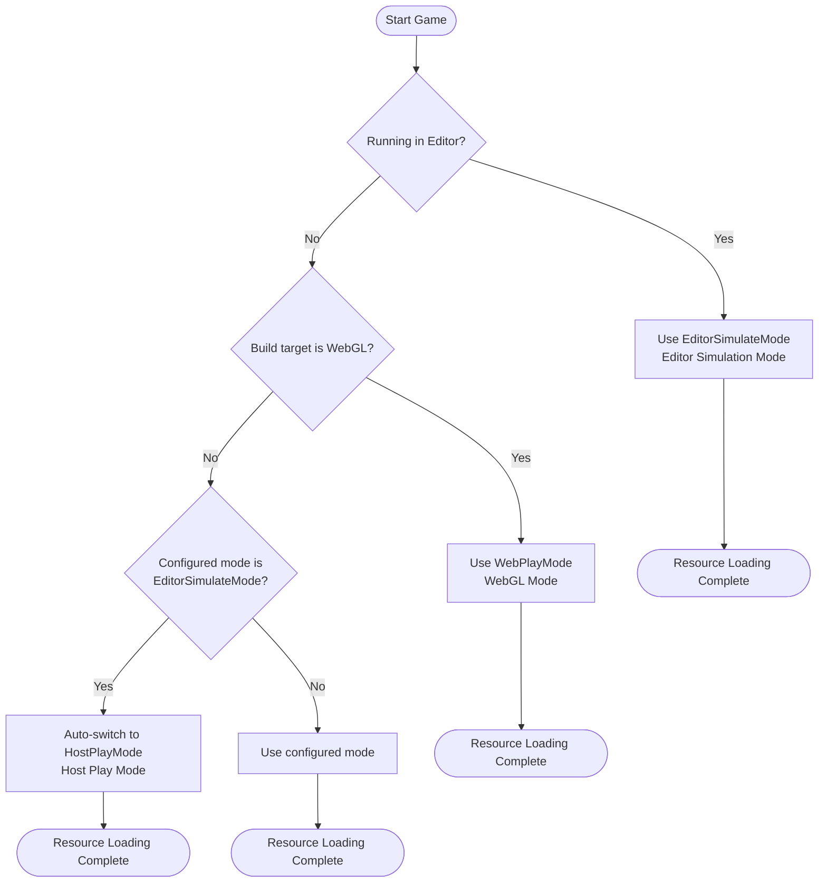
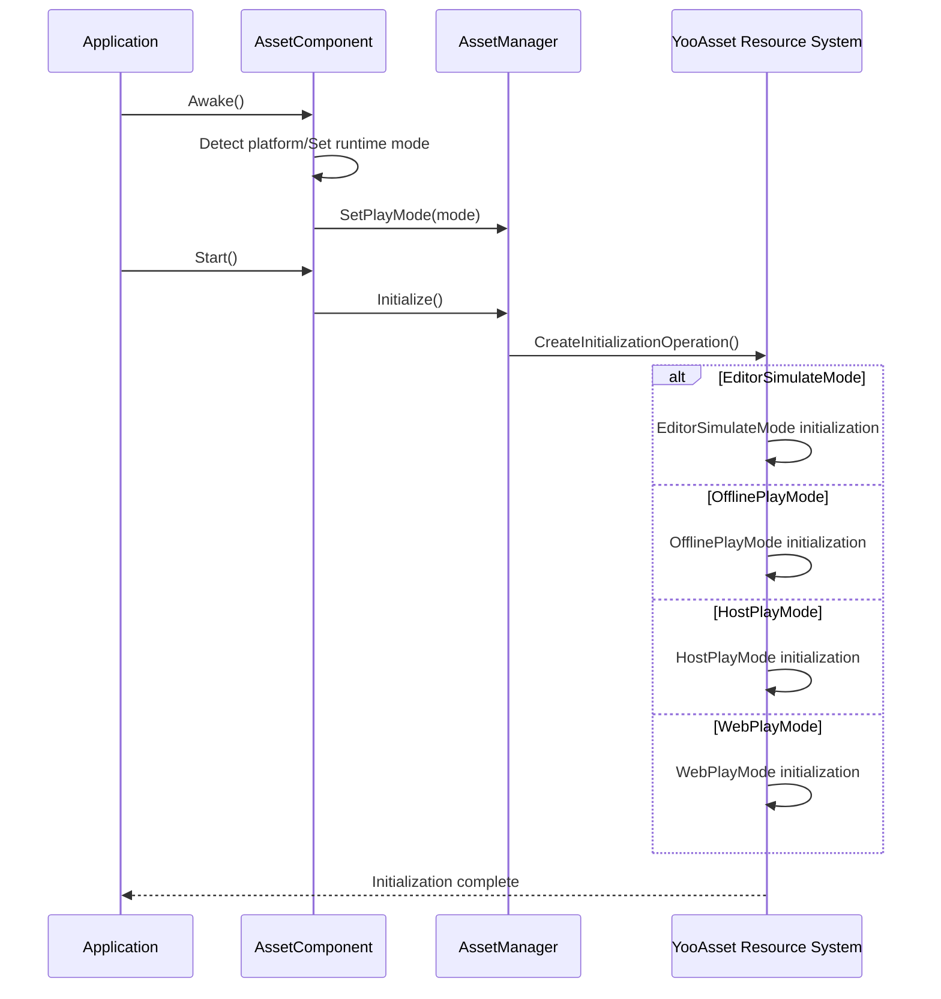

# Platform Support Overview

The GameFrameX Asset component supports multiple Unity platforms and provides flexible runtime modes to adapt to different deployment scenarios. This document provides an overview of supported platforms, runtime modes, and automatic platform detection mechanisms.

## Overview

The GameFrameX Asset component is built on the [YooAsset](https://www.yooasset.com/) resource system and provides a unified resource loading interface while supporting multiple Unity platforms and runtime modes. The system design considers platform differences and adapts to various deployment scenarios through runtime modes (Play Mode), including editor development, standalone games, hot-update games, and WebGL platforms.

Runtime mode is the core concept for understanding platform support. Different runtime modes determine the resource loading method and update strategy. Developers need to select the appropriate runtime mode based on the target platform. The system also provides automatic platform detection that will automatically select the most suitable runtime mode in certain situations based on the build target platform.

## Supported Platforms

The GameFrameX Asset component supports the following platform categories:

| Platform Category | Specific Platform | Recommended Runtime Mode | Description |
|-------------------|-------------------|--------------------------|-------------|
| Editor | Unity Editor | EditorSimulateMode | Used for rapid iteration during development |
| PC Platforms | Windows, macOS, Linux | HostPlayMode / OfflinePlayMode | Supports hot update or standalone deployment |
| Mobile Platforms | iOS, Android | HostPlayMode / OfflinePlayMode | Supports hot update or standalone deployment |
| Web Platform | WebGL | WebPlayMode | Web platform with specialized optimization |
| Mini-Game Platforms | ByteDance, Kuaishou, WeChat Mini Games | WebPlayMode | Mini-game platforms based on WebGL |

### Runtime Mode Details

The system provides four runtime modes, each suitable for different scenarios:

```csharp
// Runtime mode definition (from YooAsset)
public enum EPlayMode
{
    EditorSimulateMode,  // Editor simulation mode
    OfflinePlayMode,    // Offline play mode
    HostPlayMode,       // Host play mode (hot update)
    WebPlayMode         // WebGL mode
}
```

> Source: [AssetManager.Initialization.cs](https://github.com/GameFrameX/com.gameframex.unity.asset/blob/main/Runtime/Asset/AssetManager.Initialization.cs#L20-L46)

## Platform Selection Flow

The system automatically selects the appropriate runtime mode in different environments. The following is the runtime mode selection logic:



### Automatic Platform Detection Implementation

In `AssetComponent`, the system automatically detects the platform and adjusts the runtime mode at runtime. The following is the core implementation logic:

```csharp
protected override void Awake()
{
#if !UNITY_EDITOR
    // In non-editor environment, if EditorSimulateMode is configured, auto-switch to host mode
    if (GamePlayMode == EPlayMode.EditorSimulateMode)
    {
        GamePlayMode = EPlayMode.HostPlayMode;
    }

    // WebGL platform forces WebPlayMode
#if UNITY_WEBGL
    GamePlayMode = EPlayMode.WebPlayMode;
#endif
#endif
    // ... subsequent initialization logic
}
```

> Source: [AssetComponent.cs](https://github.com/GameFrameX/com.gameframex.unity.asset/blob/main/Runtime/Asset/AssetComponent.cs#L42-L64)

This design ensures:
- Simulation mode can be used for rapid iteration during development
- Automatically switches to the appropriate runtime mode after packaging for release
- WebGL platform always uses specially optimized WebPlayMode

## Runtime Mode and Initialization

Different runtime modes correspond to different resource initialization methods. The system calls the corresponding initialization method in `AssetManager` based on the selected runtime mode:



### Initialization Methods for Each Mode

The system provides dedicated initialization methods for each runtime mode in `AssetManager.Initialization.cs`:

```csharp
private InitializationOperation CreateInitializationOperationHandler(
    ResourcePackage resourcePackage,
    string hostServerURL,
    string fallbackHostServerURL)
{
    switch (PlayMode)
    {
        case EPlayMode.EditorSimulateMode:
            return InitializeYooAssetEditorSimulateMode(resourcePackage);
        case EPlayMode.OfflinePlayMode:
            return InitializeYooAssetOfflinePlayMode(resourcePackage);
        case EPlayMode.HostPlayMode:
            return InitializeYooAssetHostPlayMode(resourcePackage, hostServerURL, fallbackHostServerURL);
        case EPlayMode.WebPlayMode:
            return InitializeYooAssetWebPlayMode(resourcePackage, hostServerURL, fallbackHostServerURL);
    }
}
```

> Source: [AssetManager.Initialization.cs](https://github.com/GameFrameX/com.gameframex.unity.asset/blob/main/Runtime/Asset/AssetManager.Initialization.cs#L18-L47)

## WebGL and Mini-Game Platforms

WebGL platform is a key support target for this component. In addition to the standard WebPlayMode, it also supports multiple mini-game platforms:

```csharp
private InitializationOperation InitializeYooAssetWebPlayMode(
    ResourcePackage resourcePackage,
    string hostServerURL,
    string fallbackHostServerURL)
{
    var initParameters = new WebPlayModeParameters();
    FileSystemParameters webFileSystem = null;

#if UNITY_WEBGL
#if ENABLE_DOUYIN_MINI_GAME
    // ByteDance Mini Game special handling
    TTSDK.TT.PreloadConcurrent(10);
    // ... create ByteGame file system
#elif ENABLE_WECHAT_MINI_GAME
    // WeChat Mini Game special handling
    WeChatWASM.WXBase.PreloadConcurrent(10);
    // ... create Wechat file system
#elif ENABLE_KUAISHOU_MINI_GAME
    // Kuaishou Mini Game special handling
    KSWASM.KSBase.PreloadConcurrent(10);
    // ... create KuaiShou file system
#else
    // Default WebGL file system
    webFileSystem = FileSystemParameters.CreateDefaultWebFileSystemParameters();
#endif
#else
    webFileSystem = FileSystemParameters.CreateDefaultWebFileSystemParameters();
#endif

    initParameters.WebFileSystemParameters = webFileSystem;
    return resourcePackage.InitializeAsync(initParameters);
}
```

> Source: [AssetManager.Initialization.cs](https://github.com/GameFrameX/com.gameframex.unity.asset/blob/main/Runtime/Asset/AssetManager.Initialization.cs#L85-L146)

### Supported Mini-Game Platforms

| Platform | Preprocessor Symbol | Feature |
|----------|---------------------|---------|
| ByteDance Mini Game | `ENABLE_DOUYIN_MINI_GAME` | Uses ByteGameFileSystem |
| WeChat Mini Game | `ENABLE_WECHAT_MINI_GAME` | Uses WechatFileSystem |
| Kuaishou Mini Game | `ENABLE_KUAISHOU_MINI_GAME` | Uses KuaiShouFileSystem |

## Configuring Runtime Mode

In the Unity Editor, the runtime mode can be configured through the `AssetComponent` component:

```csharp
[Tooltip("Forces WebPlayMode when target platform is Web")]
[SerializeField]
private EPlayMode m_GamePlayMode;
```

> Source: [AssetComponent.cs](https://github.com/GameFrameX/com.gameframex.unity.asset/blob/main/Runtime/Asset/AssetComponent.cs#L20-L21)

Configuration steps:
1. Create or select a GameObject with `AssetComponent` in the scene
2. Find the "Game Play Mode" property in the Inspector panel
3. Select the appropriate runtime mode
4. When building the project, the system will automatically adjust the mode based on the target platform

## Runtime Mode Selection Guide

Based on different project requirements, select the appropriate runtime mode:

| Scenario | Recommended Mode | Reason |
|----------|------------------|--------|
| Editor development and debugging | EditorSimulateMode | Fast loading, no packaging needed |
| Standalone games | OfflinePlayMode | Built-in resources, no network required |
| Games requiring hot updates | HostPlayMode | Supports resource updates |
| WebGL web games | WebPlayMode | Optimized for web platform |
| WeChat/ByteDance Mini Games | WebPlayMode + Platform Symbol | Native platform support |

## Related Links

- [WebGL Platform Configuration](./7-platforms.webgl) - Detailed WebGL platform configuration guide
- [Runtime Modes](./6-configuration.play-modes) - Detailed configuration options for runtime modes
- [Resource Loading API](./5-api-reference.loading-api) - Resource loading API reference
- [Component Settings](./6-configuration.component-settings) - AssetComponent configuration guide