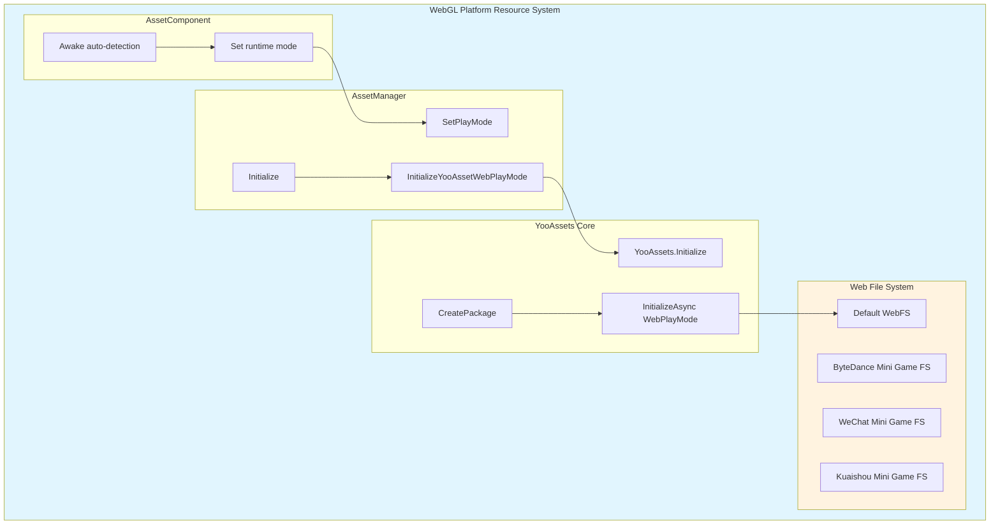
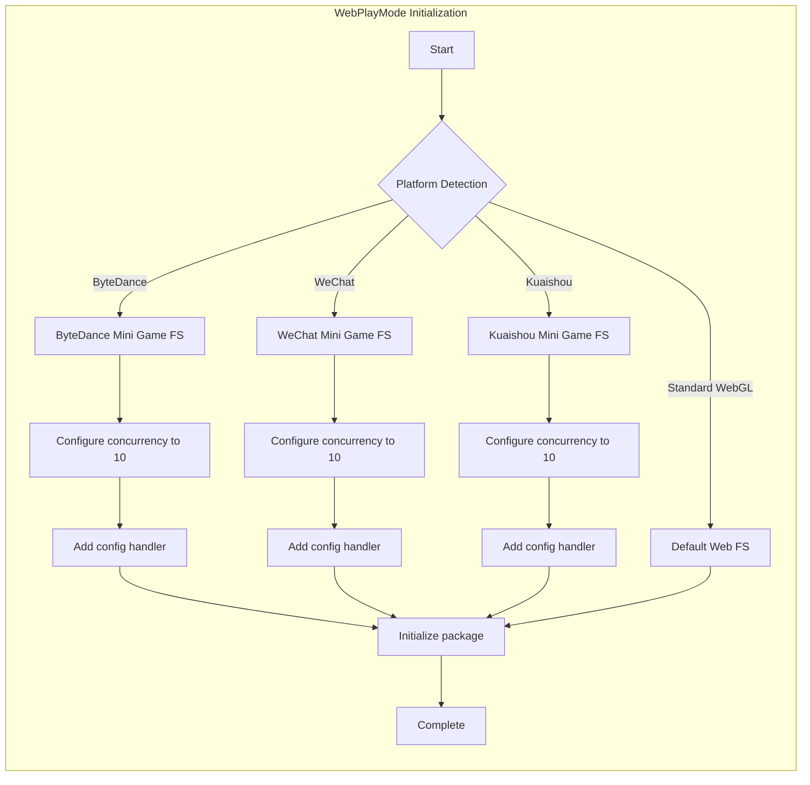

# WebGL Platform

This document describes the GameFrameX Asset component's support and configuration for the WebGL platform.

## Overview

WebGL platform is an important target platform for Unity deployment to web browsers. The GameFrameX Asset component, based on the YooAssets framework, provides a complete WebGL resource loading solution. This solution supports standard WebGL builds as well as multiple mini-game platforms (ByteDance Mini Game, WeChat Mini Game, Kuaishou Mini Game).

Key characteristics of the WebGL platform include:
- **Browser environment limitations**: Cannot use traditional file system, requires special resource loading mechanism
- **Single-threaded execution**: Resource loading in JavaScript environment requires async processing
- **Caching mechanism**: Relies on browser cache to store downloaded resources
- **Mini-game platform support**: Specially adapted for mainstream domestic mini-game platforms

## Architecture Design



### Core Component Description

| Component | Responsibility |
|-----------|----------------|
| AssetComponent | Automatically detects WebGL environment and sets runtime mode during Awake |
| AssetManager | Manages resource initialization and loading, calls YooAssets |
| YooAssets | Underlying resource system, provides WebPlayMode initialization |
| Web File System | Handles resource loading and caching in Web environment |

## Automatic Platform Detection

GameFrameX implements intelligent automatic platform detection. When building in non-editor environment, AssetComponent automatically identifies the target platform and selects the appropriate runtime mode.

```csharp
using GameFrameX.Asset.Runtime;
using UnityEngine;

[DisallowMultipleComponent]
[AddComponentMenu("GameFrameX/Asset")]
public sealed class AssetComponent : GameFrameworkComponent
{
    [Tooltip("Forces WebPlayMode when target platform is Web")]
    [SerializeField]
    private EPlayMode m_GamePlayMode;

    protected override void Awake()
    {
#if !UNITY_EDITOR
        if (GamePlayMode == EPlayMode.EditorSimulateMode)
        {
            GamePlayMode = EPlayMode.HostPlayMode;
        }
#if UNITY_WEBGL
        GamePlayMode = EPlayMode.WebPlayMode;
#endif
#endif
        base.Awake();
        _assetManager.SetPlayMode(GamePlayMode);
    }
}
```

> Source: [AssetComponent.cs](https://github.com/GameFrameX/com.gameframex.unity.asset/blob/main/Runtime/Asset/AssetComponent.cs#L42-L64)

### Detection Logic Description

| Condition | Behavior |
|-----------|----------|
| Editor environment | Uses configured GamePlayMode |
| Non-editor + EditorSimulateMode | Convert to HostPlayMode |
| Non-editor + UNITY_WEBGL | Auto-switch to WebPlayMode |
| Other cases | Keep configured runtime mode |

## WebPlayMode Initialization Flow

When set to WebPlayMode, AssetManager calls the `InitializeYooAssetWebPlayMode` method for initialization. This method supports multiple Web environment configurations.

```csharp
/// <summary>
/// Initialize YooAsset WebGL runtime mode
/// </summary>
private InitializationOperation InitializeYooAssetWebPlayMode(
    ResourcePackage resourcePackage,
    string hostServerURL,
    string fallbackHostServerURL)
{
    var initParameters = new WebPlayModeParameters();
    FileSystemParameters webFileSystem = null;

#if UNITY_WEBGL
#if ENABLE_DOUYIN_MINI_GAME
    // ByteDance Mini Game configuration
    TTSDK.TT.PreloadConcurrent(10);
    GameEntry.GetComponent<AssetComponent>().gameObject
        .GetOrAddComponent<DouYinConfigHandler>();

    if (hostServerURL.IsNullOrWhiteSpace())
    {
        webFileSystem = ByteGameFileSystemCreater.CreateByteGameFileSystemParameters();
    }
    else
    {
        webFileSystem = ByteGameFileSystemCreater.CreateByteGameFileSystemParameters(hostServerURL);
    }
#elif ENABLE_WECHAT_MINI_GAME
    // WeChat Mini Game configuration
    WeChatWASM.WXBase.PreloadConcurrent(10);
    GameEntry.GetComponent<AssetComponent>().gameObject
        .GetOrAddComponent<WeChatConfigHandler>();

    string packageRoot = $"{WeChatWASM.WXBase.env.USER_DATA_PATH}/__GAME_FILE_CACHE/{YooAssetSettingsData.Setting.DefaultYooFolderName}";

    if (hostServerURL.IsNullOrWhiteSpace())
    {
        webFileSystem = WechatFileSystemCreater.CreateWechatFileSystemParameters();
    }
    else
    {
        webFileSystem = WechatFileSystemCreater.CreateWechatPathFileSystemParameters(hostServerURL);
    }
#elif ENABLE_KUAISHOU_MINI_GAME
    // Kuaishou Mini Game configuration
#if !UNITY_EDITOR
    KSWASM.KSBase.PreloadConcurrent(10);
#endif
    GameEntry.GetComponent<AssetComponent>().gameObject
        .GetOrAddComponent<KuaiShouConfigHandler>();

    if (hostServerURL.IsNullOrWhiteSpace())
    {
        webFileSystem = KuaiShouFileSystemCreater.CreateKuaiShouFileSystemParameters();
    }
    else
    {
        webFileSystem = KuaiShouFileSystemCreater.CreateKuaiShouPathFileSystemParameters(hostServerURL);
    }
#else
    // Standard WebGL file system
    webFileSystem = FileSystemParameters.CreateDefaultWebFileSystemParameters();
#endif
#else
    // Non-WebGL environment fallback
    webFileSystem = FileSystemParameters.CreateDefaultWebFileSystemParameters();
#endif

    initParameters.WebFileSystemParameters = webFileSystem;
    return resourcePackage.InitializeAsync(initParameters);
}
```

> Source: [AssetManager.Initialization.cs](https://github.com/GameFrameX/com.gameframex.unity.asset/blob/main/Runtime/Asset/AssetManager.Initialization.cs#L85-L146)

## Mini-Program Platform Support

The GameFrameX Asset component provides dedicated adaptation support for mainstream domestic mini-program platforms.

### Supported Platforms

| Platform | Preprocessor Symbol | Feature |
|----------|---------------------|---------|
| ByteDance Mini Program | ENABLE_DOUYIN_MINI_GAME | ByteDance mini-game file system |
| WeChat Mini Program | ENABLE_WECHAT_MINI_GAME | WeChat cache directory configuration |
| Kuaishou Mini Program | ENABLE_KUAISHOU_MINI_GAME | Kuaishou file system adaptation |

### Platform Initialization Differences



### Configuration Handler Description

Each mini-program platform requires adding the corresponding configuration handler:
- **DouYinConfigHandler**: Handles ByteDance Mini Game configuration
- **WeChatConfigHandler**: Handles WeChat Mini Game configuration
- **KuaiShouConfigHandler**: Handles Kuaishou Mini Game configuration

These handlers are responsible for platform-specific file system configuration and resource path mapping.

## Package Initialization

When using packages on WebGL platform, correctly configure initialization parameters:

```csharp
using UnityEngine;
using GameFrameX.Runtime;

public class WebGLBootstrap : MonoBehaviour
{
    private async void Start()
    {
        var assetComponent = GameEntry.GetComponent<AssetComponent>();

        // Initialize the default package
        bool success = await assetComponent.InitPackageAsync(
            "DefaultPackage",           // Package name
            "https://cdn.example.com/", // Primary server address
            "https://backup.example.com/", // Backup server address
            true                        // Set as default package
        );

        if (success)
        {
            Debug.Log("WebGL package initialized successfully");
        }
    }
}
```

## Runtime Mode Configuration

The GameFrameX Asset component supports multiple runtime modes, with WebGL platform primarily using WebPlayMode:

| Mode | Applicable Scenario | WebGL Support |
|------|--------------------|---------------|
| EditorSimulateMode | Editor development and debugging | Not supported |
| OfflinePlayMode | Offline play | Limited support |
| HostPlayMode | Hot update mode | Conditionally supported |
| WebPlayMode | WebGL runtime environment | Fully supported |

> For detailed runtime mode configuration, see [Runtime Modes](./6-configuration.play-modes) document.

## Common Issues

### Q1: Resource loading fails after WebGL build

**Possible causes:**
- Server address configuration error
- CORS cross-origin policy issue
- Package not correctly built

**Solutions:**
1. Check if the resource server supports CORS
2. Confirm the package was built for WebGL platform
3. Verify hostServerURL configuration is correct

### Q2: Slow resource loading on mini-program platforms

**Possible causes:**
- Too high concurrent download count
- Resources not processed in sub-packages

**Solutions:**
1. Adjust PreloadConcurrent parameter in code
2. Use resource tags for on-demand loading
3. Enable resource compression and merging

### Q3: High memory usage

**Possible causes:**
- Loading too many resources simultaneously
- Not releasing resource handles in time

**Solutions:**
1. Use `UnloadAsset` to release resources that have been used
2. Reasonably set `DownloadingMaxNum` to control concurrency
3. Regularly call `UnloadUnusedAssetsAsync` to clean up unused resources

## Related Links

- [Runtime Mode Configuration](./6-configuration.play-modes) - Detailed runtime mode description
- [Component Settings](./6-configuration.component-settings) - AssetComponent configuration details
- [Resource Loading API](./5-api-reference.loading-api) - Async/sync loading API
- [Package Management](./5-api-reference.package-management) - Package operations
- [Asset Component Introduction](./1-overview.introduction) - Asset component overview
- [Features](./1-overview.features) - Complete feature list