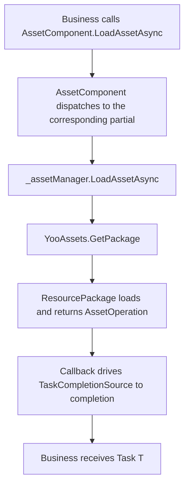

# How It Works: Collaboration Flow Between the Asset Component and YooAsset

`AssetComponent` is the resource facade exposed by the framework on the Unity side, and `AssetManager` is its runtime implementation. Both use YooAsset as the underlying loading engine. This page explains how the three connect, initialize, distribute tasks, and ultimately deliver assets to business code.

## Role Layering

| Layer | Type | Responsibility |
|----|------|----------------|
| Component layer | `AssetComponent : GameFrameworkComponent` | Attaches scenes, serializes the runtime mode, and forwards external calls to the manager layer |
| Manager layer | `AssetManager : GameFrameworkModule, IAssetManager` | Provides business-facing APIs such as `LoadAsset` / `UnloadAsset` / `InitPackageAsync`, and holds `PlayMode` |
| Engine layer | YooAsset (`YooAssets`, `ResourcePackage`) | Actually performs package initialization, file addressing, loading/unloading, and caching |

`AssetComponent` uses reflection in `Awake` based on `ImplementationComponentType = Utility.Assembly.GetType(componentType)` to get the implementation class, and obtains the manager singleton via `GameFrameworkEntry.GetModule<IAssetManager>()`. All subsequent calls go through `_assetManager`.

## Startup and Initialization Flow

1. `AssetComponent.Awake()` reads `m_GamePlayMode`. When not in the editor or on WebGL, it forcibly corrects the mode, then calls `_assetManager.SetPlayMode(GamePlayMode)`.
2. `AssetComponent.Start()` triggers `_assetManager.Initialize()`.
3. `AssetManager.Initialize()` calls `YooAssets.Initialize()` and sets `SetOperationSystemMaxTimeSlice` as needed.
4. Business code calls `AssetComponent.InitPackageAsync(packageName, host, fallback, isDefaultPackage)`, which forwards layer by layer to `AssetManager.InitPackageAsync`.

```csharp
// Extracted from AssetManager.cs:66-97
public Task<bool> InitPackageAsync(string packageName, string hostServerURL, string fallbackHostServerURL, bool isDefaultPackage = false)
{
    var taskCompletionSource = new TaskCompletionSource<bool>();
    // ... parameter validation ...

    var resourcePackage = YooAssets.TryGetPackage(packageName);
    if (resourcePackage == null)
    {
        resourcePackage = YooAssets.CreatePackage(packageName);
        if (isDefaultPackage)
        {
            YooAssets.SetDefaultPackage(resourcePackage);
        }
    }

    var initializationOperationHandler = CreateInitializationOperationHandler(resourcePackage, hostServerURL, fallbackHostServerURL);
    initializationOperationHandler.Completed += asyncOperationBase =>
    {
        if (asyncOperationBase.Error == null && asyncOperationBase.Status == EOperationStatus.Succeed && asyncOperationBase.IsDone)
        {
            taskCompletionSource.TrySetResult(true);
        }
        else
        {
            taskCompletionSource.TrySetException(new Exception(asyncOperationBase.Error));
        }
    };
    return taskCompletionSource.Task;
}
```

Key point: `TaskCompletionSource<bool>` adapts YooAsset's callback-style `InitializationOperation` into an awaitable `Task<bool>`.

## Play Mode Dispatching

`CreateInitializationOperationHandler` is a switch dispatcher that maps `EPlayMode` to YooAsset's four initialization parameters:

| `EPlayMode` | YooAsset Initialization Parameters | Typical Use |
|-------------|-------------------------------------|-------------|
| `EditorSimulateMode` | `EditorSimulateModeParameters` + `CreateDefaultEditorFileSystemParameters` | Simulate loading from build artifacts directly in the editor |
| `OfflinePlayMode` | `OfflinePlayModeParameters` + `CreateDefaultBuildinFileSystemParameters` | Standalone / fully local |
| `HostPlayMode` | `HostPlayModeParameters` + built-in file system + `RemoteServices` cache file system | Requires hot updates |
| `WebPlayMode` | `WebPlayModeParameters` + WebGL/mini-game file system | WebGL, WeChat, Douyin, Kuaishou mini-games |

```csharp
// Extracted from AssetManager.Initialization.cs:18-47
switch (PlayMode)
{
    case EPlayMode.EditorSimulateMode: return InitializeYooAssetEditorSimulateMode(resourcePackage);
    case EPlayMode.OfflinePlayMode:    return InitializeYooAssetOfflinePlayMode(resourcePackage);
    case EPlayMode.HostPlayMode:       return InitializeYooAssetHostPlayMode(resourcePackage, hostServerURL, fallbackHostServerURL);
    case EPlayMode.WebPlayMode:        return InitializeYooAssetWebPlayMode(resourcePackage, hostServerURL, fallbackHostServerURL);
    default: throw new ArgumentOutOfRangeException(nameof(PlayMode), PlayMode, $"Unsupported play mode: {PlayMode}");
}
```

`HostPlayMode` is also responsible for packaging the primary and fallback download URLs into a `RemoteServices`, which serve as the download source and fallback respectively for `CacheFileSystemParameters`:

```csharp
// Extracted from AssetManager.Initialization.cs:155-164
var remoteServices = new RemoteServices(hostServerURL, fallbackHostServerURL);
var createParameters = new HostPlayModeParameters
{
    BuildinFileSystemParameters = FileSystemParameters.CreateDefaultBuildinFileSystemParameters(),
    CacheFileSystemParameters   = FileSystemParameters.CreateDefaultCacheFileSystemParameters(remoteServices),
};
```

## Forwarding Path for Loading and Unloading

The convenience APIs for each asset type (`LoadAssetAsync<T>`, `LoadSceneAsync`, etc.) are provided by `AssetComponent`'s partial classes (for example, `AssetComponent.Prefab.cs`, `AssetComponent.Texture2D.cs`). They ultimately call the same-named methods on `_assetManager`; `_assetManager` then obtains the `ResourcePackage` via `YooAssets.GetPackage(packageName)` and executes `LoadAssetAsync` / `TryUnloadUnusedAsset` / `UnloadAllAssetsAsync` and other operations.

When unloading, `AssetManager.UnloadAsset(string assetPath)` acts on `DefaultPackageName` by default, while the overload with a package name retrieves the specified package:

```csharp
// Extracted from AssetManager.cs:104-124
public void UnloadAsset(string assetPath)
{
    var package = YooAssets.GetPackage(DefaultPackageName);
    package.TryUnloadUnusedAsset(assetPath);
}

public void UnloadAsset(string packageName, string assetPath)
{
    var package = YooAssets.GetPackage(packageName);
    package.TryUnloadUnusedAsset(assetPath);
}
```

## Collaboration Sequence



## Background

- The reason YooAsset is embedded into `GameFrameworkModule` is to keep framework-level components and hot-update/multi-package logic engine-agnostic; only `AssetManager` directly `using YooAsset`.
- `AssetComponent`'s `Awake` rewrites `EditorSimulateMode` to `HostPlayMode` outside the editor, and always changes `WebGL` to `WebPlayMode`, to prevent packaging configuration errors.
- Multi-platform mini-game support (`ENABLE_DOUYIN_MINI_GAME` / `ENABLE_WECHAT_MINI_GAME` / `ENABLE_KUAISHOU_MINI_GAME`) is implemented within `InitializeYooAssetWebPlayMode` via compile macros that create the corresponding file systems and limit concurrency to avoid being dragged down by platform-level restrictions.

## Related Links

- [AssetComponent.cs](https://github.com/GameFrameX/com.gameframex.unity.asset/blob/main/Runtime/Asset/AssetComponent.cs)
- [AssetManager.cs](https://github.com/GameFrameX/com.gameframex.unity.asset/blob/main/Runtime/Asset/AssetManager.cs)
- [AssetManager.Initialization.cs](https://github.com/GameFrameX/com.gameframex.unity.asset/blob/main/Runtime/Asset/AssetManager.Initialization.cs)
- [AssetComponent.Prefab.cs](https://github.com/GameFrameX/com.gameframex.unity.asset/blob/main/Runtime/Asset/AssetComponent.Prefab.cs)