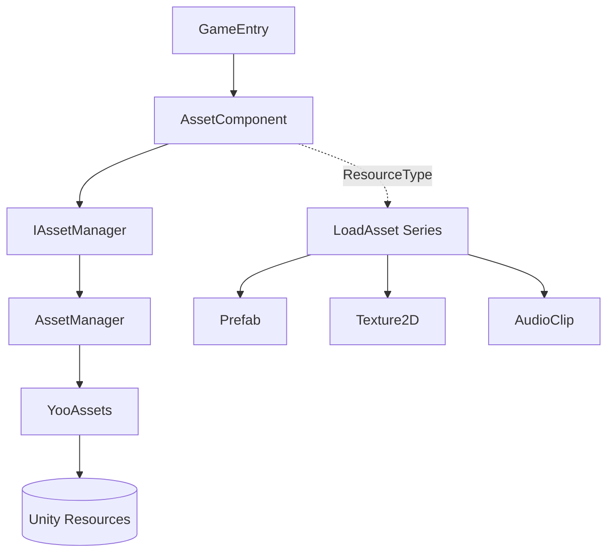

# Getting to Know GameFrameX Asset

GameFrameX Asset is a Unity resource management component built on top of the GameFrameX framework. It uses [YooAsset](https://github.com/tuyoogame/YooAsset) as its underlying engine and provides a unified interface for resource loading, unloading, and package management, allowing the game to safely retrieve Unity resources such as `Prefab`, `Texture2D`, and `AudioClip` by path or type at runtime.

## Quick Start

1. Add the scoped registry to `Packages/manifest.json` in your Unity project, then declare the dependency under the `dependencies` node:

```json
{
  "scopedRegistries": [
    {
      "name": "GameFrameX",
      "url": "https://gameframex.upm.alianblank.uk",
      "scopes": ["com.gameframex"]
    }
  ],
  "dependencies": {
    "com.gameframex.unity.asset": "3.0.1"
  }
}
```

`scopes` controls that only packages starting with `com.gameframex` go through this registry, while other packages still go through the official Unity source. You can also write the Git URL directly into `dependencies`, or place it in the `Packages` directory for offline loading.

2. Make sure `AssetComponent` is attached in the scene (it is automatically registered to `GameEntry`). Then retrieve the component from `GameEntry` and call the load interface:

```csharp
// Standard approach: through GameEntry (does not depend on com.gameframex.unity.entry)
var assetComponent = GameEntry.GetComponent<AssetComponent>();
assetComponent.LoadAsset("AssetPath");
```

## How It Works



- `AssetComponent` is a `GameFrameworkComponent` that is automatically registered to the GameFrameX framework, and can be configured in the editor through `AssetComponentInspector`.
- `IAssetManager` is an interface; the default implementation `AssetManager` holds YooAssets's initialization operation `InitializationOperation`, package information list, and load/unload task queues.
- Each Unity resource type corresponds to a partial file (such as `AssetComponent.Prefab.cs`, `AssetComponent.Texture2D.cs`), providing strongly-typed interfaces such as `LoadAssetAsync`.

## Next Steps

- Installing dependencies and configuring the registry: see the installation section in `README.zh-CN.md`.
- Load interfaces for each type of resource: see the `Runtime/Asset/AssetComponent.*.cs` series files.
- Inspector configuration on the editor side: see [AssetComponentInspector.cs](https://github.com/GameFrameX/com.gameframex.unity.asset/blob/main/Editor/Inspector/AssetComponentInspector.cs).

## Related Links

- Repository: https://github.com/GameFrameX/com.gameframex.unity.asset
- Documentation site: https://gameframex.doc.alianblank.com
- Issue tracker: https://github.com/GameFrameX/com.gameframex.unity.asset/issues
- Source code main entry: [AssetComponent.cs](https://github.com/GameFrameX/com.gameframex.unity.asset/blob/main/Runtime/Asset/AssetComponent.cs), [AssetManager.cs](https://github.com/GameFrameX/com.gameframex.unity.asset/blob/main/Runtime/Asset/AssetManager.cs)