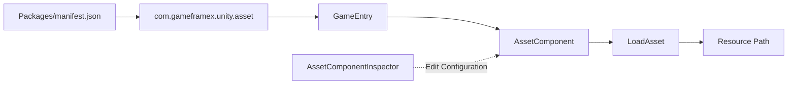

# Quick Start: Install and Load Your First Asset

After installing `com.gameframex.unity.asset`, you can obtain `AssetComponent` through `GameEntry`, then use `LoadAsset` to load an asset from a specified path. This page provides the installation and invocation paths from the repository README that can be copied directly.

## Quick Start

### Prerequisites

- Unity `2019.4`.
- The GameFrameX core package is installed in the project; the current package manifest declares dependencies on `com.gameframex.unity: 1.1.1` and `com.gameframex.unity.event: 1.1.0`.
- Prepare a usable asset path; the example uses the placeholder string `AssetPath`; replace it with your actual asset address.

### Steps

1. Open `Packages/manifest.json` in Unity and add the package to `dependencies`:

```json
{
  "dependencies": {
    "com.gameframex.unity.asset": "3.0.1"
  }
}
```

> Source: [README.zh-CN.md](https://github.com/GameFrameX/com.gameframex.unity.asset/blob/main/README.zh-CN.md#L32-L63)

2. Wait for the Unity Package Manager to resolve and load the package. You may also choose the installation methods listed in the README: scoped registry, Git URL, or placing the package directly into the `Packages` directory.

3. Obtain `AssetComponent` through `GameEntry` in your project code:

```csharp
var assetComponent = GameEntry.GetComponent<AssetComponent>();
assetComponent.LoadAsset("AssetPath");
```

> Source: [README.zh-CN.md](https://github.com/GameFrameX/com.gameframex.unity.asset/blob/main/README.zh-CN.md#L64-L70)

4. Replace `AssetPath` with your actual asset address, then run your asset loading flow. The current package version in the repository is `3.1.1`; the installation example in the README uses `3.0.1`, so use the version locked in your project as the source of truth.

```json
{
  "name": "com.gameframex.unity.asset",
  "version": "3.1.1",
  "unity": "2019.4",
  "dependencies": {
    "com.gameframex.unity": "1.1.1",
    "com.gameframex.unity.event": "1.1.0"
  }
}
```

> Source: [package.json](https://github.com/GameFrameX/com.gameframex.unity.asset/blob/main/package.json#L1-L25)

## Common Variants

| Installation Method | Configuration |
|------|------|
| Scoped registry | Registry URL is `https://gameframex.upm.alianblank.uk`, scope is `com.gameframex` |
| Git URL | `https://github.com/gameframex/com.gameframex.unity.asset.git` |
| Local directory | Place the repository directly into the Unity project's `Packages` directory |

## Common Errors

| Symptom | Cause | Fix |
|------|------|------|
| Package Manager cannot find the package | Inconsistent `scopedRegistries`, scope, or version | Check that the `scopes` in `manifest.json` is `com.gameframex`, and confirm Unity is using the target version |
| `GetComponent<AssetComponent>()` fails to compile | GameFrameX core dependency is not installed, or the corresponding namespace is not referenced | Install `com.gameframex.unity: 1.1.1`; the repository source does not provide a complete namespace usage that can be safely copied verbatim, and implementation details were not found in the source code |
| Asset cannot be loaded | The provided path is not a valid asset address, or the component/package is not yet ready | Use the actual asset address, and check the package loading and asset build configuration; the repository README does not provide more specific prerequisite steps for loading |

## How It Works (Quick Overview)

After installation, Unity loads `com.gameframex.unity.asset` through the package manifest; at runtime, `AssetComponent` is obtained from `GameEntry`, and this component calls `LoadAsset` to load assets. On the editor side, `AssetComponentInspector` is also provided to display `Resource Run Mode` and `Package List` configurations.



> Source: [README.zh-CN.md](https://github.com/GameFrameX/com.gameframex.unity.asset/blob/main/README.zh-CN.md#L26-L29)；[README.zh-CN.md](https://github.com/GameFrameX/com.gameframex.unity.asset/blob/main/README.zh-CN.md#L64-L70)；[Editor/Inspector/AssetComponentInspector.cs](https://github.com/GameFrameX/com.gameframex.unity.asset/blob/main/Editor/Inspector/AssetComponentInspector.cs#L32-L40)；[Editor/Inspector/AssetComponentInspector.cs](https://github.com/GameFrameX/com.gameframex.unity.asset/blob/main/Editor/Inspector/AssetComponentInspector.cs#L73-L78)

## What's Next

- For asset package installation, loading, and runtime configuration, refer first to the [project README](https://github.com/GameFrameX/com.gameframex.unity.asset/blob/main/README.zh-CN.md#L30-L80).
- For package version and dependency constraints, refer to [package.json](https://github.com/GameFrameX/com.gameframex.unity.asset/blob/main/package.json#L1-L25).
- For the editor configuration entry of `AssetComponent`, refer to [AssetComponentInspector.cs](https://github.com/GameFrameX/com.gameframex.unity.asset/blob/main/Editor/Inspector/AssetComponentInspector.cs#L39-L78).
- Official documentation entry: [GameFrameX Documentation](https://gameframex.doc.alianblank.com).