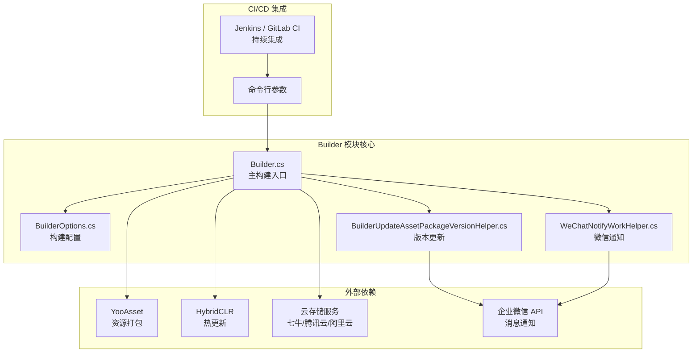
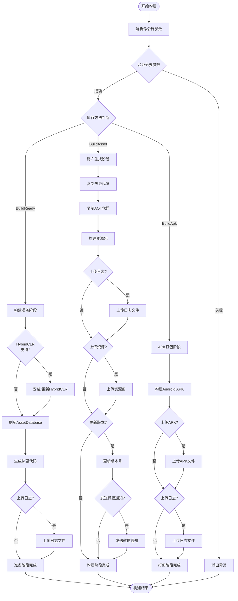

# 概述

GameFrameX Builder is the Unity automated build module of the GameFrameX game framework，提供完整的 CI/CD 构建流程支持。This module uses a command-line parameter-driven build approach，and can seamlessly integrate with CI platforms such as Jenkins, GitLab CI, and GitHub Actions，to enable automated packaging, asset generation, and version release for game projects。

## Overview

GameFrameX Builder is one of the core components of the GameFrameX game framework，focused on solving the automated build challenges of Unity game projects。In game development, frequent version releases and multi-channel packaging are time-consuming and error-prone tasks。Builder 模块Through standardized command-line interfaces and modular build process design，By automating these repetitive tasks, it significantly improves development efficiency and release quality。

The core design philosophy of this module is to split the build process into multiple independent stages，Each stage focuses on specific tasks。This design not only improves code maintainability，but also allows the build process to be flexibly configured according to project requirements。From a technical implementation perspective，the Builder module deeply integrates the HybridCLR hot update solution, YooAsset resource management system, and multiple cloud storage services，forming a complete game release solution。

## 架构设计

GameFrameX Builder adopts a modular architecture design，separating different functions in the build process into independent classes。This design pattern makes each module's responsibilities clear and well-defined，facilitating maintenance and extension。The following is the overall architecture diagram of the Builder module：



From the architecture diagram, it can be seen that，the Builder module is at the core of the entire build process，responsible for coordinating the work of various external dependency components。Command-line parameters are first parsed into a BuilderOptions object，then the Builder main class executes the corresponding build tasks based on these configurations。Resource packages generated during the build process can be uploaded through cloud storage services，while version update information can be automatically notified to relevant personnel via enterprise WeChat。

## 核心功能

### 命令行构建支持

GameFrameX Builder runs entirely from the command line，All build parameters are passed through the command line。This design allows the build process to be fully automated without manual intervention。In Builder.cs，通过 `BuildParamsParse()` 方法解析命令行参数，storing various build options into the BuilderOptions object。

```csharp
private static void BuildParamsParse()
{
    var commandLineArgs = Environment.GetCommandLineArgs();
    _builderOptions = new BuilderOptions();
    for (var index = 0; index < commandLineArgs.Length; index++)
    {
        var commandLineArg = commandLineArgs[index];
        if (commandLineArg == "-logFile")
        {
            _builderOptions.LogFilePath = commandLineArgs[index + 1].Replace("/Unity/", "/");
        }
        else if (commandLineArg == "-executeMethod")
        {
            _builderOptions.ExecuteMethod = commandLineArgs[index + 1].Trim();
        }
        // ... 更多参数解析
    }
}
```
> Source: [Builder.cs](https://github.com/GameFrameX/com.gameframex.unity.builder/blob/main/Editor/Builder.cs#L60-L74)

This parameter parsing mechanism supports a rich set of build options，including build number, task name, package name, version number, channel name, etc.。By properly configuring these parameters, development teams can implement fully customized build processes。

### 资产生成与打包

The Builder module integrates the YooAsset resource management system，providing powerful asset generation and packaging capabilities。在 `BuildAsset()` 方法中，implementing a complete resource packaging process，including hot update code copying, AOT code handling, resource package building, and other steps。

```csharp
public static void BuildAsset()
{
    // 复制热更新程序集
    Debug.Log("BuildReady Start Copy Hotfix Code");
    BuildHotfixHelper.CopyHotfixCode();
    AssetDatabase.Refresh();
    
    // 复制AOT代码
    Debug.Log("BuildReady Start Copy AOT Code");
    BuildHotfixHelper.CopyAOTCode();
    AssetDatabase.Refresh();
    
    // 构建资源包
    var buildInFileCopyParams = AssetBundleBuilderSetting.GetPackageBuildinFileCopyParams(_builderOptions.PackageName, EBuildPipeline.BuiltinBuildPipeline);
    BuiltinBuildPipeline pipeline = new BuiltinBuildPipeline();
    BuildParameters buildParameters = new BuildParameters();
    buildParameters.BuildMode = _builderOptions.IsIncrementalBuildPackage ? EBuildMode.IncrementalBuild : EBuildMode.ForceRebuild;
    // ... 更多配置
    pipeline.Run(buildParameters, true);
}
```
> Source: [Builder.cs](https://github.com/GameFrameX/com.gameframex.unity.builder/blob/main/Editor/Builder.cs#L255-L296)

Resource packaging supports both incremental build and full build modes，Developers can choose the appropriate build method based on actual needs。Incremental build mode can significantly reduce build time，especially suitable for frequent packaging needs during development。

### 热更新支持

The Builder module natively supports the HybridCLR hot update solution。During the build preparation phase（`BuildReady()` 方法），the system automatically checks the HybridCLR installation status，and performs automatic installation and configuration when necessary。This feature is critical for game projects that need to support hot updates。

```csharp
public static void BuildReady()
{
#if ENABLE_GAME_FRAME_X_HYBRID_CLR
    Debug.Log("BuildReady Start HybridCLR");
    var installerController = new InstallerController();
    var isInstalled = installerController.HasInstalledHybridCLR();
    if (!isInstalled || installerController.InstalledLibil2cppVersion != installerController.PackageVersion)
    {
        installerController.InstallDefaultHybridCLR();
    }
    // 生成热更新代理
    PrebuildCommand.GenerateAll();
#endif
    AssetDatabase.Refresh();
}
```
> Source: [Builder.cs](https://github.com/GameFrameX/com.gameframex.unity.builder/blob/main/Editor/Builder.cs#L215-L244)

Through conditional compilation directives `ENABLE_GAME_FRAME_X_HYBRID_CLR`，developers can flexibly control whether to enable the hot update feature。This design allows the module to meet different project needs with and without hot updates。

### 云存储集成

GameFrameX Builder supports integration with multiple cloud storage services，including Qiniu Cloud, Tencent Cloud, and Alibaba Cloud。Through a unified interface design, it is convenient to switch between different cloud service providers。During the build process, generated resource packages and APK files can be automatically uploaded to the specified cloud storage。

```csharp
#if ENABLE_GAME_FRAME_X_OBJECT_STORAGE
#if ENABLE_GAME_FRAME_X_OBJECT_STORAGE_QI_NIU
    ObjectStorageUploadManager = ObjectStorageUploadFactory.Create<QiNiuYunObjectStorageUploadManager>(_builderOptions.ObjectStorageKey, _builderOptions.ObjectStorageSecret, _builderOptions.ObjectStorageBucketName, _builderOptions.ObjectStorageEndPoint);
#endif

#if ENABLE_GAME_FRAME_X_OBJECT_STORAGE_TENCENT
    ObjectStorageUploadManager = ObjectStorageUploadFactory.Create<TencentCloudObjectStorageUploadManager>(_builderOptions.ObjectStorageKey, _builderOptions.ObjectStorageSecret, _builderOptions.ObjectStorageBucketName, _builderOptions.ObjectStorageEndPoint);
#endif

#if ENABLE_GAME_FRAME_X_OBJECT_STORAGE_A_LI_YUN
    ObjectStorageUploadManager = ObjectStorageUploadFactory.Create<ALiYunObjectStorageUploadManager>(_builderOptions.ObjectStorageKey, _builderOptions.ObjectStorageSecret, _builderOptions.ObjectStorageBucketName, _builderOptions.ObjectStorageEndPoint);
#endif
#endif
```
> Source: [Builder.cs](https://github.com/GameFrameX/com.gameframex.unity.builder/blob/main/Editor/Builder.cs#L32-L54)

云存储上传功能通过 `IObjectStorageUploadManager` 接口进行抽象，using the factory pattern to create specific implementations for different cloud service providers。This design follows the Open/Closed Principle, making it easy to add new cloud storage support in the future。

### 版本管理与通知

The Builder module provides complete version management functionality。After the build is complete, the resource package version number can be automatically updated，and build notifications can be sent via enterprise WeChat。These features greatly improve team collaboration efficiency，allowing relevant personnel to stay informed about build status and version information in a timely manner。

```csharp
if (_builderOptions.IsUpdateAssetPackageVersion)
{
    var result = BuilderUpdateAssetPackageVersionHelper.Run(buildParameters, _builderOptions);
    if (result)
    {
        WeChatNotifyWorkHelper.Run(buildParameters, _builderOptions);
    }
}
```
> Source: [Builder.cs](https://github.com/GameFrameX/com.gameframex.unity.builder/blob/main/Editor/Builder.cs#L335-L342)

Version updates send build information to a specified server via HTTP POST requests，while WeChat notifications use the enterprise WeChat Webhook interface to send Markdown-formatted build reports。

## 构建流程

The build process of GameFrameX Builder is divided into multiple stages，Each stage has clear goals and responsibilities。The following is the complete build process diagram：



From the flowchart, it can be seen that，the Builder module supports three main build methods：Build Preparation (BuildReady), Asset Generation (BuildAsset), and APK Packaging (BuildApk)。Each method can run independently，or can be combined in sequence to complete the full build process。

## 配置选项

The BuilderOptions class defines all available build parameters，These parameters are passed to the build system through the command line。The following are the main configuration options：

| 选项 | 类型 | 默认值 | 说明 |
|------|------|--------|------|
| ExecuteMethod | string | - | **必需**。指定要执行的构建方法（BuildReady、BuildAsset、BuildApk） |
| BuildNumber | string | - | **必需**。构建编号，用于版本追踪 |
| JobName | string | - | 任务名称，用于区分不同的构建任务 |
| PackageName | string | "DefaultPackage" | 资源包名称 |
| ChannelName | string | "default" | 渠道名称，用于多渠道打包 |
| BundleId | string | - | 包名，为空时使用项目默认包名 |
| AppVersion | string | - | 程序版本号，为空时使用项目默认版本 |
| IsIncrementalBuildPackage | bool | false | 是否使用增量构建 |
| IsUploadAsset | bool | false | 是否上传资源包到云存储 |
| IsUploadApk | bool | false | 是否上传 APK 到云存储 |
| IsUploadLogFile | bool | false | 是否上传日志文件到云存储 |
| IsUpdateAssetPackageVersion | bool | false | 是否更新资源包版本 |
| UpdateAssetPackageVersionUrl | string | - | 版本更新服务器的 URL |
| UpdateAssetPackageVersionAuthorization | string | - | 版本更新请求的授权信息 |
| WeChatBotKey | string | - | 企业微信机器人的 Key |
| Language | string | "default" | 多语言配置 |

## 使用场景

GameFrameX Builder applicable to various game development and release scenarios：

**持续集成环境**：Configure automated build tasks in Jenkins, GitLab CI, or GitHub Actions，Automatically trigger the build process when code is committed or merged to the main branch。Builder's command-line interface can easily integrate with these CI systems，achieving fully automated build and release。

**多渠道打包**：By configuring different ChannelName and PackageName parameters，game packages for different channels can be quickly generated。This capability is particularly important for projects that need to publish games on multiple platforms or channels。

**热更新发布**：Combined with HybridCLR hot update functionality，game content can be updated without republishing the game。Builder automatically handles hot update code copying and packaging，simplifying the hot update release process。

**版本管理**：Through version update and WeChat notification features，team members can stay informed about the results and changes of each build in a timely manner，improving collaboration efficiency。

## 相关链接

- [安装](./2-installation) - 了解如何安装和配置 Builder 模块
- [快速开始](./3-getting-started) - 快速上手 Builder 的基本使用
- [使用方法](./4-usage) - 详细的构建命令和使用方法
- [配置选项](./5-configuration) - 完整的配置参数参考
- [对象存储](./6-object-storage) - 云存储服务配置指南
- [常见问题](./7-troubleshooting) - 常见问题排查和解决方案

- 官方文档：https://gameframex.doc.alianblank.com
- GitHub 仓库：https://github.com/GameFrameX/com.gameframex.unity.builder
