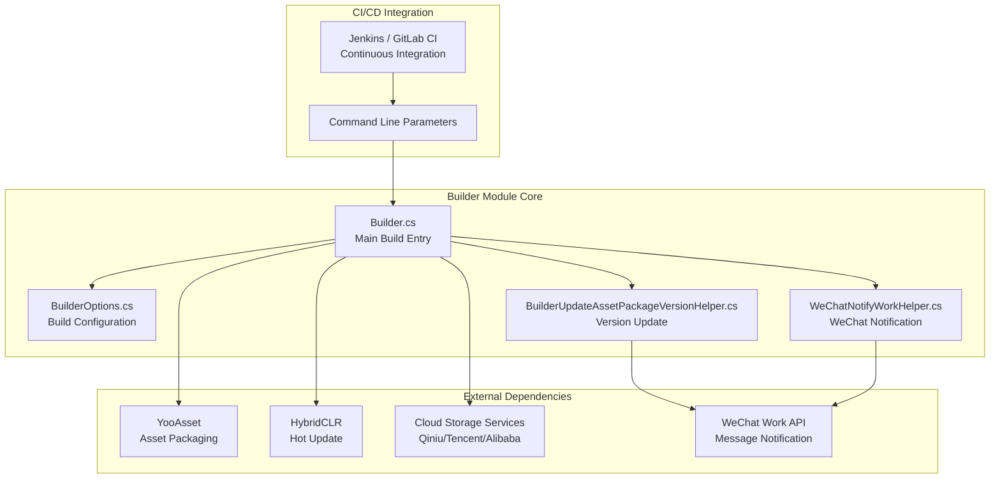
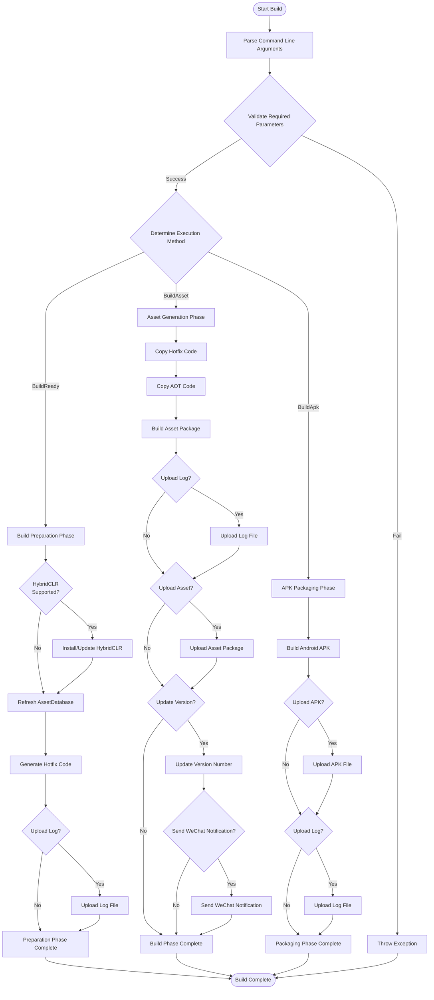

# Overview

GameFrameX Builder is the Unity automation build module of the GameFrameX game framework, providing complete CI/CD build process support. This module uses a command-line parameter-driven build approach that integrates seamlessly with continuous integration platforms like Jenkins, GitLab CI, and GitHub Actions, enabling automated packaging, asset generation, and version publishing for game projects.

## Overview

GameFrameX Builder is one of the core components of the GameFrameX game framework, focused on solving automated build problems for Unity game projects. During game development, frequent version releases and multi-channel packaging are time-consuming and error-prone tasks. The Builder module standardizes command-line interfaces and modular build processes, automating these repetitive tasks to significantly improve development efficiency and release quality.

The core design concept of this module is to split the build process into multiple independent stages, with each stage focused on specific tasks. This design improves code maintainability and allows flexible configuration of the build process based on project requirements. From a technical implementation perspective, the Builder module deeply integrates the HybridCLR hot-update solution, YooAsset resource management system, and various cloud storage services, forming a complete game publishing solution.

## Architecture Design

GameFrameX Builder adopts a modular architecture design, separating different functions in the build process into independent classes. This design pattern makes each module's responsibilities clear and facilitates maintenance and extension. The following is the overall architecture diagram of the Builder module:



As shown in the architecture diagram, the Builder module sits at the core of the entire build process, coordinating the work of various external dependency components. Command line parameters are first parsed into a BuilderOptions object, and then the Builder main class executes the corresponding build tasks based on these configurations. Asset packages generated during the build process can be automatically uploaded to specified cloud storage, and version update information can be automatically notified to relevant personnel through WeChat Work.

## Core Features

### Command Line Build Support

GameFrameX Builder runs entirely based on command line, with all build parameters passed through command line arguments. This design allows the build process to be fully automated without manual intervention. In Builder.cs, command line parameters are parsed through the `BuildParamsParse()` method, storing various build options in a BuilderOptions object.

```csharp
private static void BuildParamsParse()
{
    var commandLineArgs = Environment.GetCommandLineArgs();
    _builderOptions = new BuilderOptions();
    for (var index = 0; index < commandLineArgs.Length; index++)
    {
        var commandLineArg = commandLineArgs[index];
        if (commandLineArg == "-logFile")
        {
            _builderOptions.LogFilePath = commandLineArgs[index + 1].Replace("/Unity/", "/");
        }
        else if (commandLineArg == "-executeMethod")
        {
            _builderOptions.ExecuteMethod = commandLineArgs[index + 1].Trim();
        }
        // ... more parameter parsing
    }
}
```
> Source: [Builder.cs](https://github.com/GameFrameX/com.gameframex.unity.builder/blob/main/Editor/Builder.cs#L60-L74)

This parameter parsing mechanism supports rich build options including build number, job name, bundle ID, version number, channel name, etc. By configuring these parameters reasonably, development teams can implement fully customized build processes.

### Asset Generation and Packaging

The Builder module integrates the YooAsset resource management system, providing powerful asset generation and packaging functions. The `BuildAsset()` method implements a complete asset packaging flow, including hot-update code copying, AOT code processing, asset package building, and more.

```csharp
public static void BuildAsset()
{
    // Copy hotfix assemblies
    Debug.Log("BuildReady Start Copy Hotfix Code");
    BuildHotfixHelper.CopyHotfixCode();
    AssetDatabase.Refresh();

    // Copy AOT code
    Debug.Log("BuildReady Start Copy AOT Code");
    BuildHotfixHelper.CopyAOTCode();
    AssetDatabase.Refresh();

    // Build asset packages
    var buildInFileCopyParams = AssetBundleBuilderSetting.GetPackageBuildinFileCopyParams(_builderOptions.PackageName, EBuildPipeline.BuiltinBuildPipeline);
    BuiltinBuildPipeline pipeline = new BuiltinBuildPipeline();
    BuildParameters buildParameters = new BuildParameters();
    buildParameters.BuildMode = _builderOptions.IsIncrementalBuildPackage ? EBuildMode.IncrementalBuild : EBuildMode.ForceRebuild;
    // ... more configuration
    pipeline.Run(buildParameters, true);
}
```
> Source: [Builder.cs](https://github.com/GameFrameX/com.gameframex.unity.builder/blob/main/Editor/Builder.cs#L255-L296)

Asset packaging supports both incremental build and full build modes. Developers can choose the appropriate build method based on actual needs. Incremental build mode can significantly reduce build time, especially for frequent packaging needs during development.

### Hot Update Support

The Builder module natively supports the HybridCLR hot-update solution. During the build preparation phase (`BuildReady()` method), the system automatically checks the HybridCLR installation status and performs automatic installation and configuration when necessary. This feature is essential for game projects that need to support hot updates.

```csharp
public static void BuildReady()
{
#if ENABLE_GAME_FRAME_X_HYBRID_CLR
    Debug.Log("BuildReady Start HybridCLR");
    var installerController = new InstallerController();
    var isInstalled = installerController.HasInstalledHybridCLR();
    if (!isInstalled || installerController.InstalledLibil2cppVersion != installerController.PackageVersion)
    {
        installerController.InstallDefaultHybridCLR();
    }
    // Generate hotfix proxies
    PrebuildCommand.GenerateAll();
#endif
    AssetDatabase.Refresh();
}
```
> Source: [Builder.cs](https://github.com/GameFrameX/com.gameframex.unity.builder/blob/main/Editor/Builder.cs#L215-L244)

Through conditional compilation directive `ENABLE_GAME_FRAME_X_HYBRID_CLR`, developers can flexibly control whether to enable hot-update functionality. This design allows the module to simultaneously meet the needs of different projects that require or do not require hot updates.

### Cloud Storage Integration

GameFrameX Builder supports integration with multiple cloud storage services including Qiniu, Tencent Cloud, and Alibaba Cloud. Through unified interface design, switching between different cloud service providers is convenient. During the build process, generated asset packages and APK files can be automatically uploaded to specified cloud storage spaces.

```csharp
#if ENABLE_GAME_FRAME_X_OBJECT_STORAGE
#if ENABLE_GAME_FRAME_X_OBJECT_STORAGE_QI_NIU
    ObjectStorageUploadManager = ObjectStorageUploadFactory.Create<QiNiuYunObjectStorageUploadManager>(_builderOptions.ObjectStorageKey, _builderOptions.ObjectStorageSecret, _builderOptions.ObjectStorageBucketName, _builderOptions.ObjectStorageEndPoint);
#endif

#if ENABLE_GAME_FRAME_X_OBJECT_STORAGE_TENCENT
    ObjectStorageUploadManager = ObjectStorageUploadFactory.Create<TencentCloudObjectStorageUploadManager>(_builderOptions.ObjectStorageKey, _builderOptions.ObjectStorageSecret, _builderOptions.ObjectStorageBucketName, _builderOptions.ObjectStorageEndPoint);
#endif

#if ENABLE_GAME_FRAME_X_OBJECT_STORAGE_A_LI_YUN
    ObjectStorageUploadManager = ObjectStorageUploadFactory.Create<ALiYunObjectStorageUploadManager>(_builderOptions.ObjectStorageKey, _builderOptions.ObjectStorageSecret, _builderOptions.ObjectStorageBucketName, _builderOptions.ObjectStorageEndPoint);
#endif
#endif
```
> Source: [Builder.cs](https://github.com/GameFrameX/com.gameframex.unity.builder/blob/main/Editor/Builder.cs#L32-L54)

Cloud storage upload functionality is abstracted through the `IObjectStorageUploadManager` interface, using the factory pattern to create specific implementations for different cloud service providers. This design follows the Open-Closed Principle, making it easy to add new cloud storage support in the future.

### Version Management and Notifications

The Builder module provides complete version management functionality. After the build is complete, it can automatically update the asset package version number and send build notifications through WeChat Work. These features greatly improve team collaboration efficiency, allowing relevant personnel to promptly understand build status and version information.

```csharp
if (_builderOptions.IsUpdateAssetPackageVersion)
{
    var result = BuilderUpdateAssetPackageVersionHelper.Run(buildParameters, _builderOptions);
    if (result)
    {
        WeChatNotifyWorkHelper.Run(buildParameters, _builderOptions);
    }
}
```
> Source: [Builder.cs](https://github.com/GameFrameX/com.gameframex.unity.builder/blob/main/Editor/Builder.cs#L335-L342)

Version updates are sent to the specified server via HTTP POST request, while WeChat notifications use WeChat Work's webhook interface to send Markdown-formatted build reports.

## Build Process

The build process of GameFrameX Builder is divided into multiple stages, each with clear goals and responsibilities. The following is a complete build process diagram:



As shown in the flow diagram, the Builder module supports three main build methods: Build Preparation (BuildReady), Asset Generation (BuildAsset), and APK Packaging (BuildApk). Each method can run independently or be combined in sequence to complete the entire build process.

## Configuration Options

The BuilderOptions class defines all available build parameters, which are passed to the build system through command line arguments. The following are the main configuration options:

| Option | Type | Default | Description |
|------|------|--------|------|
| ExecuteMethod | string | - | **Required**. Specifies the build method to execute (BuildReady, BuildAsset, BuildApk) |
| BuildNumber | string | - | **Required**. Build number for version tracking |
| JobName | string | - | Job name to distinguish different build tasks |
| PackageName | string | "DefaultPackage" | Asset package name |
| ChannelName | string | "default" | Channel name for multi-channel packaging |
| BundleId | string | - | Package name; uses project default if empty |
| AppVersion | string | - | Application version number; uses project default if empty |
| IsIncrementalBuildPackage | bool | false | Whether to use incremental build |
| IsUploadAsset | bool | false | Whether to upload asset packages to cloud storage |
| IsUploadApk | bool | false | Whether to upload APK to cloud storage |
| IsUploadLogFile | bool | false | Whether to upload log files to cloud storage |
| IsUpdateAssetPackageVersion | bool | false | Whether to update asset package version |
| UpdateAssetPackageVersionUrl | string | - | URL of the version update server |
| UpdateAssetPackageVersionAuthorization | string | - | Authorization information for version update request |
| WeChatBotKey | string | - | WeChat Work bot Key |
| Language | string | "default" | Multi-language configuration |

## Use Cases

GameFrameX Builder is suitable for various game development and release scenarios:

**Continuous Integration Environment**: Configure automated build tasks in Jenkins, GitLab CI, or GitHub Actions to automatically trigger build processes when code is submitted or merged to the main branch. Builder's command line interface can be easily integrated with these CI systems to achieve fully automated builds and releases.

**Multi-Channel Packaging**: By configuring different ChannelName and PackageName parameters, you can quickly generate game packages for different channels. This capability is particularly important for projects that need to release games on multiple platforms or channels.

**Hot Update Release**: Combined with HybridCLR hot-update functionality, game content can be updated without re-publishing the game. Builder automatically handles hot-update code copying and packaging, simplifying the hot-update release process.

**Version Management**: Through version update and WeChat notification features, team members can promptly understand the results and changes of each build, improving collaboration efficiency.

## Related Links

- [Installation](./2-installation) - Learn how to install and configure the Builder module
- [Getting Started](./3-getting-started) - Get started with Builder's basic usage
- [Usage](./4-usage) - Detailed build commands and usage methods
- [Configuration](./5-configuration) - Complete configuration parameter reference
- [Object Storage](./6-object-storage) - Cloud storage service configuration guide
- [Troubleshooting](./7-troubleshooting) - Common problem troubleshooting and solutions

- Official Documentation: https://gameframex.doc.alianblank.com
- GitHub Repository: https://github.com/GameFrameX/com.gameframex.unity.builder