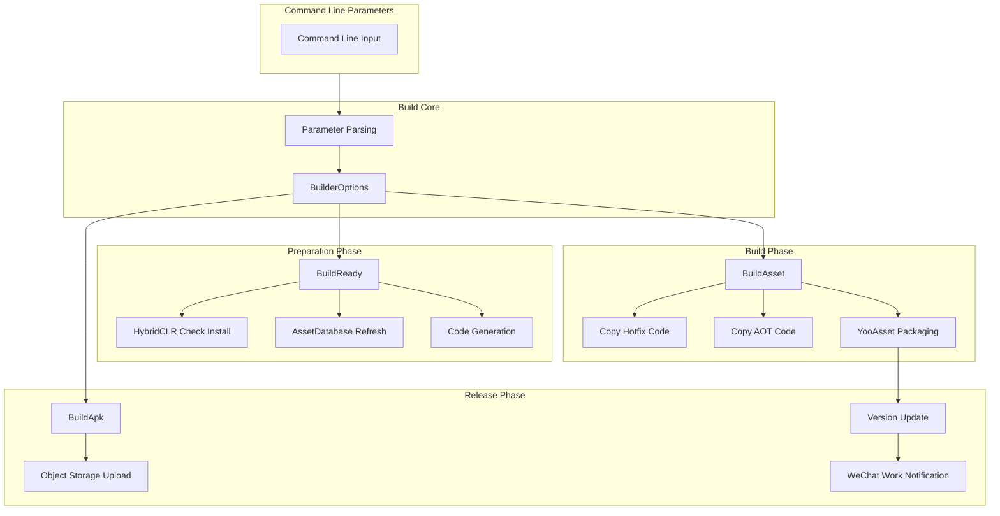
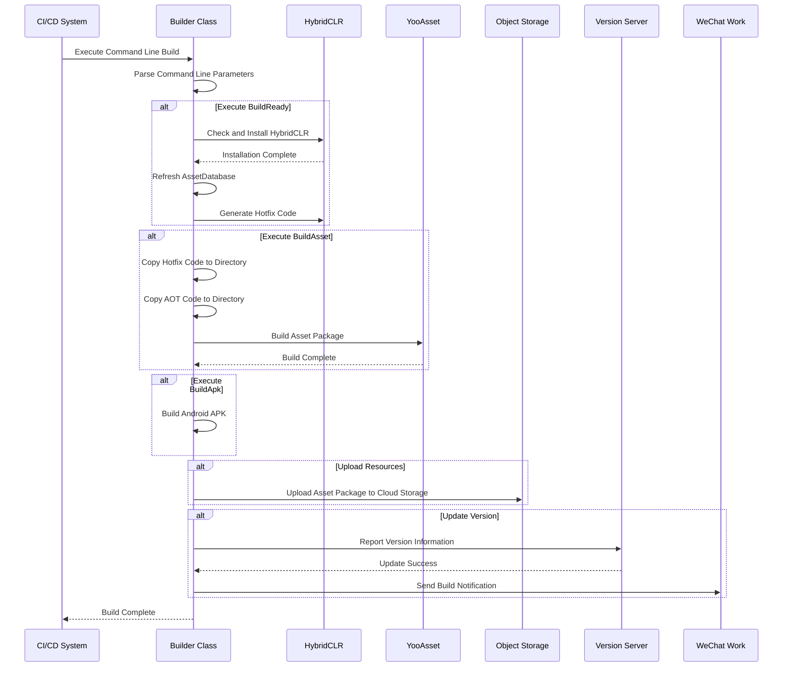

# Getting Started

GameFrameX Unity Builder is a powerful automated build system designed for Unity projects, supporting continuous integration and automated packaging. Through command-line parameter-driven execution, this system can automatically complete the entire process from environment preparation, asset packaging to APK building.

## Overview

GameFrameX Builder is one of the core components of the GameFrameX game framework, focused on solving automated build pain points for Unity projects. It configures the build process by parsing command-line parameters and supports the following core features:

- **Build Preparation (BuildReady)**: Automatically checks and installs HybridCLR hot-update framework, executes code generation
- **Asset Packaging (BuildAsset)**: Uses YooAsset to build game asset packages, supports incremental builds
- **APK Building (BuildApk)**: Automatically builds Android installation packages
- **Object Storage Upload**: Supports Tencent Cloud, Alibaba Cloud, Qiniu Cloud and other mainstream cloud storage services
- **Version Update Notifications**: Automatically updates asset package version and sends notifications through WeChat Work

## Architecture Overview



## Core Process

### Build Process Sequence Diagram



## Command Line Parameters

### Required Parameters

| Parameter | Description | Example |
|-----------|-------------|---------|
| `-executeMethod` | Execute method | `GameFrameX.Builder.Editor.Builder.BuildAsset` |
| `-BUILD_NUMBER` | Build number | `1001` |

### Build Configuration Parameters

| Parameter | Description | Default |
|-----------|-------------|---------|
| `-JOB_NAME` | Job name | - |
| `-PackageName` | Asset package name | `DefaultPackage` |
| `-ChannelName` | Channel name | `default` |
| `-BundleId` | Package name | Project default |
| `-AppVersion` | Application version number | Project default |
| `-IsIncrementalBuildPackage` | Use incremental build | `false` |
| `-Language` | Language | `default` |

### Object Storage Parameters

| Parameter | Description |
|-----------|-------------|
| `-ObjectStorageKey` | Object storage AccessKey |
| `-ObjectStorageSecret` | Object storage SecretKey |
| `-ObjectStorageBucketName` | Storage bucket name |
| `-ObjectStorageEndPoint` | Regional endpoint |

### Upload Control Parameters

| Parameter | Description |
|-----------|-------------|
| `-IsUploadLogFile` | Whether to upload log files |
| `-IsUploadAsset` | Whether to upload asset packages |
| `-IsUploadApk` | Whether to upload APK |
| `-IsUpdateAssetPackageVersion` | Whether to update asset package version |
| `-UpdateAssetPackageVersionUrl` | Version update server URL |
| `-UpdateAssetPackageVersionAuthorization` | Version update authorization code |
| `-WeChatBotKey` | WeChat Work bot Key |

## Usage Examples

### Jenkins Build Task Configuration

```groovy
// Jenkinsfile example
pipeline {
    agent any
    stages {
        stage('Build') {
            steps {
                bat '''
                    Unity.exe -projectPath "${WORKSPACE}" ^
                    -executeMethod GameFrameX.Builder.Editor.Builder.BuildAsset ^
                    -BUILD_NUMBER "${BUILD_NUMBER}" ^
                    -JOB_NAME "${JOB_NAME}" ^
                    -PackageName "GamePackage" ^
                    -ChannelName "official" ^
                    -IsUploadLogFile true ^
                    -IsUploadAsset true ^
                    -logFile "../Logs/build_${BUILD_NUMBER}.log"
                '''
            }
        }
    }
}
```

> Source: [Builder.cs](https://github.com/GameFrameX/com.gameframex.unity.builder/blob/main/Editor/Builder.cs#L60-L181)

### Complete Build Command Example

```bash
Unity.exe -projectPath "D:\UnityProject\MyGame" ^
-executeMethod GameFrameX.Builder.Editor.Builder.BuildAsset ^
-BUILD_NUMBER "1001" ^
-JOB_NAME "DailyBuild" ^
-PackageName "GamePackage" ^
-ChannelName "official" ^
-Language "zh-CN" ^
-ObjectStorageKey "your_access_key" ^
-ObjectStorageSecret "your_secret_key" ^
-ObjectStorageBucketName "game-assets" ^
-ObjectStorageEndPoint "ap-guangzhou" ^
-IsUploadLogFile true ^
-IsUploadAsset true ^
-IsUpdateAssetPackageVersion true ^
-UpdateAssetPackageVersionUrl "https://api.example.com/version" ^
-UpdateAssetPackageVersionAuthorization "Bearer token" ^
-WeChatBotKey "your_wechat_key" ^
-logFile "../Logs/build_1001.log"
```

### Different Build Stages

Select the appropriate execution method based on your needs:

```csharp
// Build preparation - Install HybridCLR, generate hotfix code
-executeMethod GameFrameX.Builder.Editor.Builder.BuildReady

// Asset packaging - Build asset packages
-executeMethod GameFrameX.Builder.Editor.Builder.BuildAsset

// APK building - Package installation packages
-executeMethod GameFrameX.Builder.Editor.Builder.BuildApk
```

> Source: [Builder.cs](https://github.com/GameFrameX/com.gameframex.unity.builder/blob/main/Editor/Builder.cs#L183-L345)

## BuilderOptions Configuration

The BuilderOptions class encapsulates all build configuration options:

```csharp
public class BuilderOptions
{
    // Log file path
    public string LogFilePath { get; set; }

    // Execute method
    public string ExecuteMethod { get; set; }

    // Build number
    public string BuildNumber { get; set; }

    // Object storage configuration
    public string ObjectStorageKey { get; set; }
    public string ObjectStorageSecret { get; set; }
    public string ObjectStorageBucketName { get; set; }
    public string ObjectStorageEndPoint { get; set; }

    // Build configuration
    public string JobName { get; set; }
    public string ChannelName { get; set; } = "default";
    public string BundleId { get; set; }
    public string AppVersion { get; set; }
    public string PackageName { get; set; } = "DefaultPackage";
    public bool IsIncrementalBuildPackage { get; set; }

    // Upload control
    public bool IsUploadLogFile { get; set; }
    public bool IsUploadAsset { get; set; }
    public bool IsUploadApk { get; set; }
    public bool IsUpdateAssetPackageVersion { get; set; }

    // Version update
    public string UpdateAssetPackageVersionUrl { get; set; }
    public string UpdateAssetPackageVersionAuthorization { get; set; }

    // Notification
    public string Language { get; set; } = "default";
    public string WeChatBotKey { get; set; }
}
```

> Source: [BuilderOptions.cs](https://github.com/GameFrameX/com.gameframex.unity.builder/blob/main/Editor/BuilderOptions.cs#L5-L116)

## Feature Descriptions

### Hot Update Support

The build system is deeply integrated with HybridCLR, supporting:
- Automatic checking of HybridCLR installation status
- Automatic installation and configuration of HybridCLR
- Automatic generation of hot-update code

### Asset Packaging

Uses YooAsset for asset packaging:
- Supports incremental and full builds
- Automatically copies hotfix code and AOT code
- Supports automatic generation of asset package version numbers

### Object Storage

Supports multiple cloud storage services:

| Cloud Provider | Conditional Compilation Symbol | Description |
|----------------|-------------------------------|-------------|
| Tencent Cloud | `ENABLE_GAME_FRAME_X_OBJECT_STORAGE_TENCENT` | Tencent Cloud COS |
| Alibaba Cloud | `ENABLE_GAME_FRAME_X_OBJECT_STORAGE_A_LI_YUN` | Alibaba Cloud OSS |
| Qiniu Cloud | `ENABLE_GAME_FRAME_X_OBJECT_STORAGE_QI_NIU` | Qiniu Cloud Kodo |

> Source: [Builder.cs](https://github.com/GameFrameX/com.gameframex.unity.builder/blob/main/Editor/Builder.cs#L40-L53)

### Version Update Notifications

Automatically after build completion:
1. Report version information to the version server
2. Send build notifications through WeChat Work

> Source: [BuilderUpdateAssetPackageVersionHelper.cs](https://github.com/GameFrameX/com.gameframex.unity.builder/blob/main/Editor/BuilderUpdateAssetPackageVersionHelper.cs#L51-L85)
> Source: [WeChatNotifyWorkHelper.cs](https://github.com/GameFrameX/com.gameframex.unity.builder/blob/main/Editor/WeChatNotifyWorkHelper.cs#L45-L71)

## Dependencies

This build system depends on the following core components:

| Dependency Package | Description |
|-------------------|-------------|
| GameFrameX.Editor | Editor tool base class |
| GameFrameX.Runtime | Runtime base library |
| YooAsset | Resource management package |
| HybridCLR | IL2CPP hot-update solution |

## Related Links

- [Installation Guide](./2-installation)
- [Usage](./4-usage)
- [Configuration](./5-configuration)
- [Object Storage Configuration](./6-object-storage)
- [Troubleshooting](./7-troubleshooting)
- [GitHub Repository](https://github.com/GameFrameX/com.gameframex.unity.builder.git)
- [Official Documentation](https://gameframex.doc.alianblank.com)