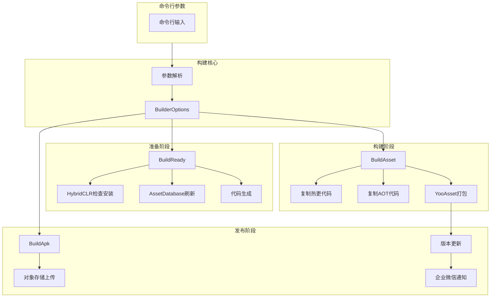
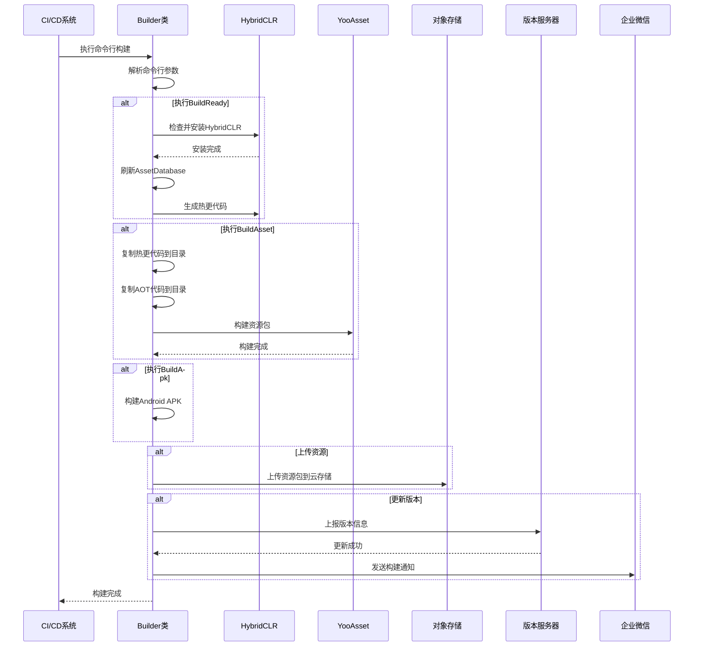

# 快速开始

GameFrameX Unity Builder 是一个功能强大的自动化构建系统，专门用于 Unity 项目的持续集成和自动化打包。通过命令行参数驱动，该系统能够自动完成从环境准备、资源打包到 APK 构建的全流程。

## 概述

GameFrameX Builder is one of the core components of the GameFrameX game framework，专注于解决 Unity 项目自动化构建的痛点。它通过解析命令行参数来配置构建流程，支持以下核心功能：

- **打包准备（BuildReady）**：自动检查并安装 HybridCLR 热更新框架，执行代码生成
- **资源打包（BuildAsset）**：使用 YooAsset 构建游戏资源包，支持增量构建
- **APK 构建（BuildApk）**：自动构建 Android 安装包
- **对象存储上传**：支持腾讯云、阿里云、七牛云等主流云存储
- **版本更新通知**：自动更新资源包版本并通过企业微信发送通知

## 架构概览



## 核心流程

### 构建流程序列图



## 命令行参数

### 必需参数

| 参数 | 说明 | 示例 |
|------|------|------|
| `-executeMethod` | 执行方法 | `GameFrameX.Builder.Editor.Builder.BuildAsset` |
| `-BUILD_NUMBER` | 构建号 | `1001` |

### 构建配置参数

| 参数 | 说明 | 默认值 |
|------|------|--------|
| `-JOB_NAME` | 任务名称 | - |
| `-PackageName` | 资源包名称 | `DefaultPackage` |
| `-ChannelName` | 渠道名称 | `default` |
| `-BundleId` | 包名 | 项目默认值 |
| `-AppVersion` | 程序版本号 | 项目默认值 |
| `-IsIncrementalBuildPackage` | 是否增量构建 | `false` |
| `-Language` | 语言 | `default` |

### 对象存储参数

| 参数 | 说明 |
|------|------|
| `-ObjectStorageKey` | 对象存储AccessKey |
| `-ObjectStorageSecret` | 对象存储SecretKey |
| `-ObjectStorageBucketName` | 存储桶名称 |
| `-ObjectStorageEndPoint` | 区域节点 |

### 上传控制参数

| 参数 | 说明 |
|------|------|
| `-IsUploadLogFile` | 是否上传日志文件 |
| `-IsUploadAsset` | 是否上传资源包 |
| `-IsUploadApk` | 是否上传APK |
| `-IsUpdateAssetPackageVersion` | 是否更新资源包版本 |
| `-UpdateAssetPackageVersionUrl` | 版本更新服务器URL |
| `-UpdateAssetPackageVersionAuthorization` | 版本更新授权码 |
| `-WeChatBotKey` | 企业微信机器人Key |

## 使用示例

### Jenkins 构建任务配置

```groovy
// Jenkinsfile 示例
pipeline {
    agent any
    stages {
        stage('构建') {
            steps {
                bat '''
                    Unity.exe -projectPath "${WORKSPACE}" ^
                    -executeMethod GameFrameX.Builder.Editor.Builder.BuildAsset ^
                    -BUILD_NUMBER "${BUILD_NUMBER}" ^
                    -JOB_NAME "${JOB_NAME}" ^
                    -PackageName "GamePackage" ^
                    -ChannelName "official" ^
                    -IsUploadLogFile true ^
                    -IsUploadAsset true ^
                    -logFile "../Logs/build_${BUILD_NUMBER}.log"
                '''
            }
        }
    }
}
```

> Source: [Builder.cs](https://github.com/GameFrameX/com.gameframex.unity.builder/blob/main/Editor/Builder.cs#L60-L181)

### 完整的构建命令示例

```bash
Unity.exe -projectPath "D:\UnityProject\MyGame" ^
-executeMethod GameFrameX.Builder.Editor.Builder.BuildAsset ^
-BUILD_NUMBER "1001" ^
-JOB_NAME "DailyBuild" ^
-PackageName "GamePackage" ^
-ChannelName "official" ^
-Language "zh-CN" ^
-ObjectStorageKey "your_access_key" ^
-ObjectStorageSecret "your_secret_key" ^
-ObjectStorageBucketName "game-assets" ^
-ObjectStorageEndPoint "ap-guangzhou" ^
-IsUploadLogFile true ^
-IsUploadAsset true ^
-IsUpdateAssetPackageVersion true ^
-UpdateAssetPackageVersionUrl "https://api.example.com/version" ^
-UpdateAssetPackageVersionAuthorization "Bearer token" ^
-WeChatBotKey "your_wechat_key" ^
-logFile "../Logs/build_1001.log"
```

### 不同构建阶段

根据需求选择不同的执行方法：

```csharp
// 打包准备 - 安装HybridCLR、生成热更代码
-executeMethod GameFrameX.Builder.Editor.Builder.BuildReady

// 打包资源 - 构建资源包
-executeMethod GameFrameX.Builder.Editor.Builder.BuildAsset

// 构建APK - 打包安装包
-executeMethod GameFrameX.Builder.Editor.Builder.BuildApk
```

> Source: [Builder.cs](https://github.com/GameFrameX/com.gameframex.unity.builder/blob/main/Editor/Builder.cs#L183-L345)

## 构建选项配置

BuilderOptions 类封装了所有构建配置选项：

```csharp
public class BuilderOptions
{
    // 日志文件路径
    public string LogFilePath { get; set; }
    
    // 执行方法
    public string ExecuteMethod { get; set; }
    
    // 构建号
    public string BuildNumber { get; set; }
    
    // 对象存储配置
    public string ObjectStorageKey { get; set; }
    public string ObjectStorageSecret { get; set; }
    public string ObjectStorageBucketName { get; set; }
    public string ObjectStorageEndPoint { get; set; }
    
    // 构建配置
    public string JobName { get; set; }
    public string ChannelName { get; set; } = "default";
    public string BundleId { get; set; }
    public string AppVersion { get; set; }
    public string PackageName { get; set; } = "DefaultPackage";
    public bool IsIncrementalBuildPackage { get; set; }
    
    // 上传控制
    public bool IsUploadLogFile { get; set; }
    public bool IsUploadAsset { get; set; }
    public bool IsUploadApk { get; set; }
    public bool IsUpdateAssetPackageVersion { get; set; }
    
    // 版本更新
    public string UpdateAssetPackageVersionUrl { get; set; }
    public string UpdateAssetPackageVersionAuthorization { get; set; }
    
    // 通知
    public string Language { get; set; } = "default";
    public string WeChatBotKey { get; set; }
}
```

> Source: [BuilderOptions.cs](https://github.com/GameFrameX/com.gameframex.unity.builder/blob/main/Editor/BuilderOptions.cs#L5-L116)

## 功能特性说明

### 热更新支持

构建系统深度集成 HybridCLR，支持：
- 自动检查 HybridCLR 安装状态
- 自动安装和配置 HybridCLR
- 自动生成热更新代码

### 资源打包

使用 YooAsset 进行资源打包：
- 支持增量构建和全量构建
- 自动复制热更代码和 AOT 代码
- 支持资源包版本号自动生成

### 对象存储

支持多种云存储服务：

| 云服务商 | 条件编译符号 | 说明 |
|---------|-------------|------|
| 腾讯云 | `ENABLE_GAME_FRAME_X_OBJECT_STORAGE_TENCENT` | 腾讯云COS |
| 阿里云 | `ENABLE_GAME_FRAME_X_OBJECT_STORAGE_A_LI_YUN` | 阿里云OSS |
| 七牛云 | `ENABLE_GAME_FRAME_X_OBJECT_STORAGE_QI_NIU` | 七牛云Kodo |

> Source: [Builder.cs](https://github.com/GameFrameX/com.gameframex.unity.builder/blob/main/Editor/Builder.cs#L40-L53)

### 版本更新通知

构建完成后自动：
1. 将版本信息上报到版本服务器
2. 通过企业微信发送构建通知

> Source: [BuilderUpdateAssetPackageVersionHelper.cs](https://github.com/GameFrameX/com.gameframex.unity.builder/blob/main/Editor/BuilderUpdateAssetPackageVersionHelper.cs#L51-L85)
> Source: [WeChatNotifyWorkHelper.cs](https://github.com/GameFrameX/com.gameframex.unity.builder/blob/main/Editor/WeChatNotifyWorkHelper.cs#L45-L71)

## 依赖项

本构建系统依赖以下核心组件：

| 依赖包 | 说明 |
|--------|------|
| GameFrameX.Editor | 编辑器工具基类 |
| GameFrameX.Runtime | 运行时基础库 |
| YooAsset | 资源管理包 |
| HybridCLR | IL2CPP热更新方案 |

## 相关链接

- [安装指南](./2-installation)
- [使用方法](./4-usage)
- [配置选项](./5-configuration)
- [对象存储配置](./6-object-storage)
- [常见问题](./7-troubleshooting)
- [GitHub 仓库](https://github.com/GameFrameX/com.gameframex.unity.builder.git)
- [官方文档](https://gameframex.doc.alianblank.com)
