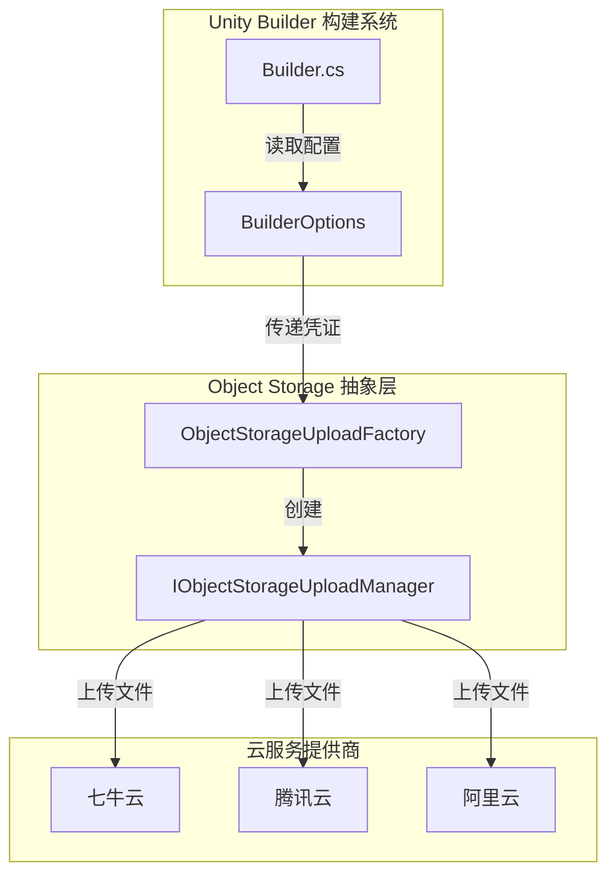
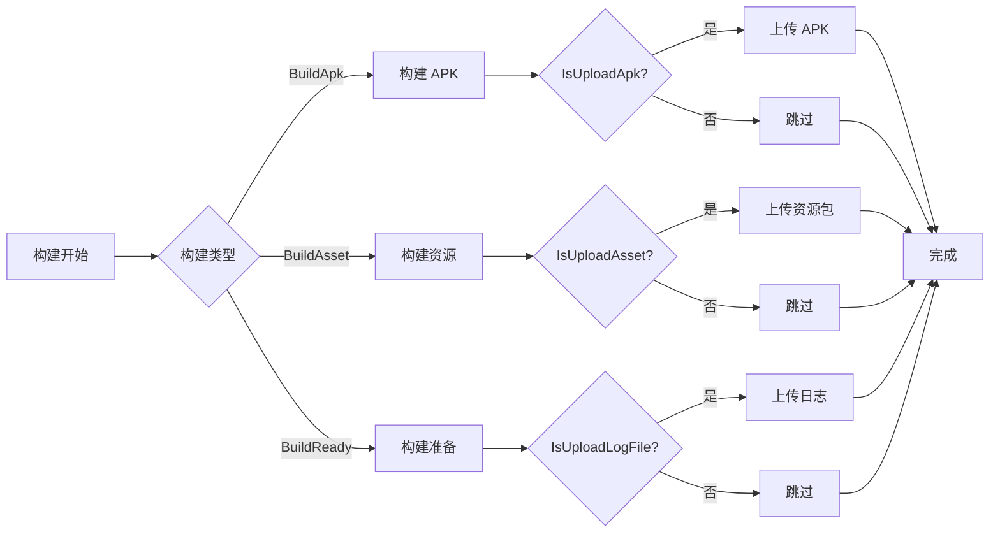

# 对象存储

对象存储模块为 Unity Builder 提供了将构建产物（APK、日志文件、资源包）上传到云端对象存储服务的能力。通过集成外部 GameFrameX ObjectStorage 包，支持主流云服务提供商。

## 概述

对象存储（Object Storage）是 Unity Builder 的核心功能之一，用于自动化构建完成后将构建产物上传到云存储服务。这一功能在持续集成/持续部署（CI/CD）工作流中尤为重要，可以实现：

- **APK 自动上传**：Android 构建完成后自动上传安装包
- **日志文件上传**：构建日志实时上传，便于远程查看构建状态
- **资源包上传**：AB 资源包自动上传到 CDN 源站

当前支持的云服务提供商：
- 腾讯云对象存储（COS）
- 阿里云对象存储（OSS）
- 七牛云对象存储（Kodo）

> 注意：对象存储功能依赖外部 GameFrameX ObjectStorage 包，需要在项目中正确安装和配置相关包才能使用。

## 架构



**架构说明：**

- **Builder**：构建入口，负责解析命令行参数并触发构建流程
- **BuilderOptions**：存储对象存储相关配置（Key、Secret、Bucket、Endpoint）
- **ObjectStorageUploadFactory**：工厂类，根据编译条件创建对应云服务商的 UploadManager
- **IObjectStorageUploadManager**：上传管理器接口，定义 UploadFile 和 UploadDirectory 方法

## 核心功能

### 支持的云服务商

| 云服务商 | 包名称 | 编译宏 |
|----------|--------|--------|
| 七牛云 | GameFrameX.ObjectStorage.QiNiu | ENABLE_GAME_FRAME_X_OBJECT_STORAGE_QI_NIU |
| 腾讯云 | GameFrameX.ObjectStorage.Tencent | ENABLE_GAME_FRAME_X_OBJECT_STORAGE_TENCENT |
| 阿里云 | GameFrameX.ObjectStorage.ALiYun | ENABLE_GAME_FRAME_X_OBJECT_STORAGE_A_LI_YUN |

### 上传类型

```csharp
// 上传单个文件
ObjectStorageUploadManager.UploadFile(apkPath);

// 上传整个目录
ObjectStorageUploadManager.SetSavePath(savePath);
ObjectStorageUploadManager.UploadDirectory(uploadPath);
```

> Source: [Builder.cs](https://github.com/GameFrameX/com.gameframex.unity.builder/blob/main/Editor/Builder.cs#L200-L330)

### 上传触发时机



## 配置选项

对象存储通过 `BuilderOptions` 类进行配置，支持以下选项：

| 选项 | 类型 | 默认值 | 说明 |
|------|------|--------|------|
| ObjectStorageKey | string | "" | 对象存储的 AccessKey |
| ObjectStorageSecret | string | "" | 对象存储的 SecretKey |
| ObjectStorageBucketName | string | "" | 存储桶名称 |
| ObjectStorageEndPoint | string | "" | 存储桶地域节点 |
| IsUploadApk | bool | false | 构建完成后是否上传 APK |
| IsUploadLogFile | bool | false | 构建完成后是否上传日志文件 |
| IsUploadAsset | bool | false | 构建完成后是否上传资源包 |

> Source: [BuilderOptions.cs](https://github.com/GameFrameX/com.gameframex.unity.builder/blob/main/Editor/BuilderOptions.cs#L22-L40)

## 命令行参数

对象存储通过命令行参数传递配置，常用参数：

```bash
# 对象存储配置
-ObjectStorageKey "your_access_key"
-ObjectStorageSecret "your_secret_key"
-ObjectStorageBucketName "your_bucket_name"
-ObjectStorageEndPoint "ap-guangzhou"

# 上传控制
-IsUploadApk
-IsUploadLogFile
-IsUploadAsset
```

> Source: [Builder.cs](https://github.com/GameFrameX/com.gameframex.unity.builder/blob/main/Editor/Builder.cs#L83-L97)

### 参数解析示例

```csharp
// Builder.cs 中的参数解析逻辑
else if (commandLineArg == "-ObjectStorageKey")
{
    _builderOptions.ObjectStorageKey = commandLineArgs[index + 1];
}
else if (commandLineArg == "-ObjectStorageSecret")
{
    _builderOptions.ObjectStorageSecret = commandLineArgs[index + 1];
}
else if (commandLineArg == "-ObjectStorageBucketName")
{
    _builderOptions.ObjectStorageBucketName = commandLineArgs[index + 1];
}
else if (commandLineArg == "-ObjectStorageEndPoint")
{
    _builderOptions.ObjectStorageEndPoint = commandLineArgs[index + 1];
}
```

## 使用方法

### 1. 安装依赖包

在 Unity Package Manager 中安装所需的 GameFrameX ObjectStorage 包：

- 基础包：`com.gameframex.unity.objectstorage`
- 七牛云：`com.gameframex.unity.objectstorage.qiniu`
- 腾讯云：`com.gameframex.unity.objectstorage.tencent`
- 阿里云：`com.gameframex.unity.objectstorage.aliyun`

### 2. 配置编译宏

在项目的 `GameFrameX.Builder.Editor.asmdef` 中已定义版本宏：

```json
{
  "versionDefines": [
    {
      "name": "com.gameframex.unity.objectstorage",
      "define": "ENABLE_GAME_FRAME_X_OBJECT_STORAGE"
    },
    {
      "name": "com.gameframex.unity.objectstorage.tencent",
      "define": "ENABLE_GAME_FRAME_X_OBJECT_STORAGE_TENCENT"
    }
  ]
}
```

> Source: [GameFrameX.Builder.Editor.asmdef](https://github.com/GameFrameX/com.gameframex.unity.builder/blob/main/Editor/GameFrameX.Builder.Editor.asmdef#L24-L44)

### 3. 创建上传管理器

根据选择的云服务商，通过工厂类创建对应的上传管理器：

```csharp
#if ENABLE_GAME_FRAME_X_OBJECT_STORAGE
#if ENABLE_GAME_FRAME_X_OBJECT_STORAGE_QI_NIU
ObjectStorageUploadManager = ObjectStorageUploadFactory.Create<QiNiuYunObjectStorageUploadManager>(
    _builderOptions.ObjectStorageKey, 
    _builderOptions.ObjectStorageSecret, 
    _builderOptions.ObjectStorageBucketName, 
    _builderOptions.ObjectStorageEndPoint);
#endif

#if ENABLE_GAME_FRAME_X_OBJECT_STORAGE_TENCENT
ObjectStorageUploadManager = ObjectStorageUploadFactory.Create<TencentCloudObjectStorageUploadManager>(
    _builderOptions.ObjectStorageKey, 
    _builderOptions.ObjectStorageSecret, 
    _builderOptions.ObjectStorageBucketName, 
    _builderOptions.ObjectStorageEndPoint);
#endif

#if ENABLE_GAME_FRAME_X_OBJECT_STORAGE_A_LI_YUN
ObjectStorageUploadManager = ObjectStorageUploadFactory.Create<ALiYunObjectStorageUploadManager>(
    _builderOptions.ObjectStorageKey, 
    _builderOptions.ObjectStorageSecret, 
    _builderOptions.ObjectStorageBucketName, 
    _builderOptions.ObjectStorageEndPoint);
#endif

// 设置上传路径
ObjectStorageUploadManager.SetSavePath($"builder/{PlayerSettings.productName}/{EditorUserBuildSettings.activeBuildTarget}/{_builderOptions.JobName}/{Application.version}/{_builderOptions.BuildNumber}");
#endif
```

> Source: [Builder.cs](https://github.com/GameFrameX/com.gameframex.unity.builder/blob/main/Editor/Builder.cs#L40-L52)

### 4. 执行上传

在构建流程的适当位置调用上传方法：

```csharp
// 上传 APK
if (_builderOptions.IsUploadApk)
{
#if ENABLE_GAME_FRAME_X_OBJECT_STORAGE
    ObjectStorageUploadManager.UploadFile(apkPath);
#endif
}

// 上传资源包
if (_builderOptions.IsUploadAsset)
{
    string savePath = $"Bundles/{PlayerSettings.applicationIdentifier}/{EditorUserBuildSettings.activeBuildTarget}/{Application.version}/{_builderOptions.ChannelName}/{_builderOptions.PackageName}/{buildParameters.PackageVersion}";
    string uploadPath = $"{buildParameters.BuildOutputRoot}/{buildParameters.BuildTarget}/{Application.version}/{buildParameters.PackageName}/{buildParameters.PackageVersion}";
    
#if ENABLE_GAME_FRAME_X_OBJECT_STORAGE
    ObjectStorageUploadManager.SetSavePath(savePath);
    ObjectStorageUploadManager.UploadDirectory(uploadPath);
#endif
}
```

> Source: [Builder.cs](https://github.com/GameFrameX/com.gameframex.unity.builder/blob/main/Editor/Builder.cs#L321-L331)

## 常见场景

### CI/CD 集成

在 Jenkins、GitLab CI 等 CI 系统中使用：

```bash
# Jenkinsfile 示例
pipeline {
    stages {
        stage('Build') {
            steps {
                sh '''
                    unity -projectPath . \
                    -executeMethod GameFrameX.Builder.Editor.Builder.BuildApk \
                    -logFile "../Logs/build_${BUILD_NUMBER}.log" \
                    -BUILD_NUMBER "${BUILD_NUMBER}" \
                    -JobName "android" \
                    -ObjectStorageKey "${OSS_KEY}" \
                    -ObjectStorageSecret "${OSS_SECRET}" \
                    -ObjectStorageBucketName "my-bucket" \
                    -ObjectStorageEndPoint "ap-guangzhou" \
                    -IsUploadApk \
                    -IsUploadLogFile
                '''
            }
        }
    }
}
```

### 多平台构建

针对不同平台配置不同的对象存储：

```bash
# Android 构建
-executeMethod GameFrameX.Builder.Editor.Builder.BuildApk \
-ObjectStorageBucketName "android-bucket" \
-ObjectStorageEndPoint "ap-guangzhou" \
-IsUploadApk

# iOS 资源构建
-executeMethod GameFrameX.Builder.Editor.Builder.BuildAsset \
-ObjectStorageBucketName "ios-bucket" \
-ObjectStorageEndPoint "ap-shanghai" \
-IsUploadAsset
```

## 相关链接

- [使用方法](./4-usage) - 了解 Builder 的完整使用方式
- [配置选项](./5-configuration) - 查看所有构建配置选项
- [GameFrameX 文档](https://gameframex.doc.alianblank.com) - 官方文档
- [七牛云对象存储](https://www.qiniu.com/products/kodo) - 七牛云官方文档
- [腾讯云对象存储](https://cloud.tencent.com/product/cos) - 腾讯云官方文档
- [阿里云对象存储](https://www.aliyun.com/product/oss) - 阿里云官方文档
