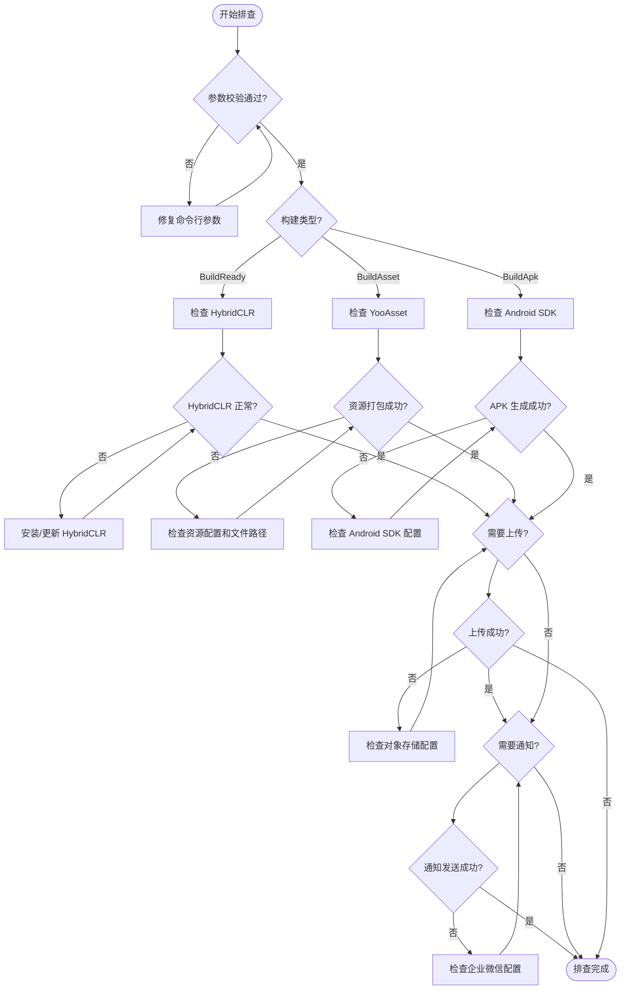

# 常见问题

本文档汇总了使用 GameFrameX Unity Builder 进行自动化构建时可能遇到的常见问题及其解决方案。

## 概述

GameFrameX Unity Builder 是一个自动化构建工具，支持以下功能：
- 命令行构建（支持 CI/CD 集成）
- 资源打包（基于 YooAsset）
- 热更新支持（基于 HybridCLR）
- 多云对象存储上传（七牛云、腾讯云、阿里云）
- 企业微信构建通知

## 常见问题与解决方案

### 1. 参数错误

#### 1.1 executeMethod 为空

**错误信息：**
```
Exception: executeMethod is null
```

**原因：** 未在命令行参数中指定 `-executeMethod`。

**解决方案：** 确保 CI/CD 配置中包含 `-executeMethod` 参数，指定要执行的构建方法（如 `GameFrameX.Builder.Editor.Builder.BuildAsset`）。

```bash
-executeMethod GameFrameX.Builder.Editor.Builder.BuildAsset
```
> Source: [Builder.cs#L153-L156](https://github.com/GameFrameX/com.gameframex.unity.builder/blob/main/Editor/Builder.cs#L153-L156)

---

#### 1.2 buildNumber 为空

**错误信息：**
```
Exception: build number is null
```

**原因：** 未在命令行参数中指定 `-BUILD_NUMBER`。

**解决方案：** 确保 CI/CD 配置中包含 `-BUILD_NUMBER` 参数。

```bash
-BUILD_NUMBER 1001
```
> Source: [Builder.cs#L158-L161](https://github.com/GameFrameX/com.gameframex.unity.builder/blob/main/Editor/Builder.cs#L158-L161)

---

### 2. 构建问题

#### 2.1 HybridCLR 安装失败

**问题描述：** 构建过程中 HybridCLR 安装失败或未正确安装。

**原因分析：**
- HybridCLR 包未正确安装
- il2cpp 版本与 HybridCLR 版本不匹配

**解决方案：**

确保在构建前检查 HybridCLR 安装状态。Builder 会在 `BuildReady` 阶段自动检查并安装：

```csharp
var installerController = new InstallerController();
var isInstalled = installerController.HasInstalledHybridCLR();
if (!isInstalled || installerController.InstalledLibil2cppVersion != installerController.PackageVersion)
{
    installerController.InstallDefaultHybridCLR();
}
```
> Source: [Builder.cs#L219-L232](https://github.com/GameFrameX/com.gameframex.unity.builder/blob/main/Editor/Builder.cs#L219-L232)

**排查步骤：**
1. 确认 Unity 项目已正确安装 HybridCLR 包
2. 确认 il2cpp 版本与 HybridCLR 兼容
3. 在构建日志中查看 `BuildReady Check HybridCLR Install Status` 输出

---

#### 2.2 资源打包失败

**问题描述：** 资源打包过程中出现异常，导致构建失败。

**常见原因：**
- YooAsset 配置错误
- 资源文件路径问题
- 磁盘空间不足

**解决方案：**

Builder 捕获了异常并会输出详细错误日志：

```csharp
try
{
    pipeline.Run(buildParameters, true);
    isSuccess = true;
}
catch (Exception e)
{
    Debug.LogException(e);
    Environment.Exit(1);
}
```
> Source: [Builder.cs#L298-L308](https://github.com/GameFrameX/com.gameframex.unity.builder/blob/main/Editor/Builder.cs#L298-L308)

**排查步骤：**
1. 查看构建日志中的详细异常信息
2. 检查 YooAsset 配置（AssetBundleCollectorSetting）
3. 确认资源目录路径正确
4. 确认磁盘空间充足

---

#### 2.3 资源包文件名大小写问题

**问题描述：** 某些文件系统（不区分大小写）导致资源包文件名冲突。

**解决方案：**

Builder 自动将所有资源包文件名转换为小写：

```csharp
foreach (var assetBundleCollectorPackage in AssetBundleCollectorSettingData.Setting.Packages)
{
    assetBundleCollectorPackage.LocationToLower = true;
}
AssetBundleCollectorSettingData.SaveFile();
```
> Source: [Builder.cs#L271-L278](https://github.com/GameFrameX/com.gameframex.unity.builder/blob/main/Editor/Builder.cs#L271-L278)

---

### 3. 对象存储问题

#### 3.1 对象存储上传失败

**问题描述：** 构建完成后，资源包或 APK 上传至对象存储失败。

**原因分析：**
- 配置的 Key/Secret 错误
- Bucket 名称或 Endpoint 错误
- 网络连接问题

**解决方案：**

确保在命令行参数中正确配置对象存储相关参数：

| 参数 | 说明 | 示例 |
|------|------|------|
| `-ObjectStorageKey` | API 密钥 | AKIDxxxx |
| `-ObjectStorageSecret` | API 秘钥 | xxxxxxxxx |
| `-ObjectStorageBucketName` | 存储桶名称 | my-bucket |
| `-ObjectStorageEndPoint` | 区域节点 | ap-guangzhou |

并在代码中正确启用编译宏：
```csharp
#if ENABLE_GAME_FRAME_X_OBJECT_STORAGE
// 对象存储功能代码
#endif
```

---

#### 3.2 未启用对象存储功能

**问题描述：** 代码中使用了对象存储相关功能，但编译报错或功能未生效。

**原因：** 未在项目脚本定义中启用 `ENABLE_GAME_FRAME_X_OBJECT_STORAGE` 编译宏。

**解决方案：**

在 Unity 编辑器中：
1. 打开 `Edit > Project Settings > Player`
2. 找到 `Scripting Define Symbols`
3. 添加 `ENABLE_GAME_FRAME_X_OBJECT_STORAGE`
4. 根据需要添加云服务商对应的宏：
   - `ENABLE_GAME_FRAME_X_OBJECT_STORAGE_QI_NIU`（七牛云）
   - `ENABLE_GAME_FRAME_X_OBJECT_STORAGE_TENCENT`（腾讯云）
   - `ENABLE_GAME_FRAME_X_OBJECT_STORAGE_A_LI_YUN`（阿里云）

---

### 4. 网络通知问题

#### 4.1 企业微信通知发送失败

**问题描述：** 构建成功但未收到企业微信通知。

**原因分析：**
- WeChatBotKey 配置错误
- 企业微信机器人 API 调用失败

**解决方案：**

确保配置了正确的企业微信机器人 Key：

```csharp
-WeChatBotKey xxxxx-xxxxx-xxxxx
```
> Source: [WeChatNotifyWorkHelper.cs#L49](https://github.com/GameFrameX/com.gameframex.unity.builder/blob/main/Editor/WeChatNotifyWorkHelper.cs#L49)

Builder 会捕获异常但不会阻止构建流程：

```csharp
try
{
    var httpResponseMessage = httpClient.PostAsync(url, stringContent).GetAwaiter().GetResult();
    var response = httpResponseMessage.Content.ReadAsStringAsync().GetAwaiter().GetResult();
    Debug.Log(response);
}
catch (Exception e)
{
    Debug.LogException(e);
}
```
> Source: [WeChatNotifyWorkHelper.cs#L59-L69](https://github.com/GameFrameX/com.gameframex.unity.builder/blob/main/Editor/WeChatNotifyWorkHelper.cs#L59-L69)

---

#### 4.2 资源版本更新 API 调用失败

**问题描述：** 资源包版本更新请求失败。

**原因分析：**
- `UpdateAssetPackageVersionUrl` 配置错误
- `UpdateAssetPackageVersionAuthorization` 授权信息错误

**解决方案：**

配置正确的版本更新 URL 和授权信息：

```csharp
-UpdateAssetPackageVersionUrl https://api.example.com/version
-UpdateAssetPackageVersionAuthorization Bearer xxxxxx
```
> Source: [BuilderUpdateAssetPackageVersionHelper.cs#L55-L56](https://github.com/GameFrameX/com.gameframex.unity.builder/blob/main/Editor/BuilderUpdateAssetPackageVersionHelper.cs#L55-L56)

---

### 5. 版本与包名问题

#### 5.1 包名未更新

**问题描述：** 构建的 APK 包名未使用命令行指定的值。

**原因：** 只有在配置了 `-BundleId` 参数时才会覆盖项目包名。

**解决方案：**

确保在命令行参数中包含 `-BundleId`：

```bash
-BundleId com.example.myapp
```

如果未配置此参数，将使用项目原有的包名：
```csharp
if (!_builderOptions.BundleId.IsNullOrWhiteSpace())
{
    PlayerSettings.applicationIdentifier = _builderOptions.BundleId.Trim();
}
```
> Source: [Builder.cs#L172-L175](https://github.com/GameFrameX/com.gameframex.unity.builder/blob/main/Editor/Builder.cs#L172-L175)

---

#### 5.2 版本号未更新

**问题描述：** 构建的 APK 版本号未使用命令行指定的值。

**原因：** 只有在配置了 `-AppVersion` 参数时才会覆盖项目版本号。

**解决方案：**

确保在命令行参数中包含 `-AppVersion`：

```bash
-AppVersion 1.2.3
```

如果未配置此参数，将使用项目原有的版本号：
```csharp
if (!_builderOptions.AppVersion.IsNullOrWhiteSpace())
{
    PlayerSettings.bundleVersion = _builderOptions.AppVersion.Trim();
}
```
> Source: [Builder.cs#L177-L180](https://github.com/GameFrameX/com.gameframex.unity.builder/blob/main/Editor/Builder.cs#L177-L180)

---

### 6. 日志相关问题

#### 6.1 日志文件路径问题

**问题描述：** 无法找到构建日志文件。

**原因：** 未在命令行参数中指定 `-logFile` 路径。

**解决方案：**

Builder 会自动生成默认日志路径（如果未指定）：

```csharp
if (_builderOptions.LogFilePath.IsNullOrWhiteSpace())
{
    var split = _builderOptions.ExecuteMethod.Split(new[] { "." }, StringSplitOptions.RemoveEmptyEntries);
    _builderOptions.LogFilePath = $"../Logs/{split[split.Length - 1]}_{_builderOptions.BuildNumber}.log";
}
```
> Source: [Builder.cs#L163-L167](https://github.com/GameFrameX/com.gameframex.unity.builder/blob/main/Editor/Builder.cs#L163-L167)

建议显式指定日志路径：
```bash
-logFile /path/to/build.log
```

---

## 构建流程问题排查

### 排查流程图



---

## 常用命令参考

### 完整构建命令示例

```bash
Unity \
  -projectPath /path/to/project \
  -executeMethod GameFrameX.Builder.Editor.Builder.BuildAsset \
  -BUILD_NUMBER ${BUILD_NUMBER} \
  -JOB_NAME ${JOB_NAME} \
  -PackageName DefaultPackage \
  -ChannelName default \
  -BundleId com.example.game \
  -AppVersion 1.0.0 \
  -IsIncrementalBuildPackage false \
  -IsUploadAsset true \
  -IsUploadLogFile true \
  -ObjectStorageKey ${OSS_KEY} \
  -ObjectStorageSecret ${OSS_SECRET} \
  -ObjectStorageBucketName game-assets \
  -ObjectStorageEndPoint ap-guangzhou \
  -IsUpdateAssetPackageVersion true \
  -UpdateAssetPackageVersionUrl https://api.example.com/version \
  -UpdateAssetPackageVersionAuthorization "Bearer token" \
  -WeChatBotKey ${WECHAT_KEY} \
  -logFile ../Logs/build_${BUILD_NUMBER}.log
```
> Source: [Builder.cs#L60-L151](https://github.com/GameFrameX/com.gameframex.unity.builder/blob/main/Editor/Builder.cs#L60-L151)

---

## 相关链接

- [概述](./1-overview) - 项目概述与架构
- [安装](./2-installation) - 安装指南
- [快速开始](./3-getting-started) - 快速入门
- [使用方法](./4-usage) - 详细使用方法
- [配置选项](./5-configuration) - 配置选项说明
- [对象存储](./6-object-storage) - 对象存储集成
