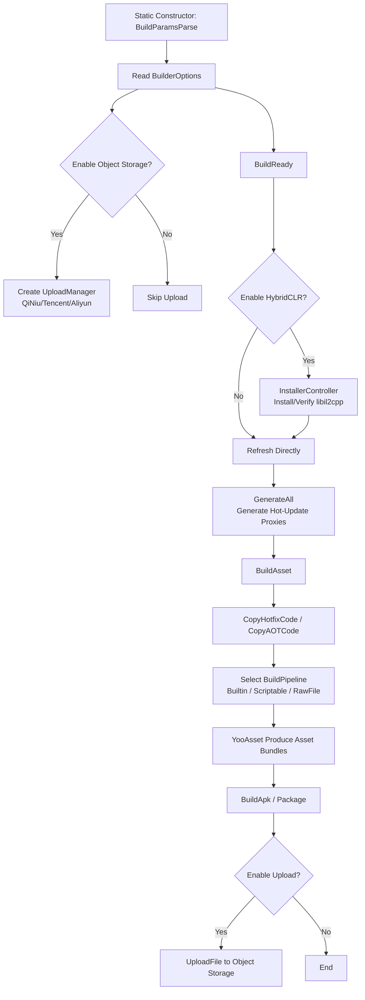

# How It Works: Builder Pipeline

The Builder pipeline is a set of build entries triggered sequentially by GameFrameX Unity Builder on the Editor side. It is responsible for everything from preparing the environment in `BuildReady`, to building YooAsset asset bundles in `BuildAsset`, to producing the package in `BuildApk` and optionally uploading it to object storage. The entire pipeline is connected through static methods organized across files in `Builder.cs` using the `partial` keyword, with each method corresponding to one pipeline stage.

## Pipeline Stages Overview

| Stage | Entry Method | Main Work |
|------|---------|---------|
| 1. Parameter Parsing | `Builder.BuildParamsParse()` (called in static constructor) | Parses JSON config file and populates `BuilderOptions`; creates `IObjectStorageUploadManager` (QiNiu/Tencent Cloud/Aliyun) based on scripting define symbols |
| 2. Build Preparation | `Builder.BuildReady()` | When HybridCLR is enabled, installs/verifies libil2cpp, refreshes `AssetDatabase`, generates hot-update proxies |
| 3. Asset Building | `Builder.BuildAsset()` | Copies hot-update and AOT assemblies, selects the build pipeline, calls YooAsset to produce asset bundles |
| 4. Packaging | `Builder.BuildApk()` (similar methods for other platforms) | Calls the platform builder, optionally uploads APK and logs to object storage |

## How It Works at a Glance



## Stage 1: Parameter Parsing

The static constructor of `Builder.cs` first calls `BuildParamsParse()` to read the JSON config and populate `_builderOptions`, then decides whether to instantiate the object storage upload manager based on scripting define symbols, and sets the save path template.

Source: [Editor/Builder.cs#L32-L49](https://github.com/GameFrameX/com.gameframex.unity.builder/blob/main/Editor/Builder.cs#L32-L49)

```csharp
static Builder()
{
    BuildParamsParse();
#if ENABLE_GAME_FRAME_X_OBJECT_STORAGE_QI_NIU
    ObjectStorageUploadManager = ObjectStorageUploadFactory.Create<QiNiuYunObjectStorageUploadManager>(
        _builderOptions.ObjectStorageKey, _builderOptions.ObjectStorageSecret,
        _builderOptions.ObjectStorageBucketName, _builderOptions.ObjectStorageEndPoint);
#endif
    /* ... Tencent Cloud / Aliyun branches are similar ... */
    ObjectStorageUploadManager.SetSavePath($"builder/{PlayerSettings.productName}/{EditorUserBuildSettings.activeBuildTarget}/{_builderOptions.JobName}/{Application.version}/{_builderOptions.BuildNumber}");
}
```

## Stage 2: `BuildReady` Build Preparation

`BuildReady` brings the environment to a consistent state before packaging begins: when HybridCLR is enabled, it verifies/installs libil2cpp, refreshes the AssetDatabase, and generates HybridCLR hot-update proxies; then if log upload is enabled, it uploads the logs once first.

Source: [Editor/Builder.BuildReady.cs#L15-L50](https://github.com/GameFrameX/com.gameframex.unity.builder/blob/main/Editor/Builder.BuildReady.cs#L15-L50)

```csharp
public static void BuildReady()
{
#if ENABLE_GAME_FRAME_X_HYBRID_CLR
    var installerController = new InstallerController();
    var isInstalled = installerController.HasInstalledHybridCLR();
    if (!isInstalled || installerController.InstalledLibil2cppVersion != installerController.PackageVersion)
    {
        installerController.InstallDefaultHybridCLR();
    }
    PrebuildCommand.GenerateAll();
#endif
    AssetDatabase.Refresh();
    if (_builderOptions.IsUploadLogFile)
    {
        ObjectStorageUploadManager.UploadFile(_builderOptions.LogFilePath);
    }
}
```

## Stage 3: `BuildAsset` Asset Building

`BuildAsset` first copies the hot-update/AOT assemblies to the runtime directory, then selects `BuiltinBuildPipeline`, `ScriptableBuildPipeline`, or `RawFileBuildPipeline` according to `_builderOptions.BuildPipeline`, and finally calls YooAsset to produce the package.

Source: [Editor/Builder.BuildAsset.cs#L15-L80](https://github.com/GameFrameX/com.gameframex.unity.builder/blob/main/Editor/Builder.BuildAsset.cs#L15-L80)

```csharp
BuildHotfixHelper.CopyHotfixCode();
AssetDatabase.Refresh();
BuildHotfixHelper.CopyAOTCode();
AssetDatabase.Refresh();

var buildPipeline = (EBuildPipeline)buildPipelineObj;
switch (buildPipeline)
{
    case EBuildPipeline.ScriptableBuildPipeline:
        pipeline = new ScriptableBuildPipeline();
        buildParameters = new ScriptableBuildParameters();
        break;
    case EBuildPipeline.RawFileBuildPipeline:
        pipeline = new RawFileBuildPipeline();
        buildParameters = new RawFileBuildParameters();
        break;
    default:
        pipeline = new BuiltinBuildPipeline();
        buildParameters = new BuiltinBuildParameters();
        break;
}
buildParameters.BuildMode = _builderOptions.IsIncrementalBuildPackage ? EBuildMode.IncrementalBuild : EBuildMode.ForceRebuild;
```

When the `EBuildPipeline` string is configured incorrectly, it prints `Invalid build pipeline type` and directly `return`s, without entering the packaging stage.

## Stage 4: `BuildApk` Packaging and Upload

`BuildApk` delegates to `BuildProductHelper.BuildPlayerAndroid()` to produce the APK, then based on the `IsUploadApk` / `IsUploadLogFile` options, uploads the artifact and logs to object storage.

Source: [Editor/Builder.cs#L62-L78](https://github.com/GameFrameX/com.gameframex.unity.builder/blob/main/Editor/Builder.cs#L62-L78)

```csharp
public static void BuildApk()
{
    var apkPath = BuildProductHelper.BuildPlayerAndroid();
    if (_builderOptions.IsUploadApk)
    {
        ObjectStorageUploadManager.UploadFile(apkPath);
    }
    if (_builderOptions.IsUploadLogFile)
    {
        ObjectStorageUploadManager.UploadFile(_builderOptions.LogFilePath);
    }
}
```

## Key Configuration Items (`BuilderOptions`)

| Field | Purpose | Default Value |
|------|------|--------|
| `BuildPipeline` | Choose `BuiltinBuildPipeline` / `ScriptableBuildPipeline` / `RawFileBuildPipeline` | — |
| `PackageName` | YooAsset package name | — |
| `PackageVersion` | Asset package version number; falls back to `yyyyMMddHHmmss` when empty | Empty string |
| `IsIncrementalBuildPackage` | `true`=incremental build, `false`=force rebuild | — |
| `BuildinFileCopyOption` | Built-in file copy option; falls back to `ClearAndCopyAll` when empty | Empty string |
| `IsUploadApk` / `IsUploadLogFile` | Whether to upload APK / logs | — |
| `ObjectStorageKey/Secret/BucketName/EndPoint` | Object storage credentials | Empty string |
| `JobName` / `BuildNumber` | Concatenated into the object storage path `builder/{product}/{target}/{job}/{version}/{buildNumber}` | Empty string |

Source: [Editor/BuilderOptions.cs#L1-L60](https://github.com/GameFrameX/com.gameframex.unity.builder/blob/main/Editor/BuilderOptions.cs#L1-L60)

## Upload Path Template

When object storage is enabled, the save path is uniformly:

```text
builder/{PlayerSettings.productName}/{activeBuildTarget}/{JobName}/{Application.version}/{BuildNumber}
```

Source: [Editor/Builder.cs#L47](https://github.com/GameFrameX/com.gameframex.unity.builder/blob/main/Editor/Builder.cs#L47)

## What's Next

- For differences in packaging methods across platforms, see the "Platform Packaging" task page (if it exists in the directory).
- For the complete list of `BuilderOptions` fields, see the "Build Options Quick Reference" reference page.
- For troubleshooting build failures, see the "What to Do When Build Fails" troubleshooting page.