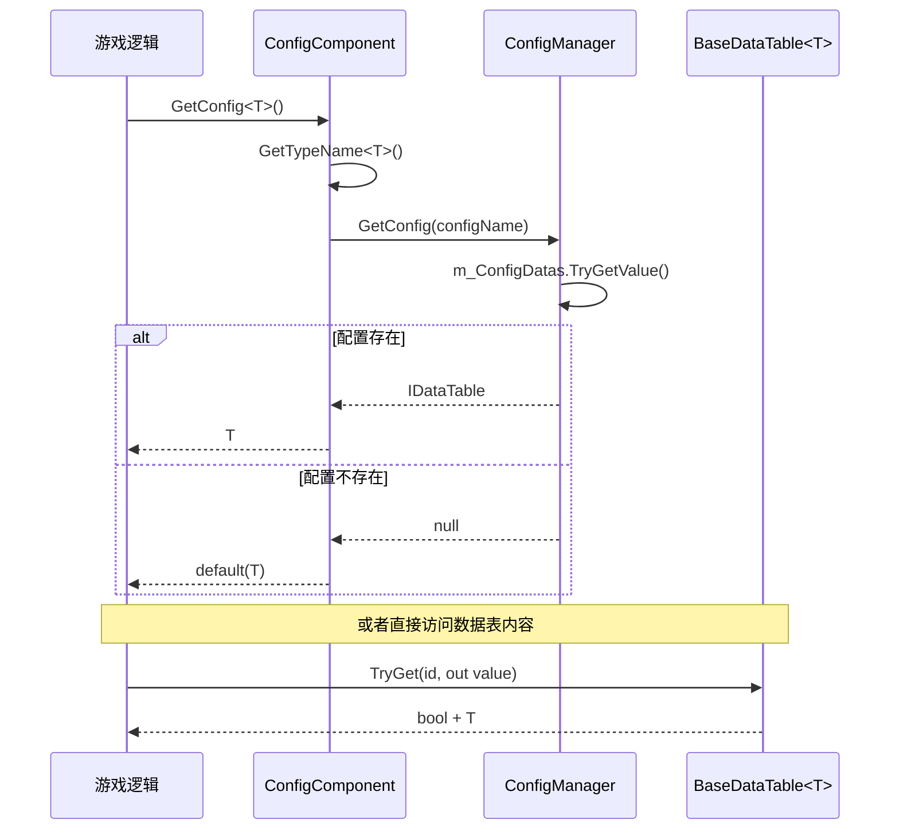

# Config 组件简介

Config 组件是 GameFrameX 框架中used forManagesConfig Table数据的核心模块。它provides了统一的Config Loading、存储和查询机制，使Config Data的Uses更加简单高效。

## 概述

GameFrameX Config 组件是一个轻量级、高性能的 Unity configurationManages解决方案，专门为游戏开发场景设计。该组件adopts模块化架构，将Config Data的存储、查询和Manages分离，provides清晰的分层结构。

### Design Goals

- **简化configurationAccess**：throughGeneric Interfaceprovides强Type的configurationAccess方式
- **高性能查询**：supports多种 ID Type（int、long、string）的快速find
- **灵活的数据操作**：provides丰富的Data Query和Aggregation Methods
- **事件驱动**：supportsconfigurationLoad Success/failure的事件通知

### Core Features

1. **强Typesupports**：Config Data以泛型 `IDataTable<T>` 形式Access，编译时Type Safety
2. **多键值索引**：supports `int`、`long`、`string` 三种Primary Key Type的查询
3. **数据聚合能力**：内置 Max、Min、Sum 等聚合函数
4. **Asynchronous Loading**：Config DatasupportsAsynchronous Loading模式
5. **Thread Safety**：Uses `ConcurrentDictionary` guarantee多Thread Safety

## Architecture Design

Config 组件adopts三层Architecture Design，各层Responsibility清晰，Dependencies明确：

```mermaid
graph TD
    subgraph UnityComponent["Unity 组件层"]
        CC[ConfigComponent<br/>配置组件]
    end

    subgraph ManagerLayer["管理器层"]
        ICM[IConfigManager<br/>配置管理器接口]
        CM[ConfigManager<br/>配置管理器实现]
    end

    subgraph DataTableLayer["数据表层"]
        IDataTable[IDataTable<br/>数据表接口]
        IDataTableG[IDataTable&lt;T&gt;<br/>泛型数据表接口]
        BDT[BaseDataTable&lt;T&gt;<br/>数据表基类]
    end

    subgraph EventLayer["事件层"]
        LCSEA[LoadConfigSuccessEventArgs<br/>加载成功事件]
        LCFA[LoadConfigFailureEventArgs<br/>加载失败事件]
    end

    CC --> ICM
    ICM <|.. CM
    IDataTable <|.. IDataTableG
    IDataTableG <|.. BDT
    CM -.->|存储| BDT
```

### 各层Responsibility

| 层级 | 组件 | ResponsibilityDescription |
|------|------|----------|
| Unity Component Layer | ConfigComponent | 作为 Unity Component暴露给场景，providesGame Logic调用的入口 |
| Manages器层 | ConfigManager | Manages所有Config Table的存储、检索和生命周期 |
| Data Table Layer | BaseDataTable<T> | Implements具体Config Data的存储和查询逻辑 |
| Event Layer | EventArgs | providesConfig Loading状态的事件通知 |

## Core Concepts

### Config Component (ConfigComponent)

`ConfigComponent` 是直接挂载在 Unity 场景中的组件，Inherits自 `GameFrameworkComponent`。它responsible for：

- Initialize `ConfigManager` 模块
- provides面向Game Logic的configurationAccess接口
- 维护Type到Config Name的map

> Source: [ConfigComponent.cs](https://github.com/GameFrameX/com.gameframex.unity.config/blob/main/Runtime/Config/ConfigComponent.cs#L46-L185)

### configurationManages器 (ConfigManager)

`ConfigManager` 是框架内部的configurationManages模块，Implements了 `IConfigManager` 接口。Uses `ConcurrentDictionary<string, IDataTable>` 存储所有Config Table数据。

### Data Table接口 (IDataTable)

Data Table接口分为两个层次：

- **IDataTable**：Non-generic Base Interface，定义通用的Asynchronous LoadingMethod
- **IDataTable<T>**：Generic Interface，Inherits自 `IDataTable`，provides强Type的数据AccessMethod

> Source: [IDataTable.cs](https://github.com/GameFrameX/com.gameframex.unity.config/blob/main/Runtime/Config/Config/IDataTable.cs#L39-L355)

### Data Table基类 (BaseDataTable<T>)

`BaseDataTable<T>` 是所有具体Config Data表的Abstract Base Class，provides了：

- 内部Uses `Dictionary<long, T>` 和 `Dictionary<string, T>` 分别存储不同Primary Key Type的数据
- Implements了 `TryGet` 系列Methodused for安全的查询
- provides了Indexersupports直接through `table[id]` 方式Access
- Implements了 `FirstOrDefault`、`LastOrDefault`、`All` 等便捷Property
- provides了 `Find`、`FindList`、`FindListArray` 等Query Methods
- 内置 `Max`、`Min`、`Sum` 等Aggregation CalculationMethod

> Source: [BaseDataTable.cs](https://github.com/GameFrameX/com.gameframex.unity.config/blob/main/Runtime/Config/Config/BaseDataTable.cs#L40-L520)

## Data Access Flow

Config Data从Creates到Access的完整流程如下：



## Getting Started

### 基本Uses步骤

1. **CreatesData Table类**：Inherits `BaseDataTable<T>`，Implements `LoadAsync` Method
2. **挂载组件**：在 Unity 场景中挂载 `ConfigComponent` 组件
3. **Get Config**：through `ConfigComponent.GetConfig<T>()` Get Config实例

### 代码示例

```csharp
// 1. 定义配置数据类型
public class ItemData
{
    public int Id { get; set; }
    public string Name { get; set; }
    public string Description { get; set; }
}

// 2. 创建具体的数据表实现
public class ItemTable : BaseDataTable<ItemData>
{
    public override async Task LoadAsync()
    {
        // 在这里实现从文件或网络加载数据的逻辑
        // 加载完成后将数据添加到字典中
        LongDataMaps.Add(1, new ItemData { Id = 1, Name = "武器", Description = "新手武器" });
        LongDataMaps.Add(2, new ItemData { Id = 2, Name = "护甲", Description = "新手护甲" });
        DataList.AddRange(LongDataMaps.Values);
    }
}

// 3. 在游戏逻辑中使用配置
public class GameManager : MonoBehaviour
{
    private ConfigComponent _configComponent;
    
    private async void Start()
    {
        _configComponent = UnityEngine.Component.FindObjectOfType<ConfigComponent>();
        
        // 加载配置
        var itemTable = new ItemTable();
        await itemTable.LoadAsync();
        _configComponent.Add("ItemTable", itemTable);
        
        // 访问配置数据 - 使用 TryGet 安全获取
        if (itemTable.TryGet(1, out var item))
        {
            Debug.Log($"物品名称: {item.Name}");
        }
        
        // 使用索引器访问
        var item2 = itemTable[2];
        
        // 条件查询
        var foundItems = itemTable.FindList(x => x.Name.Contains("护"));
    }
}
```

> Source: [ConfigComponent.cs](https://github.com/GameFrameX/com.gameframex.unity.config/blob/main/Runtime/Config/ConfigComponent.cs#L108-L127)

## API Overview

### ConfigComponent 核心Method

| Method | Description |
|------|------|
| `GetConfig<T>()` | get指定Type的Config Table实例 |
| `HasConfig<T>()` | check指定Type的configurationWhether exists |
| `RemoveConfig<T>()` | remove指定Type的configuration |
| `RemoveAllConfigs()` | remove所有configuration |
| `Add(string, IDataTable)` | add新的Config Table |

### IDataTable<T> 核心Member

| Member | Description |
|------|------|
| `TryGet(int/long/string, out T)` | 尝试根据主键get数据 |
| `this[int/long/string id]` | Indexer，supports直接through主键Access |
| `FirstOrDefault` | get第一个数据元素 |
| `LastOrDefault` | get最后一个数据元素 |
| `All` | Get all data元素 |
| `Find(Func<T, bool>)` | find第一个匹配的元素 |
| `FindList(Func<T, bool>)` | find所有匹配的元素 |
| `ForEach(Action<T>)` | iterate所有元素 |
| `Max/Min<Tk>()` | Get maximum value/最小值 |
| `Sum()` | Calculate sum |

## Dependencies

Config 组件Depends on以下 GameFrameX 核心模块：

| Depends on模块 | 最低版本 | UsageDescription |
|----------|----------|----------|
| com.gameframex.unity | 1.1.1 | Core Framework基础 |
| com.gameframex.unity.asset | 1.0.6 | 资源loadsupports |
| com.gameframex.unity.event | 1.0.0 | Event System |

> 详细DependenciesPlease refer to [Dependencies](../2-installation/dependencies) 文档

## Related Links

- [Features](./1-overview.features) - 了解 Config 组件的完整功能列表
- [Installation](../2-installation.install-methods) - 掌握组件的正确installation步骤
- [Basic Usage](../3-getting-started.basic-usage) - 快速上手Config Component的Uses
- [Data Table Definition](../3-getting-started.data-table-definition) - 学习如何定义自己的Data Table
- [Config Component详解](../4-core-concepts.config-component) - ConfigComponent 深入parse
- [configurationManages器详解](../4-core-concepts.config-manager) - ConfigManager Implements细节
- [IDataTable 接口详解](../4-core-concepts.idata-table) - Data Table接口完整文档
