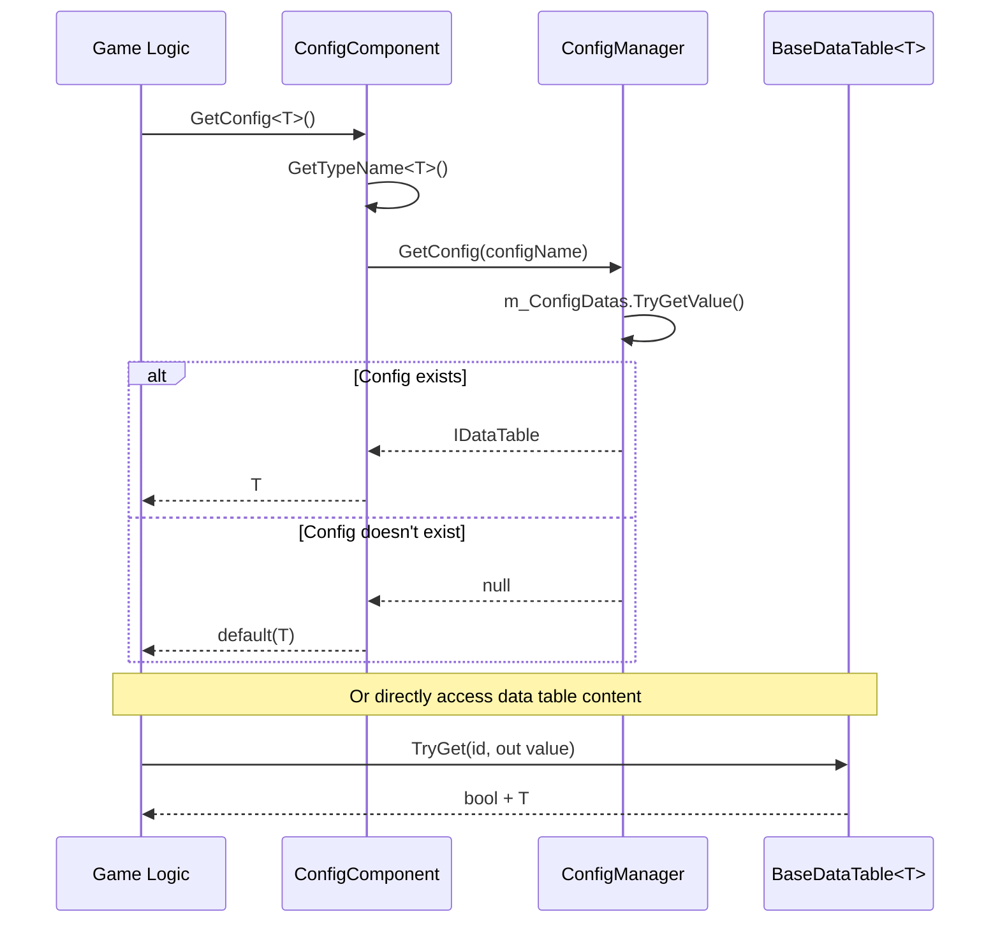

# Overview

This document provides an overview of the GameFrameX Config component, a core module for managing configuration table data in Unity games.

## Overview

GameFrameX Config is a lightweight, high-performance Unity configuration management solution designed specifically for game development scenarios. The component uses a modular architecture that separates configuration data storage, querying, and management, providing a clear layered structure.

### Design Goals

- **Simplified Configuration Access**: Provides strongly-typed configuration access through generic interfaces
- **High-Performance Queries**: Supports fast lookup with multiple ID types (int, long, string)
- **Flexible Data Operations**: Provides rich data querying and aggregation methods
- **Event-Driven**: Supports event notifications for configuration loading success/failure

### Core Features

1. **Strongly-Typed Support**: Configuration data is accessed through generic `IDataTable<T>` with compile-time type safety
2. **Multi-Key Indexing**: Supports `int`, `long`, `string` three primary key types for queries
3. **Data Aggregation**: Built-in Max, Min, Sum and other aggregation functions
4. **Async Loading**: Configuration data supports async loading mode
5. **Thread Safety**: Uses `ConcurrentDictionary` to ensure multi-thread safety

## Architecture Design

The Config component uses a three-layer architecture design with clear responsibilities and explicit dependencies:

```mermaid
graph TD
    subgraph UnityComponent["Unity Component Layer"]
        CC[ConfigComponent<br/>Config Component]
    end

    subgraph ManagerLayer["Manager Layer"]
        ICM[IConfigManager<br/>Config Manager Interface]
        CM[ConfigManager<br/>Config Manager Implementation]
    end

    subgraph DataTableLayer["Data Table Layer"]
        IDataTable[IDataTable<br/>Data Table Interface]
        IDataTableG[IDataTable&lt;T&gt;<br/>Generic Data Table Interface]
        BDT[BaseDataTable&lt;T&gt;<br/>Data Table Base Class]
    end

    subgraph EventLayer["Event Layer"]
        LCSEA[LoadConfigSuccessEventArgs<br/>Load Success Event]
        LCFA[LoadConfigFailureEventArgs<br/>Load Failure Event]
    end

    CC --> ICM
    ICM <|.. CM
    IDataTable <|.. IDataTableG
    IDataTableG <|.. BDT
    CM -.->|Storage| BDT
```

### Layer Responsibilities

| Layer | Component | Description |
|------|-----------|-------------|
| Unity Component Layer | ConfigComponent | Exposed as a Unity component for scene access, providing the entry point for game logic calls |
| Manager Layer | ConfigManager | Manages storage, retrieval, and lifecycle of all configuration tables |
| Data Table Layer | `BaseDataTable<T>` | Implements specific configuration data storage and query logic |
| Event Layer | EventArgs | Provides event notifications for configuration loading status |

## Core Concepts

### ConfigComponent

`ConfigComponent` is a component mounted in Unity scenes, inheriting from `GameFrameworkComponent`. It is responsible for:

- Initializing the `ConfigManager` module
- Providing configuration access interfaces for game logic
- Maintaining type-to-configuration name mappings

> Source: [ConfigComponent.cs](https://github.com/GameFrameX/com.gameframex.unity.config/blob/main/Runtime/Config/ConfigComponent.cs#L46-L185)

### ConfigManager

`ConfigManager` is the internal configuration management module that implements the `IConfigManager` interface. It uses `ConcurrentDictionary<string, IDataTable>` to store all configuration table data.

### IDataTable Interface

The data table interface has two layers:

- **IDataTable**: Non-generic base interface defining common async loading methods
- **`IDataTable<T>`**: Generic interface inheriting from `IDataTable`, providing strongly-typed data access methods

> Source: [IDataTable.cs](https://github.com/GameFrameX/com.gameframex.unity.config/blob/main/Runtime/Config/Config/IDataTable.cs#L39-L355)

### `BaseDataTable<T>`

`BaseDataTable<T>` is the abstract base class for all concrete configuration data tables, providing:

- Internal use of `Dictionary<long, T>` and `Dictionary<string, T>` for storing different primary key type data
- Implementation of `TryGet` series methods for safe queries
- Indexer support for direct access via `table[id]`
- Implementation of `FirstOrDefault`, `LastOrDefault`, `All` and other convenience properties
- Provides `Find`, `FindList`, `FindListArray` and other query methods
- Built-in `Max`, `Min`, `Sum` and other aggregate calculation methods

> Source: [BaseDataTable.cs](https://github.com/GameFrameX/com.gameframex.unity.config/blob/main/Runtime/Config/Config/BaseDataTable.cs#L40-L520)

## Data Access Flow

The complete flow from configuration data creation to access is as follows:



## Getting Started

### Basic Usage Steps

1. **Create Data Table Class**: Inherit `BaseDataTable<T>` and implement `LoadAsync` method
2. **Mount Component**: Mount `ConfigComponent` in Unity scene
3. **Get Configuration**: Get configuration instance through `ConfigComponent.GetConfig<T>()`

### Code Example

```csharp
// 1. Define configuration data type
public class ItemData
{
    public int Id { get; set; }
    public string Name { get; set; }
    public string Description { get; set; }
}

// 2. Create concrete data table implementation
public class ItemTable : BaseDataTable<ItemData>
{
    public override async Task LoadAsync()
    {
        // Implement data loading from file or network here
        // Add data to dictionary after loading
        LongDataMaps.Add(1, new ItemData { Id = 1, Name = "Weapon", Description = "Beginner weapon" });
        LongDataMaps.Add(2, new ItemData { Id = 2, Name = "Armor", Description = "Beginner armor" });
        DataList.AddRange(LongDataMaps.Values);
    }
}

// 3. Use configuration in game logic
public class GameManager : MonoBehaviour
{
    private ConfigComponent _configComponent;
    
    private async void Start()
    {
        _configComponent = UnityEngine.Component.FindObjectOfType<ConfigComponent>();
        
        // Load configuration
        var itemTable = new ItemTable();
        await itemTable.LoadAsync();
        _configComponent.Add("ItemTable", itemTable);
        
        // Access configuration data - use TryGet for safe retrieval
        if (itemTable.TryGet(1, out var item))
        {
            Debug.Log($"Item name: {item.Name}");
        }
        
        // Use indexer to access
        var item2 = itemTable[2];
        
        // Conditional query
        var foundItems = itemTable.FindList(x => x.Name.Contains("Armor"));
    }
}
```

> Source: [ConfigComponent.cs](https://github.com/GameFrameX/com.gameframex.unity.config/blob/main/Runtime/Config/ConfigComponent.cs#L108-L127)

## API Overview

### ConfigComponent Core Methods

| Method | Description |
|--------|-------------|
| `GetConfig<T>()` | Get configuration table instance of specified type |
| `HasConfig<T>()` | Check if configuration of specified type exists |
| `RemoveConfig<T>()` | Remove configuration of specified type |
| `RemoveAllConfigs()` | Remove all configurations |
| `Add(string, IDataTable)` | Add a new configuration table |

### `IDataTable<T>` Core Members

| Member | Description |
|--------|-------------|
| `TryGet(int/long/string, out T)` | Try to get data by primary key |
| `this[int/long/string id]` | Indexer for direct primary key access |
| `FirstOrDefault` | Get the first data element |
| `LastOrDefault` | Get the last data element |
| `All` | Get all data elements |
| `Find(Func<T, bool>)` | Find the first matching element |
| `FindList(Func<T, bool>)` | Find all matching elements |
| `ForEach(Action<T>)` | Iterate through all elements |
| `Max/Min<Tk>()` | Get maximum/minimum value |
| `Sum()` | Calculate sum |

## Dependencies

The Config component depends on the following GameFrameX core modules:

| Dependency Module | Min Version | Description |
|-------------------|-------------|-------------|
| com.gameframex.unity | 1.1.1 | Core framework foundation |
| com.gameframex.unity.asset | 1.0.6 | Asset loading support |
| com.gameframex.unity.event | 1.0.0 | Event system |

> For detailed dependency requirements, refer to [Dependency Requirements](../2-installation/dependencies) document

## Related Links

- [Features](./1-overview.features) - Complete feature list of Config component
- [Installation](../2-installation.install-methods) - Correct installation steps for the component
- [Basic Usage](../3-getting-started.basic-usage) - Quick start guide for using the configuration component
- [Data Table Definition](../3-getting-started.data-table-definition) - Learn how to define your own data tables
- [ConfigComponent Details](../4-core-concepts.config-component) - In-depth analysis of ConfigComponent
- [ConfigManager Details](../4-core-concepts.config-manager) - ConfigManager implementation details
- [IDataTable Interface Details](../4-core-concepts.idata-table) - Complete documentation of data table interface