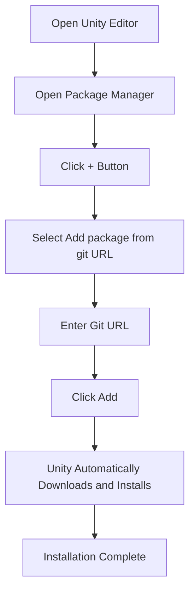

# Installation

This document introduces multiple installation methods for the GameFrameX Config component, helping developers quickly integrate this component into Unity projects.

## Overview

GameFrameX Config is the Config Table component of the GameFrameX framework, providing configuration table related interfaces and making configuration functionality easier to use. Before using this component, you need to correctly install it in your Unity project.

> **Current Version**: 1.1.3
> **Unity Version Requirement**: 2019.4 and above

## Dependencies

Before installing the Config component, ensure the following dependency packages are already installed in your project:

| Dependency Package | Minimum Version | Description |
|--------|----------|------|
| com.gameframex.unity | 1.1.1 | GameFrameX Core Framework |
| com.gameframex.unity.asset | 1.0.6 | Asset Management Module |
| com.gameframex.unity.event | 1.0.0 | Event System Module |

The Config component will automatically process dependency package installation. When using Package Manager for installation, all dependencies will be automatically installed.

## Installation

### Method 1: Install via manifest.json (Recommended)

This is the most recommended installation method, facilitating version management and team collaboration.

1. Open the `Packages` folder in your Unity project
2. Locate and edit the `manifest.json` file
3. Add the following content under the `dependencies` node:

```json
{
  "dependencies": {
    "com.gameframex.unity.config": "https://github.com/GameFrameX/com.gameframex.unity.config.git"
  }
}
```

4. After saving the file, Unity will automatically download and install dependency packages

> **Note**: When installing via Git URL, Unity will automatically parse and install all dependency items.

### Method 2: Install via Unity Package Manager

1. Open Unity Editor
2. Navigate to menu **Window** → **Package Manager**
3. In the Package Manager window, click the **+** button in the upper left corner
4. Select the **Add package from git URL...** option
5. Paste the following address in the input field:

```
https://github.com/GameFrameX/com.gameframex.unity.config.git
```

6. Click the **Add** button. Unity will automatically download and install the package and its dependencies



### Method 3: Place Directly in Packages Directory

Suitable for scenarios requiring source code modifications or deep customization.

1. Clone or download the repository:

```bash
git clone https://github.com/GameFrameX/com.gameframex.unity.config.git
```

2. Copy the downloaded repository folder to the `Packages` directory of your Unity project
3. Unity will automatically recognize and load the package

> **Note**: Packages installed this way will not automatically receive updates and require manual updates.

## Installation Verification

After installation completes, you can verify if the Config component is correctly installed through the following methods:

1. **Check Package Manager**: Confirm "GameFrameX Config" is displayed in Package Manager
2. **Check Assembly Definition**: Confirm `GameFrameX.Config.Runtime.asmdef` has been correctly compiled
3. **Use Component**: Try adding `ConfigComponent` in the scene to check if it works correctly

```csharp
// Verify installation - check if Config component is available in code
using GameFrameX.Runtime;

var configComponent = UnityEngine.GameObject.FindObjectOfType<ConfigComponent>();
if (configComponent != null)
{
    UnityEngine.Debug.Log("Config component installed successfully!");
}
```

## Upgrade and Update

### Automatic Update (Methods 1 and 2)

Packages installed via Package Manager can be updated through the following methods:

1. Select GameFrameX Config in Package Manager
2. Click the dropdown arrow next to the version number
3. Select the latest version or click "See all versions" to view available versions

### Manual Update (Method 3)

For installations directly placed in Packages directory:

1. Delete the original package folder
2. Download the latest version again
3. Copy to Packages directory

## Common Installation Issues

### Git URL Inaccessible

If you encounter issues accessing the Git URL, try:
- Use a proxy
- Fork the repository to your own GitHub account
- Download the ZIP package and decompress to Packages directory

### Dependency Package Version Conflicts

When dependency package version conflicts occur:
1. Check the version requirements of each dependency package
2. Unify all GameFrameX components to the same major version
3. Refer to [Dependencies](./2-installation.dependencies) document

### Unity Version Incompatibility

Confirm Unity Editor version meets requirements (2019.4+). Older versions may require upgrading Unity Editor.

## Related Links

- [Dependencies](./2-installation.dependencies) - Learn more about component dependencies
- [Getting Started](./3-getting-started.basic-usage) - Learn about basic usage of the component
- [Config Component Introduction](./1-overview.introduction) - Learn about Config component features
- [GitHub Repository](https://github.com/GameFrameX/com.gameframex.unity.config.git) - Get the latest version
- [Official Documentation](https://gameframex.doc.alianblank.com) - View complete documentation