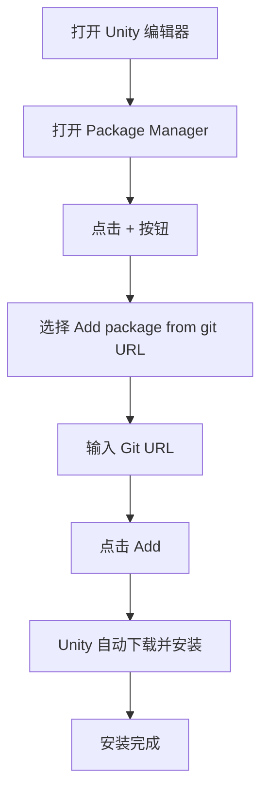

# Installation

This document introduces GameFrameX Config Config Component的多种Installation，帮助开发者快速在 Unity 项目中集成该组件。

## 概述

GameFrameX Config 是 GameFrameX 框架的Config Table Component，providesConfig Table相关的接口，使configuration功能的Uses更加简单高效。在Uses该组件之前，需要先将其正确installation到 Unity 项目中。

> **Current Version**: 1.1.3  
> **Unity 版本要求**: 2019.4 及以上

## Dependencies

在installation Config 组件之前，需要ensure项目中已installation以下Depends on包：

| Depends on包 | 最低版本 | Description |
|--------|----------|------|
| com.gameframex.unity | 1.1.1 | GameFrameX Core Framework |
| com.gameframex.unity.asset | 1.0.6 | 资源Manages模块 |
| com.gameframex.unity.event | 1.0.0 | Event System模块 |

Config 组件会自动processDepends on包的installation，当Uses Package Manager installation时会自动installation所有Depends on。

## Installation

### 方式一：through manifest.json installation（推荐）

这是最推荐的Installation，方便版本Manages和团队协作。

1. 打开 Unity 项目中的 `Packages` 文件夹
2. 找到并Edit `manifest.json` 文件
3. 在 `dependencies` 节点下add以下内容：

```json
{
  "dependencies": {
    "com.gameframex.unity.config": "https://github.com/GameFrameX/com.gameframex.unity.config.git"
  }
}
```

4. save文件后，Unity 会自动下载并installationDepends on包

> **注意**: Uses Git URL 方式installation时，Unity 会自动parse并installation所有Depends on项。

### 方式二：through Unity Package Manager installation

1. 打开 Unity Editor
2. 依次点击菜单 **Window** → **Package Manager**
3. 在 Package Manager 窗口中，点击左上角的 **+** 按钮
4. 选择 **Add package from git URL...** 选项
5. 在输入框中粘贴以下地址：

```
https://github.com/GameFrameX/com.gameframex.unity.config.git
```

6. 点击 **Add** 按钮，Unity 会自动下载并installation包及其Depends on



### 方式三：直接放置到 Packages 目录

suitable for需要修改源码或进行深度定制的场景。

1. 克隆或下载仓库：

```bash
git clone https://github.com/GameFrameX/com.gameframex.unity.config.git
```

2. 将下载的仓库文件夹复制到 Unity 项目的 `Packages` 目录下
3. Unity 会自动识别并load包

> **注意**: 这种方式installation的包不会自动receiveupdate，需要手动update。

## Installation Verification

installationcomplete后，可以through以下方式verify Config 组件是否正确installation：

1. **check Package Manager**: 在 Package Manager 中确认 "Game Frame X Config" 已显示
2. **check Assembly Definition**: 确认 `GameFrameX.Config.Runtime.asmdef` 已正确编译
3. **Uses组件**: 在场景中尝试add `ConfigComponent` check是否正常工作

```csharp
// 验证安装 - 在代码中检查 Config 组件是否可用
using GameFrameX.Runtime;

var configComponent = UnityEngine.GameObject.FindObjectOfType<ConfigComponent>();
if (configComponent != null)
{
    UnityEngine.Debug.Log("Config 组件安装成功！");
}
```

## 升级与update

### 自动update（方式一和二）

Uses Package Manager installation的包可以through以下方式update：

1. 在 Package Manager 中选择 GameFrameX Config
2. 点击版本号旁的下拉箭头
3. 选择最新版本或点击 "See all versions" 查看可用版本

### 手动update（方式三）

对于直接放置到 Packages 目录的Installation：

1. delete原有的包文件夹
2. 重新下载最新版本
3. 复制到 Packages 目录

## 常见installation问题

### Git URL 无法Access

如果遇到 Git URL 无法Access的问题，可以尝试：
- Uses代理
- 将仓库 fork 到自己的 GitHub 账户
- 下载 ZIP 包后decompress到 Packages 目录

### Depends on包版本冲突

当出现Depends on包版本冲突时：
1. check各个Depends on包的版本要求
2. 统一所有 GameFrameX 组件到相同主版本
3. 参考 [Dependencies](./2-installation.dependencies) 文档

### Unity 版本不兼容

确认 Unity Editor版本是否符合要求（2019.4+），旧版本可能需要升级 Unity Editor。

## Related Links

- [Dependencies](./2-installation.dependencies) - 详细了解组件Dependencies
- [Getting Started](./3-getting-started.basic-usage) - 了解组件的基本Uses
- [Config 组件简介](./1-overview.introduction) - 了解 Config 组件功能
- [GitHub 仓库](https://github.com/GameFrameX/com.gameframex.unity.config.git) - get最新版本
- [官方文档](https://gameframex.doc.alianblank.com) - 查看完整文档
