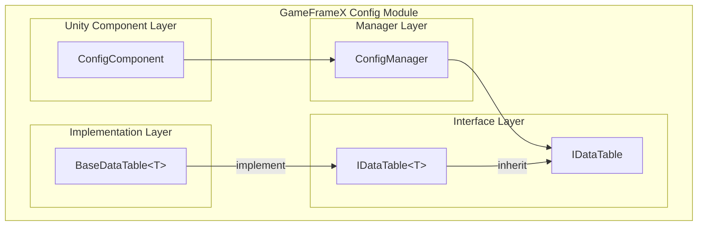

# Basic Usage

The Config component is the core module in the GameFrameX framework for managing game configuration data, providing an efficient, type-safe configuration data storage and access mechanism. Through the Config component, developers can easily load and manage various configuration tables in games (such as item tables, character tables, level tables, etc.) and quickly query configuration data through strongly-typed interfaces.

## Overview

The design goal of the Config component is to provide a unified configuration data management solution for game development. In game development, configuration data is usually stored in configuration tables in formats like Excel, CSV, or JSON. This data needs to be quickly queried and accessed at runtime. The Config component meets this requirement through the following features:

- **Type Safety**: Provides compile-time type checking through generic interfaces, reducing runtime errors
- **High-Efficiency Queries**: Uses Dictionary internally for storage, supporting O(1) time complexity data lookup
- **Flexible Primary Key Support**: Supports three primary key types - int, long, string, adapting to different configuration table requirements
- **Rich Query Operations**: Provides commonly used query methods such as Find, Max, Min, Sum

### Core Component Architecture



### Data Access Flow

```mermaid
sequenceDiagram
    participant Dev as Developer Code
    participant CC as ConfigComponent
    participant CM as ConfigManager
    participant DT as IDataTable&lt;T&gt;

    Dev->>CC: GetConfig&lt;TDataTable&gt;()
    CC->>CM: GetConfig(configName)
    CM->>DT: Return IDataTable instance
    DT-->>Dev: TDataTable data table object
    Dev->>DT: TryGet(id, out value)
    DT-->>Dev: Return query result
```

## Create Data Table

To use the Config component, you first need to create a custom data table class. The data table class needs to inherit from the `BaseDataTable<T>` abstract class and implement the `LoadAsync` method to load configuration data.

### Define Data Model

First, define the model class for configuration data. For example, create an item configuration data model:

```csharp
using GameFrameX.Config.Runtime;

[Serializable]
public class ItemData
{
    public int Id { get; set; }
    public string Name { get; set; }
    public string Description { get; set; }
    public int Quality { get; set; }
    public int Price { get; set; }
}
```
> Source: [Example Code](https://github.com/GameFrameX/com.gameframex.unity.config/blob/main/README.md)

### Create Data Table Class

Inherit `BaseDataTable<T>` and implement the `LoadAsync` method:

```csharp
using System.Collections.Generic;
using System.Threading.Tasks;
using GameFrameX.Config.Runtime;

public class ItemDataTable : BaseDataTable<ItemData>
{
    public override async Task LoadAsync()
    {
        // Load data from configuration source
        // This can load from files, network, or resource system
        var items = new List<ItemData>
        {
            new ItemData { Id = 1001, Name = "Health Potion", Description = "Restore 100 HP", Quality = 1, Price = 50 },
            new ItemData { Id = 1002, Name = "Mana Potion", Description = "Restore 50 MP", Quality = 1, Price = 30 },
            new ItemData { Id = 1003, Name = "Purple Equipment", Description = "High quality equipment", Quality = 5, Price = 1000 }
        };

        // Add data to dictionary
        foreach (var item in items)
        {
            LongDataMaps.Add(item.Id, item);
            DataList.Add(item);
        }

        await Task.CompletedTask;
    }
}
```
> Source: [BaseDataTable.cs](https://github.com/GameFrameX/com.gameframex.unity.config/blob/main/Runtime/Config/Config/BaseDataTable.cs#L48-L69)

The `BaseDataTable<T>` class provides two main internal dictionaries for storing data:
- `LongDataMaps`: Used for storing data with long integer primary keys
- `StringDataMaps`: Used for storing data with string primary keys
- `DataList`: Used for storing all data objects in sequence

## Register and Use Data Table

### Add ConfigComponent

Create an empty object in the Unity scene and add the ConfigComponent component:

1. In Unity Editor, right-click on the Hierarchy panel
2. Select `GameObject` → `Create Empty`
3. In the Inspector panel, click `Add Component`
4. Search and add `ConfigComponent` (located under the GameFrameX/Config menu)

```csharp
// Can also add via code
var configEntity = new GameObject("ConfigSystem");
var configComponent = configEntity.AddComponent<GameFrameX.Config.Runtime.ConfigComponent>();
```
> Source: [ConfigComponent.cs](https://github.com/GameFrameX/com.gameframex.unity.config/blob/main/Runtime/Config/ConfigComponent.cs#L46-L48)

### Register Data Table

Register the created data table to ConfigComponent:

```csharp
using GameFrameX.Config.Runtime;
using UnityEngine;

public class GameStart : MonoBehaviour
{
    private ConfigComponent _configComponent;

    private void Start()
    {
        // Get ConfigComponent instance
        _configComponent = GetComponent<ConfigComponent>();

        if (_configComponent == null)
        {
            _configComponent = gameObject.AddComponent<ConfigComponent>();
        }

        // Create and register data table
        var itemDataTable = new ItemDataTable();
        _configComponent.Add("ItemDataTable", itemDataTable);

        // Asynchronously load data
        _ = LoadDataAsync();
    }

    private async Task LoadDataAsync()
    {
        var itemDataTable = _configComponent.GetConfig<ItemDataTable>();
        if (itemDataTable != null)
        {
            await itemDataTable.LoadAsync();
            Debug.Log($"Item table loaded, total {itemDataTable.Count} records");
        }
    }
}
```
> Source: [ConfigComponent.cs](https://github.com/GameFrameX/com.gameframex.unity.config/blob/main/Runtime/Config/ConfigComponent.cs#L108-L127)

### Generic Method Convenient Access

ConfigComponent provides generic methods to simplify data table access:

```csharp
// Check if data table of specified type exists
bool hasTable = _configComponent.HasConfig<ItemDataTable>();

// Get data table instance
var itemDataTable = _configComponent.GetConfig<ItemDataTable>();

// Remove data table
_configComponent.RemoveConfig<ItemDataTable>();

// Clear all data tables
_configComponent.RemoveAllConfigs();
```
> Source: [ConfigComponent.cs](https://github.com/GameFrameX/com.gameframex.unity.config/blob/main/Runtime/Config/ConfigComponent.cs#L129-L170)

## Data Query

The IDataTable<T> interface provides rich data query methods, supporting various query scenarios.

### Basic Query

Use indexer or TryGet method to query data:

```csharp
var itemDataTable = _configComponent.GetConfig<ItemDataTable>();

// Use indexer query (recommended)
// Query by integer primary key
ItemData item1 = itemDataTable[1001];

// Query by long integer primary key
ItemData item2 = itemDataTable[(long)1001];

// Query by string primary key
ItemData item3 = itemDataTable["1001"];

// Use TryGet method query (safer)
if (itemDataTable.TryGet(1001, out ItemData item))
{
    Debug.Log($"Found item: {item.Name}");
}
```
> Source: [BaseDataTable.cs](https://github.com/GameFrameX/com.gameframex.unity.config/blob/main/Runtime/Config/Config/BaseDataTable.cs#L119-L162)

### Conditional Query

Use Find method for conditional query:

```csharp
var itemDataTable = _configComponent.GetConfig<ItemDataTable>();

// Find first matching object
ItemData highQualityItem = itemDataTable.Find(item => item.Quality >= 5);

// Find all matching objects
ItemData[] allHighQualityItems = itemDataTable.FindListArray(item => item.Quality >= 3);

// Find all matching objects (return list)
List<ItemData> expensiveItems = itemDataTable.FindList(item => item.Price > 100);
```
> Source: [BaseDataTable.cs](https://github.com/GameFrameX/com.gameframex.unity.config/blob/main/Runtime/Config/Config/BaseDataTable.cs#L296-L336)

### Aggregation Query

Use Max, Min, Sum methods for aggregation calculations:

```csharp
var itemDataTable = _configComponent.GetConfig<ItemDataTable>();

// Get maximum value of specified property
int maxPrice = itemDataTable.Max(item => item.Price);

// Get minimum value of specified property
int minPrice = itemDataTable.Min(item => item.Price);

// Calculate sum of properties
int totalPrice = itemDataTable.Sum(item => item.Price);

// Count number of elements
int count = itemDataTable.Count;

// Get all data
ItemData[] allItems = itemDataTable.All;
```
> Source: [BaseDataTable.cs](https://github.com/GameFrameX/com.gameframex.unity.config/blob/main/Runtime/Config/Config/BaseDataTable.cs#L351-L449)

### Iteration Operation

Use ForEach method to iterate through all data:

```csharp
var itemDataTable = _configComponent.GetConfig<ItemDataTable>();

// Iterate through all data
itemDataTable.ForEach(item =>
{
    Debug.Log($"Item: {item.Name}, Price: {item.Price}");
});
```
> Source: [BaseDataTable.cs](https://github.com/GameFrameX/com.gameframex.unity.config/blob/main/Runtime/Config/Config/BaseDataTable.cs#L338-L349)

### Get First and Last Elements

```csharp
var itemDataTable = _configComponent.GetConfig<ItemDataTable>();

// Get first element
ItemData first = itemDataTable.FirstOrDefault;

// Get last element
ItemData last = itemDataTable.LastOrDefault;
```
> Source: [BaseDataTable.cs](https://github.com/GameFrameX/com.gameframex.unity.config/blob/main/Runtime/Config/Config/BaseDataTable.cs#L223-L255)

## Complete Usage Example

The following is a complete Config System usage example:

```csharp
using System.Collections.Generic;
using System.Threading.Tasks;
using GameFrameX.Config.Runtime;
using UnityEngine;

// 1. Define data model
[System.Serializable]
public class ItemData
{
    public int Id { get; set; }
    public string Name { get; set; }
    public string Description { get; set; }
    public int Quality { get; set; }
    public int Price { get; set; }
}

// 2. Create data table class
public class ItemDataTable : BaseDataTable<ItemData>
{
    public override async Task LoadAsync()
    {
        // Simulate loading data from file or network
        var items = new List<ItemData>
        {
            new ItemData { Id = 1001, Name = "Health Potion", Description = "Restore 100 HP", Quality = 1, Price = 50 },
            new ItemData { Id = 1002, Name = "Mana Potion", Description = "Restore 50 MP", Quality = 1, Price = 30 },
            new ItemData { Id = 1003, Name = "Golden Weapon", Description = "Legendary golden weapon", Quality = 5, Price = 10000 }
        };

        foreach (var item in items)
        {
            LongDataMaps.Add(item.Id, item);
            DataList.Add(item);
        }

        await Task.CompletedTask;
    }
}

// 3. Game startup script
public class GameConfigManager : MonoBehaviour
{
    private ConfigComponent _configComponent;

    private void Awake()
    {
        // Ensure ConfigComponent exists in scene
        _configComponent = GetComponent<ConfigComponent>();
        if (_configComponent == null)
        {
            _configComponent = gameObject.AddComponent<ConfigComponent>();
        }
    }

    private async void Start()
    {
        // Register data table
        var itemTable = new ItemDataTable();
        _configComponent.Add("ItemDataTable", itemTable);

        // Load data
        await itemTable.LoadAsync();

        // Query data
        QueryData();
    }

    private void QueryData()
    {
        var itemTable = _configComponent.GetConfig<ItemDataTable>();

        // Basic query
        var item = itemTable[1001];
        Debug.Log($"Query result: {item?.Name}");

        // Conditional query
        var highQualityItems = itemTable.FindListArray(x => x.Quality >= 3);
        Debug.Log($"High quality item count: {highQualityItems.Length}");

        // Aggregation query
        var totalValue = itemTable.Sum(x => x.Price);
        Debug.Log($"Total item value: {totalValue}");
    }
}
```
> Source: [BaseDataTable.cs](https://github.com/GameFrameX/com.gameframex.unity.config/blob/main/Runtime/Config/Config/BaseDataTable.cs#L48-L69)

## Config Data Format

The Config component supports loading data from configuration files in various formats:

### Text Format (TSV)

Default support for Tab-separated text format:

```
# Format: Id    Name    Description    Quality    Price
1001    Health Potion    Restore 100 HP    1    50
1002    Mana Potion    Restore 50 MP    1    30
```

Each row contains 4 columns, separated by Tab key.

### Binary Format

Also supports loading binary format configuration files, usually using `.bytes` extension.

> For detailed configuration format description, please refer to [Data Table Definition](./08.data-table-definition.md) document.

## Best Practices

### Data Table Naming Convention

- Data table class names use PascalCase naming
- Data table instance names use meaningful names
- Recommend using singleton pattern for data table access management

### Asynchronous Loading

All data loading operations should use asynchronous methods to avoid blocking the main thread:

```csharp
// Recommended: Asynchronous loading
await itemDataTable.LoadAsync();

// Or use async call
_ = itemDataTable.LoadAsync();
```

### Null Value Check

Use TryGet method for safe null value check:

```csharp
// Recommended写法
if (itemDataTable.TryGet(1001, out ItemData item))
{
    // Handle found data
    Debug.Log(item.Name);
}

// Not recommended: Returns null if data does not exist
var item = itemDataTable[1001];
if (item != null)
{
    // Handle data
}
```

## Related Links

- [Config Component Overview](./01.overview.md)
- [Features](./04.features.md)
- [Data Table Definition](./08.data-table-definition.md)
- [ConfigComponent](./10.config-component.md)
- [ConfigManager](./09.config-manager.md)
- [IDataTable Interface](./07.idata-table.md)
- [Interface Definitions](./06.interfaces.md)
- [Event Arguments](./12.event-args.md)