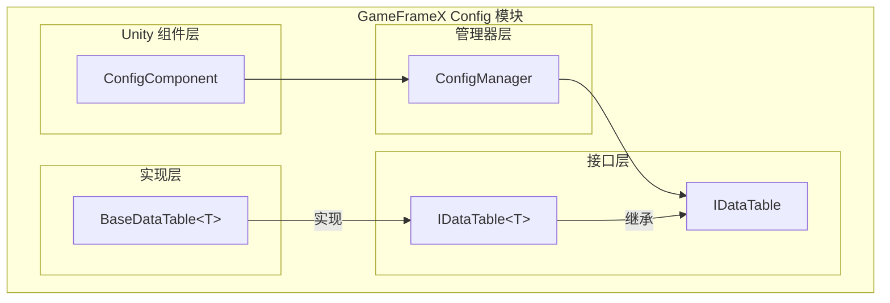

# Basic Usage

Config 组件是 GameFrameX 框架中used forManages游戏Config Data的核心模块，provides了一套高效、Type Safety的Config Data存储和Access机制。through Config 组件，开发者可以方便地load和Manages游戏中的各种Config Table（如物品表、角色表、关卡表等），并through强Type接口快速查询Config Data。

## 概述

Config 组件的Design Goals是为游戏开发provides一个统一的Config DataManages解决方案。在游戏开发中，Config Data通常存储在 Excel、CSV 或 JSON 等格式的Config Table中，这些数据需要在运行时被快速查询和Access。Config 组件through以下特性满足这一需求：

- **Type Safety**：throughGeneric Interfaceprovides编译时的Typecheck，减少运行时error
- **高效查询**：内部Uses Dictionary 存储，supports O(1) 时间复杂度的数据find
- **灵活的主键supports**：supports int、long、string 三种Primary Key Type，适应不同的Config Table需求
- **丰富的Query Operations**：provides Find、Max、Min、Sum 等常用Query Methods

### 核心组件架构



### Data Access Flow

```mermaid
sequenceDiagram
    participant Dev as 开发者代码
    participant CC as ConfigComponent
    participant CM as ConfigManager
    participant DT as IDataTable&lt;T&gt;

    Dev->>CC: GetConfig&lt;TDataTable&gt;()
    CC->>CM: GetConfig(configName)
    CM->>DT: 返回 IDataTable 实例
    DT-->>Dev: TDataTable 数据表对象
    Dev->>DT: TryGet(id, out value)
    DT-->>Dev: 返回查询结果
```

## CreatesData Table

要Uses Config 组件，首先需要Creates自定义的Data Table类。Data Table类需要Inherits `BaseDataTable<T>` 抽象类，并Implements `LoadAsync` Method来loadConfig Data。

### Define Data Model

首先，需要定义Config Data的模型类。for example，Creates一个物品Config Data模型：

```csharp
using GameFrameX.Config.Runtime;

[Serializable]
public class ItemData
{
    public int Id { get; set; }
    public string Name { get; set; }
    public string Description { get; set; }
    public int Quality { get; set; }
    public int Price { get; set; }
}
```
> Source: [示例代码](https://github.com/GameFrameX/com.gameframex.unity.config/blob/main/README.md)

### CreatesData Table类

Inherits `BaseDataTable<T>` 并Implements `LoadAsync` Method：

```csharp
using System.Collections.Generic;
using System.Threading.Tasks;
using GameFrameX.Config.Runtime;

public class ItemDataTable : BaseDataTable<ItemData>
{
    public override async Task LoadAsync()
    {
        // 从配置源加载数据
        // 这里可以是从文件、网络或资源系统加载
        var items = new List<ItemData>
        {
            new ItemData { Id = 1001, Name = "生命药水", Description = "恢复100点生命", Quality = 1, Price = 50 },
            new ItemData { Id = 1002, Name = "魔法药水", Description = "恢复50点魔法", Quality = 1, Price = 30 },
            new ItemData { Id = 1003, Name = "紫色装备", Description = "高品质装备", Quality = 5, Price = 1000 }
        };

        // 将数据添加到字典中
        foreach (var item in items)
        {
            LongDataMaps.Add(item.Id, item);
            DataList.Add(item);
        }
        
        await Task.CompletedTask;
    }
}
```
> Source: [BaseDataTable.cs](https://github.com/GameFrameX/com.gameframex.unity.config/blob/main/Runtime/Config/Config/BaseDataTable.cs#L48-L69)

`BaseDataTable<T>` 类provides了两个主要的内部字典used for存储数据：
- `LongDataMaps`：used for存储长整数主键的数据
- `StringDataMaps`：used for存储字符串主键的数据
- `DataList`：used for按sequential存储所有数据对象

## register和UsesData Table

### add ConfigComponent

在 Unity 场景中Creates一个空物体，并add ConfigComponent 组件：

1. 在 Unity Editor中，右键点击 Hierarchy 面板
2. 选择 `GameObject` → `Create Empty`
3. 在 Inspector 面板中，点击 `Add Component`
4. search并add `ConfigComponent`（located in GameFrameX/Config 菜单下）

```csharp
// 也可以通过代码添加
var configEntity = new GameObject("ConfigSystem");
var configComponent = configEntity.AddComponent<GameFrameX.Config.Runtime.ConfigComponent>();
```
> Source: [ConfigComponent.cs](https://github.com/GameFrameX/com.gameframex.unity.config/blob/main/Runtime/Config/ConfigComponent.cs#L46-L48)

### registerData Table

将Creates的Data Tableregister到 ConfigComponent 中：

```csharp
using GameFrameX.Config.Runtime;
using UnityEngine;

public class GameStart : MonoBehaviour
{
    private ConfigComponent _configComponent;

    private void Start()
    {
        // 获取 ConfigComponent 实例
        _configComponent = GetComponent<ConfigComponent>();
        
        if (_configComponent == null)
        {
            _configComponent = gameObject.AddComponent<ConfigComponent>();
        }

        // 创建并注册数据表
        var itemDataTable = new ItemDataTable();
        _configComponent.Add("ItemDataTable", itemDataTable);

        // 异步加载数据
        _ = LoadDataAsync();
    }

    private async Task LoadDataAsync()
    {
        var itemDataTable = _configComponent.GetConfig<ItemDataTable>();
        if (itemDataTable != null)
        {
            await itemDataTable.LoadAsync();
            Debug.Log($"物品表加载完成，共 {itemDataTable.Count} 条数据");
        }
    }
}
```
> Source: [ConfigComponent.cs](https://github.com/GameFrameX/com.gameframex.unity.config/blob/main/Runtime/Config/ConfigComponent.cs#L108-L127)

### 泛型Method便捷Access

ConfigComponent provides了泛型Method来简化Data Table的get：

```csharp
// 检查是否存在指定类型的数据表
bool hasTable = _configComponent.HasConfig<ItemDataTable>();

// 获取数据表实例
var itemDataTable = _configComponent.GetConfig<ItemDataTable>();

// 移除数据表
_configComponent.RemoveConfig<ItemDataTable>();

// 清空所有数据表
_configComponent.RemoveAllConfigs();
```
> Source: [ConfigComponent.cs](https://github.com/GameFrameX/com.gameframex.unity.config/blob/main/Runtime/Config/ConfigComponent.cs#L129-L170)

## Data Query

IDataTable<T> 接口provides了丰富的数据Query Methods，supports多种查询场景。

### Basic Query

UsesIndexer或 TryGet Method查询数据：

```csharp
var itemDataTable = _configComponent.GetConfig<ItemDataTable>();

// 使用索引器查询（推荐）
// 根据整数主键查询
ItemData item1 = itemDataTable[1001];

// 根据长整数主键查询
ItemData item2 = itemDataTable[(long)1001];

// 根据字符串主键查询
ItemData item3 = itemDataTable["1001"];

// 使用 TryGet 方法查询（更安全）
if (itemDataTable.TryGet(1001, out ItemData item))
{
    Debug.Log($"找到物品: {item.Name}");
}
```
> Source: [BaseDataTable.cs](https://github.com/GameFrameX/com.gameframex.unity.config/blob/main/Runtime/Config/Config/BaseDataTable.cs#L119-L162)

### Conditional Query

Uses Find Method进行Conditional Query：

```csharp
var itemDataTable = _configComponent.GetConfig<ItemDataTable>();

// 查找第一个符合条件的对象
ItemData highQualityItem = itemDataTable.Find(item => item.Quality >= 5);

// 查找所有符合条件的对象
ItemData[] allHighQualityItems = itemDataTable.FindListArray(item => item.Quality >= 3);

// 查找所有符合条件的对象（返回列表）
List<ItemData> expensiveItems = itemDataTable.FindList(item => item.Price > 100);
```
> Source: [BaseDataTable.cs](https://github.com/GameFrameX/com.gameframex.unity.config/blob/main/Runtime/Config/Config/BaseDataTable.cs#L296-L336)

### Aggregation Query

Uses Max、Min、Sum Method进行Aggregation Calculation：

```csharp
var itemDataTable = _configComponent.GetConfig<ItemDataTable>();

// 获取指定属性的最大值
int maxPrice = itemDataTable.Max(item => item.Price);

// 获取指定属性的最小值
int minPrice = itemDataTable.Min(item => item.Price);

// 计算属性总和
int totalPrice = itemDataTable.Sum(item => item.Price);

// 统计元素数量
int count = itemDataTable.Count;

// 获取所有数据
ItemData[] allItems = itemDataTable.All;
```
> Source: [BaseDataTable.cs](https://github.com/GameFrameX/com.gameframex.unity.config/blob/main/Runtime/Config/Config/BaseDataTable.cs#L351-L449)

### Iteration Operation

Uses ForEach Methoditerate所有数据：

```csharp
var itemDataTable = _configComponent.GetConfig<ItemDataTable>();

// 遍历所有数据
itemDataTable.ForEach(item =>
{
    Debug.Log($"物品: {item.Name}, 价格: {item.Price}");
});
```
> Source: [BaseDataTable.cs](https://github.com/GameFrameX/com.gameframex.unity.config/blob/main/Runtime/Config/Config/BaseDataTable.cs#L338-L349)

### Get First and Last Elements

```csharp
var itemDataTable = _configComponent.GetConfig<ItemDataTable>();

// 获取第一个元素
ItemData first = itemDataTable.FirstOrDefault;

// 获取最后一个元素
ItemData last = itemDataTable.LastOrDefault;
```
> Source: [BaseDataTable.cs](https://github.com/GameFrameX/com.gameframex.unity.config/blob/main/Runtime/Config/Config/BaseDataTable.cs#L223-L255)

## 完整Usage Examples

以下是一个完整的Config SystemUsage Examples：

```csharp
using System.Collections.Generic;
using System.Threading.Tasks;
using GameFrameX.Config.Runtime;
using UnityEngine;

// 1. 定义数据模型
[System.Serializable]
public class ItemData
{
    public int Id { get; set; }
    public string Name { get; set; }
    public string Description { get; set; }
    public int Quality { get; set; }
    public int Price { get; set; }
}

// 2. 创建数据表类
public class ItemDataTable : BaseDataTable<ItemData>
{
    public override async Task LoadAsync()
    {
        // 模拟从文件或网络加载数据
        var items = new List<ItemData>
        {
            new ItemData { Id = 1001, Name = "生命药水", Description = "恢复100点生命", Quality = 1, Price = 50 },
            new ItemData { Id = 1002, Name = "魔法药水", Description = "恢复50点魔法", Quality = 1, Price = 30 },
            new ItemData { Id = 1003, Name = "金色武器", Description = "金色传说武器", Quality = 5, Price = 10000 }
        };

        foreach (var item in items)
        {
            LongDataMaps.Add(item.Id, item);
            DataList.Add(item);
        }
        
        await Task.CompletedTask;
    }
}

// 3. 游戏启动脚本
public class GameConfigManager : MonoBehaviour
{
    private ConfigComponent _configComponent;

    private void Awake()
    {
        // 确保场景中有 ConfigComponent
        _configComponent = GetComponent<ConfigComponent>();
        if (_configComponent == null)
        {
            _configComponent = gameObject.AddComponent<ConfigComponent>();
        }
    }

    private async void Start()
    {
        // 注册数据表
        var itemTable = new ItemDataTable();
        _configComponent.Add("ItemDataTable", itemTable);

        // 加载数据
        await itemTable.LoadAsync();

        // 查询数据
        QueryData();
    }

    private void QueryData()
    {
        var itemTable = _configComponent.GetConfig<ItemDataTable>();
        
        // 基本查询
        var item = itemTable[1001];
        Debug.Log($"查询结果: {item?.Name}");

        // 条件查询
        var highQualityItems = itemTable.FindListArray(x => x.Quality >= 3);
        Debug.Log($"高品质物品数量: {highQualityItems.Length}");

        // 聚合查询
        var totalValue = itemTable.Sum(x => x.Price);
        Debug.Log($"物品总价值: {totalValue}");
    }
}
```
> Source: [BaseDataTable.cs](https://github.com/GameFrameX/com.gameframex.unity.config/blob/main/Runtime/Config/Config/BaseDataTable.cs#L48-L69)

## Config Data格式

Config 组件supports从多种格式的Config File中load数据：

### 文本格式（TSV）

默认supports Tab 分隔的文本格式：

```
# 格式：Id	Name	Description	Quality	Price
1001	生命药水	恢复100点生命	1	50
1002	魔法药水	恢复50点魔法	1	30
```

每行contains 4 列，以 Tab 键分隔。

### 二进制格式

也supportsload二进制格式的Config File，通常Uses `.bytes` 扩展名。

> 详细的configuration格式DescriptionPlease refer to [Data Table Definition](../3-getting-started.data-table-definition) 文档。

## Best Practices

### Data Table命名规范

- Data Table类名Uses PascalCase 命名
- Data Table实例名称Uses有意义的名称
- 建议Uses单例模式ManagesData TableAccess

### Asynchronous Loading

所有数据load操作都应Usesasynchronous方式进行，避免阻塞主线程：

```csharp
// 推荐：异步加载
await itemDataTable.LoadAsync();

// 或者使用异步调用
_ = itemDataTable.LoadAsync();
```

### 空值check

Uses TryGet Method进行安全的空值check：

```csharp
// 推荐写法
if (itemDataTable.TryGet(1001, out ItemData item))
{
    // 处理找到的数据
    Debug.Log(item.Name);
}

// 不推荐：如果数据不存在会返回 null
var item = itemDataTable[1001];
if (item != null)
{
    // 处理数据
}
```

## Related Links

- [Config 组件简介](../1-overview.introduction)
- [Features](../1-overview.features)
- [Data Table Definition](../3-getting-started.data-table-definition)
- [ConfigComponent Config Component](../4-core-concepts.config-component)
- [ConfigManager configurationManages器](../4-core-concepts.config-manager)
- [IDataTable Data Table接口](../4-core-concepts.idata-table)
- [API Reference](../5-api-reference.interfaces)
- [Event Arguments](../5-api-reference.event-args)
