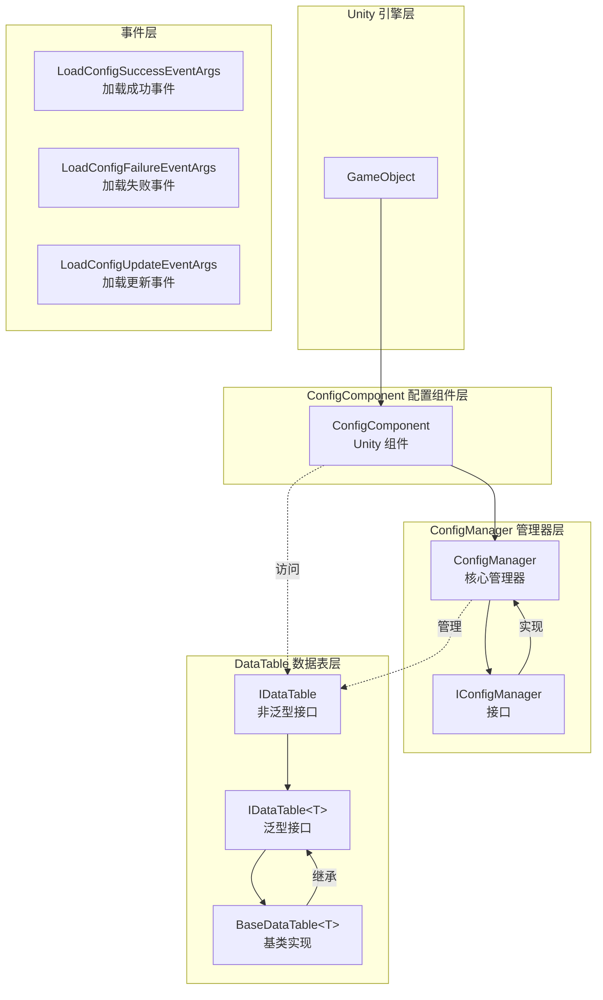
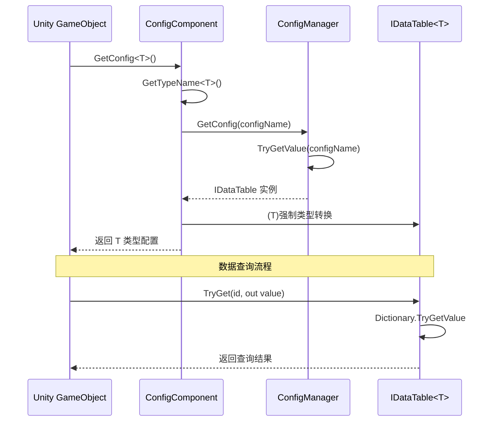

# Features

Config Config Table Component是 GameFrameX 框架的核心模块之一，provides了一套完整的数据configurationManages解决方案。该组件supports多种数据格式（文本和二进制）、灵活的Data Table查询、Type Safety的数据Access，and完整的Event System。

## 概述

Config Config Table Component为 Unity 游戏开发provides高效的Config DataManages能力，主要特性including：

- **统一configurationManages**：through ConfigManager 集中Manages所有Config Data表
- **Type Safety的数据Access**：Generic data table interface, provides compile-time type checking
- **多种数据格式supports**：Supports text format (Tab-separated) and binary format config tables
- **高性能查询**：Uses字典结构Implements O(1) 时间复杂度的数据find
- **灵活的数据操作**：Provides rich query, filter, and aggregation methods
- **事件驱动架构**：Provides load success, failure, and update event callbacks

## Architecture Design

Config 组件adopts分层Architecture Design，各组件Responsibility清晰，协同工作：



### 核心组件Description

| 组件 | Namespace | Description |
|------|----------|------|
| ConfigComponent | GameFrameX.Config.Runtime | Unity Component, provides runtime config access entry point |
| ConfigManager | GameFrameX.Config.Runtime | Core Config Manager, implements IConfigManager interface |
| IConfigManager | GameFrameX.Config.Runtime | Config Manager Interface, defines config management operations |
| IDataTable | GameFrameX.Config.Runtime | Data Table Base Interface |
| IDataTable<T> | GameFrameX.Config.Runtime | Generic Data Table Interface, provides type-safe access |
| BaseDataTable<T> | GameFrameX.Config.Runtime | Data Table Base Class, provides concrete implementation |

## Core Features

### 1. Config Data存储与Manages

ConfigManager UsesThread Safety的 `ConcurrentDictionary` 存储Config Data，supportsconfiguration的add、查询、remove和clear操作。

```csharp
// ConfigManager.cs - 配置管理器核心实现
public sealed partial class ConfigManager : GameFrameworkModule, IConfigManager
{
    private readonly ConcurrentDictionary<string, IDataTable> m_ConfigDatas;

    public ConfigManager()
    {
        m_ConfigDatas = new ConcurrentDictionary<string, IDataTable>(StringComparer.Ordinal);
    }

    public bool HasConfig(string configName)
    {
        return m_ConfigDatas.TryGetValue(configName, out _);
    }

    public void AddConfig(string configName, IDataTable configValue)
    {
        m_ConfigDatas.TryAdd(configName, configValue);
    }

    public IDataTable GetConfig(string configName)
    {
        return m_ConfigDatas.TryGetValue(configName, out var value) ? value : null;
    }

    public bool RemoveConfig(string configName)
    {
        return m_ConfigDatas.TryRemove(configName, out _);
    }

    public void RemoveAllConfigs()
    {
        m_ConfigDatas.Clear();
    }
}
```
> Source: [ConfigManager.cs](https://github.com/GameFrameX/com.gameframex.unity.config/blob/main/Runtime/Config/Config/ConfigManager.cs#L46-L166)

### 2. 泛型Data Table接口

`IDataTable<T>` Interface Definitions了Type Safety的数据Access方式，supports多种键Type（int、long、string）的Data Query：

```csharp
// IDataTable.cs - 泛型数据表接口定义
public interface IDataTable<T> : IDataTable where T : class
{
    // 尝试根据整数ID获取对象
    bool TryGet(int id, out T value);

    // 尝试根据长整数ID获取对象
    bool TryGet(long id, out T value);

    // 尝试根据字符串ID获取对象
    bool TryGet(string id, out T value);

    // 索引器 - 支持多种键类型
    T this[int id] { get; }
    T this[long id] { get; }
    T this[string id] { get; }

    // 获取首尾元素
    T FirstOrDefault { get; }
    T LastOrDefault { get; }

    // 获取所有数据
    T[] All { get; }
    T[] ToArray();
    List<T> ToList();

    // 查询方法
    T Find(Func<T, bool> func);
    T[] FindListArray(Func<T, bool> func);
    List<T> FindList(Func<T, bool> func);
    void ForEach(Action<T> func);

    // 聚合方法
    Tk Max<Tk>(Func<T, Tk> func) where Tk : IComparable<Tk>;
    Tk Min<Tk>(Func<T, Tk> func) where Tk : IComparable<Tk>;
    int Sum(Func<T, int> func);
    long Sum(Func<T, long> func);
    float Sum(Func<T, float> func);
    double Sum(Func<T, double> func);
    decimal Sum(Func<T, decimal> func);
}
```
> Source: [IDataTable.cs](https://github.com/GameFrameX/com.gameframex.unity.config/blob/main/Runtime/Config/Config/IDataTable.cs#L76-L265)

### 3. Data Table基类Implements

`BaseDataTable<T>` provides了完整的泛型Data TableImplements，内部Uses双字典结构（`LongDataMaps` 和 `StringDataMaps`）分别存储长整型和字符串键的数据：

```csharp
// BaseDataTable.cs - 数据表基类实现
public abstract class BaseDataTable<T> : IDataTable<T> where T : class
{
    private const int DefaultSize = 1024 * 8;
    protected readonly Dictionary<long, T> LongDataMaps = new Dictionary<long, T>(DefaultSize);
    protected readonly Dictionary<string, T> StringDataMaps = new Dictionary<string, T>(DefaultSize);
    protected readonly List<T> DataList = new List<T>(DefaultSize);

    // 缓存优化
    private bool _cacheInitialized;
    private T _firstOrDefaultCache;
    private T _lastOrDefaultCache;

    public bool TryGet(int id, out T value)
    {
        return LongDataMaps.TryGetValue(id, out value);
    }

    public bool TryGet(long id, out T value)
    {
        return LongDataMaps.TryGetValue(id, out value);
    }

    public bool TryGet(string id, out T value)
    {
        return StringDataMaps.TryGetValue(id, out value);
    }

    // 使用索引器访问
    public T this[int id] => TryGet(id, out var value) ? value : null;
    public T this[long id] => TryGet(id, out var value) ? value : null;
    public T this[string id] => TryGet(id, out var value) ? value : null;

    // 查询方法
    public T Find(Func<T, bool> func)
    {
        return DataList.FirstOrDefault(func);
    }

    public T[] FindListArray(Func<T, bool> func)
    {
        return DataList.Where(func).ToArray();
    }
}
```
> Source: [BaseDataTable.cs](https://github.com/GameFrameX/com.gameframex.unity.config/blob/main/Runtime/Config/Config/BaseDataTable.cs#L46-L165)

### 4. Unity Component集成

`ConfigComponent` 是 Unity Component，可add到 GameObject 上，providesconfigurationAccess的便捷接口：

```csharp
// ConfigComponent.cs - Unity 组件
[DisallowMultipleComponent]
[AddComponentMenu("GameFrameX/Config")]
public sealed class ConfigComponent : GameFrameworkComponent
{
    private IConfigManager m_ConfigManager = null;
    private ConcurrentDictionary<Type, string> m_ConfigNameTypeMap = new ConcurrentDictionary<Type, string>();

    protected override void Awake()
    {
        base.Awake();
        m_ConfigManager = GameFrameworkEntry.GetModule<IConfigManager>();
    }

    // 泛型方法获取配置
    public T GetConfig<T>() where T : IDataTable
    {
        var configName = GetTypeName<T>();
        var config = m_ConfigManager.GetConfig(configName);
        return config != null ? (T)config : default;
    }

    // 检查配置是否存在
    public bool HasConfig<T>() where T : IDataTable
    {
        var configName = GetTypeName<T>();
        return m_ConfigManager.HasConfig(configName);
    }

    // 移除配置
    public bool RemoveConfig<T>() where T : IDataTable
    {
        var configName = GetTypeName<T>();
        return m_ConfigManager.RemoveConfig(configName);
    }

    // 添加配置
    public void Add(string configName, IDataTable dataTable)
    {
        m_ConfigManager.AddConfig(configName, dataTable);
    }
}
```
> Source: [ConfigComponent.cs](https://github.com/GameFrameX/com.gameframex.unity.config/blob/main/Runtime/Config/ConfigComponent.cs#L46-L185)

### 5. Event System

Config 组件provides了完整的Event System，used for监听Config Loading状态：

```csharp
// 加载成功事件
public sealed class LoadConfigSuccessEventArgs : GameEventArgs
{
    public static readonly string EventId = typeof(LoadConfigSuccessEventArgs).FullName;
    public string ConfigAssetName { get; private set; }  // 配置资源名称
    public float Duration { get; private set; }          // 加载耗时
    public object UserData { get; private set; }          // 用户数据

    public static LoadConfigSuccessEventArgs Create(string dataAssetName, float duration, object userData)
    {
        // 创建事件实例
    }
}

// 加载失败事件
public sealed class LoadConfigFailureEventArgs : GameEventArgs
{
    public static readonly string EventId = typeof(LoadConfigFailureEventArgs).FullName;
    public string ConfigAssetName { get; private set; }  // 配置资源名称
    public string ErrorMessage { get; private set; }     // 错误信息
    public object UserData { get; private set; }          // 用户数据
}

// 加载更新事件（进度）
public sealed class LoadConfigUpdateEventArgs : GameEventArgs
{
    public static readonly string EventId = typeof(LoadConfigUpdateEventArgs).FullName;
    public string ConfigAssetName { get; private set; }  // 配置资源名称
    public float Progress { get; private set; }           // 加载进度 (0.0 - 1.0)
    public object UserData { get; private set; }          // 用户数据
}
```
> Sources:
> - [LoadConfigSuccessEventArgs.cs](https://github.com/GameFrameX/com.gameframex.unity.config/blob/main/Runtime/EventArgs/LoadConfigSuccessEventArgs.cs#L43-L137)
> - [LoadConfigFailureEventArgs.cs](https://github.com/GameFrameX/com.gameframex.unity.config/blob/main/Runtime/EventArgs/LoadConfigFailureEventArgs.cs#L43-L137)
> - [LoadConfigUpdateEventArgs.cs](https://github.com/GameFrameX/com.gameframex.unity.config/blob/main/Runtime/EventArgs/LoadConfigUpdateEventArgs.cs#L43-L137)

## Data Access Flow

以下流程图展示了从 Unity Component到Data Table的数据Access过程：



## Usage Examples

### 基本configurationget

```csharp
// 获取配置组件
var configComponent = GameEntry.GetComponent<ConfigComponent>();

// 检查配置是否存在
if (configComponent.HasConfig<PlayerConfig>())
{
    // 获取配置数据表
    var playerConfig = configComponent.GetConfig<PlayerConfig>();
    
    // 使用索引器查询数据
    var player = playerConfig[1001];  // 根据 ID 查询
    
    // 使用 TryGet 方法安全查询
    if (playerConfig.TryGet(1001, out var playerData))
    {
        Debug.Log($"玩家名称: {playerData.Name}");
    }
}
```

### Data Query与filter

```csharp
var config = configComponent.GetConfig<MonsterConfig>();

// 查询所有满足条件的对象
var bossMonsters = config.FindList(m => m.Type == MonsterType.Boss);

// 使用聚合函数
var maxLevel = config.Max(m => m.Level);
var totalHP = config.Sum(m => m.HP);

// 遍历所有数据
config.ForEach(monster => {
    Debug.Log($"怪物: {monster.Name}, 等级: {monster.Level}");
});
```

## configuration格式supports

Config 组件supports两种Config Table格式：

### 1. 文本格式（Tab 分隔）

文本格式configurationUses Tab 字符作为列分隔符，suitable forEdit器预览和debug：

```
# 格式：ID    名称    描述    值
1    config1 配置1   100
2    config2 配置2   200
```

### 2. 二进制格式（.bytes）

二进制格式Config File后缀为 `.bytes`，suitable for生产环境load，具有更小的体积和更快的parse速度。

> 关于Binary Config Table的详细内容，Please refer to [Binary Config Table](./6-configuration.binary-config) 文档。

## Related Links

- [Config 组件简介](./1-overview.introduction) - Config 组件概述与installation
- [Installation](./2-installation.install-methods) - 组件Installation Guide
- [Dependencies](./2-installation.dependencies) - 项目Depends onDescription
- [ConfigComponent Config Component](./4-core-concepts.config-component) - Unity Component详解
- [ConfigManager configurationManages器](./4-core-concepts.config-manager) - 核心Manages器详解
- [IDataTable Data Table接口](./4-core-concepts.idata-table) - Data TableInterface Definitions
- [API Reference](./5-api-reference.interfaces) - 完整接口文档
- [Event Arguments](./5-api-reference.event-args) - Event Arguments详情
- [Scripting Define Symbols](./6-configuration.scripting-define-symbols) - 编译符号configuration
