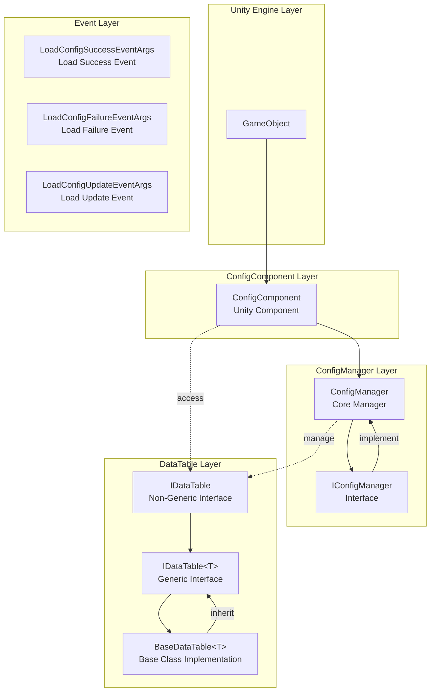
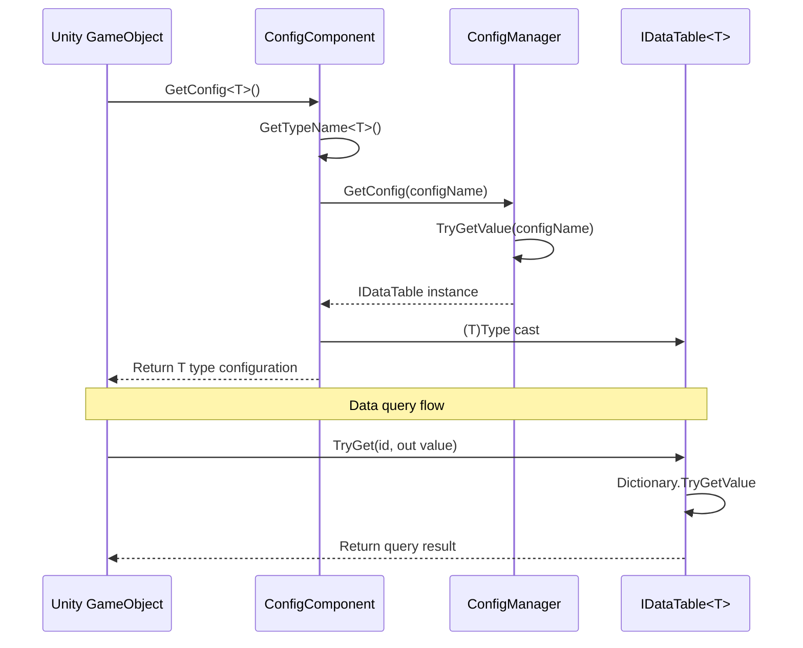

# Features

The Config Config Table component is one of the core modules of the GameFrameX framework, providing a complete data configuration management solution. This component supports multiple data formats (text and binary), flexible data table queries, type-safe data access, and a complete event system.

## Overview

The Config Config Table component provides efficient configuration data management capability for Unity game development. The main features include:

- **Unified Configuration Management**: Through ConfigManager, centrally manages all configuration data tables
- **Type-Safe Data Access**: Generic data table interface, provides compile-time type checking
- **Multiple Data Format Support**: Supports text format (Tab-separated) and binary format config tables
- **High-Performance Queries**: Uses dictionary structure implementing O(1) time complexity data lookup
- **Flexible Data Operations**: Provides rich query, filter, and aggregation methods
- **Event-Driven Architecture**: Provides load success, failure, and update event callbacks

## Architecture Design

The Config component adopts a layered architecture design, with clear responsibilities and coordinated work among all components:



### Core Component Description

| Component | Namespace | Description |
|------|----------|------|
| ConfigComponent | GameFrameX.Config.Runtime | Unity Component, provides runtime config access entry point |
| ConfigManager | GameFrameX.Config.Runtime | Core Config Manager, implements IConfigManager interface |
| IConfigManager | GameFrameX.Config.Runtime | Config Manager Interface, defines config management operations |
| IDataTable | GameFrameX.Config.Runtime | Data Table Base Interface |
| IDataTable<T> | GameFrameX.Config.Runtime | Generic Data Table Interface, provides type-safe access |
| BaseDataTable<T> | GameFrameX.Config.Runtime | Data Table Base Class, provides concrete implementation |

## Core Features

### 1. Config Data Storage and Management

ConfigManager uses thread-safe `ConcurrentDictionary` to store config data, supporting configuration add, query, remove, and clear operations.

```csharp
// ConfigManager.cs - Configuration manager core implementation
public sealed partial class ConfigManager : GameFrameworkModule, IConfigManager
{
    private readonly ConcurrentDictionary<string, IDataTable> m_ConfigDatas;

    public ConfigManager()
    {
        m_ConfigDatas = new ConcurrentDictionary<string, IDataTable>(StringComparer.Ordinal);
    }

    public bool HasConfig(string configName)
    {
        return m_ConfigDatas.TryGetValue(configName, out _);
    }

    public void AddConfig(string configName, IDataTable configValue)
    {
        m_ConfigDatas.TryAdd(configName, configValue);
    }

    public IDataTable GetConfig(string configName)
    {
        return m_ConfigDatas.TryGetValue(configName, out var value) ? value : null;
    }

    public bool RemoveConfig(string configName)
    {
        return m_ConfigDatas.TryRemove(configName, out _);
    }

    public void RemoveAllConfigs()
    {
        m_ConfigDatas.Clear();
    }
}
```
> Source: [ConfigManager.cs](https://github.com/GameFrameX/com.gameframex.unity.config/blob/main/Runtime/Config/Config/ConfigManager.cs#L46-L166)

### 2. Generic Data Table Interface

`IDataTable<T>` interface defines type-safe data access methods, supporting multiple key types (int, long, string) for data queries:

```csharp
// IDataTable.cs - Generic data table interface definition
public interface IDataTable<T> : IDataTable where T : class
{
    // Try to get object by integer ID
    bool TryGet(int id, out T value);

    // Try to get object by long integer ID
    bool TryGet(long id, out T value);

    // Try to get object by string ID
    bool TryGet(string id, out T value);

    // Indexer - supports multiple key types
    T this[int id] { get; }
    T this[long id] { get; }
    T this[string id] { get; }

    // Get first and last elements
    T FirstOrDefault { get; }
    T LastOrDefault { get; }

    // Get all data
    T[] All { get; }
    T[] ToArray();
    List<T> ToList();

    // Query methods
    T Find(Func<T, bool> func);
    T[] FindListArray(Func<T, bool> func);
    List<T> FindList(Func<T, bool> func);
    void ForEach(Action<T> func);

    // Aggregation methods
    Tk Max<Tk>(Func<T, Tk> func) where Tk : IComparable<Tk>;
    Tk Min<Tk>(Func<T, Tk> func) where Tk : IComparable<Tk>;
    int Sum(Func<T, int> func);
    long Sum(Func<T, long> func);
    float Sum(Func<T, float> func);
    double Sum(Func<T, double> func);
    decimal Sum(Func<T, decimal> func);
}
```
> Source: [IDataTable.cs](https://github.com/GameFrameX/com.gameframex.unity.config/blob/main/Runtime/Config/Config/IDataTable.cs#L76-L265)

### 3. Data Table Base Class Implementation

`BaseDataTable<T>` provides a complete generic data table implementation, internally using a dual dictionary structure (`LongDataMaps` and `StringDataMaps`) to store long integer and string key data respectively:

```csharp
// BaseDataTable.cs - Data table base class implementation
public abstract class BaseDataTable<T> : IDataTable<T> where T : class
{
    private const int DefaultSize = 1024 * 8;
    protected readonly Dictionary<long, T> LongDataMaps = new Dictionary<long, T>(DefaultSize);
    protected readonly Dictionary<string, T> StringDataMaps = new Dictionary<string, T>(DefaultSize);
    protected readonly List<T> DataList = new List<T>(DefaultSize);

    // Cache optimization
    private bool _cacheInitialized;
    private T _firstOrDefaultCache;
    private T _lastOrDefaultCache;

    public bool TryGet(int id, out T value)
    {
        return LongDataMaps.TryGetValue(id, out value);
    }

    public bool TryGet(long id, out T value)
    {
        return LongDataMaps.TryGetValue(id, out value);
    }

    public bool TryGet(string id, out T value)
    {
        return StringDataMaps.TryGetValue(id, out value);
    }

    // Access using indexer
    public T this[int id] => TryGet(id, out var value) ? value : null;
    public T this[long id] => TryGet(id, out var value) ? value : null;
    public T this[string id] => TryGet(id, out var value) ? value : null;

    // Query methods
    public T Find(Func<T, bool> func)
    {
        return DataList.FirstOrDefault(func);
    }

    public T[] FindListArray(Func<T, bool> func)
    {
        return DataList.Where(func).ToArray();
    }
}
```
> Source: [BaseDataTable.cs](https://github.com/GameFrameX/com.gameframex.unity.config/blob/main/Runtime/Config/Config/BaseDataTable.cs#L46-L165)

### 4. Unity Component Integration

`ConfigComponent` is a Unity Component that can be added to GameObject, providing a convenient interface for configuration access:

```csharp
// ConfigComponent.cs - Unity component
[DisallowMultipleComponent]
[AddComponentMenu("GameFrameX/Config")]
public sealed class ConfigComponent : GameFrameworkComponent
{
    private IConfigManager m_ConfigManager = null;
    private ConcurrentDictionary<Type, string> m_ConfigNameTypeMap = new ConcurrentDictionary<Type, string>();

    protected override void Awake()
    {
        base.Awake();
        m_ConfigManager = GameFrameworkEntry.GetModule<IConfigManager>();
    }

    // Generic method to get configuration
    public T GetConfig<T>() where T : IDataTable
    {
        var configName = GetTypeName<T>();
        var config = m_ConfigManager.GetConfig(configName);
        return config != null ? (T)config : default;
    }

    // Check if configuration exists
    public bool HasConfig<T>() where T : IDataTable
    {
        var configName = GetTypeName<T>();
        return m_ConfigManager.HasConfig(configName);
    }

    // Remove configuration
    public bool RemoveConfig<T>() where T : IDataTable
    {
        var configName = GetTypeName<T>();
        return m_ConfigManager.RemoveConfig(configName);
    }

    // Add configuration
    public void Add(string configName, IDataTable dataTable)
    {
        m_ConfigManager.AddConfig(configName, dataTable);
    }
}
```
> Source: [ConfigComponent.cs](https://github.com/GameFrameX/com.gameframex.unity.config/blob/main/Runtime/Config/ConfigComponent.cs#L46-L185)

### 5. Event System

The Config component provides a complete event system, used for monitoring config loading status:

```csharp
// Load success event
public sealed class LoadConfigSuccessEventArgs : GameEventArgs
{
    public static readonly string EventId = typeof(LoadConfigSuccessEventArgs).FullName;
    public string ConfigAssetName { get; private set; }  // Configuration asset name
    public float Duration { get; private set; }          // Load duration
    public object UserData { get; private set; }          // User data

    public static LoadConfigSuccessEventArgs Create(string dataAssetName, float duration, object userData)
    {
        // Create event instance
    }
}

// Load failure event
public sealed class LoadConfigFailureEventArgs : GameEventArgs
{
    public static readonly string EventId = typeof(LoadConfigFailureEventArgs).FullName;
    public string ConfigAssetName { get; private set; }  // Configuration asset name
    public string ErrorMessage { get; private set; }     // Error message
    public object UserData { get; private set; }          // User data
}

// Load update event (progress)
public sealed class LoadConfigUpdateEventArgs : GameEventArgs
{
    public static readonly string EventId = typeof(LoadConfigUpdateEventArgs).FullName;
    public string ConfigAssetName { get; private set; }  // Configuration asset name
    public float Progress { get; private set; }           // Load progress (0.0 - 1.0)
    public object UserData { get; private set; }          // User data
}
```
> Sources:
> - [LoadConfigSuccessEventArgs.cs](https://github.com/GameFrameX/com.gameframex.unity.config/blob/main/Runtime/EventArgs/LoadConfigSuccessEventArgs.cs#L43-L137)
> - [LoadConfigFailureEventArgs.cs](https://github.com/GameFrameX/com.gameframex.unity.config/blob/main/Runtime/EventArgs/LoadConfigFailureEventArgs.cs#L43-L137)
> - [LoadConfigUpdateEventArgs.cs](https://github.com/GameFrameX/com.gameframex.unity.config/blob/main/Runtime/EventArgs/LoadConfigUpdateEventArgs.cs#L43-L137)

## Data Access Flow

The following flowchart shows the data access process from Unity Component to Data Table:



## Usage Examples

### Basic Configuration Access

```csharp
// Get configuration component
var configComponent = GameEntry.GetComponent<ConfigComponent>();

// Check if configuration exists
if (configComponent.HasConfig<PlayerConfig>())
{
    // Get configuration data table
    var playerConfig = configComponent.GetConfig<PlayerConfig>();

    // Use indexer to query data
    var player = playerConfig[1001];  // Query by ID

    // Use TryGet method for safe query
    if (playerConfig.TryGet(1001, out var playerData))
    {
        Debug.Log($"Player name: {playerData.Name}");
    }
}
```

### Data Query and Filter

```csharp
var config = configComponent.GetConfig<MonsterConfig>();

// Query all objects satisfying conditions
var bossMonsters = config.FindList(m => m.Type == MonsterType.Boss);

// Use aggregation functions
var maxLevel = config.Max(m => m.Level);
var totalHP = config.Sum(m => m.HP);

// Iterate through all data
config.ForEach(monster => {
    Debug.Log($"Monster: {monster.Name}, Level: {monster.Level}");
});
```

## Configuration Format Support

The Config component supports two configuration table formats:

### 1. Text Format (Tab Separated)

Text format configuration uses Tab character as column separator, suitable for editor preview and debugging:

```
# Format: ID    Name    Description    Value
1    config1    config1    100
2    config2    config2    200
```

### 2. Binary Format (.bytes)

Binary format config files have `.bytes` suffix, suitable for production environment loading, with smaller size and faster parsing speed.

> For detailed information on Binary Config Table, please refer to [Binary Config Table](./11.binary-config.md) document.

## Related Links

- [Config Component Overview](./01.overview.md) - Config component overview and installation
- [Installation](./02.installation.md) - Component installation guide
- [Dependencies](./05.dependencies.md) - Project dependency description
- [ConfigComponent](./10.config-component.md) - Unity component details
- [ConfigManager](./09.config-manager.md) - Core manager details
- [IDataTable Interface](./07.idata-table.md) - Data table interface definitions
- [Interface Definitions](./06.interfaces.md) - Complete interface documentation
- [Event Arguments](./12.event-args.md) - Event arguments details
- [Scripting Define Symbols](./13.scripting-define-symbols.md) - Compilation symbol configuration