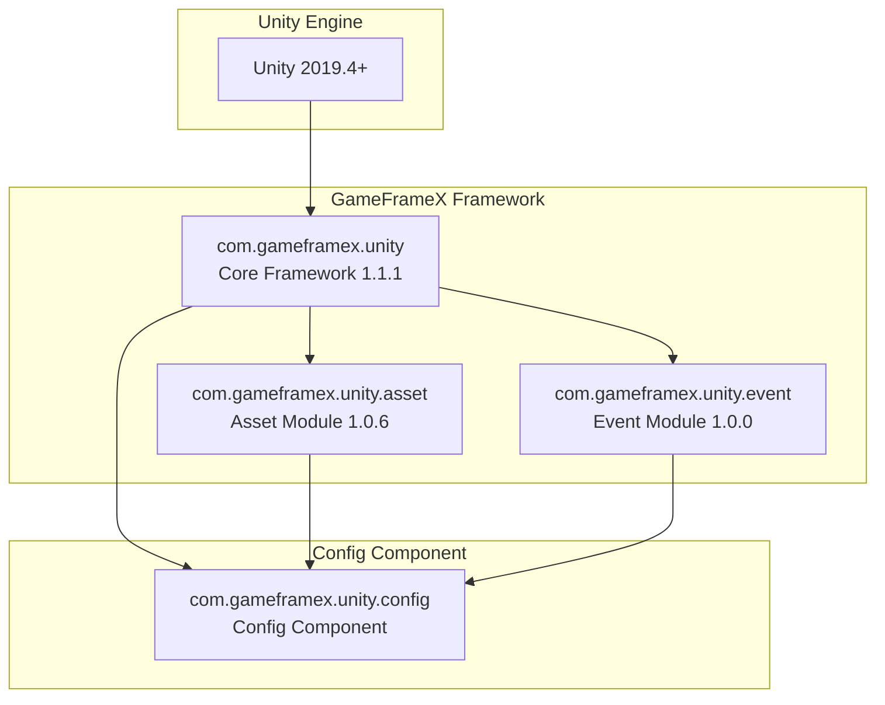

# Dependencies

This document provides detailed information about Config component dependencies, including Unity version requirements, GameFrameX core package dependencies, and internal assembly reference relationships.

## Overview

The Config component is one of the core modules of the GameFrameX framework, used for managing game configuration data tables. This component depends on other modules in the GameFrameX Core Framework and needs to run in a Unity environment that meets specific version requirements, with correct configuration of related dependency packages to function properly.

## Dependency Architecture



## Unity Version Requirements

| Item | Requirement |
|------|------|
| Minimum Version | Unity 2019.4 |
| Recommended Version | Unity 2020.3 LTS or higher |
| Script Runtime | .NET Standard 2.0+ |

> Source: [package.json](https://github.com/GameFrameX/com.gameframex.unity.config/blob/main/package.json#L7)

Unity version requirements are defined in the `unity` field of the `package.json` file. Ensure your project uses a compatible Unity version for optimal compatibility.

## GameFrameX Core Package Dependencies

The Config component depends on the following GameFrameX official packages. These dependencies are declared in `package.json`:

### Dependency Package List

| Package Name | Minimum Version | Usage Description |
|------|----------|----------|
| com.gameframex.unity | 1.1.1 | Core Framework, provides basic components and module management functionality |
| com.gameframex.unity.asset | 1.0.6 | Asset loading module, used for asynchronous loading of config table files |
| com.gameframex.unity.event | 1.0.0 | Event System, used for configuration load success/failure and other event notifications |

```json
{
  "dependencies": {
    "com.gameframex.unity": "1.1.1",
    "com.gameframex.unity.asset": "1.0.6",
    "com.gameframex.unity.event": "1.0.0"
  }
}
```

> Source: [package.json](https://github.com/GameFrameX/com.gameframex.unity.config/blob/main/package.json#L21-L25)

### Dependency Description

**com.gameframex.unity (Core Framework)**
- Provides `GameFrameworkComponent` base class, ConfigComponent inherits from this class
- Provides module management system, get module instances through `GameFrameworkEntry`
- Provides assembly utility `Utility.Assembly` for type reflection

**com.gameframex.unity.asset (Asset Module)**
- Provides asynchronous asset loading capability, ConfigManager uses `GameFrameX.Asset.Runtime` namespace
- Used for loading config table binary files or JSON/XML config files
- Supports on-demand loading and cache management of config tables

**com.gameframex.unity.event (Event Module)**
- Provides Event System, used for notifying config loading status
- Defines the following event argument classes:
  - `LoadConfigSuccessEventArgs`: Configuration load success event
  - `LoadConfigFailureEventArgs`: Configuration load failure event
  - `LoadConfigUpdateEventArgs`: Configuration load update event

## Internal Assembly References

The Config component's runtime assembly `GameFrameX.Config.Runtime.asmdef` defines the following assembly references:

```csharp
// Runtime/GameFrameX.Config.Runtime.asmdef
{
    "references": [
        "GameFrameX.Runtime",
        "GameFrameX.Event.Runtime",
        "GameFrameX.Asset.Runtime"
    ]
}
```

> Source: [Runtime/GameFrameX.Config.Runtime.asmdef](https://github.com/GameFrameX/com.gameframex.unity.config/blob/main/Runtime/GameFrameX.Config.Runtime.asmdef#L3-L6)

### Assembly Reference Details

| Assembly | Namespace | Function Description |
|--------|----------|----------|
| GameFrameX.Runtime | `GameFrameX.Runtime` | Core runtime, provides GameFrameworkComponent, GameFrameworkModule, IConfigManager interface |
| GameFrameX.Event.Runtime | `GameFrameX.Event.Runtime` | Event System base interface and implementation |
| GameFrameX.Asset.Runtime | `GameFrameX.Asset.Runtime` | Asset loading interface and implementation |

### Key Type Dependencies

Key types used in the Config component and their sources:

```csharp
using GameFrameX.Runtime;           // GameFrameworkComponent, GameFrameworkModule
using GameFrameX.Asset.Runtime;      // Asset loading related interfaces
using GameFrameX.Event.Runtime;     // Event arguments base class

// ConfigComponent inheritance
public sealed class ConfigComponent : GameFrameworkComponent

// ConfigManager inheritance
public sealed class ConfigManager : GameFrameworkModule, IConfigManager
```

> Source: [Runtime/Config/ConfigComponent.cs](https://github.com/GameFrameX/com.gameframex.unity.config/blob/main/Runtime/Config/ConfigComponent.cs#L48)
> Source: [Runtime/Config/Config/ConfigManager.cs](https://github.com/GameFrameX/com.gameframex.unity.config/blob/main/Runtime/Config/Config/ConfigManager.cs#L47)

## Installing Dependencies

### Automatic Installation (Recommended)

When adding packages via Unity Package Manager, dependency packages will be automatically installed:

1. Open the `Packages/manifest.json` file in your Unity project
2. Add the Config component in `dependencies`:

```json
{
  "dependencies": {
    "com.gameframex.unity.config": "https://github.com/GameFrameX/com.gameframex.unity.config.git"
  }
}
```

3. Unity will automatically parse and install all required dependency packages

### Manual Installation

If manual installation is required, ensure dependencies are installed in the following order:

1. **Install Core Framework**
   ```json
   { "com.gameframex.unity": "1.1.1" }
   ```

2. **Install Asset Module**
   ```json
   { "com.gameframex.unity.asset": "1.0.6" }
   ```

3. **Install Event Module**
   ```json
   { "com.gameframex.unity.event": "1.0.0" }
   ```

4. **Install Config Component Last**
   ```json
   { "com.gameframex.unity.config": "1.1.3" }
   ```

## Dependency Version Compatibility

| Config Version | Unity Version | Core Framework Version | Asset Module Version | Event Module Version |
|------------|------------|--------------|--------------|--------------|
| 1.1.3 | 2019.4+ | 1.1.1 | 1.0.6 | 1.0.0 |
| 1.1.2 | 2019.4+ | 1.1.0 | 1.0.5 | 1.0.0 |
| 1.1.1 | 2019.4+ | 1.1.0 | 1.0.5 | 1.0.0 |

It is recommended to always use the latest version of dependency packages to get the best compatibility and new feature support.

## Common Dependency Issues

### Issue 1: Missing Core Framework Dependency

**Symptom**: Compilation error indicating `GameFrameworkComponent` type not found

**Solution**: Ensure `com.gameframex.unity` Core Framework package is installed

### Issue 2: Event System Not Initialized

**Symptom**: Config loading events cannot be triggered

**Solution**: Ensure `com.gameframex.unity.event` is correctly installed and the Event System is initialized in the scene

### Issue 3: Asset Loading Failure

**Symptom**: Config table file cannot be loaded

**Solution**: Confirm `com.gameframex.unity.asset` version matches requirements and check asset path configuration

## Related Links

- [Installation](./02.installation.md) - Learn about different installation methods
- [ConfigComponent](./10.config-component.md) - Learn about component usage
- [ConfigManager](./09.config-manager.md) - Learn about manager functionality
- [IDataTable Interface](./07.idata-table.md) - Learn about data table interface definitions
- [Official Documentation](https://gameframex.doc.alianblank.com/) - GameFrameX complete documentation