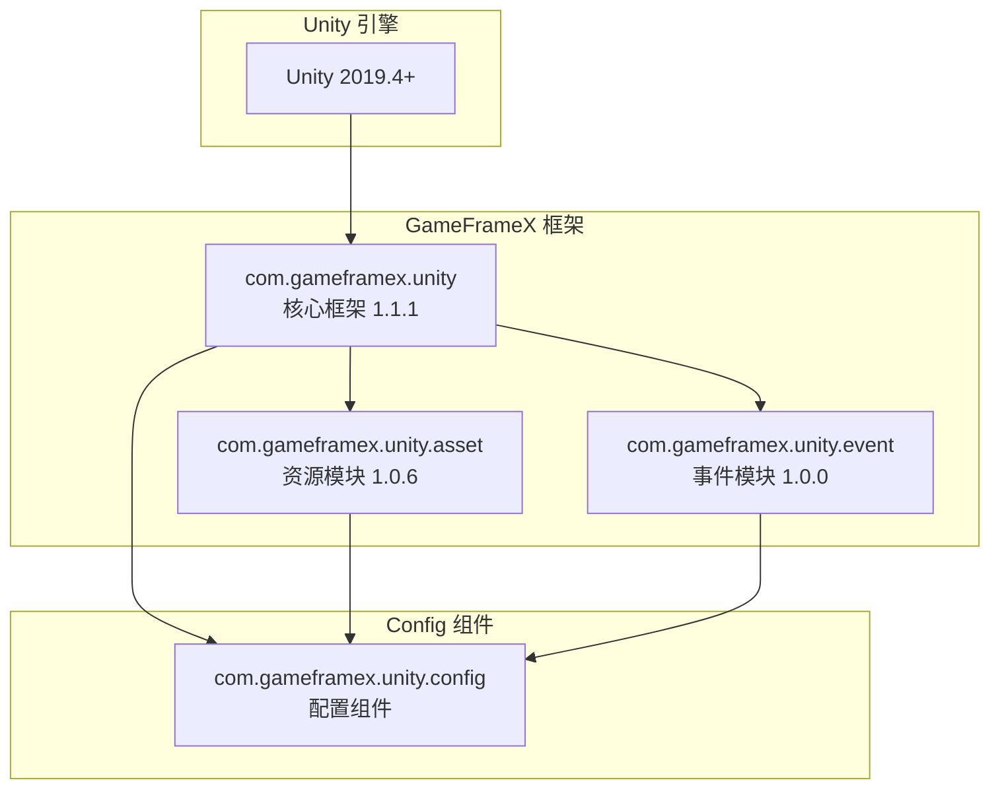

# Dependencies

This document provides detailed information about Config Config Component的Dependencies，including Unity 版本要求、GameFrameX 核心包Depends onand内部程序集引用关系。

## 概述

Config Config Component是 GameFrameX 框架的核心模块之一，used forManages游戏中的Config Data表。该组件Depends on于 GameFrameX Core Framework的其他模块，需要在满足特定版本要求的 Unity 环境中运行，并正确configuration相关Depends on包才能正常工作。

## Depends on架构



## Unity 版本要求

| 项目 | 要求 |
|------|------|
| 最低版本 | Unity 2019.4 |
| Recommended Version | Unity 2020.3 LTS 或更高 |
| 脚本运行时 | .NET Standard 2.0+ |

> Source: [package.json](https://github.com/GameFrameX/com.gameframex.unity.config/blob/main/package.json#L7)

Unity 版本要求定义在 `package.json` 文件的 `unity` Field中，ensure您的项目Uses兼容的 Unity 版本以获得最佳兼容性。

## GameFrameX 核心包Depends on

Config 组件Depends on于以下 GameFrameX 官方包，这些Depends on在 `package.json` 中声明：

### Depends on包列表

| 包名 | 最低版本 | UsageDescription |
|------|----------|----------|
| com.gameframex.unity | 1.1.1 | Core Framework，provides基础组件和模块Manages功能 |
| com.gameframex.unity.asset | 1.0.6 | 资源load模块，used forAsynchronous LoadingConfig Table文件 |
| com.gameframex.unity.event | 1.0.0 | Event System，used forconfigurationLoad Success/failure等事件通知 |

```json
{
  "dependencies": {
    "com.gameframex.unity": "1.1.1",
    "com.gameframex.unity.asset": "1.0.6",
    "com.gameframex.unity.event": "1.0.0"
  }
}
```

> Source: [package.json](https://github.com/GameFrameX/com.gameframex.unity.config/blob/main/package.json#L21-L25)

### DependenciesDescription

**com.gameframex.unity (Core Framework)**
- provides `GameFrameworkComponent` 基类，ConfigComponent Inherits自此类
- provides模块Manages系统，through `GameFrameworkEntry` get各模块实例
- provides程序集工具 `Utility.Assembly` used forType反射

**com.gameframex.unity.asset (Asset Module)**
- provides资源Asynchronous Loading能力，ConfigManager Uses `GameFrameX.Asset.Runtime` Namespace
- used forloadConfig Table二进制文件或 JSON/XML Config File
- supportsConfig Table的按需load和缓存Manages

**com.gameframex.unity.event (事件模块)**
- providesEvent System，used for通知Config Loading状态
- 定义了以下Event Arguments类：
  - `LoadConfigSuccessEventArgs`: configurationLoad Success Event
  - `LoadConfigFailureEventArgs`: configurationLoad Failure Event
  - `LoadConfigUpdateEventArgs`: configurationLoad Update Event

## 内部程序集引用

Config 组件的Runtime Assembly `GameFrameX.Config.Runtime.asmdef` 定义了以下程序集引用：

```csharp
// Runtime/GameFrameX.Config.Runtime.asmdef
{
    "references": [
        "GameFrameX.Runtime",
        "GameFrameX.Event.Runtime",
        "GameFrameX.Asset.Runtime"
    ]
}
```

> Source: [Runtime/GameFrameX.Config.Runtime.asmdef](https://github.com/GameFrameX/com.gameframex.unity.config/blob/main/Runtime/GameFrameX.Config.Runtime.asmdef#L3-L6)

### 程序集引用详情

| 程序集 | Namespace | 功能Description |
|--------|----------|----------|
| GameFrameX.Runtime | `GameFrameX.Runtime` | 核心运行时，provides GameFrameworkComponent、GameFrameworkModule、IConfigManager 接口 |
| GameFrameX.Event.Runtime | `GameFrameX.Event.Runtime` | Event System基础接口和Implements |
| GameFrameX.Asset.Runtime | `GameFrameX.Asset.Runtime` | 资源load接口和Implements |

### 关键TypeDepends on

Config 组件中Uses的关键Type及其来源：

```csharp
using GameFrameX.Runtime;           // GameFrameworkComponent, GameFrameworkModule
using GameFrameX.Asset.Runtime;      // 资源加载相关接口
using GameFrameX.Event.Runtime;     // 事件参数基类

// ConfigComponent 继承关系
public sealed class ConfigComponent : GameFrameworkComponent

// ConfigManager 继承关系  
public sealed class ConfigManager : GameFrameworkModule, IConfigManager
```

> Source: [Runtime/Config/ConfigComponent.cs](https://github.com/GameFrameX/com.gameframex.unity.config/blob/main/Runtime/Config/ConfigComponent.cs#L48)
> Source: [Runtime/Config/Config/ConfigManager.cs](https://github.com/GameFrameX/com.gameframex.unity.config/blob/main/Runtime/Config/Config/ConfigManager.cs#L47)

## installationDepends on

### 自动installation（推荐）

through Unity Package Manager add包时，Depends on包会自动installation：

1. 打开 Unity 项目的 `Packages/manifest.json` 文件
2. 在 `dependencies` 中add Config 组件：

```json
{
  "dependencies": {
    "com.gameframex.unity.config": "https://github.com/GameFrameX/com.gameframex.unity.config.git"
  }
}
```

3. Unity 会自动parse并installation所有必需的Depends on包

### 手动installation

如果需要手动installation，Please ensure按以下sequentialinstallationDepends on：

1. **installationCore Framework**
   ```json
   { "com.gameframex.unity": "1.1.1" }
   ```

2. **installationAsset Module**
   ```json
   { "com.gameframex.unity.asset": "1.0.6" }
   ```

3. **installation事件模块**
   ```json
   { "com.gameframex.unity.event": "1.0.0" }
   ```

4. **最后installation Config 组件**
   ```json
   { "com.gameframex.unity.config": "1.1.3" }
   ```

## Depends on版本兼容性

| Config 版本 | Unity 版本 | Core Framework版本 | Asset Module版本 | 事件模块版本 |
|------------|------------|--------------|--------------|--------------|
| 1.1.3 | 2019.4+ | 1.1.1 | 1.0.6 | 1.0.0 |
| 1.1.2 | 2019.4+ | 1.1.0 | 1.0.5 | 1.0.0 |
| 1.1.1 | 2019.4+ | 1.1.0 | 1.0.5 | 1.0.0 |

建议始终Uses最新版本的Depends on包以获得最佳兼容性和新功能supports。

## 常见Depends on问题

### 问题 1：缺少Core FrameworkDepends on

**症状**: 编译时报错找不到 `GameFrameworkComponent` Type

**解决方案**: ensure已installation `com.gameframex.unity` Core Framework包

### 问题 2：Event System未Initialize

**症状**: Config Loading事件无法触发

**解决方案**: ensure `com.gameframex.unity.event` 已正确installation，并在场景中InitializeEvent System

### 问题 3：资源Load Failure

**症状**: Config Table文件无法load

**解决方案**: 确认 `com.gameframex.unity.asset` 版本与要求一致，并check资源路径configuration

## Related Links

- [Installation](./2-installation.install-methods) - 了解不同的Installation Methods
- [ConfigComponent Config Component](./4-core-concepts.config-component) - 了解组件的Uses
- [ConfigManager configurationManages器](./4-core-concepts.config-manager) - 了解Manages器功能
- [IDataTable Data Table接口](./4-core-concepts.idata-table) - 了解Data TableInterface Definitions
- [官方文档](https://gameframex.doc.alianblank.com/) - GameFrameX 完整文档
