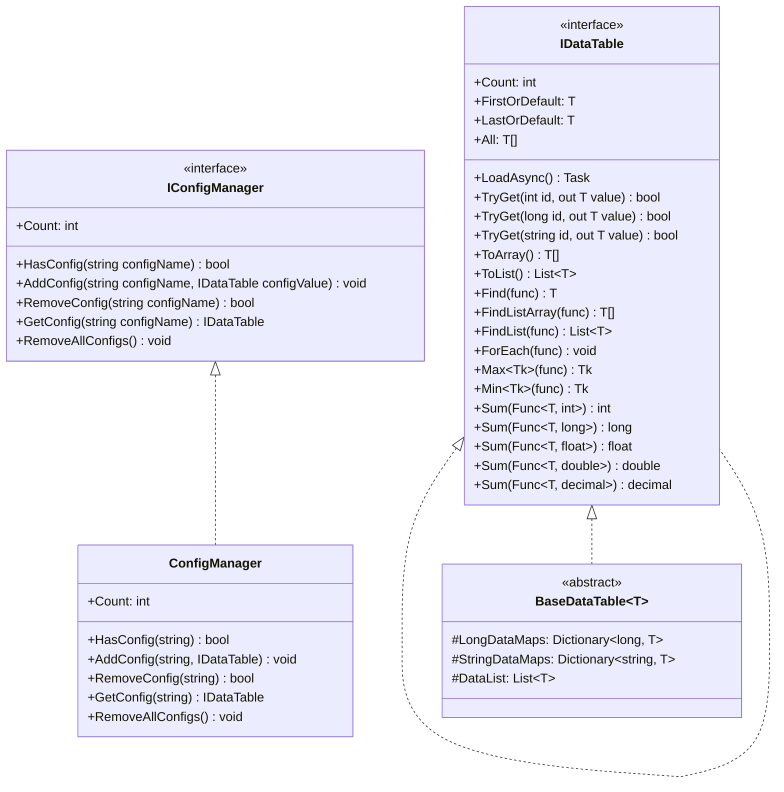
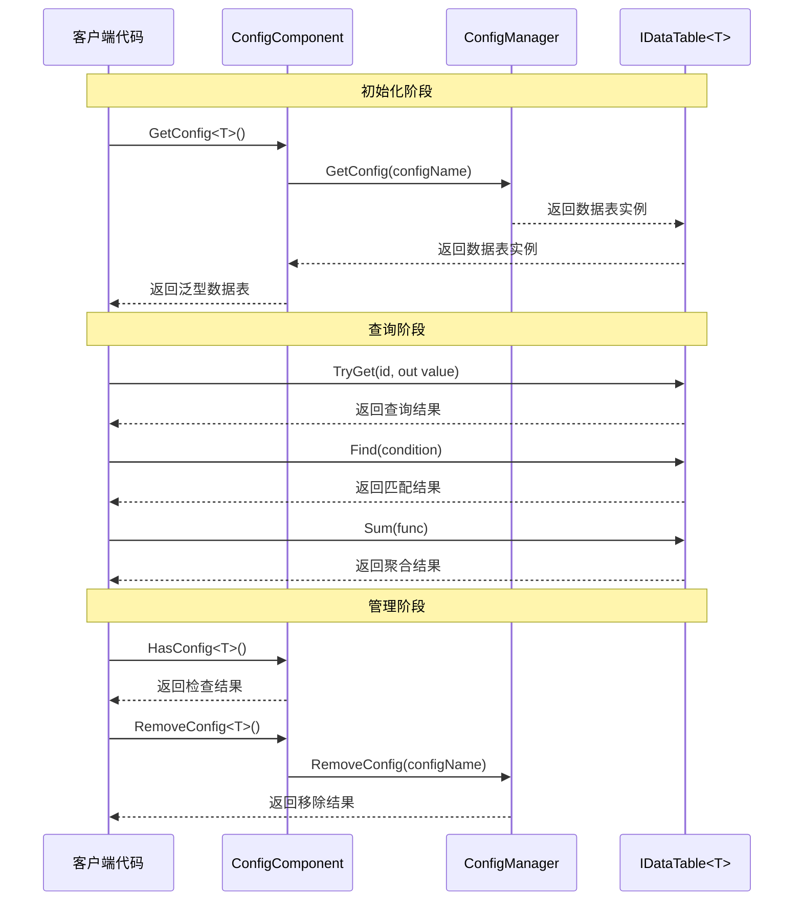

# Interface Definitions

This document provides detailed information about GameFrameX Config configuration模块中定义的核心接口，includingData Table接口 IDataTable、泛型Data Table接口 IDataTable<T> and全局Config Manager Interface IConfigManager。这些接口为Config Systemprovides了统一的抽象层，使开发者能够以Type Safety的方式Access和Manages游戏Config Data。

## 概述

GameFrameX Config configuration模块adopts接口驱动设计，through定义清晰的接口契约来ImplementsConfig Data的解耦Manages。接口设计follows以下核心原则：

- **Type Safety**：throughGeneric Interface IDataTable<T> ensure编译时的Typecheck
- **灵活查询**：provides多种Data Query方式，includingPrimary Key Query、Conditional Query、聚合运算等
- **Asynchronous Loading**：所有数据load操作均supportsasynchronous模式，避免阻塞游戏主线程
- **事件驱动**：throughEvent Arguments类Implementsload状态的精确通知

## Interface Layer次结构



如上图所示，接口之间存在明确的Inherits和Implements关系。IDataTable<T> Inherits自 IDataTable，add了强Type的数据AccessMethod。BaseDataTable<T> Implements了 IDataTable<T> 接口，provides了数据存储和查询的基类Implements。ConfigManager Implements了 IConfigManager 接口，responsible forManages所有的Config Data表实例。

## IDataTable 非Generic Interface

IDataTable 是Data Table的Non-generic Base Interface，定义了所有Data Table都必须Implements的Core Features。该接口located in Runtime/Config/Config/IDataTable.cs 文件中。

> Source: [IDataTable.cs](https://github.com/GameFrameX/com.gameframex.unity.config/blob/main/Runtime/Config/Config/IDataTable.cs#L46-L67)

### Interface Definitions

```csharp
[Preserve]
public interface IDataTable
{
    [Preserve]
    Task LoadAsync();

    [Preserve]
    int Count { get; }
}
```

### Member Description

**LoadAsync Method**
- **签名**: `Task LoadAsync()`
- **Description**: Asynchronous LoadingData Table内容。此Method由具体Implements类Implements，used for从各种数据源（如二进制文件、JSON、XML 等）loadConfig Data
- **Return Value**: 表示asynchronous操作的任务对象

**Count Property**
- **签名**: `int Count { get; }`
- **Description**: Get the number of data objects contained in the data table
- **Return Value**: 非负整数，表示数据项总数

## IDataTable<T> Generic Interface

IDataTable<T> 是Data Table的Generic Interface，Inherits自 IDataTable 接口，provides了强Type的数据Access和查询能力。该接口同样located in Runtime/Config/Config/IDataTable.cs 文件中。

> Source: [IDataTable.cs](https://github.com/GameFrameX/com.gameframex.unity.config/blob/main/Runtime/Config/Config/IDataTable.cs#L77-L355)

### Interface Definitions

```csharp
[Preserve]
public interface IDataTable<T> : IDataTable where T : class
{
    // 主键查询方法
    [Obsolete("请使用TryGet方法")]
    [Preserve]
    T Get(int id);

    [Obsolete("请使用TryGet方法")]
    [Preserve]
    T Get(long id);

    [Obsolete("请使用TryGet方法")]
    [Preserve]
    T Get(string id);

    [Preserve]
    bool TryGet(int id, out T value);

    [Preserve]
    bool TryGet(long id, out T value);

    [Preserve]
    bool TryGet(string id, out T value);

    // 索引器
    [Preserve]
    T this[int id] { get; }

    [Preserve]
    T this[long id] { get; }

    [Preserve]
    T this[string id] { get; }

    // 快捷访问属性
    [Preserve]
    T FirstOrDefault { get; }

    [Preserve]
    T LastOrDefault { get; }

    [Preserve]
    T[] All { get; }

    // 集合转换方法
    [Preserve]
    T[] ToArray();

    [Preserve]
    List<T> ToList();

    // 查询方法
    [Preserve]
    T Find(System.Func<T, bool> func);

    [Preserve]
    T[] FindListArray(System.Func<T, bool> func);

    [Preserve]
    List<T> FindList(Func<T, bool> func);

    [Preserve]
    void ForEach(Action<T> func);

    // 聚合方法
    [Preserve]
    Tk Max<Tk>(Func<T, Tk> func) where Tk : IComparable<Tk>;

    [Preserve]
    Tk Min<Tk>(Func<T, Tk> func) where Tk : IComparable<Tk>;

    [Preserve]
    int Sum(Func<T, int> func);

    [Preserve]
    long Sum(Func<T, long> func);

    [Preserve]
    float Sum(Func<T, float> func);

    [Preserve]
    double Sum(Func<T, double> func);

    [Preserve]
    decimal Sum(Func<T, decimal> func);
}
```

### MemberDetailed Description

#### Primary Key QueryMethod

**TryGet Method重载**
- **Description**: 尝试根据指定的主键get数据对象。相比已废弃的 Get Method，TryGet Method更加安全，不会抛出Exception
- **Parameters**:
  - `id`: 数据对象的主键，supports int、long、string 三种Type
  - `value`: 输出Parameters，当找到对应主键的数据时，返回该数据对象；否则返回Default
- **Return Value**: bool Type，找到对应主键的数据返回 true，否则返回 false

```csharp
// 使用 TryGet 方法安全地获取数据
if (dataTable.TryGet(1001, out var item))
{
    Debug.Log($"找到数据: {item.Name}");
}
else
{
    Debug.LogWarning("未找到指定数据");
}
```

> Source: [BaseDataTable.cs](https://github.com/GameFrameX/com.gameframex.unity.config/blob/main/Runtime/Config/Config/BaseDataTable.cs#L119-L162)

#### Indexer

**Description**: provides了三种Type的Indexerused for便捷Access数据。Indexer内部调用 TryGet MethodImplements，当找不到对应数据时返回 null

```csharp
// 使用索引器访问数据
var item1 = dataTable[1001];      // int 类型主键
var item2 = dataTable[10001L];     // long 类型主键
var item3 = dataTable["item_001"]; // string 类型主键
```

> Source: [BaseDataTable.cs](https://github.com/GameFrameX/com.gameframex.unity.config/blob/main/Runtime/Config/Config/BaseDataTable.cs#L164-L204)

#### 快捷AccessProperty

**FirstOrDefault Property**
- **Type**: `T`
- **Description**: Get the first data object in the data table; returns null if the table is empty

**LastOrDefault Property**
- **Type**: `T`
- **Description**: Get the last data object in the data table; returns null if the table is empty

**All Property**
- **Type**: `T[]`
- **Description**: Get an array copy of all data objects in the data table

```csharp
// 使用快捷属性访问数据
var first = dataTable.FirstOrDefault;
var last = dataTable.LastOrDefault;
var allItems = dataTable.All;
```

> Source: [BaseDataTable.cs](https://github.com/GameFrameX/com.gameframex.unity.config/blob/main/Runtime/Config/Config/BaseDataTable.cs#L223-L268)

#### Query Methods

**Find Method**
- **签名**: `T Find(Func<T, bool> func)`
- **Description**: Find the first matching data object by the specified condition
- **Parameters**: `func` - 定义匹配条件的委托函数
- **Return Value**: 第一个匹配的对象，如果未找到则返回 null

**FindListArray Method**
- **签名**: `T[] FindListArray(Func<T, bool> func)`
- **Description**: 根据指定的条件find所有匹配的数据对象，并返回数组

**FindList Method**
- **签名**: `List<T> FindList(Func<T, bool> func)`
- **Description**: 根据指定的条件find所有匹配的数据对象，并返回列表

**ForEach Method**
- **签名**: `void ForEach(Action<T> func)`
- **Description**: Execute the specified action on each data object in the data table

```csharp
// 使用查询方法
var found = dataTable.Find(item => item.Level > 10);
var matched = dataTable.FindList(item => item.Rarity == "SSR");
var arrayMatched = dataTable.FindListArray(item => item.IsAvailable);

dataTable.ForEach(item => Debug.Log(item.Name));
```

> Source: [BaseDataTable.cs](https://github.com/GameFrameX/com.gameframex.unity.config/blob/main/Runtime/Config/Config/BaseDataTable.cs#L296-L349)

#### Aggregation Methods

**Max Method**
- **签名**: `Tk Max<Tk>(Func<T, Tk> func) where Tk : IComparable<Tk>`
- **Description**: Get the maximum value of the specified property in the data table
- **泛型约束**: Tk 必须Implements IComparable<Tk> 接口

**Min Method**
- **签名**: `Tk Min<Tk>(Func<T, Tk> func) where Tk : IComparable<Tk>`
- **Description**: Get the minimum value of the specified property in the data table
- **泛型约束**: Tk 必须Implements IComparable<Tk> 接口

**Sum Method重载**
- **Description**: 计算Data Table中指定数值Property的总和，supports int、long、float、double、decimal 五种数值Type
- **签名**: 
  - `int Sum(Func<T, int> func)`
  - `long Sum(Func<T, long> func)`
  - `float Sum(Func<T, float> func)`
  - `double Sum(Func<T, double> func)`
  - `decimal Sum(Func<T, decimal> func)`

```csharp
// 使用聚合方法
var maxLevel = dataTable.Max(item => item.Level);
var minPrice = dataTable.Min(item => item.Price);
var totalDamage = dataTable.Sum(item => item.BaseDamage);
```

> Source: [BaseDataTable.cs](https://github.com/GameFrameX/com.gameframex.unity.config/blob/main/Runtime/Config/Config/BaseDataTable.cs#L351-L449)

## IConfigManager 全局Config Manager Interface

IConfigManager Interface Definitions了全局configurationManages器的Core Features，responsible forManages所有的Config Data表实例。该接口located in Runtime/Config/Config/IConfigManager.cs 文件中。

> Source: [IConfigManager.cs](https://github.com/GameFrameX/com.gameframex.unity.config/blob/main/Runtime/Config/Config/IConfigManager.cs#L34-L99)

### Interface Definitions

```csharp
public interface IConfigManager
{
    /// <summary>
    /// 获取全局配置项数量。
    /// </summary>
    int Count { get; }

    /// <summary>
    /// 检查是否存在指定全局配置项。
    /// </summary>
    bool HasConfig(string configName);

    /// <summary>
    /// 增加指定全局配置项。
    /// </summary>
    void AddConfig(string configName, IDataTable configValue);

    /// <summary>
    /// 移除指定全局配置项。
    /// </summary>
    bool RemoveConfig(string configName);

    /// <summary>
    /// 获取指定全局配置项。
    /// </summary>
    IDataTable GetConfig(string configName);

    /// <summary>
    /// 清空所有全局配置项。
    /// </summary>
    void RemoveAllConfigs();
}
```

### MemberDetailed Description

**Count Property**
- **Type**: `int`
- **Description**: Get the number of currently loaded global config items

**HasConfig Method**
- **签名**: `bool HasConfig(string configName)`
- **Description**: Check if exists指定名称的全局configuration项
- **Parameters**: `configName` - 要check的configuration项名称
- **Return Value**: Returns true if it exists; otherwise returns false

**AddConfig Method**
- **签名**: `void AddConfig(string configName, IDataTable configValue)`
- **Description**: add一个新的全局configuration项
- **Parameters**:
  - `configName` - configuration项的名称，used for后续检索
  - `configValue` - configuration项的Data Table实例

**RemoveConfig Method**
- **签名**: `bool RemoveConfig(string configName)`
- **Description**: remove指定名称的全局configuration项
- **Parameters**: `configName` - 要remove的configuration项名称
- **Return Value**: Returns true if removal was successful; otherwise returns false

**GetConfig Method**
- **签名**: `IDataTable GetConfig(string configName)`
- **Description**: get指定名称的全局configuration项
- **Parameters**: `configName` - 要get的configuration项名称
- **Return Value**: The data table instance of the config item; returns null if not found

**RemoveAllConfigs Method**
- **签名**: `void RemoveAllConfigs()`
- **Description**: remove所有已load的全局configuration项

## 接口Uses流程



如序列图所示，Uses接口的基本流程分为三个阶段：Initialize阶段through ConfigComponent get泛型Data Table实例；查询阶段Uses IDataTable<T> 接口provides的Method进行数据Access；Manages阶段through ConfigComponent 或 ConfigManager 进行configuration项的check和remove操作。

## ConfigComponent 组件接口封装

ConfigComponent 是 Unity Component，对 IConfigManager 接口进行了面向 Unity 的封装，provides了更便捷的泛型Access方式。该组件located in Runtime/Config/ConfigComponent.cs 文件中。

> Source: [ConfigComponent.cs](https://github.com/GameFrameX/com.gameframex.unity.config/blob/main/Runtime/Config/ConfigComponent.cs#L40-L185)

### 核心Method

**GetConfig<T> Method**
- **签名**: `T GetConfig<T>() where T : IDataTable`
- **Description**: get指定Type的全局configuration项，返回强Type的泛型Data Table
- **Return Value**: 泛型Data Table实例，如果不存在则返回Default

**HasConfig<T> Method**
- **签名**: `bool HasConfig<T>() where T : IDataTable`
- **Description**: Check if exists指定Type的全局configuration项

**RemoveConfig<T> Method**
- **签名**: `bool RemoveConfig<T>() where T : IDataTable`
- **Description**: remove指定Type的全局configuration项

**Add Method**
- **签名**: `void Add(string configName, IDataTable dataTable)`
- **Description**: add一个新的全局configuration项

```csharp
// ConfigComponent 使用示例
public class MyGameController : MonoBehaviour
{
    private ConfigComponent configComponent;
    
    private void Start()
    {
        configComponent = GetComponent<ConfigComponent>();
        
        // 检查配置是否存在
        if (configComponent.HasConfig<WeaponDataTable>())
        {
            // 获取配置
            var weaponTable = configComponent.GetConfig<WeaponDataTable>();
            
            // 查询数据
            var weapon = weaponTable[1001];
            var fireWeapons = weaponTable.FindList(w => w.Type == WeaponType.Fire);
        }
    }
}
```

## Related Links

- [ConfigComponent Config Component](./4-core-concepts.config-component) - 了解 ConfigComponent 组件的详细information
- [ConfigManager configurationManages器](./4-core-concepts.config-manager) - 了解 ConfigManager Implements细节
- [IDataTable Data Table接口](./4-core-concepts.idata-table) - 了解Data Table接口的Core Concepts
- [Event Arguments](./5-api-reference.event-args) - 了解Config Loading相关的Event Arguments
- [Basic Usage](./3-getting-started.basic-usage) - Getting Startedconfiguration模块的Uses
- [Data Table Definition](./3-getting-started.data-table-definition) - 了解如何定义Data Table
