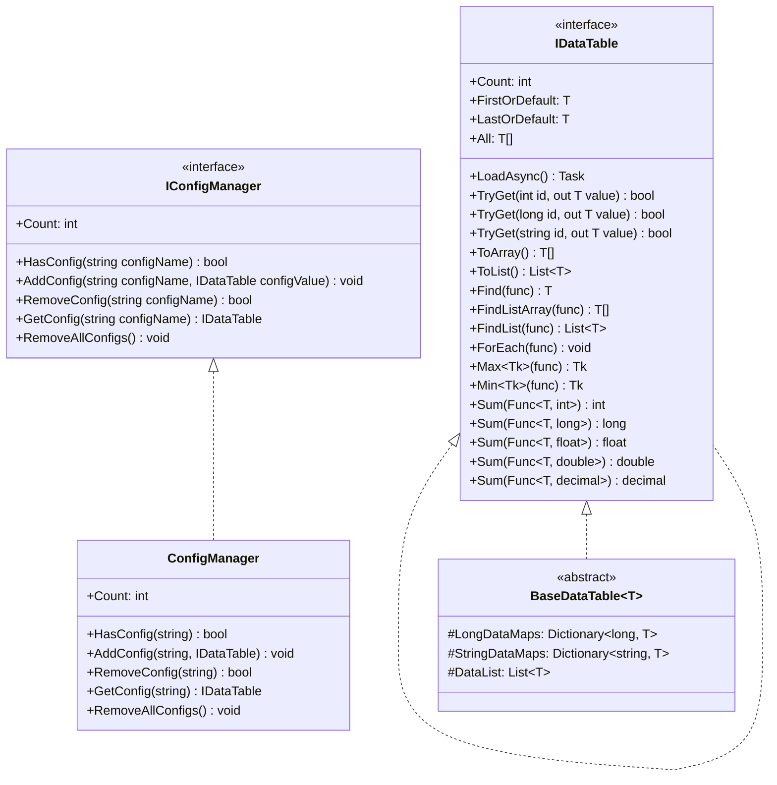
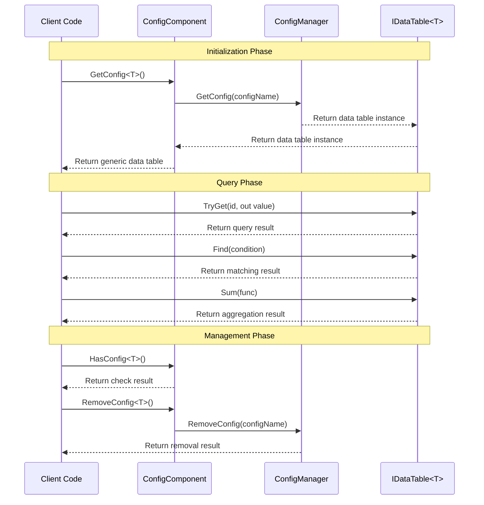

# Interface Definitions

This document provides detailed information about the core interfaces defined in the GameFrameX Config configuration module, including the data table interface IDataTable, generic data table interface `IDataTable<T>`, and the global Config Manager interface IConfigManager. These interfaces provide a unified abstraction layer for the Config system, enabling developers to access and manage game configuration data in a type-safe manner.

## Overview

The GameFrameX Config configuration module adopts an interface-driven design, implementing decoupled configuration data management through clearly defined interface contracts. The interface design follows these core principles:

- **Type Safety**: Ensures compile-time type checking through generic interface `IDataTable<T>`
- **Flexible Queries**: Provides multiple data query methods, including primary key queries, conditional queries, and aggregation operations
- **Asynchronous Loading**: All data loading operations support asynchronous mode, avoiding blocking the game main thread
- **Event-Driven**: Implements precise loading status notifications through event argument classes

## Interface Layer Hierarchy



As shown in the diagram, there are clear inheritance and implementation relationships between interfaces. `IDataTable<T>` inherits from IDataTable and adds strongly-typed data access methods. `BaseDataTable<T>` implements the `IDataTable<T>` interface, providing a base class implementation for data storage and queries. ConfigManager implements the IConfigManager interface, responsible for managing all configuration data table instances.

## IDataTable Non-Generic Interface

IDataTable is the non-generic base interface for data tables, defining core features that all data tables must implement. This interface is located in the Runtime/Config/Config/IDataTable.cs file.

> Source: [IDataTable.cs](https://github.com/GameFrameX/com.gameframex.unity.config/blob/main/Runtime/Config/Config/IDataTable.cs#L46-L67)

### Interface Definition

```csharp
[Preserve]
public interface IDataTable
{
    [Preserve]
    Task LoadAsync();

    [Preserve]
    int Count { get; }
}
```

### Member Description

**LoadAsync Method**
- **Signature**: `Task LoadAsync()`
- **Description**: Asynchronously loads the data table content. This method is implemented by concrete implementation classes, used for loading configuration data from various data sources (such as binary files, JSON, XML, etc.)
- **Return Value**: Task object representing the asynchronous operation

**Count Property**
- **Signature**: `int Count { get; }`
- **Description**: Gets the number of data objects contained in the data table
- **Return Value**: Non-negative integer, representing the total number of data items

## `IDataTable<T>` Generic Interface

`IDataTable<T>` is the generic interface for data tables, inheriting from the IDataTable interface and providing strongly-typed data access and query capabilities. This interface is also located in the Runtime/Config/Config/IDataTable.cs file.

> Source: [IDataTable.cs](https://github.com/GameFrameX/com.gameframex.unity.config/blob/main/Runtime/Config/Config/IDataTable.cs#L77-L355)

### Interface Definition

```csharp
[Preserve]
public interface IDataTable<T> : IDataTable where T : class
{
    // Primary key query methods
    [Obsolete("Please use TryGet method")]
    [Preserve]
    T Get(int id);

    [Obsolete("Please use TryGet method")]
    [Preserve]
    T Get(long id);

    [Obsolete("Please use TryGet method")]
    [Preserve]
    T Get(string id);

    [Preserve]
    bool TryGet(int id, out T value);

    [Preserve]
    bool TryGet(long id, out T value);

    [Preserve]
    bool TryGet(string id, out T value);

    // Indexer
    [Preserve]
    T this[int id] { get; }

    [Preserve]
    T this[long id] { get; }

    [Preserve]
    T this[string id] { get; }

    // Quick access properties
    [Preserve]
    T FirstOrDefault { get; }

    [Preserve]
    T LastOrDefault { get; }

    [Preserve]
    T[] All { get; }

    // Collection conversion methods
    [Preserve]
    T[] ToArray();

    [Preserve]
    List<T> ToList();

    // Query methods
    [Preserve]
    T Find(System.Func<T, bool> func);

    [Preserve]
    T[] FindListArray(System.Func<T, bool> func);

    [Preserve]
    List<T> FindList(Func<T, bool> func);

    [Preserve]
    void ForEach(Action<T> func);

    // Aggregation methods
    [Preserve]
    Tk Max<Tk>(Func<T, Tk> func) where Tk : IComparable<Tk>;

    [Preserve]
    Tk Min<Tk>(Func<T, Tk> func) where Tk : IComparable<Tk>;

    [Preserve]
    int Sum(Func<T, int> func);

    [Preserve]
    long Sum(Func<T, long> func);

    [Preserve]
    float Sum(Func<T, float> func);

    [Preserve]
    double Sum(Func<T, double> func);

    [Preserve]
    decimal Sum(Func<T, decimal> func);
}
```

### Member Detailed Description

#### Primary Key Query Methods

**TryGet Method Overloads**
- **Description**: Attempts to get a data object by the specified primary key. Compared to the deprecated Get method, TryGet method is safer and does not throw exceptions
- **Parameters**:
  - `id`: Primary key of the data object, supports three types: int, long, string
  - `value`: Output parameter, returns the data object when found; otherwise returns default
- **Return Value**: Boolean type, returns true if data is found; otherwise returns false

```csharp
// Use TryGet method to safely get data
if (dataTable.TryGet(1001, out var item))
{
    Debug.Log($"Found data: {item.Name}");
}
else
{
    Debug.LogWarning("Specified data not found");
}
```

> Source: [BaseDataTable.cs](https://github.com/GameFrameX/com.gameframex.unity.config/blob/main/Runtime/Config/Config/BaseDataTable.cs#L119-L162)

#### Indexer

**Description**: Provides three types of indexers for convenient data access. The indexer internally calls the TryGet method implementation and returns null when data is not found

```csharp
// Use indexer to access data
var item1 = dataTable[1001];      // int type primary key
var item2 = dataTable[10001L];     // long type primary key
var item3 = dataTable["item_001"]; // string type primary key
```

> Source: [BaseDataTable.cs](https://github.com/GameFrameX/com.gameframex.unity.config/blob/main/Runtime/Config/Config/BaseDataTable.cs#L164-L204)

#### Quick Access Properties

**FirstOrDefault Property**
- **Type**: `T`
- **Description**: Gets the first data object in the data table; returns null if the table is empty

**LastOrDefault Property**
- **Type**: `T`
- **Description**: Gets the last data object in the data table; returns null if the table is empty

**All Property**
- **Type**: `T[]`
- **Description**: Gets an array copy of all data objects in the data table

```csharp
// Use quick access properties to access data
var first = dataTable.FirstOrDefault;
var last = dataTable.LastOrDefault;
var allItems = dataTable.All;
```

> Source: [BaseDataTable.cs](https://github.com/GameFrameX/com.gameframex.unity.config/blob/main/Runtime/Config/Config/BaseDataTable.cs#L223-L268)

#### Query Methods

**Find Method**
- **Signature**: `T Find(Func<T, bool> func)`
- **Description**: Finds the first matching data object by the specified condition
- **Parameters**: `func` - Delegate function defining the matching condition
- **Return Value**: First matching object, returns null if not found

**FindListArray Method**
- **Signature**: `T[] FindListArray(Func<T, bool> func)`
- **Description**: Finds all data objects matching the specified condition and returns an array

**FindList Method**
- **Signature**: `List<T> FindList(Func<T, bool> func)`
- **Description**: Finds all data objects matching the specified condition and returns a list

**ForEach Method**
- **Signature**: `void ForEach(Action<T> func)`
- **Description**: Executes the specified action on each data object in the data table

```csharp
// Use query methods
var found = dataTable.Find(item => item.Level > 10);
var matched = dataTable.FindList(item => item.Rarity == "SSR");
var arrayMatched = dataTable.FindListArray(item => item.IsAvailable);

dataTable.ForEach(item => Debug.Log(item.Name));
```

> Source: [BaseDataTable.cs](https://github.com/GameFrameX/com.gameframex.unity.config/blob/main/Runtime/Config/Config/BaseDataTable.cs#L296-L349)

#### Aggregation Methods

**Max Method**
- **Signature**: `Tk Max<Tk>(Func<T, Tk> func) where Tk : IComparable<Tk>`
- **Description**: Gets the maximum value of the specified property in the data table
- **Generic Constraint**: Tk must implement `IComparable<Tk>` interface

**Min Method**
- **Signature**: `Tk Min<Tk>(Func<T, Tk> func) where Tk : IComparable<Tk>`
- **Description**: Gets the minimum value of the specified property in the data table
- **Generic Constraint**: Tk must implement `IComparable<Tk>` interface

**Sum Method Overloads**
- **Description**: Calculates the sum of specified numeric properties in the data table, supports five numeric types: int, long, float, double, decimal
- **Signatures**:
  - `int Sum(Func<T, int> func)`
  - `long Sum(Func<T, long> func)`
  - `float Sum(Func<T, float> func)`
  - `double Sum(Func<T, double> func)`
  - `decimal Sum(Func<T, decimal> func)`

```csharp
// Use aggregation methods
var maxLevel = dataTable.Max(item => item.Level);
var minPrice = dataTable.Min(item => item.Price);
var totalDamage = dataTable.Sum(item => item.BaseDamage);
```

> Source: [BaseDataTable.cs](https://github.com/GameFrameX/com.gameframex.unity.config/blob/main/Runtime/Config/Config/BaseDataTable.cs#L351-L449)

## IConfigManager Global Config Manager Interface

IConfigManager interface defines the core features of the global configuration manager, responsible for managing all configuration data table instances. This interface is located in the Runtime/Config/Config/IConfigManager.cs file.

> Source: [IConfigManager.cs](https://github.com/GameFrameX/com.gameframex.unity.config/blob/main/Runtime/Config/Config/IConfigManager.cs#L34-L99)

### Interface Definition

```csharp
public interface IConfigManager
{
    /// <summary>
    /// Gets the number of global configuration items.
    /// </summary>
    int Count { get; }

    /// <summary>
    /// Checks if the specified global configuration item exists.
    /// </summary>
    bool HasConfig(string configName);

    /// <summary>
    /// Adds the specified global configuration item.
    /// </summary>
    void AddConfig(string configName, IDataTable configValue);

    /// <summary>
    /// Removes the specified global configuration item.
    /// </summary>
    bool RemoveConfig(string configName);

    /// <summary>
    /// Gets the specified global configuration item.
    /// </summary>
    IDataTable GetConfig(string configName);

    /// <summary>
    /// Clears all global configuration items.
    /// </summary>
    void RemoveAllConfigs();
}
```

### Member Detailed Description

**Count Property**
- **Type**: `int`
- **Description**: Gets the number of currently loaded global config items

**HasConfig Method**
- **Signature**: `bool HasConfig(string configName)`
- **Description**: Checks if a global configuration item with the specified name exists
- **Parameters**: `configName` - Name of the configuration item to check
- **Return Value**: Returns true if it exists; otherwise returns false

**AddConfig Method**
- **Signature**: `void AddConfig(string configName, IDataTable configValue)`
- **Description**: Adds a new global configuration item
- **Parameters**:
  - `configName` - Name of the configuration item, used for subsequent retrieval
  - `configValue` - Data table instance of the configuration item

**RemoveConfig Method**
- **Signature**: `bool RemoveConfig(string configName)`
- **Description**: Removes the global configuration item with the specified name
- **Parameters**: `configName` - Name of the configuration item to remove
- **Return Value**: Returns true if removal was successful; otherwise returns false

**GetConfig Method**
- **Signature**: `IDataTable GetConfig(string configName)`
- **Description**: Gets the global configuration item with the specified name
- **Parameters**: `configName` - Name of the configuration item to get
- **Return Value**: The data table instance of the config item; returns null if not found

**RemoveAllConfigs Method**
- **Signature**: `void RemoveAllConfigs()`
- **Description**: Removes all loaded global configuration items

## Interface Usage Flow



As shown in the sequence diagram, the basic process of using interfaces is divided into three phases: initialization phase obtains a generic data table instance through ConfigComponent; query phase uses methods provided by `IDataTable<T>` interface for data access; management phase performs configuration item check and removal operations through ConfigComponent or ConfigManager.

## ConfigComponent Component Interface Wrapper

ConfigComponent is a Unity Component that wraps the IConfigManager interface in a Unity-oriented manner, providing more convenient generic access. This component is located in the Runtime/Config/ConfigComponent.cs file.

> Source: [ConfigComponent.cs](https://github.com/GameFrameX/com.gameframex.unity.config/blob/main/Runtime/Config/ConfigComponent.cs#L40-L185)

### Core Methods

**`GetConfig<T>` Method**
- **Signature**: `T GetConfig<T>() where T : IDataTable`
- **Description**: Gets the global configuration item of the specified type, returns a strongly-typed generic data table
- **Return Value**: Generic data table instance; returns default if not exists

**`HasConfig<T>` Method**
- **Signature**: `bool HasConfig<T>() where T : IDataTable`
- **Description**: Checks if a global configuration item of the specified type exists

**`RemoveConfig<T>` Method**
- **Signature**: `bool RemoveConfig<T>() where T : IDataTable`
- **Description**: Removes the global configuration item of the specified type

**Add Method**
- **Signature**: `void Add(string configName, IDataTable dataTable)`
- **Description**: Adds a new global configuration item

```csharp
// ConfigComponent usage example
public class MyGameController : MonoBehaviour
{
    private ConfigComponent configComponent;

    private void Start()
    {
        configComponent = GetComponent<ConfigComponent>();

        // Check if configuration exists
        if (configComponent.HasConfig<WeaponDataTable>())
        {
            // Get configuration
            var weaponTable = configComponent.GetConfig<WeaponDataTable>();

            // Query data
            var weapon = weaponTable[1001];
            var fireWeapons = weaponTable.FindList(w => w.Type == WeaponType.Fire);
        }
    }
}
```

## Related Links

- [ConfigComponent](./10.config-component.md) - Learn detailed information about the ConfigComponent component
- [ConfigManager](./09.config-manager.md) - Learn about ConfigManager implementation details
- [IDataTable Interface](./07.idata-table.md) - Learn core concepts of data table interfaces
- [Event Arguments](./12.event-args.md) - Learn about Config loading related event arguments
- [Basic Usage](./03.getting-started.md) - Getting started with the configuration module usage
- [Data Table Definition](./08.data-table-definition.md) - Learn how to define data tables