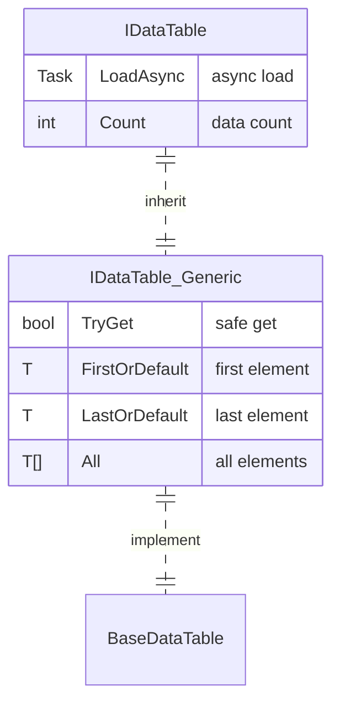

# IDataTable Data Table Interface

IDataTable is the core interface of the GameFrameX Config module, providing unified access to configuration data tables. This interface supports multiple primary key types (int, long, string) and provides rich data query and aggregation operations.

## Overview

The IDataTable interface is the base abstraction layer for configuration data tables, designed for managing static configuration data in game development. It adopts a generic design, supporting strongly-typed data access while maintaining flexible query capabilities.

This interface adopts a two-layer structure design:
- **IDataTable**: Non-generic base interface, defining common loading and data counting functionality
- **IDataTable<T>**: Generic interface, inheriting from IDataTable, provides rich data access and query methods

### Design Intent

The IDataTable interface design follows these principles:

1. **Type Safety**: Ensures compile-time type safety through generic interfaces
2. **Unified Access**: Provides access methods for multiple primary key types, adapting to different configuration data structures
3. **Flexible Queries**: Supports LINQ-style conditional queries and aggregation calculations
4. **Asynchronous Loading**: Supports asynchronous data loading, improving game startup performance

## Architecture

The following shows the architecture relationship of IDataTable in the Config system:


### Core Component Description

| Component | Responsibility |
|------|------|
| **IDataTable** | Non-generic base interface, defines loading and counting functionality |
| **IDataTable<T>** | Generic interface, provides strongly-typed data access methods |
| **BaseDataTable<T>** | Abstract base class, implements core storage logic (dictionary + list) |
| **ConfigManager** | Global configuration manager, responsible for storing and managing all IDataTable instances |
| **ConfigComponent** | Unity Component wrapper, provides user-friendly convenient access methods |

## Data Table Inheritance Structure

The IDataTable<T> interface inherits from IDataTable, forming a complete interface system:



## Usage Examples

### Basic Usage

The following example shows how to define a data table class that inherits from BaseDataTable:

```csharp
using GameFrameX.Config.Runtime;

// Define data table element type
public class ItemData
{
    public int Id { get; set; }
    public string Name { get; set; }
    public int Level { get; set; }
    public int Price { get; set; }
}

// Define data table implementation class
public class ItemDataTable : BaseDataTable<ItemData>
{
    public override async Task LoadAsync()
    {
        // Implement data loading logic here
        // Example: Load data from configuration file and populate LongDataMaps and StringDataMaps
        var dataList = new List<ItemData>
        {
            new ItemData { Id = 1, Name = "Weapon", Level = 1, Price = 100 },
            new ItemData { Id = 2, Name = "Armor", Level = 1, Price = 80 },
            new ItemData { Id = 3, Name = "Potion", Level = 1, Price = 10 }
        };

        foreach (var data in dataList)
        {
            LongDataMaps[data.Id] = data;
            StringDataMaps[data.Name] = data;
            DataList.Add(data);
        }
    }
}
```
> Source: [IDataTable.cs](https://github.com/GameFrameX/com.gameframex.unity.config/blob/main/Runtime/Config/Config/IDataTable.cs#L46-L77)
> Source: [BaseDataTable.cs](https://github.com/GameFrameX/com.gameframex.unity.config/blob/main/Runtime/Config/Config/BaseDataTable.cs#L46-L70)

### Data Query

After data table loading, you can query data in various ways:

```csharp
// Get data table instance (via ConfigComponent)
var configComponent = UnityEngine.GameObject.FindObjectOfType<ConfigComponent>();
var itemDataTable = configComponent.GetConfig<ItemDataTable>();

// Get by integer primary key (recommended to use TryGet)
ItemData item1 = itemDataTable[1];

// Get by string key
ItemData item2 = itemDataTable["Weapon"];

// Safe get (recommended, avoids null reference exception)
if (itemDataTable.TryGet(1, out ItemData item3))
{
    UnityEngine.Debug.Log($"Found item: {item3.Name}");
}

// Get first and last elements
ItemData first = itemDataTable.FirstOrDefault;
ItemData last = itemDataTable.LastOrDefault;

// Get all elements
ItemData[] allItems = itemDataTable.All;
```
> Source: [BaseDataTable.cs](https://github.com/GameFrameX/com.gameframex.unity.config/blob/main/Runtime/Config/Config/BaseDataTable.cs#L119-L204)

### Conditional Query

Use LINQ-style conditional queries:

```csharp
// Find first matching element
ItemData found = itemDataTable.Find(item => item.Level == 1);

// Find all matching elements (array)
ItemData[] level1Items = itemDataTable.FindListArray(item => item.Level == 1);

// Find all matching elements (list)
List<ItemData> cheapItems = itemDataTable.FindList(item => item.Price < 50);

// Iterate through all elements
itemDataTable.ForEach(item =>
{
    UnityEngine.Debug.Log($"Item: {item.Name}, Price: {item.Price}");
});
```
> Source: [BaseDataTable.cs](https://github.com/GameFrameX/com.gameframex.unity.config/blob/main/Runtime/Config/Config/BaseDataTable.cs#L296-L349)

### Aggregation Operations

Data table supports multiple aggregation calculations:

```csharp
// Calculate sum
int totalPrice = itemDataTable.Sum(item => item.Price);

// Get maximum value
int maxLevel = itemDataTable.Max(item => item.Level);

// Get minimum value
int minPrice = itemDataTable.Min(item => item.Price);

// Get element count
int count = itemDataTable.Count;
```
> Source: [BaseDataTable.cs](https://github.com/GameFrameX/com.gameframex.unity.config/blob/main/Runtime/Config/Config/BaseDataTable.cs#L351-L449)

## API Reference

### IDataTable Interface

Non-generic base interface, defining basic data table functionality.

#### `Task LoadAsync()`

Asynchronously loads the data table.

**Returns:** Task representing the asynchronous operation

```csharp
await itemDataTable.LoadAsync();
```

#### `int Count { get; }`

Gets the number of objects in the data table.

**Returns:** Number of objects in the data table

---

### IDataTable<T> Interface

Generic interface, provides strongly-typed data access and query functionality.

#### `bool TryGet(int id, out T value)`

Attempts to get an object by integer ID.

**Parameters:**
- `id` (int): Integer ID of the object to get
- `value` (out T): When an object with the corresponding ID is found, returns that object; otherwise returns default

**Returns:** `true` if an object with the corresponding ID is found; otherwise `false`

#### `bool TryGet(long id, out T value)`

Attempts to get an object by long integer ID.

**Parameters:**
- `id` (long): Long integer ID of the object to get
- `value` (out T): When an object with the corresponding ID is found, returns that object; otherwise returns default

**Returns:** `true` if an object with the corresponding ID is found; otherwise `false`

#### `bool TryGet(string id, out T value)`

Attempts to get an object by string ID.

**Parameters:**
- `id` (string): String ID of the object to get
- `value` (out T): When an object with the corresponding ID is found, returns that object; otherwise returns default

**Returns:** `true` if an object with the corresponding ID is found; otherwise `false`

#### `T this[int id] { get; }`

Gets an object in the data table by integer primary key.

**Parameters:**
- `id` (int): Integer primary key of the object to get

**Returns:** Data object associated with the specified primary key; returns `null` if not found

#### `T this[long id] { get; }`

Gets an object in the data table by long integer primary key.

**Parameters:**
- `id` (long): Long integer primary key of the object to get

**Returns:** Data object associated with the specified primary key; returns `null` if not found

#### `T this[string id] { get; }`

Gets an object in the data table by string key.

**Parameters:**
- `id` (string): String key of the object to get

**Returns:** Data object associated with the specified key; returns `null` if not found

#### `T FirstOrDefault { get; }`

Gets the first object in the data table.

**Returns:** `null` if the data table is empty; otherwise returns the first object

#### `T LastOrDefault { get; }`

Gets the last object in the data table.

**Returns:** `null` if the data table is empty; otherwise returns the last object

#### `T[] All { get; }`

Gets all objects in the data table.

**Returns:** Array containing all objects in the data table

#### `T[] ToArray()`

Copies all objects in the data table to a new array.

**Returns:** New array containing all objects in the data table

#### `List<T> ToList()`

Copies all objects in the data table to a new list.

**Returns:** New list containing all objects in the data table

#### `T Find(Func<T, bool> func)`

Finds the first matching object by condition.

**Parameters:**
- `func` (Func<T, bool>): Function used to define matching condition

**Returns:** The object if found; otherwise `null`

#### `T[] FindListArray(Func<T, bool> func)`

Finds all matching objects by condition and returns an array.

**Parameters:**
- `func` (Func<T, bool>): Function used to define matching condition

**Returns:** Array containing all matching objects

#### `List<T> FindList(Func<T, bool> func)`

Finds all matching objects by condition and returns a list.

**Parameters:**
- `func` (Func<T, bool>): Function used to define matching condition

**Returns:** List containing all matching objects

#### `void ForEach(Action<T> func)`

Executes the specified action on each element in the data table.

**Parameters:**
- `func` (Action<T>): Action to execute on each element

#### `Tk Max<Tk>(Func<T, Tk> func) where Tk : IComparable<Tk>`

Gets the maximum value of the specified property in the data table.

**Parameters:**
- `func` (Func<T, Tk>): Function used to get comparison value

**Type Parameters:**
- `Tk`: Type of comparison value, must implement `IComparable<Tk>` interface

**Returns:** Maximum value of the specified property

#### `Tk Min<Tk>(Func<T, Tk> func) where Tk : IComparable<Tk>`

Gets the minimum value of the specified property in the data table.

**Parameters:**
- `func` (Func<T, Tk>): Function used to get comparison value

**Type Parameters:**
- `Tk`: Type of comparison value, must implement `IComparable<Tk>` interface

**Returns:** Minimum value of the specified property

#### `int Sum(Func<T, int> func)`

Calculates the sum of the specified `int` property in the data table.

**Parameters:**
- `func` (Func<T, int>): Function used to get the value to sum

**Returns:** Sum of the specified property

#### `long Sum(Func<T, long> func)`

Calculates the sum of the specified `long` property in the data table.

**Parameters:**
- `func` (Func<T, long>): Function used to get the value to sum

**Returns:** Sum of the specified property

#### `float Sum(Func<T, float> func)`

Calculates the sum of the specified `float` property in the data table.

**Parameters:**
- `func` (Func<T, float>): Function used to get the value to sum

**Returns:** Sum of the specified property

#### `double Sum(Func<T, double> func)`

Calculates the sum of the specified `double` property in the data table.

**Parameters:**
- `func` (Func<T, double>): Function used to get the value to sum

**Returns:** Sum of the specified property

#### `decimal Sum(Func<T, decimal> func)`

Calculates the sum of the specified `decimal` property in the data table.

**Parameters:**
- `func` (Func<T, decimal>): Function used to get the value to sum

**Returns:** Sum of the specified property

## Related Links

- [ConfigComponent](./10.config-component.md)
- [ConfigManager](./09.config-manager.md)
- [Interface Definitions](./06.interfaces.md)
- [Data Table Definition](./08.data-table-definition.md)