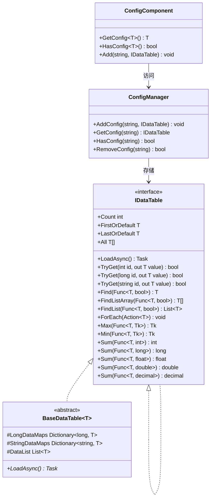
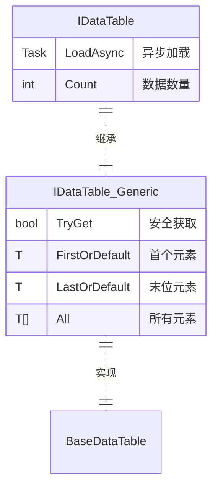

# IDataTable Data Table接口

IDataTable 是 GameFrameX Config 模块的核心接口，provides了对Config Data表的统一Access方式。该接口supports多种Primary Key Type（int、long、string），并provides了丰富的Data Query和Aggregation Operations。

## 概述

IDataTable 接口是Config Data表的基础抽象层，设计used for在游戏开发中Manages静态Config Data。它adopts泛型设计，supports强Type的数据Access，同时保持了灵活的查询能力。

该接口adopts双层结构设计：
- **IDataTable**：Non-generic Base Interface，定义了通用的load和数据计数功能
- **IDataTable<T>**：Generic Interface，Inherits自 IDataTable，provides了丰富的数据Access和Query Methods

### 设计意图

IDataTable 接口的设计follows以下原则：

1. **Type Safety**：throughGeneric Interfaceensure编译时的Type Safety
2. **统一Access**：provides多种Primary Key Type的Access方式，适应不同的Config Data结构
3. **查询灵活**：supports LINQ 风格的Conditional Query和Aggregation Calculation
4. **Asynchronous Loading**：supportsAsynchronous Loading数据，提升游戏start性能

## 架构

以下是 IDataTable 在 Config 系统中的架构关系：



### 核心组件Description

| 组件 | Responsibility |
|------|------|
| **IDataTable** | Non-generic Base Interface，定义load和计数功能 |
| **IDataTable<T>** | Generic Interface，provides强Type的数据AccessMethod |
| **BaseDataTable<T>** | Abstract Base Class，Implements核心存储逻辑（字典+列表） |
| **ConfigManager** | 全局configurationManages器，responsible for存储和Manages所有 IDataTable 实例 |
| **ConfigComponent** | Unity Component封装，provides面向用户的便捷AccessMethod |

## Data TableInherits结构

IDataTable<T> 接口Inherits自 IDataTable，形成完整的接口体系：



## Usage Examples

### Basic Usage

以下示例展示如何定义一个Inherits自 BaseDataTable 的Data Table类：

```csharp
using GameFrameX.Config.Runtime;

// 定义数据表元素类型
public class ItemData
{
    public int Id { get; set; }
    public string Name { get; set; }
    public int Level { get; set; }
    public int Price { get; set; }
}

// 定义数据表实现类
public class ItemDataTable : BaseDataTable<ItemData>
{
    public override async Task LoadAsync()
    {
        // 在此处实现数据加载逻辑
        // 示例：从配置文件中加载数据并填充到 LongDataMaps 和 StringDataMaps
        var dataList = new List<ItemData>
        {
            new ItemData { Id = 1, Name = "武器", Level = 1, Price = 100 },
            new ItemData { Id = 2, Name = "护甲", Level = 1, Price = 80 },
            new ItemData { Id = 3, Name = "药水", Level = 1, Price = 10 }
        };
        
        foreach (var data in dataList)
        {
            LongDataMaps[data.Id] = data;
            StringDataMaps[data.Name] = data;
            DataList.Add(data);
        }
    }
}
```
> Source: [IDataTable.cs](https://github.com/GameFrameX/com.gameframex.unity.config/blob/main/Runtime/Config/Config/IDataTable.cs#L46-L77)
> Source: [BaseDataTable.cs](https://github.com/GameFrameX/com.gameframex.unity.config/blob/main/Runtime/Config/Config/BaseDataTable.cs#L46-L70)

### Data Query

Data Tableload后，可以through多种方式查询数据：

```csharp
// 获取数据表实例（通过 ConfigComponent）
var configComponent = UnityEngine.GameObject.FindObjectOfType<ConfigComponent>();
var itemDataTable = configComponent.GetConfig<ItemDataTable>();

// 通过整数主键获取（推荐使用 TryGet）
ItemData item1 = itemDataTable[1];

// 通过字符串键获取
ItemData item2 = itemDataTable["武器"];

// 安全获取（推荐，避免空引用异常）
if (itemDataTable.TryGet(1, out ItemData item3))
{
    UnityEngine.Debug.Log($"找到物品: {item3.Name}");
}

// 获取第一个和最后一个元素
ItemData first = itemDataTable.FirstOrDefault;
ItemData last = itemDataTable.LastOrDefault;

// 获取所有元素
ItemData[] allItems = itemDataTable.All;
```
> Source: [BaseDataTable.cs](https://github.com/GameFrameX/com.gameframex.unity.config/blob/main/Runtime/Config/Config/BaseDataTable.cs#L119-L204)

### Conditional Query

Uses LINQ 风格的Conditional Query：

```csharp
// 查找第一个匹配的元素
ItemData found = itemDataTable.Find(item => item.Level == 1);

// 查找所有匹配的元素（数组）
ItemData[] level1Items = itemDataTable.FindListArray(item => item.Level == 1);

// 查找所有匹配的元素（列表）
List<ItemData> cheapItems = itemDataTable.FindList(item => item.Price < 50);

// 遍历所有元素
itemDataTable.ForEach(item => 
{
    UnityEngine.Debug.Log($"物品: {item.Name}, 价格: {item.Price}");
});
```
> Source: [BaseDataTable.cs](https://github.com/GameFrameX/com.gameframex.unity.config/blob/main/Runtime/Config/Config/BaseDataTable.cs#L296-L349)

### Aggregation Operations

Data Tablesupports多种Aggregation Calculation：

```csharp
// 计算总和
int totalPrice = itemDataTable.Sum(item => item.Price);

// 获取最大值
int maxLevel = itemDataTable.Max(item => item.Level);

// 获取最小值
int minPrice = itemDataTable.Min(item => item.Price);

// 获取元素数量
int count = itemDataTable.Count;
```
> Source: [BaseDataTable.cs](https://github.com/GameFrameX/com.gameframex.unity.config/blob/main/Runtime/Config/Config/BaseDataTable.cs#L351-L449)

## API Reference

### IDataTable 接口

Non-generic Base Interface，定义Data Table的基本功能。

#### `Task LoadAsync()`

Asynchronous LoadingData Table。

**返回：** 表示asynchronous操作的任务

```csharp
await itemDataTable.LoadAsync();
```

#### `int Count { get; }`

getData Table中对象的数量。

**返回：** Data Table中对象的数量

---

### IDataTable<T> 接口

Generic Interface，provides强Type的数据Access和查询功能。

#### `bool TryGet(int id, out T value)`

尝试根据整数 ID get对象。

**Parameters：**
- `id` (int): 要get的对象的整数 ID
- `value` (out T): 当找到对应 ID 的对象时，返回该对象；否则返回Default

**返回：** 如果找到对应 ID 的对象则返回 `true`；否则返回 `false`

#### `bool TryGet(long id, out T value)`

尝试根据长整数 ID get对象。

**Parameters：**
- `id` (long): 要get的对象的长整数 ID
- `value` (out T): 当找到对应 ID 的对象时，返回该对象；否则返回Default

**返回：** 如果找到对应 ID 的对象则返回 `true`；否则返回 `false`

#### `bool TryGet(string id, out T value)`

尝试根据字符串 ID get对象。

**Parameters：**
- `id` (string): 要get的对象的字符串 ID
- `value` (out T): 当找到对应 ID 的对象时，返回该对象；否则返回Default

**返回：** 如果找到对应 ID 的对象则返回 `true`；否则返回 `false`

#### `T this[int id] { get; }`

根据整数主键getData Table中的对象。

**Parameters：**
- `id` (int): 要get的对象的整数主键

**返回：** 与指定主键关联的数据对象；如果找不到则返回 `null`

#### `T this[long id] { get; }`

根据长整数主键getData Table中的对象。

**Parameters：**
- `id` (long): 要get的对象的长整数主键

**返回：** 与指定主键关联的数据对象；如果找不到则返回 `null`

#### `T this[string id] { get; }`

根据字符串键getData Table中的对象。

**Parameters：**
- `id` (string): 要get的对象的字符串键

**返回：** 与指定键关联的数据对象；如果找不到则返回 `null`

#### `T FirstOrDefault { get; }`

getData Table中第一个对象。

**返回：** 如果Data Table为空，则返回 `null`；否则返回第一个对象

#### `T LastOrDefault { get; }`

getData Table中最后一个对象。

**返回：** 如果Data Table为空，则返回 `null`；否则返回最后一个对象

#### `T[] All { get; }`

Get all objects in the data table。

**返回：** containsData Table中所有对象的数组

#### `T[] ToArray()`

Copy all objects in the data table to a new array。

**返回：** containsData Table中所有对象的新数组

#### `List<T> ToList()`

Copy all objects in the data table to a new list。

**返回：** containsData Table中所有对象的新列表

#### `T Find(Func<T, bool> func)`

根据条件find第一个匹配的对象。

**Parameters：**
- `func` (Func<T, bool>): used for定义匹配条件的函数

**返回：** 如果找到匹配的对象，则返回该对象；否则返回 `null`

#### `T[] FindListArray(Func<T, bool> func)`

根据条件find所有匹配的对象并返回数组。

**Parameters：**
- `func` (Func<T, bool>): used for定义匹配条件的函数

**返回：** contains所有匹配对象的数组

#### `List<T> FindList(Func<T, bool> func)`

根据条件find所有匹配的对象并返回列表。

**Parameters：**
- `func` (Func<T, bool>): used for定义匹配条件的函数

**返回：** contains所有匹配对象的列表

#### `void ForEach(Action<T> func)`

对Data Table中的每个元素执行指定的操作。

**Parameters：**
- `func` (Action<T>): 要对每个元素执行的操作

#### `Tk Max<Tk>(Func<T, Tk> func) where Tk : IComparable<Tk>`

Get the maximum value of the specified property in the data table。

**Parameters：**
- `func` (Func<T, Tk>): used forget比较值的函数

**TypeParameters：**
- `Tk`: 比较值的Type，必须Implements `IComparable<Tk>` 接口

**返回：** 指定Property的最大值

#### `Tk Min<Tk>(Func<T, Tk> func) where Tk : IComparable<Tk>`

Get the minimum value of the specified property in the data table。

**Parameters：**
- `func` (Func<T, Tk>): used forget比较值的函数

**TypeParameters：**
- `Tk`: 比较值的Type，必须Implements `IComparable<Tk>` 接口

**返回：** 指定Property的最小值

#### `int Sum(Func<T, int> func)`

计算Data Table中指定 `int` Property的总和。

**Parameters：**
- `func` (Func<T, int>): used forget求和值的函数

**返回：** 指定Property的总和

#### `long Sum(Func<T, long> func)`

计算Data Table中指定 `long` Property的总和。

**Parameters：**
- `func` (Func<T, long>): used forget求和值的函数

**返回：** 指定Property的总和

#### `float Sum(Func<T, float> func)`

计算Data Table中指定 `float` Property的总和。

**Parameters：**
- `func` (Func<T, float>): used forget求和值的函数

**返回：** 指定Property的总和

#### `double Sum(Func<T, double> func)`

计算Data Table中指定 `double` Property的总和。

**Parameters：**
- `func` (Func<T, double>): used forget求和值的函数

**返回：** 指定Property的总和

#### `decimal Sum(Func<T, decimal> func)`

计算Data Table中指定 `decimal` Property的总和。

**Parameters：**
- `func` (Func<T, decimal>): used forget求和值的函数

**返回：** 指定Property的总和

## Related Links

- [ConfigComponent Config Component](./4-core-concepts.config-component)
- [ConfigManager configurationManages器](./4-core-concepts.config-manager)
- [API Reference](./5-api-reference.interfaces)
- [Data Table Definition](./3-getting-started.data-table-definition)
