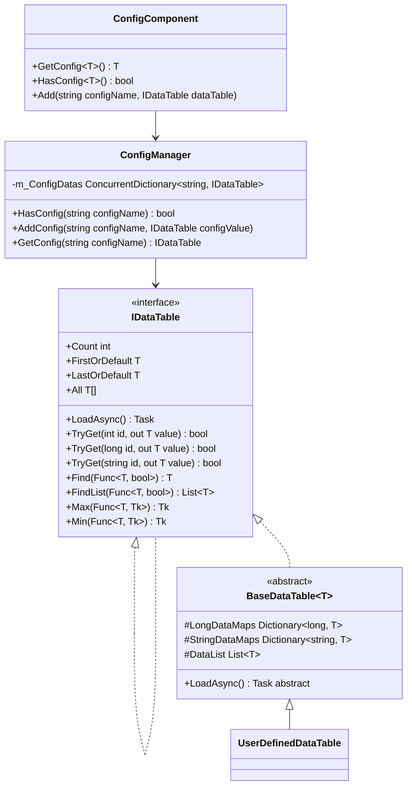
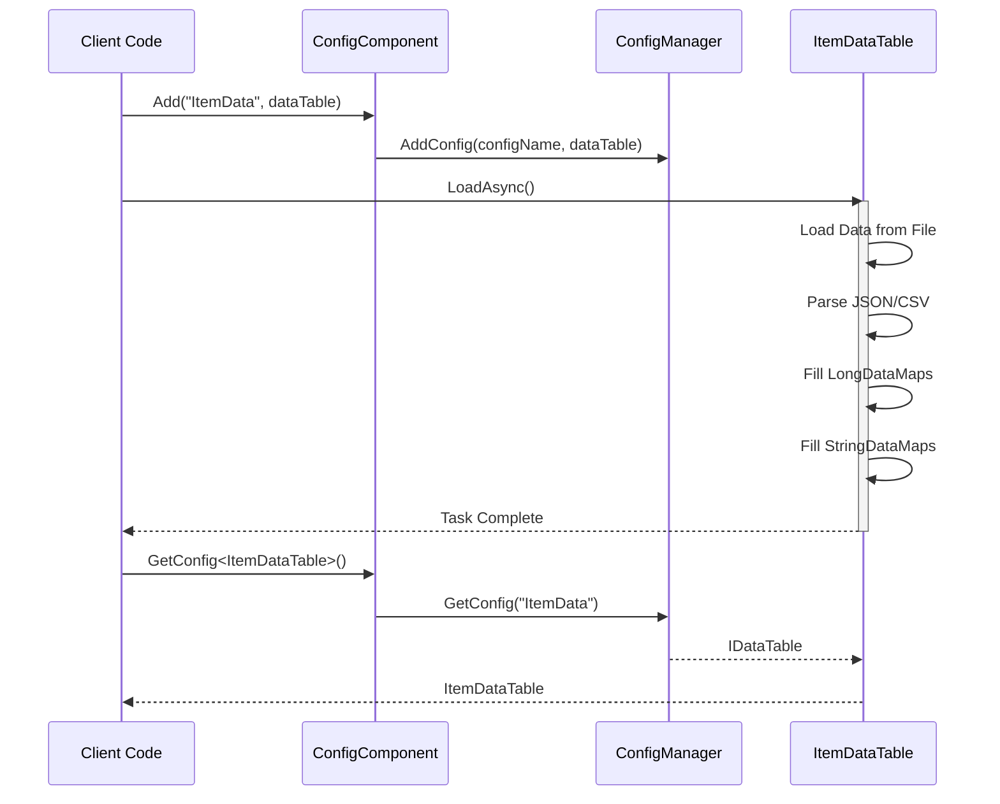

# Data Table Definition

Data Table is the core abstraction in the GameFrameX Config System used for storing and managing configuration data. Through data tables, developers can efficiently access, query, and manage game configurations.

## Overview

Data Table is a core part of the GameFrameX Config System, providing a type-safe way to store and retrieve configuration data. Each data table is essentially a key-value pair collection, supporting fast lookup through integer ID, long integer ID, or string ID.

The main design goals of the data table system are:

- **High-Performance Queries**: Uses Dictionary implementing O(1) time complexity data lookup
- **Type Safety**: Ensures compile-time type checking through generic interfaces
- **Flexible Data Organization**: Supports multiple primary key types to meet different business scenarios
- **Rich Query Operations**: Provides LINQ-style query interface, supporting conditional filtering, aggregation calculations, and other operations

## Data Table Architecture

The data table system adopts a layered architecture design, from bottom to top:



### Architecture Layer Description

| Layer | Component | Responsibility |
|------|------|------|
| Interface Layer | `IDataTable` / `IDataTable<T>` | Defines abstract operation contracts for data tables |
| Implementation Layer | `BaseDataTable<T>` | Provides common implementation for data storage and queries |
| Component Layer | `ConfigComponent` | Unity Component wrapper, provides Inspector configuration interface |
| Management Layer | `ConfigManager` | Global configuration manager, responsible for unified configuration management |

## Define Data Table

### Define Data Model

First, define the data model (entity class) for the data table. The data model can be any reference type class:

```csharp
using UnityEngine;

[System.Serializable]
public class ItemData
{
    public int Id;
    public string Name;
    public string Description;
    public int Quality;
    public int Price;
    public string Icon;
}
```

> Source: [Data Model Example](https://github.com/GameFrameX/com.gameframex.unity.config/blob/main/Runtime/Config/Config/BaseDataTable.cs#L46-L48)

### Inherit BaseDataTable

Then, create a data table class that inherits from `BaseDataTable<T>` and implement the `LoadAsync` method:

```csharp
using GameFrameX.Config.Runtime;
using System.Collections.Generic;
using System.Threading.Tasks;
using UnityEngine;

public class ItemDataTable : BaseDataTable<ItemData>
{
    private const string DataTablePath = "Assets/Game/Configs/ItemData.json";

    public override async Task LoadAsync()
    {
        // Load data and populate dictionaries
        var jsonText = await LoadJsonAsync(DataTablePath);
        var items = DeserializeItems(jsonText);

        foreach (var item in items)
        {
            // Add to both long integer and string indexes
            LongDataMaps.Add(item.Id, item);
            StringDataMaps.Add(item.Name, item);
            DataList.Add(item);
        }
    }

    private Task<string> LoadJsonAsync(string path)
    {
        // Implement resource loading logic
        return Task.FromResult(string.Empty);
    }

    private List<ItemData> DeserializeItems(string json)
    {
        // Implement deserialization logic
        return new List<ItemData>();
    }
}
```

> Source: [BaseDataTable Definition](https://github.com/GameFrameX/com.gameframex.unity.config/blob/main/Runtime/Config/Config/BaseDataTable.cs#L48-L69)

### Register Data Table

Add ConfigComponent component in Unity scene and register the data table:

```csharp
using UnityEngine;
using GameFrameX.Config.Runtime;

public class GameBootstrap : MonoBehaviour
{
    private ConfigComponent _configComponent;

    private async void Start()
    {
        _configComponent = FindObjectOfType<ConfigComponent>();

        // Create and load data table
        var itemDataTable = new ItemDataTable();
        await itemDataTable.LoadAsync();

        // Register to ConfigComponent
        _configComponent.Add("ItemData", itemDataTable);
    }
}
```

> Source: [ConfigComponent.Add Method](https://github.com/GameFrameX/com.gameframex.unity.config/blob/main/Runtime/Config/ConfigComponent.cs#L181-L184)

## Data Table Operations

### Basic Query

Data table supports multiple query methods:

```csharp
// Get via indexer (recommended)
var item = _configComponent.GetConfig<ItemDataTable>()[1001];

// Use TryGet method (safe version)
if (_configComponent.GetConfig<ItemDataTable>().TryGet(1001, out var item))
{
    Debug.Log($"Found item: {item.Name}");
}

// Get by string key
var itemByName = _configComponent.GetConfig<ItemDataTable>()["Weapon"];
```

> Source: [TryGet Implementation](https://github.com/GameFrameX/com.gameframex.unity.config/blob/main/Runtime/Config/Config/BaseDataTable.cs#L128-L162)

### Conditional Query

Data table provides LINQ-like query interface:

```csharp
var dataTable = _configComponent.GetConfig<ItemDataTable>();

// Find first matching element
var firstQualityItem = dataTable.Find(item => item.Quality == 1);

// Find all matching elements
var expensiveItems = dataTable.FindList(item => item.Price > 1000);

// Iterate through all elements
dataTable.ForEach(item =>
{
    Debug.Log($"{item.Name}: {item.Price}");
});
```

> Source: [Find and ForEach Methods](https://github.com/GameFrameX/com.gameframex.unity.config/blob/main/Runtime/Config/Config/BaseDataTable.cs#L296-L349)

### Aggregation Operations

Supports common aggregation calculations:

```csharp
var dataTable = _configComponent.GetConfig<ItemDataTable>();

// Calculate total price of all items
var totalValue = dataTable.Sum(item => item.Price);

// Get maximum price
var maxPrice = dataTable.Max(item => item.Price);

// Get minimum price
var minPrice = dataTable.Min(item => item.Price);

// Get item count
var count = dataTable.Count;
```

> Source: [Aggregation Methods Implementation](https://github.com/GameFrameX/com.gameframex.unity.config/blob/main/Runtime/Config/Config/BaseDataTable.cs#L351-L449)

## Data Loading Flow

Data table loading follows an asynchronous pattern. The complete process is as follows:



## Core Data Structures

`BaseDataTable<T>` maintains three core data structures internally:

```csharp
protected readonly Dictionary<long, T> LongDataMaps = new Dictionary<long, T>(DefaultSize);
protected readonly Dictionary<string, T> StringDataMaps = new Dictionary<string, T>(DefaultSize);
protected readonly List<T> DataList = new List<T>(DefaultSize);
```

| Data Structure | Usage | Access Method |
|---------|------|---------|
| `LongDataMaps` | Stores data with long integer as primary key | `TryGet(long id)` |
| `StringDataMaps` | Stores data with string as primary key | `TryGet(string id)` |
| `DataList` | Stores all data in insertion order | iterate, aggregation operations |

This design ensures:
- O(1) time complexity for primary key queries
- Support for querying through multiple key types simultaneously
- Preserves data insertion order for iteration and batch operations

## Caching Mechanism

To optimize performance, `BaseDataTable<T>` implements a caching mechanism:

```csharp
private bool _cacheInitialized;
private T _firstOrDefaultCache;
private T _lastOrDefaultCache;
private bool _countCacheInitialized;
private int _countCache;
```

> Source: [Cache Implementation](https://github.com/GameFrameX/com.gameframex.unity.config/blob/main/Runtime/Config/Config/BaseDataTable.cs#L55-L59)

- **First/Last Cache**: When first accessing `FirstOrDefault` or `LastOrDefault`, iterates through the data list to find the first and last non-empty elements and caches them
- **Count Cache**: When first accessing `Count` property, calculates and caches the data count

This lazy-load caching strategy avoids additional calculations during data loading while ensuring efficient subsequent access.

## Best Practices

### Data Model Design

1. **Use Value Type Fields**: For simple data, prefer value types (int, float, bool) to reduce memory usage
2. **Avoid Nested Complex Objects**: Configuration data should be kept flat, with complex relationships implemented through ID references
3. **Add Index Fields**: Add corresponding index dictionaries for fields that need frequent queries

### Performance Optimization

1. **Batch Loading**: Load all configuration data at once during game startup
2. **On-Demand Loading**: For large configurations, consider loading by scene or functional module
3. **Cache Query Results**: For frequently accessed configuration data, consider adding application-layer caching

### Error Handling

When data table loading fails, provide appropriate error handling:

```csharp
try
{
    var dataTable = new ItemDataTable();
    await dataTable.LoadAsync();
    _configComponent.Add("ItemData", dataTable);
}
catch (System.Exception ex)
{
    Debug.LogError($"Failed to load configuration: {ex.Message}");
    // Use default configuration or display error UI
}
```

## Related Links

- [ConfigComponent](./10.config-component.md)
- [ConfigManager](./09.config-manager.md)
- [IDataTable Interface](./07.idata-table.md)
- [Basic Usage](./03.getting-started.md)