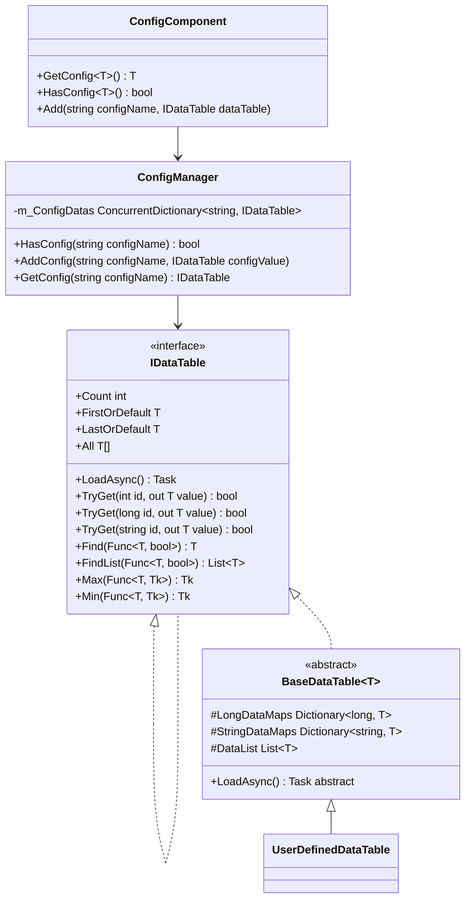
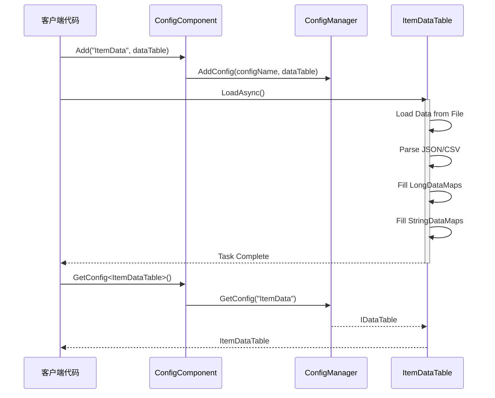

# Data Table Definition

Data Table（Data Table）是 GameFrameX Config Config System中used for存储和ManagesConfig Data的核心抽象。throughData Table，开发者可以高效地Access、查询和Manages游戏configuration。

## 概述

Data Table是 GameFrameX Config System的核心组成部分，provides了一种Type Safety的方式来存储和检索Config Data。每个Data Table本质上是一个键值对集合，supportsthrough整数 ID、长整数 ID 或字符串 ID 进行快速find。

Data Table系统的主要Design Goals是：

- **高性能查询**：Uses Dictionary Implements O(1) 时间复杂度的数据find
- **Type Safety**：throughGeneric Interfaceensure编译时Typecheck
- **灵活的数据组织**：supports多种Primary Key Type，满足不同业务场景
- **丰富的Query Operations**：Provides LINQ-style query interface，supports条件筛选、Aggregation Calculation等操作

## Data Table架构

Data Table系统adopts分层Architecture Design，从底层到上层依次为：



### 架构层级Description

| 层级 | 组件 | Responsibility |
|------|------|------|
| Interface Layer | `IDataTable` / `IDataTable<T>` | 定义Data Table的抽象操作契约 |
| Implementation Layer | `BaseDataTable<T>` | provides数据存储和查询的通用Implements |
| 组件层 | `ConfigComponent` | Unity Component封装，provides Inspector configuration界面 |
| Management Layer | `ConfigManager` | 全局configurationManages器，responsible forconfiguration的统一Manages |

## 定义Data Table

### Define Data Model

首先，需要定义Data Table中的数据模型（实体类）。数据模型可以是任何引用Type的类：

```csharp
using UnityEngine;

[System.Serializable]
public class ItemData
{
    public int Id;
    public string Name;
    public string Description;
    public int Quality;
    public int Price;
    public string Icon;
}
```

> Source: [数据模型示例](https://github.com/GameFrameX/com.gameframex.unity.config/blob/main/Runtime/Config/Config/BaseDataTable.cs#L46-L48)

### Inherits BaseDataTable

然后，Creates一个Inherits自 `BaseDataTable<T>` 的Data Table类，并Implements `LoadAsync` Method：

```csharp
using GameFrameX.Config.Runtime;
using System.Collections.Generic;
using System.Threading.Tasks;
using UnityEngine;

public class ItemDataTable : BaseDataTable<ItemData>
{
    private const string DataTablePath = "Assets/Game/Configs/ItemData.json";

    public override async Task LoadAsync()
    {
        // 加载数据并填充到字典中
        var jsonText = await LoadJsonAsync(DataTablePath);
        var items = DeserializeItems(jsonText);
        
        foreach (var item in items)
        {
            // 同时添加到长整型和字符串索引中
            LongDataMaps.Add(item.Id, item);
            StringDataMaps.Add(item.Name, item);
            DataList.Add(item);
        }
    }
    
    private Task<string> LoadJsonAsync(string path)
    {
        // 实现资源加载逻辑
        return Task.FromResult(string.Empty);
    }
    
    private List<ItemData> DeserializeItems(string json)
    {
        // 实现反序列化逻辑
        return new List<ItemData>();
    }
}
```

> Source: [BaseDataTable 定义](https://github.com/GameFrameX/com.gameframex.unity.config/blob/main/Runtime/Config/Config/BaseDataTable.cs#L48-L69)

### registerData Table

在 Unity 场景中add ConfigComponent 组件，并registerData Table：

```csharp
using UnityEngine;
using GameFrameX.Config.Runtime;

public class GameBootstrap : MonoBehaviour
{
    private ConfigComponent _configComponent;
    
    private async void Start()
    {
        _configComponent = FindObjectOfType<ConfigComponent>();
        
        // 创建并加载数据表
        var itemDataTable = new ItemDataTable();
        await itemDataTable.LoadAsync();
        
        // 注册到 ConfigComponent
        _configComponent.Add("ItemData", itemDataTable);
    }
}
```

> Source: [ConfigComponent.Add Method](https://github.com/GameFrameX/com.gameframex.unity.config/blob/main/Runtime/Config/ConfigComponent.cs#L181-L184)

## Data Table操作

### Basic Query

Data Tablesupports多种查询方式：

```csharp
// 通过索引器获取（推荐）
var item = _configComponent.GetConfig<ItemDataTable>()[1001];

// 使用 TryGet 方法获取（安全版本）
if (_configComponent.GetConfig<ItemDataTable>().TryGet(1001, out var item))
{
    Debug.Log($"找到物品: {item.Name}");
}

// 通过字符串键获取
var itemByName = _configComponent.GetConfig<ItemDataTable>()["武器"];
```

> Source: [TryGet Implements](https://github.com/GameFrameX/com.gameframex.unity.config/blob/main/Runtime/Config/Config/BaseDataTable.cs#L128-L162)

### Conditional Query

Data Tableprovides了类似 LINQ 的查询接口：

```csharp
var dataTable = _configComponent.GetConfig<ItemDataTable>();

// 查找第一个匹配的元素
var firstQualityItem = dataTable.Find(item => item.Quality == 1);

// 查找所有匹配的元素
var expensiveItems = dataTable.FindList(item => item.Price > 1000);

// 遍历所有元素
dataTable.ForEach(item => 
{
    Debug.Log($"{item.Name}: {item.Price}");
});
```

> Source: [Find 和 ForEach Method](https://github.com/GameFrameX/com.gameframex.unity.config/blob/main/Runtime/Config/Config/BaseDataTable.cs#L296-L349)

### Aggregation Operations

supports常用的Aggregation Calculation：

```csharp
var dataTable = _configComponent.GetConfig<ItemDataTable>();

// 计算所有物品的总价
var totalValue = dataTable.Sum(item => item.Price);

// 获取最高价格的物品
var maxPrice = dataTable.Max(item => item.Price);

// 获取最低价格的物品
var minPrice = dataTable.Min(item => item.Price);

// 获取物品数量
var count = dataTable.Count;
```

> Source: [Aggregation MethodsImplements](https://github.com/GameFrameX/com.gameframex.unity.config/blob/main/Runtime/Config/Config/BaseDataTable.cs#L351-L449)

## Data Loading Flow

Data Table的loadfollowsasynchronous模式，整个流程如下：



## Core Data Structures

`BaseDataTable<T>` 内部维护三个Core Data Structures：

```csharp
protected readonly Dictionary<long, T> LongDataMaps = new Dictionary<long, T>(DefaultSize);
protected readonly Dictionary<string, T> StringDataMaps = new Dictionary<string, T>(DefaultSize);
protected readonly List<T> DataList = new List<T>(DefaultSize);
```

| 数据结构 | Usage | Access方式 |
|---------|------|---------|
| `LongDataMaps` | 存储以长整数为主键的数据 | `TryGet(long id)` |
| `StringDataMaps` | 存储以字符串为主键的数据 | `TryGet(string id)` |
| `DataList` | 按插入sequential存储所有数据 | iterate、Aggregation Operations |

这种设计ensure了：
- throughPrimary Key Query时具有 O(1) 的时间复杂度
- supports同时through多种键Type进行查询
- 保留了数据的插入sequential，便于iterate和批量操作

## Caching Mechanism

为了优化性能，`BaseDataTable<T>` Implements了Caching Mechanism：

```csharp
private bool _cacheInitialized;
private T _firstOrDefaultCache;
private T _lastOrDefaultCache;
private bool _countCacheInitialized;
private int _countCache;
```

> Source: [缓存Implements](https://github.com/GameFrameX/com.gameframex.unity.config/blob/main/Runtime/Config/Config/BaseDataTable.cs#L55-L59)

- **首尾缓存**：首次Access `FirstOrDefault` 或 `LastOrDefault` 时，会iterate数据列表找到第一个和最后一个非空元素并缓存
- **数量缓存**：首次Access `Count` Property时，会计算并缓存数据数量

这种懒load缓存策略避免了在数据load时进行额外的计算，同时ensure了后续Access的高效性。

## Best Practices

### Data Model Design

1. **Uses值TypeField**：对于简单数据，优先Uses值Type（int、float、bool）以减少内存占用
2. **避免嵌套复杂对象**：Config Data应保持扁平化，复杂关系through ID 引用Implements
3. **add索引Field**：为需要频繁查询的Field在Data Table中add对应的索引字典

### Performance Optimization

1. **批量load**：在游戏start时一次性load所有Config Data
2. **按需load**：对于大型configuration，可以Uses场景或功能模块按需load
3. **缓存查询结果**：对于频繁Access的Config Data，考虑addApplication Layer缓存

### Error Handling

Data TableLoad Failure时，应provides适当的Error Handling：

```csharp
try
{
    var dataTable = new ItemDataTable();
    await dataTable.LoadAsync();
    _configComponent.Add("ItemData", dataTable);
}
catch (System.Exception ex)
{
    Debug.LogError($"加载配置失败: {ex.Message}");
    // 使用默认配置或显示错误界面
}
```

## Related Links

- [ConfigComponent Config Component](./4-core-concepts.config-component)
- [ConfigManager configurationManages器](./4-core-concepts.config-manager)
- [IDataTable Data Table接口](./4-core-concepts.idata-table)
- [Basic Usage](./3-getting-started.basic-usage)
